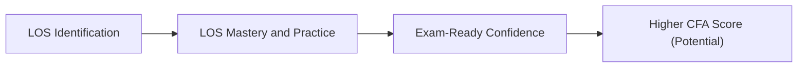

## Introduction
So, let’s imagine you’re halfway through reviewing multiple regression, time-series forecasting, machine learning, and all the other juicy topics in the CFA® Level II Quantitative Methods curriculum. You’ve got practice exams piling up on your desk. You’re hitting your stride, yet something feels off. You find yourself thinking: “Am I hitting all the required Learning Outcome Statements (LOS), or am I randomly scattering my efforts?” Don’t worry, that nagging doubt is normal. Mapping your practice and comprehension back to the official LOS is like having a trusty GPS guiding you through the busy city of exam prep. 

This article shows you how to methodically link exam vignettes, practice sets, and even daily reading notes straight to the official LOS. By doing so, you ensure that every minute spent studying truly counts toward exam readiness. We’ll walk through best practices, real-world examples, and maybe share a personal blunder or two (trust me, we’ve all been there). Let’s get going.

## Why LOS Mapping Matters
Let’s be real: the CFA® Program can feel like a marathon. You don’t just want random bits of expertise—you want a robust blueprint that helps you conquer the entire curriculum. That’s where the official Learning Outcome Statements come in. Each LOS corresponds to a learning goal that the CFA Institute aims for you to master; they act like signposts telling you, “This is what you should walk away knowing—and be ready to demonstrate on the exam.”

I’ll never forget the time I spent a whole weekend crunching data on mean reversion in time-series. Sure, it felt super productive, but later I realized I was practicing advanced steps while completely ignoring a fundamental sub-LOS on stationarity assumptions. That weekend was still useful, but if I had systematically cross-referenced stationarity (the actual LOS requirement), I could have used my time much more effectively. That’s the power of a good LOS map—it saves you from overspecializing (or over-studying something that’s not explicitly tested) and from neglecting other required areas.

## Cross-Referencing Vignettes
Exam vignettes are the beating heart of CFA® Level II evaluation. But they can also be tricky, since each six-question set may test several LOS from across different topic readings.

• Think about a hypothetical vignette on a hedge fund’s analytics. It touches on multiple regression techniques, explores heteroskedasticity within the dataset, sneaks in an ethics-based scenario about data manipulation, and possibly references dummy variables. That single vignette can span multiple LOS from chapters on regression assumptions, model misspecification, and even professional conduct.  
• By noting which LOS each question maps to—like “LOS 2.4: Assumptions Underlying Multiple Regression” or “LOS 4.2: Heteroskedasticity Detection and Remedies”—you see exactly why you’re being tested on that subtopic. This insight clarifies how each piece of knowledge is tested together in a cohesive scenario.

In your study journal, you might keep a running list: 
• Vignette #3 (Hedge Fund Data Analysis):  
  – Q1 → LOS 2.3 (Interpreting Regression Coefficients)  
  – Q2 → LOS 4.2 (Heteroskedasticity: Detection)  
  – Q3 → LOS 5.2 (Regression with Qualitative Variables)  
  – Q4 → LOS 7.6 (ML Applications in Equity and Fixed Income, if it touches on advanced analysis)  
  – Q5 → LOS 2.5 (Identifying Violations from Residual Plots)  
  – Q6 → Possibly an ethics side, referencing broad Code and Standards.  

Yes, it can feel a bit tedious to label each question with an LOS. But see how that clarifies everything? It’s a genuine map showing whether you’ve truly covered all corners. 

## Building a Revision Framework
Organizing your final review can quickly turn chaotic if you don’t have a structured approach. That’s why building an LOS-based grid or matrix is so helpful:

• Create a table in a spreadsheet, or even on a whiteboard. List out all the relevant LOS from the Quantitative Methods portion—things like “Multiple Regression Model Formulation,” “Evaluating Goodness of Fit,” “Serial Correlation,” “Machine Learning Overfitting,” you name it.  
• Along the top row, list your major practice resources: your standard question bank, official mock exams, third-party practice vignettes, maybe a friend’s question set, etc.  
• Fill in the cells by marking which LOS each question or vignette covers. For example, you might have a checkmark or color coding to show a question addresses “LOS 4.2—Heteroskedasticity.” 
• Step back and see if you have huge gaps. Are you ignoring “LOS 6.5: Testing for Seasonality and Correcting It” by accident? Is your coverage of “LOS 7.4: Unsupervised Machine Learning” lacking?  

This matrix, or “LOS coverage map,” quickly highlights if you have entire reading sections left behind. That intel can be gold in your final push.

Below is a simple conceptual illustration in Mermaid to visualize the process:

Notice how it all starts with recognizing the LOS. Once you do that—boom—suddenly you know exactly where to drive your practice. And that leads to better mastery and, let’s be honest, a stronger probability of crushing the exam.

## Reflective Review Techniques
So you’ve gone through your practice sets, you’ve built your grid, and you see a few glaring LOS that are giving you nightmares—maybe “Time-Series Seasonality,” or “Probit vs. Logistic Regression,” or “Panel Data Approaches.” Now it’s time for reflection.

1) Write a short summary for each LOS you find challenging. Revisiting your own words can be super powerful. You might say:  
   – “LOS 6.5: Testing for Seasonality—Use monthly dummy variables or transformations to see if patterns repeat each year.”  

2) Pair up with a study buddy or group. Often you’ll discover that each person struggles with different LOS, and discussing them out loud leads to deeper comprehension. Besides, explaining a concept to someone else cements it in your own mind.

3) Tie real-world examples to your LOS. Let’s say you’re doing “LOS 5.2: Regression with Qualitative (Dummy) Variables.” Think about an everyday scenario—like how a sporting event might shift consumer behavior differently by region (dummy variable “region” or “event day” equals 1 if an event is present, 0 if not). This real-life context helps you remember the application better.

4) Track repeated mistakes. If the same LOS is consistently tripping you up, that’s a bright neon sign pointing to your knowledge gap. Dive back into the official reading, watch a short tutorial, or do more targeted practice until you see improvement. Enough said.

## Common Pitfalls
Let’s talk about a few slip-ups we’ve seen candidates (myself included) make when dealing with LOS mapping:

• Overloading on certain LOS: Let’s face it, some topics, like multiple regression or time-series, feel more “fun” or more relevant, so you might do triple the questions there and neglect smaller topics (like certain aspects of big data or advanced ML approaches). Watch out—sometimes those “smaller” areas can appear in the exam in a question or two.  
• Confusing general interest in a topic with the actual LOS: You may feel extra curious about logistic regression and read advanced academic papers that go beyond the scope of the exam. That’s not necessarily harmful, but do be aware: if the LOS states “Explain the usage of logistic regression in binary classification tasks,” you should ensure your knowledge aligns with that statement first.  
• Ignoring the official curriculum references: Look, third-party materials are often great, but always tie them back to the official reading references so you know exactly how the CFA Institute frames a particular topic. The exam might have a certain nuance or formula interpretation that differs from other textbooks.

## Conclusion
Mapping your answers, your practice vignettes, and even your nightmares directly to the LOS is not just a neat organizational trick—it’s the difference between guesswork and precision in your final prep. Honestly, once you incorporate LOS mapping into your routine, you’ll be so much more confident because you’ll know you’ve covered what the examiners expect. Yes, you might still have last-minute jitters—who doesn’t?—but at least you’ll know you left no corner of the official requirements unexplored. 

We all want to walk into the exam hall with the calm sense that we’ve done everything we can. And building an LOS-based revision framework is one of the surest ways to get there.

## References
• CFA Institute. (Year). “Learning Outcome Statements,” Level II Program Curriculum.  
• Pflugrath, G. (2020). “Aligning Study Methods with LOS for Efficient Learning.” (White paper on optimizing exam study.)  
• [CFA Institute Exam Prep Resources](https://www.cfainstitute.org/en/programs/cfa/exam/prep)

---

## Test Your Knowledge: Mapping LOS and Vignette Mastery Quiz



### Which of the following best describes the primary benefit of systematically mapping practice questions to LOS?
- [ ] It shortens the total study time required to pass the exam.  
- [ ] It guarantees a 100% pass rate if done thoroughly.  
- [x] It helps identify gaps in coverage and weak areas needing further review.  
- [ ] It completely replaces the need to consult the official curriculum.  

> **Explanation:** Mapping practice questions to LOS allows you to see where you are strong or weak in the curriculum. It doesn’t guarantee a pass or reduce study time, but it helps ensure you’re systematically covering everything.

### In a typical CFA Level II vignette, how many LOS could be tested by a single six-question item set?
- [ ] Only one LOS, as each vignette is dedicated to one topic.  
- [ ] At least ten LOS, as vignettes are too broad not to.  
- [x] Often multiple LOS from within a single topic area (and sometimes beyond).  
- [ ] None of the above.  

> **Explanation:** A single vignette frequently spans multiple LOS (e.g., in time-series, a question might check stationarity, seasonality, and the validity of AR models), emphasizing the need for a broad understanding.

### In cross-referencing a regression vignette, a question about identifying heteroskedasticity from residual plots most likely aligns with:
- [ ] LOS 3.5: Forecasting with a Multiple Regression Model  
- [x] LOS 4.2: Heteroskedasticity—Detection and Remedies  
- [ ] LOS 5.3: Logistic Regression  
- [ ] LOS 7.2: Overfitting in Machine Learning  

> **Explanation:** Residual plots and detecting heteroskedasticity clearly map to the LOS in Chapter 4 that addresses heteroskedasticity detection and its remedies.

### When building a revision framework, which approach is most effective?
- [ ] Randomly selecting questions to see if any match an LOS.  
- [x] Creating a grid or matrix indicating which LOS each question addresses.  
- [ ] Avoiding official curriculum references to save time.  
- [ ] Studying only your favorite topics.  

> **Explanation:** A structured approach entails creating a grid that tracks each question’s link to a specific LOS, ensuring comprehensive coverage and pinpointing any overlooked areas.

### According to the article, which is a common pitfall for CFA candidates related to LOS mapping?
- [ ] Using color coding to track coverage.  
- [ ] Revisiting official curriculum after each practice session.  
- [ ] Focusing on performance only in topics they find most challenging.  
- [x] Over-studying popular or “preferred” topics while ignoring smaller or supplementary LOS.  

> **Explanation:** Overemphasizing certain “interesting” or familiar areas while neglecting lesser-studied LOS is a frequent mistake that can leave major exam-ready gaps.

### If you consistently miss questions about stationarity in time-series modeling, which step should you take?
- [x] Return to the official reading or watch explanatory tutorials focused on stationarity.  
- [ ] Ignore it, as stationarity is rarely tested.  
- [ ] Only study advanced AR models without re-checking basic assumptions.  
- [ ] Mark it as a lost cause and move on.  

> **Explanation:** Revisiting the official reading or tutorials that specifically address stationarity is the best move. Strengthening foundational assumptions is crucial for mastering time-series analysis.

### Which is an advantage of writing short summaries after you answer each LOS-related question?
- [ ] You can skip reading the official books altogether.  
- [x] It promotes retention by requiring you to restate the material in your own words.  
- [ ] It encourages you to memorize formulaic instructions only.  
- [ ] It replaces the need for practice exams.  

> **Explanation:** Summaries act as a powerful tool to internalize and recall concepts, because you actively process and restate the material rather than passively memorize it.

### In group study, how can you use LOS mapping effectively?
- [x] Have each member explain a specific LOS in detail to the group.  
- [ ] Test each other only on topics you all already excel in.  
- [ ] Avoid discussing the official curriculum to stay unbiased.  
- [ ] Randomly assign each LOS without verifying who’s strong or weak.  

> **Explanation:** Group study can be very effective if you allocate different LOS to each member for teaching or explanation. This method ensures collective understanding and leverages peer learning.

### What’s one reason to connect real-world news articles or events to LOS when reviewing?
- [ ] The exam only asks real-world scenario-based questions.  
- [ ] It replaces your need to read the official curriculum.  
- [ ] The CFA Institute never updates the curriculum.  
- [x] It can improve retention and understanding by linking theory to practical contexts.  

> **Explanation:** Linking LOS to current events or real-life examples helps solidify knowledge and makes the material feel more tangible and memorable.

### True or False: Mapping exam questions to LOS ensures a perfect score on the CFA exam.
- [x] True  
- [ ] False  

> **Explanation:** This is a trick question—strictly speaking, this statement is actually false. While LOS mapping is extremely helpful for thorough preparation, it doesn’t guarantee a perfect score. You still need to apply the concepts correctly under exam pressure.  


