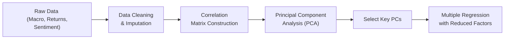

## Introduction

It’s not every day that we have to juggle multiple regression, time‑series analysis, machine learning, and big data techniques all in one place. At least, that’s what I used to think until I tackled my first real‑world portfolio analytics project for a mid‑size hedge fund. I remember opening the monstrous dataset with shaky hands—there were pages of macroeconomic indicators, daily price updates for over a hundred assets, textual sentiment columns gleaned from social media, and, oh yeah, a few hundred factor exposures tossed in for good measure.

Well, guess what? You’ll get to walk through a scenario just like that here—minus the shaky hands, I hope. This section integrates everything from earlier chapters and more. We’ll talk about everything from the joys (and stumbles) of data exploration to the nuances of AR modeling, regression diagnostics, classification metrics, and factor analysis. The point: demonstrate not only that you can handle these tools individually, but that you can bring them all together to solve time‑pressured, exam‑style vignettes under one roof.

## Data Setup and Case Overview

Let’s set the scene. Suppose you work as a junior quantitative analyst at EdgeStone Asset Management. You’ve been handed a data file that combines:

• Daily stock returns (for a fictitious firm, “RiverTech Inc.”) over five years.  
• Macroeconomic variables like GDP growth rate (quarterly), interest rates (monthly), and CPI (monthly).  
• A monthly sentiment score for RiverTech Inc., derived from social media commentary and news headlines.  
• Several factor indices (e.g., Growth Factor Index, Value Factor Index).  
• Broad market conditions (S&P 500 returns, VIX index levels).  

Your manager wants a 360° analysis:  
1. A forecast of RiverTech Inc.’s next‑period returns (yes, a time‑series viewpoint).  
2. A classification model that predicts whether the firm’s quarterly earnings will beat or miss analyst consensus.  
3. Some factor analysis to see if there’s a “latent” market driver that might unify changes across the macro variables you’ve got.  
4. A discussion of how you’d handle big data issues like missing values, outliers, or the explosion in the number of variables.  

This is basically your perfect storm. And in an exam scenario, you might get a long vignette giving you these details, accompanied by tables embedded with random pieces of data. Buried in there could be hints about stationarity, or glimpses of autocorrelation in the residuals, or an unexpected text mention that the data had significant changes after a certain structural break. 

So what do you do first? Let’s break it down step by step.

## Exploratory Data Analysis

Before any modeling, you’d always do data exploration. This typically involves computing descriptive statistics, generating correlation matrices, and maybe plotting a few scatter plots or time‑series graphs. Time can be tight in a test, though, so let’s highlight the essential moves:

• Check for missing or erratic data points. Maybe you notice that sentiment scores are missing for a couple of months. Are these truly missing, or is it zero sentiment?  
• Glance at the distribution of daily returns. If it’s extremely skewed or has heavy tails, you’ll keep that in mind for the type of regression or time‑series approach you pick.  
• Quickly look for trends in the macro variables. Are they trending upward or cyclical? This might foreshadow the possibility of nonstationarity in a time‑series model.  

Remember from Chapter 8 on Big Data Projects how crucial it is to do data cleaning. You might employ simple transformations, like dropping rows with too many missing values, or applying mean/median imputation if the missingness is small and random. Always keep an eye on outliers, especially for the factor indices—those can wreak havoc on your regression or machine learning model.

Anyway, you know the gist: you cannot skip this part, even if it might be tempting to jump right into the “fun parts,” like forecasting or classification.

## Building a Time‑Series Forecast

Next up, we want to forecast RiverTech Inc.’s next‑period return using a time‑series lens. You might recall from Chapter 6 that we have to ensure stationarity. Let’s say after a quick test (like the Augmented Dickey‑Fuller test), you find the daily returns are already stationary (which is usually the case with returns). Great. Then you suspect an AR(1) or AR(2) might be enough.

### AR(1) Model Example

Maybe we start with an AR(1) model:


R_t = \alpha + \phi R_{t-1} + \varepsilon_t


where \\( R_t \\) is RiverTech’s return at time \\( t \\), \\(\alpha\\) is the intercept, \\(\phi\\) is the coefficient for the lagged return, and \\( \varepsilon_t \\) is the error term.

You estimate it—imagine the estimate for \\(\phi\\) is 0.20 with a p‑value of 0.01, which suggests a mild but significant impact of yesterday’s return on today’s. That’s your baseline forecast. Then you look at the residual plot. If it’s consistent with white noise, you’re golden. If you spot patterns or significant autocorrelation, you might upgrade to an AR(2) or add an ARMA term.  

Because your manager wants to see how macro factors influence returns, you might incorporate them into an AR model with exogenous variables. For instance:


R_t = \alpha + \phi R_{t-1} + \beta_1 (\text{CPI}_t) + \beta_2 (\text{GDP Growth}_t) + \beta_3 (\text{Factor Index}_t) + \varepsilon_t 


Just remember: you need to check if these macro time series are stationary or integrated. If they’re not, you might difference them or switch to a cointegration approach if you suspect a long‑run equilibrium relationship.  

That’s the gist for time‑series forecasting. Chapter 6 discussed the critical tests and pitfalls (e.g., correlation of errors, seasonality). So watch out!

## Multiple Regression Insight

Now imagine your manager says, “Hey, can you figure out the drivers of the daily returns in a cross‑sectional sense? Maybe we can treat it as a good old multiple regression problem, ignoring the time dimension but letting your factors do the heavy lifting.” So you pivot to the standard multiple regression from Chapter 2 and Chapter 3:


R_t = \beta_0 + \beta_1 \Delta \text{Rate}_t + \beta_2 \text{VIX}_t + \beta_3 \text{Sentiment}_t + \ldots + \varepsilon_t


In exam conditions, you might see a big table with partial regression output: t‑stats, p‑values, R‑squared, F‑statistics. If you find, for instance, that \\(\beta_3\\) is large and significant for “Sentiment,” that suggests textual sentiment has a real effect on daily returns. But if your residual plots from Chapter 4’s lessons show, say, a funnel shape or correlations in the residuals, watch out for heteroskedasticity or autocorrelation.  

### Checking the Residuals

• Plot the residuals vs. fitted values: If you see an increase in scatter, suspect heteroskedasticity.  
• Perform a Durbin‑Watson test if you suspect autocorrelation.  
• Use White’s test or a robust standard error approach if heteroskedasticity is present.

In some contexts, you might have to fix or mitigate these problems, either by robust standard errors (e.g., HAC standard errors for time‑series data) or by transforming your variables. 

## Factor Analysis (Dimensionality Reduction)

Now for the real fun. Suppose you have a bunch of correlated variables: five macro indicators, three factor indices, and four sentiment‑related metrics. It’s getting messy. A perfect moment to think about Chapter 5 suggestions on advanced regression or Chapter 9’s multivariate approaches. Factor analysis (or more commonly these days, principal component analysis—PCA) helps reduce these correlated variables into fewer unobserved “factors.”  

In practice, you might run PCA on the correlation matrix of your five macro indicators plus the factor indices. Let’s say the first principal component (PC1) explains 60% of the variance and is primarily related to interest rates, GDP growth, and corporate sentiment. This single factor might be a “macroeconomic growth factor.” The second principal component (PC2) might capture “market volatility,” loading heavily on the VIX and possibly the Growth Factor Index.

### Illustrative Mermaid Diagram

Below is a rough flow of how data can move through a factor analysis + regression approach:

You can imagine that after the PCA step, you might take the most influential principal components into a new multiple regression:


R_t = \gamma_0 + \gamma_1 PC1_t + \gamma_2 PC2_t + \dots + \eta_t


That’s how you keep your model simpler (fewer variables) while still capturing most of the variance in your original data.  

## Logistic Regression for Earnings Classification

We’re not done. Your manager also wants to classify whether RiverTech Inc.’s next quarterly earnings beat or miss consensus expectations. That’s a binary outcome—perfect for logistic regression. Remember from Chapter 5.3: logistic regression is a classification approach modeling the log‑odds of the probability of a “positive” outcome (like beating earnings).


\text{logit}(p) = \ln \left(\frac{p}{1-p}\right) = \beta_0 + \beta_1 \text{Sentiment Score} + \beta_2 \text{Past Earnings Surprise} + \dots


Where \\(p\\) is the probability that RiverTech’s next earnings announcement is a “beat.” You’ll interpret \\(\beta_1\\) as how a one‑unit change in the sentiment score shifts the log‑odds of beating. If \\(\beta_1 > 0\\) and is statistically significant, that means higher sentiment leads to a higher probability to beat.

### Classification Metrics

When the exam question shows you logistic regression output, watch for confusion between R‑squared from a linear regression vs. accuracy, precision, recall, or area under the ROC curve—these are classification metrics, not the typical regression metrics. It’s easy to slip up if you’re not paying attention. Indeed, you might see an “R^2 = 0.28” that someone tries to interpret as for logistic regression, but that’s basically a pseudo R^2—it does not have the same interpretation as the standard R‑squared in multiple regression.

## Big Data Wrangling and Practical Considerations

In real practice, and sometimes in the exam item sets, you’ll have data that’s not perfectly aligned. Sentiment might be daily or weekly, while GDP is quarterly. The moral of the story: watch your frequencies and your merges. If you incorrectly “match” data, you can cause weird lags or illusions of significance.

Additionally, big data can raise issues about:

• Overfitting: Combining many factors into your model might give you a suspiciously high \\(R^2\\). Remember from Chapter 7, you can do cross‑validation or use penalized regression (like ridge or lasso) to avoid overfitting.  
• Storage and Speed: In a real environment, the sheer data size can matter. In an exam scenario, they might mention “the firm has 20 million lines of data,” hinting you could deploy a distributed computing technique. But practically, in the test context, you just need to mention that standard software or sampling might be used.  
• Data Snooping Bias: With so much data, it can be easy to cherry‑pick patterns that hold in sample but vanish out of sample.

## Putting It All Together

Let’s take a step back. The exam might hand you a vignette that merges all these layers in a single narrative. You’ll be asked:

1. **Forecasting**: “Given the partial AR(1) output and the residual diagnostics, what is the best next‑day return forecast for RiverTech?”  
2. **Classification**: “Using the logistic regression output, is an earnings beat likely at the next announcement given the company’s sentiment score is X and last quarter’s surprise was Y?”  
3. **Factor Analysis**: “Which principal component seems to represent the macro‑growth environment, and how might it improve regression fit?”  
4. **Diagnostics**: “Do the residual plots and test statistics suggest heteroskedasticity or autocorrelation? How would you correct it?”  
5. **Big Data Handling**: “Which data wrangling step is necessary before merging daily returns with quarterly GDP?”  

The key is to identify which approach solves which problem and interpret results carefully. A final question might ask you to reflect on model selection criteria—like the AIC/BIC or cross‑validated error for time‑series vs. classification accuracy metrics.  

## Common Pitfalls and Best Practices

• **Mixing up R‑Squared vs. Classification Metrics**: Always confirm which metric is relevant for the model at hand.  
• **Ignoring Stationarity**: Remember that time‑series variables often need differencing or transformations.  
• **Overfitting with Too Many Variables**: In multiple regression, if the number of variables creeps close to the number of observations, your model might be suspect. Factor analysis or penalization can help.  
• **Forgetting Real-World Constraints**: The best theoretical model might not be suitable if it’s too computationally heavy or if you can’t get certain data in real time.  
• **Neglecting Residual Diagnostics**: Even if your regression or AR model has a great fit, check for patterns in the residuals.

## A Few Personal Reflections

I’ll admit: the first time I tried weaving all these analyses into one big project, I completely forgot about the difference in data frequencies—almost ended up modeling monthly returns against annual GDP, which was nonsense. Another time, I was so proud of my logistic regression accuracy (90%—woohoo!) until my manager pointed out that if 92% of all earnings announcements in the sample exceeded consensus, any model that predicted “always beat” would have a 92% accuracy. Oops.  

So yes, it’s easy to make mistakes in an integrated environment. But that’s part of why the CFA Institute wants you to see how these pieces fit together—so you can catch the pitfalls early, apply good judgment, and deliver a robust analysis under time constraints.

## Exam Tips

• **Time Management**: Multi‑topic vignettes can be lengthy. Quickly identify the main question—are they asking about a forecast, a classification, or a factor interpretation? Then jump to the relevant formula or concept.  
• **Annotate**: In a real exam, highlight or jot small notes near data tables. Identify which data point goes into which formula.  
• **Keep an Eye on the Types of Statistics**: T‑tests, F‑tests, confusion matrices, or cross‑validation errors might all appear in the same item set.  
• **Be Flexible**: Sometimes, the exam scenario presents a twist. Maybe the logistic regression has a structural break in the middle of the sample, or the time‑series data is particularly seasonal. Remember to adapt.  
• **Refer to the Code and Standards**: If the question touches on something like data privacy or manipulative use of modeling, tie in ethical considerations from the CFA Institute’s Code and Standards.

## Quick Recap

1. **Explore and Clean**: Check for outliers, missing data, stationarity.  
2. **Model Appropriately**: AR for time‑series, multiple regression for continuous outcomes, logistic regression for classification.  
3. **Use Factor Analysis** if your dataset is large and correlation is high among variables.  
4. **Validate** with proper diagnostics to confirm you haven’t missed heteroskedasticity, autocorrelation, or other forms of model misspecification.  
5. **Evaluate** results and interpret them in the broader context.  

## References

• Hastie, T., Tibshirani, R., & Friedman, J. (2009). “The Elements of Statistical Learning.”  
• CFA Institute. (Year). “Case Studies in Application,” Official Curriculum (Level II).  
• [Wiley’s CFA Exam Review](https://www.efficientlearning.com/cfa/)

## Test Your Knowledge: Integrated Quant Methods Across Multiple Models



### Which of the following best describes the purpose of using PCA or factor analysis before building a regression model?

- [ ] It ensures that all regression coefficients are statistically significant. 
- [x] It helps reduce the dimensionality of the dataset by summarizing correlated variables into fewer factors. 
- [ ] It confirms that the data is stationary. 
- [ ] It converts categorical variables into continuous variables.

> **Explanation:** Principal component analysis (or any factor analysis approach) is a method to condense correlated variables into fewer uncorrelated factors, not to ensure significance or stationarity.

### In an AR(1) model of daily returns, which assumption must generally be satisfied for the model’s estimates to be valid?

- [x] The residuals should exhibit no autocorrelation. 
- [ ] The original data must be normally distributed. 
- [ ] The multicollinearity in the data must be minimal. 
- [ ] The VIX index must be used as a predictor.

> **Explanation:** A core assumption is that the residuals (errors) are white noise, meaning no autocorrelation remains.

### In a logistic regression used for predicting whether a company’s earnings will beat or miss consensus, how should you interpret the coefficient on a sentiment score variable?

- [ ] As the absolute contribution to the earnings per share. 
- [ ] As the probability of a beat if all other variables are zero. 
- [ ] As the elasticity of earnings with respect to sentiment. 
- [x] As the change in the log‑odds of a beat for a one‑unit increase in the sentiment score.

> **Explanation:** Logistic regression coefficients relate to the log‑odds of the outcome.

### Suppose you see a funnel‑shaped pattern in a residual plot from a multiple regression model of returns. What is the most likely issue?

- [x] Heteroskedasticity. 
- [ ] Perfect multicollinearity. 
- [ ] Stationarity. 
- [ ] Nonlinearity in the dependent variable.

> **Explanation:** A funnel shape in the residuals usually indicates variance that depends on the level of fitted values—i.e., heteroskedasticity.

### When merging daily returns data with quarterly GDP data, which step is most crucial to avoid misleading model inputs?

- [ ] Using logistic regression. 
- [x] Aligning the date frequencies correctly, possibly by matching daily returns to their corresponding quarter. 
- [ ] Removing all missing daily returns. 
- [ ] Ensuring the daily returns are strictly positive.

> **Explanation:** The mismatch of data frequencies can undermine the entire analysis if not carefully resolved.

### When deciding whether to use an AR model or a multiple regression with lagged returns, what key factor should guide your choice?

- [ ] The presence of a multicollinearity problem. 
- [ ] Whether the R‑squared is less than 0.50. 
- [x] The nature of the data (time‑series stationarity vs. cross‑sectional approach) and the specific modeling objective. 
- [ ] Whether the manager prefers linear or nonlinear methods.

> **Explanation:** You choose AR models specifically for time‑series patterns, whereas multiple regression of cross‑sectional data may follow a different approach.

### Which statement is correct regarding the difference between logistic regression and multiple linear regression?

- [x] Logistic regression models the log‑odds of a binary event, whereas linear regression models a continuous dependent variable. 
- [ ] Logistic regression is always more accurate. 
- [x] Multiple linear regression can handle binary data without transformations. 
- [ ] Logistic regression requires stationarity of residuals.

> **Explanation:** Logistic regression deals with binary classification by modeling log‑odds, while linear regression is for continuous outcomes.

### If you find that your time‑series residuals contain significant autocorrelation, how might you address this problem?

- [ ] Use principal component analysis on the dependent variable. 
- [x] Expand the model to AR(2), add MA terms, or use HAC standard errors. 
- [ ] Convert all variables into dummy variables. 
- [ ] Reduce the sample size to remove outliers.

> **Explanation:** Autocorrelation can often be handled by using higher‑order AR/MA terms or robust standard errors for time‑series.

### Which of the following best characterizes the main advantage of using a “principal component” instead of several correlated macro variables in a regression?

- [ ] It guarantees a higher R‑squared. 
- [x] It simplifies the model by capturing the majority of variance with fewer explanatory variables. 
- [ ] It identifies the best performing stock in the portfolio. 
- [ ] It automatically fixes autocorrelation in the data.

> **Explanation:** Principal components capture variance in fewer factors, simplifying the model.

### True or False: An AR(1) model and a multiple regression model with one lagged independent variable are literally the same approach.

- [x] True
- [ ] False

> **Explanation:** At a fundamental level, an AR(1) model is a specific type of regression where the dependent variable is regressed on its own lag. Both are linear models with one lagged term. Some differences arise in the assumptions about the errors, but structurally, they are quite similar.


