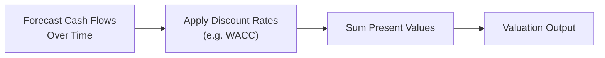

## Introduction
I remember the first time I tried to value a company’s equity by discounting projected cash flows—let me tell you, I felt downright overwhelmed. There were growth rates to estimate, discount rates to debate, plus terminal values and all kinds of risk adjustments. But it became a lot simpler once I recognized that at the heart of every approach—whether you’re forecasting in an equity context or pricing a bond’s cash flows—you’re just applying good old Time Value of Money (TVM) fundamentals. Turning those intangible future dollars into something we can compare in the present is the name of the game.

Consider this a deep dive into how TVM concepts morph into more advanced forms at Level II. We’ll explore how discounting sneaks its way into equity valuation, derivative pricing, corporate finance deals, and more. We’ll also see how seemingly disparate ideas like interest rate parity or scenario-based forecasting still boil down to bringing future values back to the present with an appropriate rate. It’s all about bridging the gap between “tomorrow’s money” and “today’s money.”

## TVM as the Foundation for Advanced Valuation
By now, you’ve probably applied the simple present value (PV) formula:

\text{PV} = \frac{\text{Future Value}}{(1 + r)^n}

so many times that it feels second nature. However, Level II pushes you to integrate this concept into more nuanced valuation frameworks:

• Free Cash Flow (FCF) Models: You project a firm’s FCF for discrete forecast periods, then discount each period’s FCF at a cost of capital that matches the project’s or firm’s risk. Chapter 2 introduced you to multiple regression for forecasting financial metrics, and many of those forecasts feed directly into your free cash flow estimates.

• Residual Income (RI) Models: You can start with book value and add present values of future “residual” income (income above the required return on equity). Again, you’ll discount each year’s residual income, typically at the cost of equity.

Whether you’re computing these valuations in your favorite spreadsheet software or with a financial calculator, the key principle is the same: you need to capture how an amount of money loses or gains value over time depending on the required rate of return.

## Applying Appropriate Discount Rates
One of the biggest leaps in real-world valuation is selecting the right discount rate. Often, you’ll see Weighted Average Cost of Capital (WACC) used when a project or firm includes both debt and equity financing. WACC accounts for the proportional costs of each financing source and is often expressed as:

\text{WACC} = \left(\frac{E}{E + D}\right)r_e + \left(\frac{D}{E + D}\right)r_d(1 - t)

where:
• \\(E\\) = market value of equity,  
• \\(D\\) = market value of debt,  
• \\(r_e\\) = cost of equity,  
• \\(r_d\\) = cost of debt, and  
• \\(t\\) = corporate tax rate.

For equity-only valuations, you might simply discount by \\(r_e\\). But watch out: The cost of equity isn’t always just given. You may have to estimate it, often using the CAPM:

r_e = R_f + \beta ( R_m - R_f )

Then you bring that discount rate into each of your cash flow calculations. So, if you’re looking at a new project, you might decide that a higher \\(r_e\\) is appropriate if it’s riskier than your typical corporate initiatives.

## Multiple Growth Stages and the Infamous “Terminal Value”
Another place TVM rears its head: multi-stage growth models. Let’s say you’re valuing a biotech company with high growth for the next five years, but after that, it’s expected to level off. Typically, you’ll break your valuation into:
1. A forecast period: Discount each separate year’s projected cash flow at an appropriate rate.  
2. A terminal value (TV) at the end of the forecast horizon: This lumps together all the subsequent stable (or perpetually growing) cash flows.  

Remember:

\text{Terminal Value at Year } n = \frac{\text{Cash Flow at Year } (n+1)}{(r - g)}

And then, guess what? You discount that terminal value back to present:

\text{PV of TV} = \frac{\text{Terminal Value at Year } n}{(1 + r)^n}


In practical terms, you might see that terminal value can account for a whopping majority of the total valuation—especially in companies expected to generate positive cash flows far beyond your forecast period. You definitely don’t want to mess up that piece.

## Interest Rate Parity and Cash Flow Discounting
In Level II Economics, you’ll see interest rate parity (IRP) lurking around the corner. IRP ensures that the forward exchange rate (let’s call it \\(F\\)) matches the difference in interest rates between two currencies. The idea is basically that the present value of currency amounts should come out equal, regardless of which currency you hold. The formula is often:

F = S \times \frac{(1 + i_d)}{(1 + i_f)}

where \\(S\\) is the spot rate, \\(i_d\\) is the domestic interest rate, and \\(i_f\\) is the foreign interest rate. Notice how we’re discounting or compounding currency flows to maintain no-arbitrage conditions. So even in global macro contexts, the fundamental logic—discounting future amounts to get equivalences—still applies.

## Scenario Analysis and Probability Weighting
It’s not enough to just discount your “best guess” cash flows at a single rate. Sometimes you’ll want to incorporate a multi-scenario approach:

• Scenario 1 (optimistic): Probability = \\(p_1\\).  
• Scenario 2 (most likely): Probability = \\(p_2\\).  
• Scenario 3 (pessimistic): Probability = \\(p_3\\).  

You then discount the cash flows in each scenario at an appropriate risk-adjusted rate (or perhaps the same rate if you treat them as equally risky) and sum up the expected values:

\text{Expected Valuation} = p_1(\text{PV of CF}_{1}) + p_2(\text{PV of CF}_{2}) + p_3(\text{PV of CF}_{3})

Sometimes, you might also reflect different discount rates for different scenarios if the risk profile changes drastically. The result is a weighted present value that accounts for uncertain futures. This approach can be critical when you’re dealing with tricky industries or uncertain macro conditions.

## Discounting in Derivative Pricing
For interest rate derivatives (like an interest rate swap), you typically discount each projected cash flow on the floating and fixed sides at the appropriate zero-coupon rates or the forward rate curve. In many advanced fixed income readings, you’ll see expressions like:

\text{Swap Value} = \sum \frac{\text{Expected Net Payment at time } t}{(1 + r_t)^t}

where \\(r_t\\) might be the forward/futures implied discount rate. Futures markets, forward contracts, and even forward rate agreements (FRAs) rely heavily on discounting at risk-free or near risk-free rates. In practice, you might see references to the LIBOR or SOFR curves, or local equivalents, for discounting future payments.

**Forward Pricing** is also intimately connected to discounting. When you see the forward price for a commodity, equity index, or currency, it’s usually derived by “cost of carry” logic, which basically says the forward price should match the spot price plus carrying costs (like financing, storage, convenience yield) all brought forward or back with discount/interest rates.

## Real-World Corporate Finance Deals
You might have encountered M&A (merger and acquisitions) or LBO (leveraged buy-outs) analyses. In these cases, you take prospective synergies or future savings and discount them to the present, typically at the acquirer’s WACC or a risk-adjusted M&A rate. If the deal is highly leveraged, the cost of debt might climb, so your WACC can shift over time as debt gets paid down or restructured. Whenever you see multi-tier capital structures with mezzanine debt, senior debt, or convertible bonds, each layer might have a different required return—leading you to carefully pick the discount rate for each piece of the puzzle.

Even interim valuations get interesting. If you’ve got, say, a bridging loan that’s used for a fraction of the year, or you have floating rate notes that get repriced every quarter, you might do partial-year discounting or break your discount intervals into smaller pieces. In other words, if the interest rate changes every quarter, you discount at the effective quarterly rate for that quarter’s cash flows.

## Bond Valuation in More Complex Settings
At a fundamental level, a bond’s price is:

\text{Bond Price} = \sum_{t=1}^{n} \frac{\text{Coupon}_t}{(1 + YTM)^t} + \frac{\text{Face Value}}{(1 + YTM)^n}

That’s the purest expression of discounting: summing up the present values of each coupon payment and the redemption amount. But once you add in call features, put features, or sinking funds, the timing and magnitude of cash flows can change. So you might have to consider:

- **Callable Bonds**: The issuer might redeem the bond earlier at a call price, which changes your effective horizon.  
- **Putable Bonds**: The investor can force early redemption, altering the payment timeline.  
- **Sinking Funds**: The issuer systematically retires portions of the debt before maturity.  

In each scenario, you’ll need to discount the adjusted set of cash flows at the bond’s yield or the appropriate discount rates derived from the yield curve. If you have partial-year periods or irregular coupon intervals, you might do piecewise discounting—calculating present values for each distinct time period.

## Combining Regression Forecasts and Discounting
We introduced multiple regression models back in Chapter 2 and time-series forecasting in Chapter 6. Those tools often help produce the underlying numbers for your valuation. For instance:

• Predicting next year’s sales or operating margins uses regression or time-series.  
• Then you convert those predicted figures into net cash flows.  
• Finally, you discount them to obtain a present value.  

So, if you see a test question that first charts out a time-series revenue forecast, then transitions to discounting free cash flows, you know they’re connecting the dots between the quant modeling and good old TVM.

## Inflation, Real vs. Nominal, and Other Adjustments
In many “true to life” vignettes, you deal with inflation assumptions. If your cash flows are nominal, your discount rate should usually be nominal. If your cash flows are real, your discount rate should be real. The formula bridging real (r) and nominal (R) rates with inflation (i) is commonly:

1 + R = (1 + r)(1 + i)

Don’t accidentally mismatch real discount rates with nominal cash flows. That’s a sure way to get an inconsistent valuation. Also keep an eye out for scenarios where the inflation rate changes over time—this might require piecewise discounting, each period using a different inflation assumption and discount rate.

## Pitfalls and Common Mistakes
• **Mixing Frequencies**: Always match the frequency of your discount rate to the frequency of your cash flows. If you have monthly cash flows, you need a monthly discount rate.  
• **Ignoring Terminal Value**: A huge chunk of a project’s or firm’s value can reside in those post-forecast “steady” years.  
• **Underestimating Risk**: If a project is much riskier than the rest of the company’s projects, the standard WACC might understate its true required return.  
• **Invalid Growth Assumptions**: Growth rates that exceed your discount rate indefinitely will lead to nonsensical valuations.  
• **Improper Partial-Year Discounting**: If a payment arrives mid-year, you may need to discount using \\( (1 + r)^{0.5} \\) or an equivalent, not the full-year discount factor.

## Personal Anecdote: The Partial-Year Headache
Early in my career, I once valued a boutique retailer that generated most of its cash flows over the holiday season—roughly from October through December—and had minimal inflows the rest of the year. I had to discount a bunch of so-called “lumpy” monthly cash flows with an effective monthly discount rate. I spent hours recalculating the partial period discount factors. Let’s just say many cups of coffee were had that week. But in the end, the accuracy was worth it: a small discounting adjustment made a big difference in the final number.

## A Visual Overview of the Discounting Process
Below is a simple Mermaid diagram that depicts the multi-step process we commonly follow when applying TVM to valuation. It might look basic, but it’s how many advanced finance models are structured behind the scenes.



## Example: Python Code for Bond Price with Multiple Coupons
If you’re a fan of coding, you can do a quick bond pricing check in Python. Suppose you have a bond that pays semiannual coupons. Here’s a tiny snippet:

```python
import math

def bond_price(face_value, coupon_rate, ytm, semiannual_periods):
    """
    face_value: par value of the bond
    coupon_rate: annual coupon rate expressed as a decimal
    ytm: annual yield to maturity in decimal
    semiannual_periods: total number of semiannual periods
    """
    coupon_payment = face_value * coupon_rate / 2  # since semiannual
    semiannual_ytm = ytm / 2
    price = 0.0
    for t in range(1, semiannual_periods + 1):
        price += coupon_payment / ((1 + semiannual_ytm)**t)
    price += face_value / ((1 + semiannual_ytm)**semiannual_periods)
    return price

print(bond_price(face_value=1000, coupon_rate=0.06, ytm=0.05, semiannual_periods=10))
```

You’ll see that each coupon is discounted by the semiannual yield to maturity, and then the face value gets discounted in the final period.

## Exam Tips and Strategies
• **Read Carefully**: Vignette-style questions often bury details about timing (e.g., a coupon might be paid right in the middle of the year).  
• **Watch the Rate**: If they say the discount rate is 6% “effective annual,” but the bond pays semiannual coupons, always convert to the correct periodic rate.  
• **Double Check for Staged Growth**: If the vignette mentions a change in the growth or cost of capital after three years, that means you have to adjust your discounting approach at that exact point in time.  
• **Use Probability**: If the question includes scenario probabilities, it’s not just for show. You might have to do an expected valuation.  
• **Scan for Real vs. Nominal**: If inflation is involved, ensure your discount rates and cash flows align.

## References
- CFA Institute Level II Curriculum: Readings on Equity Valuation and Fixed Income.  
- Investment Valuation, Aswath Damodaran — a deep dive into methodologies for discounting different cash flow streams.  
- Fixed Income Securities, Bruce Tuckman — especially the chapters on bond pricing methods and interest rate derivatives.  

And, of course, do keep cross-referencing the relevant sections in our own text: Chapter 2 (Multiple Regression) and Chapter 6 (Time-Series Analysis) to see how forecasting and discount factors are commonly integrated.

---

## Practice Questions on TVM Applications



### Which of the following most accurately describes a key advantage of applying a multi-stage growth model for stock valuation?

- [ ] It ensures the discount rate remains constant over the entire life of the equity.  
- [x] It allows for changing growth rates in different phases before a stable terminal period.  
- [ ] It eliminates the need to calculate a terminal value.  
- [ ] It avoids reliance on projecting free cash flow.  

> **Explanation:** A multi-stage growth model addresses varying growth rates across different time periods and then applies a terminal value for stable perpetual growth beyond the forecast horizon.


### In applying WACC for a firm’s valuation, which component is typically tax-adjusted?

- [x] The cost of debt.  
- [ ] The cost of equity.  
- [ ] Both the cost of debt and equity.  
- [ ] Neither component is tax-adjusted.  

> **Explanation:** Generally, the cost of debt is adjusted by (1 – tax rate) because interest payments are usually tax-deductible. The cost of equity does not receive a direct tax-benefit component in this calculation.


### An analyst has three scenarios for a project’s free cash flows, each discounted at the same rate but weighted by different probabilities. The final valuation is most likely:

- [ ] The highest scenario’s free cash flow discounted value.  
- [x] A probability-weighted sum of discounted values across all scenarios.  
- [ ] An average of scenario outcomes divided by the discount rate.  
- [ ] Whichever scenario has the highest net present value.  

> **Explanation:** In scenario analysis, the expected valuation is the sum of each scenario’s NPV multiplied by its corresponding probability.


### When discounting future coupon payments for a callable bond, an investor should:

- [ ] Ignore the call feature, as it does not alter discounting.  
- [ ] Assume the bond will never be called if interest rates decrease.  
- [x] Consider the timing and probability of early redemption.  
- [ ] Always use the yield to maturity as it remains valid for callable features.  

> **Explanation:** Callable bonds may be redeemed earlier than the final maturity date, meaning the timing of some cash flows may change, influencing both the yield and actual discounting process.


### If a firm issues convertible bonds, how might the discount rate differ for valuation purposes compared to a plain vanilla bond?

- [x] It may be lower, as convertibles provide the added benefit of equity conversion.  
- [ ] It must be higher because the issuer faces greater risk.  
- [ ] It remains exactly the same as the firm’s cost of debt.  
- [ ] It always equals the market risk premium.  

> **Explanation:** Convertible bonds typically offer investors an equity upside, potentially reducing the required yield (and hence discount rate) compared to standard debt. 


### Which statement best characterizes the relationship between real discount rates and nominal discount rates in the presence of inflation?

- [x] (1 + nominal) = (1 + real)(1 + inflation).  
- [ ] (1 + real) = (1 + nominal)/(1 + inflation).  
- [ ] Using a nominal rate is always more accurate.  
- [ ] There is no difference once inflation is considered.  

> **Explanation:** The correct relationship is (1 + Nominal) = (1 + Real)(1 + Inflation). One must remain consistent with real cash flows and real rates or nominal cash flows and nominal rates.


### When partial-year discounting is required due to an irregular coupon schedule, which of the following is most appropriate?

- [x] Adjust the exponent for the fraction of the year, e.g., (1 + r)^(fraction).  
- [ ] Always convert the annual discount rate to an effective monthly rate.  
- [ ] Use the simple arithmetic mean of the partial-year discount rates.  
- [ ] Postpone valuation until a full-year payment cycle is available.  

> **Explanation:** If cash flow occurs mid-year, you must discount using the correct fraction of the annual discount rate, typically applied to the fraction of the year remaining.


### In interest rate parity, the forward rate for a currency pair:

- [ ] Compounds the domestic spot rate by the foreign interest rate.  
- [x] Reflects the difference in interest rates between two currencies to ensure no arbitrage.  
- [ ] Is unrelated to discount rates or future value calculations.  
- [ ] Is always higher than the spot rate in real terms.  

> **Explanation:** The forward exchange rate is set so that investors cannot earn riskless profits by borrowing in one currency and investing in another. It’s essentially discounting and compounding currency amounts at respective interest rates.


### A multi-stage valuation of a young tech company shows half the total value comes from the terminal value. Which action should the analyst consider?

- [ ] Eliminate the terminal value as it’s too uncertain.  
- [x] Carefully verify terminal year assumptions given its large impact.  
- [ ] Reduce growth assumptions to decrease the terminal value share.  
- [ ] Switch to a single-stage DDM for simplicity.  

> **Explanation:** When the terminal value constitutes a large portion of the total valuation, the assumptions driving that terminal value (growth rate, discount rate) must be reviewed carefully for accuracy and realism.


### True or False: In separate scenario analyses, the discount rate can be higher for a riskier scenario than for a less risky scenario.

- [x] True  
- [ ] False  

> **Explanation:** It’s entirely possible to vary the discount rate across scenarios if you believe the risk profile differs significantly. Doing so can produce a more refined overall expected valuation.


