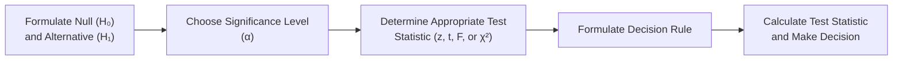

## Overview of Descriptive Statistics

Descriptive statistics are all about summarizing and understanding data. When we say “descriptive,” we mean tools like the mean and median that help us pinpoint typical values, or the variance that tells us how numbers spread out. Let’s walk through the main categories: measures of central tendency (Where’s the middle?), measures of dispersion (How spread out is the data?), and correlation/covariance (How do variables move together?).

Sure, we all know that various formulae exist, but it’s super important to grasp why these metrics matter in finance. If you’re analyzing a stock’s returns over time (maybe monthly returns of your favorite large-cap stock), you’d probably start with the average return (the arithmetic mean) and the standard deviation (a measure of the fluctuations in returns). Then, if you’re building a portfolio, you might check how your stock’s returns correlate with those of other assets. All of these tasks—or “checks,” if you like—fall under descriptive statistics.

### Measures of Central Tendency

• Mean (Arithmetic Mean):  
  The arithmetic mean (often just called “mean”) is the average value of a set of observations. If we have n observations x₁, x₂, …, xₙ, their mean is:

  
    \bar{x} = \frac{\sum_{i=1}^n x_i}{n}.
  

  This measure is widely used to represent expected returns when analyzing stocks or entire portfolios.

• Median:  
  The median is the midpoint of the dataset when your observations are arranged in ascending (or descending) order. That is to say, half the observations are above the median and half are below. If you have an odd number of observations, it’s simply the middle one. If it’s even, you take the average of the two middle ones. In investment contexts, the median is less sensitive to extreme outliers, such as a one-off quarter with extraordinary returns (either extremely high or negative).

• Mode:  
  The mode is the most frequently occurring value in a dataset. In finance, it is less often used for things like returns (because returns are typically numerical and continuous in nature), but you might encounter the mode in categorical data—say, the most common credit rating an issuer has across different rating agencies.

### Measures of Dispersion

• Range:  
  The simplest measure of dispersion is the range, which is the difference between the maximum and minimum values in your dataset. If your monthly returns range from –3% to +5%, then your range is 8%. It’s straightforward but can be misleading if there is just one big outlier.

• Variance and Standard Deviation:  
  Variance is the average of the squared deviations from the mean. For a population with mean μ, each data point xᵢ is subtracted from μ, squared, summed, and then divided by the population size N:

  
    \sigma^2 = \frac{\sum_{i=1}^N (x_i - \mu)^2}{N}.
  

  Standard deviation (σ) is simply the square root of variance. For a sample (with sample size n), we use the sample variance estimator:

  
    s^2 = \frac{\sum_{i=1}^n (x_i - \bar{x})^2}{n - 1}.
  

  The n – 1 in the denominator is that little correction we do (the so-called Bessel’s correction) to adjust the bias when estimating a population variance from a sample.

• Coefficient of Variation (CV):  
  The coefficient of variation is the ratio of the standard deviation to the mean:

  
    \text{CV} = \frac{\sigma}{\bar{x}}.
  

  We see this used in finance to compare risk per unit of return across different assets. A lower CV indicates a more favorable risk–return trade-off (generally speaking).

### Covariance and Correlation

In portfolio management, we really care about how different assets move together because that guides diversification decisions.

• Covariance:  
  Covariance measures the degree to which two variables move together (or separately). For instance, you might see that the returns of stock A and stock B have a positive covariance, meaning when stock A’s return is above its average, stock B’s return tends to be above its average too. The sample covariance is:

  
    \hat{\text{Cov}}(X, Y) = \frac{\sum_{i=1}^n (x_i - \bar{x})(y_i - \bar{y})}{n - 1}.
  

• Correlation:  
  Correlation is a standardized version of covariance, bounded between –1 and +1. With correlation (ρ), we remove the influence of scale:

  
    \rho_{X,Y} = \frac{\text{Cov}(X,Y)}{\sigma_X \,\sigma_Y}.
  

  A correlation close to +1 means a very strong positive relationship. A correlation near –1 indicates they move in opposite directions. A correlation around 0 indicates no linear relationship.

### Sample vs. Population Statistics

Sometimes, your dataset is the entire population. But in finance, we typically have a sample—like we’re studying monthly returns from the last five years to infer something about the “true” distribution of returns. The sample approach means we often use the sample mean and sample variance. Remember that if a question specifically calls something the “population variance,” you’d divide by N, not (n – 1). Keep an eye on vignettes: they might specify population assumptions or highlight small sample sizes. That detail can decide whether you use z- or t-tests.

## Hypothesis Testing Essentials

Let me just say: it’s easy to get turned off by the formal structure of hypothesis testing. But trust me, you’ll be happy to have a systematic framework when you’re deciding if your portfolio’s “alpha” is truly different from zero.  

The standard approach is to set up a Null Hypothesis (H₀) and an Alternative Hypothesis (H₁). H₀ is typically the “no change” or “no difference” scenario (like “Mean return is 5%” or “Coefficient is zero”). H₁ is the “there is a difference” scenario (“Mean return is not 5%” or “Coefficient is not zero”).  

Then you choose a significance level (α)—like 0.05 or 5%—beyond which, if your test statistic is sufficiently large, you reject the null. If the test statistic is not that large, or if your p-value is bigger than α, you fail to reject the null. Notice we say “fail to reject” and not “accept” the null—because it’s possible the test is just not powerful enough to detect the difference.

### Steps in Hypothesis Testing

A standard set of steps is typically followed:

1. Formulate H₀ and H₁.  
2. Choose α (e.g., 0.05).  
3. Determine the test statistic (z, t, F, or χ², depending on your scenario).  
4. Formulate the decision rule (e.g., “Reject H₀ if t > t-critical or t < –t-critical”).  
5. Calculate the test statistic from your data. Compare to the critical value (or compare p-value to α).  

At the end, you’ll “Reject H₀” if your evidence is strong, or “Fail to reject H₀” if it’s not.

### One-Tailed vs. Two-Tailed Tests

• One-tailed:  
  A one-tailed test is used when you expect an effect in a specific direction. For instance, “The portfolio return is greater than 3%.” Your alternative hypothesis might be H₁: μ > 3%.  

• Two-tailed:  
  A two-tailed test is used when the difference could go in either direction. “The portfolio return differs from 3%.” That means H₁: μ ≠ 3%. If you see “different from,” “not equal to,” or “less or greater,” likely it’s a two-tailed scenario.

### Interpreting p-values

The p-value is the probability of obtaining results at least as extreme as those observed, assuming H₀ is true. If that p-value is smaller than α, it means your evidence is strong enough that such an extreme event under H₀ is unlikely—so you reject H₀. The exam vignettes might present p-values directly, saving you the trouble of using distribution tables. Make sure you watch if they give you a p-value for a two-tailed scenario or if you need to double it for a two-tailed test. Such details can be tricky in exam contexts.

### Errors in Hypothesis Testing

• Type I Error (False Positive):  
  You reject a true null hypothesis. If you set your α = 5%, it means there’s a 5% chance you commit this error in repeated testing.

• Type II Error (False Negative):  
  You fail to reject a false null hypothesis. So, you might incorrectly conclude your portfolio’s alpha is zero when, in reality, you did have alpha.  

• Power of a Test:  
  The probability of correctly rejecting a false null hypothesis. This is 1 – β, where β is the probability of a Type II error. If you have a large enough sample (and a real effect to detect), your test power increases.

### Parametric vs. Non-Parametric Tests

• Parametric Tests:  
  These tests assume the underlying population follows a certain distribution (often normal). Examples include the z-test and t-test.

• Non-Parametric Tests:  
  These tests do not rely on assumptions about the population distribution. They’re handy when you suspect severe non-normality, have ordinal data, or small sample sizes. Familiar examples might include the rank-sum test or the Wilcoxon signed-rank test.

## Connecting Hypothesis Testing to Regression

When you’re analyzing regression output, you’re actually running loads of little hypothesis tests. For each coefficient (like a slope coefficient in multiple regression), you check whether it differs significantly from zero using a t-test. The default null is H₀: βᵢ = 0.  

Similarly, you can run an F-test to check whether multiple coefficients as a group differ from zero. For example, in a 3-factor asset pricing model, you might test whether all three betas are simultaneously zero. If the F-test is large enough (or the p-value small enough), you conclude that at least one of those betas is non-zero.

### Confidence Intervals

Confidence intervals are basically ranges of values that are likely to contain the true parameter. A 95% confidence interval around the mean might look like:


\bar{x} \pm t_{\alpha/2, df} \times \frac{s}{\sqrt{n}}


where (s / √n) is the standard error of the mean, and tᵅ/₂,df is the critical value from the t-table for a 95% confidence interval (two-tailed) with df = n – 1 degrees of freedom. These intervals pop up in finance when you’re trying to estimate the future return of a stock or the effect size of a factor in a regression.

## Practical Notes and Pitfalls

• Statistical Sig vs. Practical Sig:  
  Just because something is statistically significant doesn’t mean it’s big enough in practical terms. Context matters—a 0.03% outperformance might be “significant” but maybe not worth your transaction costs.

• Sample Size Woes:  
  With small samples, you rely on t-distributions (rather than z). Also, small samples can reduce your test’s power.  

• Read the Fine Print in Vignettes:  
  The exam might say “Assume all relevant populations are normally distributed, and the sample size is 100.” That green-lights a z-test. Or it might say “n=12,” so you pivot to a t-test. These details matter.

• Interpretation in Context:  
  If you’re testing the significance of correlation, ensure you’re using the right formula and distribution. If you’re testing volatility, you might bump into χ² tests or F-tests, especially in certain portfolio variance contexts.

## Conclusion and Exam Tips

Hypothesis testing and descriptive statistics provide the backbone for analyzing data, whether you’re just describing a single return series or exploring regression coefficients. At Level II, you’ll see many item sets that throw in a short table of returns or regression outputs, followed by questions about test results, confidence intervals, and significance. Keep your eyes on sample sizes, normal distribution assumptions, one-tailed vs. two-tailed clarifications, and watch out for Type I/Type II error pitfalls.

Now—best advice? Practice interpreting p-values, reading summary tables, and running quickly through the five-step hypothesis testing framework in your head. That mental muscle memory is critical under exam-time pressure.

## References and Further Reading

• CFA Institute Level II Curriculum – Official readings on hypothesis testing, correlation, and basic regression.  
• Freedman, Pisani, and Purves, “Statistics” – A classic text for fundamental statistics.  
• Walpole et al., “Probability & Statistics for Engineers & Scientists” – A deeper look into real-world applications.  

-----------------------------------

## Practice Questions: Hypothesis Testing and Descriptive Statistics



### Which measure of central tendency is least affected by outliers?

- [ ] Mean
- [x] Median
- [ ] Mode
- [ ] Standard Deviation

> **Explanation:** The median is simply the middle value in an ordered dataset. Large outliers affect the mean more severely, but the median is resistant to extreme values.

### What does the coefficient of variation (CV) measure?

- [ ] Frequency of data values
- [ ] Probability of Type II error
- [ ] Variance-to-covariance ratio
- [x] Standard deviation per unit of mean

> **Explanation:** The CV is (standard deviation) / (mean). It indicates relative dispersion, facilitating comparison across datasets with different scales.

### When conducting a two-tailed test at α = 0.05, what is the critical z-value?

- [ ] ±1.64
- [x] ±1.96
- [ ] ±1.28
- [ ] ±2.58

> **Explanation:** For a two-tailed test at 5% significance, each tail is 2.5%. The z-value with a 2.5% tail is approximately 1.96 for a normal distribution.

### A t-test is generally more appropriate than a z-test when:

- [ ] The sample variance is unknown and n > 30
- [ ] The population variance is known but n < 10
- [x] The population variance is unknown and the sample is small
- [ ] The data is known to be perfectly normal

> **Explanation:** A t-test is used when the population variance is unknown, especially for small samples, and you estimate the variance from the sample data.

### What is the main difference between Type I error and Type II error?

- [x] Type I error is rejecting a true null; Type II error is failing to reject a false null
- [ ] Type I error is rejecting a false null; Type II error is failing to reject a true null
- [ ] Type I error is failing to reject a false null; Type II error is rejecting a true null
- [ ] There is no difference; both errors are the same in practice

> **Explanation:** Type I error is a “false positive,” while Type II error is a “false negative.” Understanding each is vital in deciding significance levels.

### Which of the following statements about the correlation coefficient is correct?

- [x] Correlation ranges from –1 to +1
- [ ] Correlation is always positive
- [ ] Correlation is unaffected by outliers
- [ ] A correlation of zero means no possible relationship

> **Explanation:** Correlation only captures linear relationships, ranging from –1 (perfect negative) to +1 (perfect positive). A zero correlation suggests no linear relationship but doesn’t rule out other types of relationships.

### When is a non-parametric test most appropriate?

- [ ] When distributions are known to be normal
- [ ] When the sample variance is known
- [x] When data is significantly non-normal or ordinal
- [ ] When homoscedasticity is assured

> **Explanation:** Non-parametric tests help when you can’t assume normality or when data is ordinal, as they don’t rely on strict distributional assumptions.

### A portfolio manager wants to see if her new strategy’s mean return exceeds that of the old strategy at the 5% level. To test H₀: µ ≤ 10% versus H₁: µ > 10%, she should use:

- [ ] A two-tailed z-test
- [ ] A two-tailed t-test
- [x] A one-tailed t- or z-test
- [ ] A chi-square test

> **Explanation:** Because she’s checking if her return is “greater than 10%,” it’s a one-tailed test. If the standard deviation or population variance is unknown and the sample is small, she’d use t. If large sample with known variance, she’d use z.

### The power of a test refers to:

- [x] The probability of rejecting a false null hypothesis
- [ ] The probability of failing to reject a false null hypothesis
- [ ] The probability of rejecting a true null hypothesis
- [ ] The probability of a Type I error

> **Explanation:** The power of the test is 1 – β, where β is the probability of a Type II error (failing to reject a false null).

### True or False: In a two-tailed test with α = 0.10, we reject H₀ if p-value < 0.10.

- [x] True
- [ ] False

> **Explanation:** In a two-tailed test at α = 0.10, we reject H₀ if the p-value < α (0.10). You split α/2 in each tail for critical values, but the total area is still 0.10.


