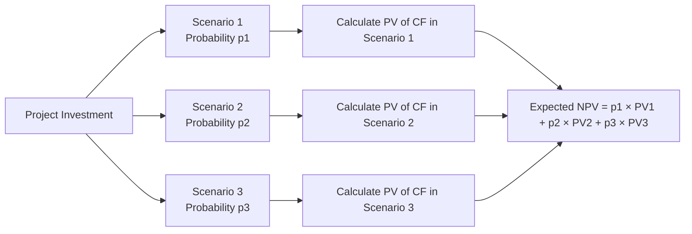

## Introduction 
Sometimes, the hardest moments in quantitative finance come when we have to juggle different branches of our toolkit—time value of money (TVM), probability theory, scenario analysis, discount rate adjustments, and so forth—all at once in a vignette. You might read a short paragraph in the item set about a bond’s possible default (with partial recovery) or a project’s varying future cash flows (with probabilities assigned to each scenario). Then—boom—your next step is to discount them to get an expected present value. It might feel a bit like you’re spinning plates at a circus: keep the probabilities straight, keep the discount rates consistent, remember if compounding is continuous or discrete, and don’t forget inflation assumptions. 

But good news: it all becomes fairly systematic if you build a framework. Let’s walk through how to integrate TVM with probability concepts so you can tackle even multi-step vignette questions in an exam setting without feeling overwhelmed.

## Why TVM and Probability Must Coexist in the CFA Exam
• The real world doesn’t let you ignore probabilities: We rarely have “guaranteed” future cash flows.  
• The exam wants to test your ability to weigh multiple outcomes, discount them appropriately, and figure out which scenario is plausible under changing conditions.  
• Vignettes often blend short-term forecasting (sometimes from a time-series model you tackled in Chapter 6) with scenario-based branching. Understanding all pieces helps you compute an expected present value or expected NPV that accounts for risk and the time value of money.

## Scenario Analysis and Expected NPV
### Laying Out the Logic
Scenario analysis is the process of considering different possible future outcomes—like best case, base case, and worst case—and assigning a probability to each. Then we estimate cash flows for each scenario, discount them to the present, and sum everything up according to their probabilities. In formula form:


\text{Expected NPV} = \sum_{i=1}^n \Bigl( P_i \times \text{NPV}_i \Bigr),


where \\( P_i \\) is the probability of scenario \\( i \\) and \\( \text{NPV}_i \\) is the net present value under scenario \\( i \\).

Here’s a quick but vivid memory of how I learned this: I once tried to weigh a default scenario for a firm’s bond. I got so caught up in the coupon calculations that I forgot to apply the appropriate discount rate to the partial recovery amount. Oops. Ever done that? You’re not alone. The moral is that each scenario should be discounted at a rate that’s consistent with that scenario’s risk and timing.

### A Simple Example
Imagine a project with three possible outcomes after one year:
• Best Case: Cash flow of $2,000 with probability 30%  
• Base Case: Cash flow of $1,200 with probability 50%  
• Worst Case: Cash flow of $200 with probability 20%  

If our discount rate is 10% (assuming discrete annual compounding) and we ignore additional complexities like salvage value or taxes, the present value (PV) of each scenario is:

\text{PV}_\text{Best} = \frac{2{,}000}{(1+0.10)^1} = 1{,}818.18


\text{PV}_\text{Base} = \frac{1{,}200}{(1+0.10)^1} = 1{,}090.91


\text{PV}_\text{Worst} = \frac{200}{(1+0.10)^1} = 181.82


Then the expected PV is:

0.30 \times 1{,}818.18 + 0.50 \times 1{,}090.91 + 0.20 \times 181.82 \approx 1{,}200.00


You could interpret this as an expected project value of about $1,200.

## Partial Probabilities and Default Risk
### Understanding Partial Recovery
In real-world bond investing—or in a tricky exam vignette—you might read: “There’s a 20% chance this bond defaults next year. If it defaults, the recovery rate is 40% of the par value. Otherwise, you get your regular coupon and par at maturity.” Now you have two scenarios:
• With probability 20%, you get 40% of par (plus any partial coupon, if specified)  
• With probability 80%, you get coupon + par  

Each scenario’s outcome is discounted to the present. If the discount rate is consistent for both (assuming the same time horizon and risk premium), you weigh them each by their probability, then sum. The difference from typical scenario analysis is that you might see partial recovery spelled out, so watch for that in the item set!

### Example Table: Probability, Cash Flow, and Discount

| Scenario   | Probability | Cash Flow in 1 Year | Present Value (Discount @ 8%) |
|------------|------------|----------------------|--------------------------------|
| Default    | 20%        | 40% of \$1,000 par = \$400 | \$400 / 1.08 = \$370.37         |
| No Default | 80%        | \$1,000 par + \$50 coupon = \$1,050 | \$1,050 / 1.08 = \$972.22        |

Expected Present Value =  
\\( 0.20 \times 370.37 + 0.80 \times 972.22 \approx \$846.67 \\)

This expected value might then help you decide if the bond is trading at a discount or premium relative to that value in the marketplace.

## Time-Series Forecasting and Discounting
Recall from Chapter 6 how we might use an autoregressive model (AR) or a different time-series approach to project future cash flows or prices. Once you forecast the future value (close price, dividend yield, or coupon), the next step is discounting. The exam might slip in a subtle hint: “Analysts expect a log-linear trend in the firm’s growth rate,” which suggests maybe you’ll use continuous compounding. Or the question might straightforwardly say, “Assume discrete annual compounding.” 

One big caution: If you forecast returns under a lognormal assumption (common with continuous compounding), but the question expects discrete compounding for its discount factor, mismatch can occur. Read carefully for those “key words” like “lognormal,” “continuously,” or “periodic.”  

## Combining TVM with Hypothesis Testing
This might sound unusual, but vignettes can incorporate statistical significance to alter discount rates. For example, maybe the question says: “We tested historical data and found that returns deviate significantly from the assumed mean (p-value < 0.05). The new environment suggests a 2% higher discount rate than historically used.” Then you might recalculate your NPV with a new discount rate to reflect the changed environment. The exam loves to see if you can integrate multiple steps. So watch for:

• A p-value or t-stat indicating that returns differ from historical norms.  
• An instruction to revise the discount rate based on new data.  
• Recalculation of your previously computed project or bond value.  

## Correlation, Covariance, and the Changing Risk Premium
Ever found yourself reading an item set that says, “Analyst notes that inflation is expected to spike by 3% next year, and that historically, inflation correlates with a rising discount rate for the company’s projects”? If so, you need to piece together how an increase in inflation leads to a higher nominal discount rate. The question might tell you that for each 1% increase in inflation, the discount rate goes up 0.5%. So if inflation is forecast to rise by 2%, then your discount rate might need to increase by 1%. 

Correlation and covariance analysis in the background can signal a shifting cost of capital. The big takeaway is to keep your discount rates aligned with the scenario. If inflation or some correlated variable changes drastically in the scenario, your discount rate is probably not the same as in the base case.

## Real vs. Nominal Rates
Another common trap is mixing up real versus nominal rates. Let’s say you read: 
• “Inflation is forecast at 2%.”  
• “All growth rates stated above are nominal.”  
• “Discount rate is 6% in nominal terms.”  

In that case, you can proceed with the nominal growth rates and the nominal discount rate consistently. If, however, you see real growth rates but a nominal discount rate, you might need to convert one to the other. Keep a mental note:


(1 + r_\text{nominal}) = (1 + r_\text{real})(1 + \pi),


where \\( \pi \\) is the inflation rate. Consistency is key!

## A Quick Visual: Scenario Analysis Flow
Below is a simple Mermaid diagram illustrating weighted scenario analysis. We start with a project investment, branch into scenarios, discount each scenario, and sum probabilities to arrive at an expected NPV.



Remember: you discount each scenario’s cash flow (or set of cash flows) at an appropriate rate. Then multiply by the scenario’s probability. Finally, sum to get the overall expected present value (or expected NPV).

## Step-by-Step Outline for Integrated Vignette Solutions
Below is a flexible outline to follow when you see a question that combines probabilities and TVM:

1. Identify Key Variables  
   • Read carefully for discount rate references. Note if it’s nominal, real, or if compounding is continuous.  
   • Extract significant probabilities for each scenario.  
   • Jot down timing (e.g., CF in Year 1 vs. CF in Year 2?).  
   • Note any partial recovery or salvage values.  

2. Calculate Present Values  
   • For each scenario, discount the projected cash flows or salvage amounts using the correct rate.  
   • Include any incremental changes from time-series forecasts or statistically updated discount rates.  

3. Weight by Probability  
   • Multiply each present value by the corresponding probability.  
   • That yields the “Expected Value” of each scenario.  

4. Sum the Expected Values  
   • Add them up for a final expected NPV (or expected bond value).  

5. Sanity Check  
   • Does the answer make sense? Are your discount rates coherent with the scenario descriptions?  
   • If the question introduced nuances like changes in inflation, or correlation that influences the discount rate, did you incorporate that?

## Practical Example with Taxes and Salvage
Let’s suppose you have a capital project with a salvage value at the end of Year 3. You’re provided with:

1. Probability of high demand (60%) → Net annual after-tax cash flow of \$500 for Years 1–3 + salvage of \$1,000 at end of Year 3.  
2. Probability of low demand (40%) → Net annual after-tax cash flow of \$300 for Years 1–3 + salvage of \$600 at end of Year 3.  
3. Discount rate = 9% annually, nominal.  
4. Taxes are already accounted for in the net cash flows.  

Calculate the PV of each scenario, multiply each by its probability, sum the results. The only difference from simpler examples is that you have multiple years plus salvage. But the concept remains: discount year by year, sum the PVs into an NPV, multiply by probability, and sum again.

## Python Snippet for Scenario Analysis
If you’re comfortable with Python, here’s a tiny snippet that shows how you might compute an expected NPV for multiple scenarios. This is purely illustrative:

```python
import math

def present_value(cf, r, t):
    # r is the continuously compounded rate, t is time in years
    return cf * math.exp(-r * t)

scenarios = [
    {"prob": 0.20, "future_value": 1000, "rate": 0.08, "time": 1},
    {"prob": 0.80, "future_value": 1050, "rate": 0.08, "time": 1}
]

expected_value = 0
for scenario in scenarios:
    pv = present_value(
        scenario["future_value"], 
        scenario["rate"], 
        scenario["time"]
    )
    expected_value += scenario["prob"] * pv

print("Expected Value =", round(expected_value, 2))
```

Note how we used continuous compounding here just as an example. In a real exam scenario, you’d typically see discrete compounding unless stated otherwise.

## Common Pitfalls and Best Practices
• Mixing up Real vs. Nominal: Always check the problem statement carefully.  
• Overlooking Partial Probabilities: A default scenario might have only partial recovery.  
• Inconsistent Discount Rates: If the problem states the discount rate changes with inflation, incorporate that.  
• Forgetting Time Horizons: Some scenarios might have different lengths or timings, so you discount them for their actual duration.  
• Mismatching Statistical Findings: If the question tells you returns are now 2% higher than historical, adjust your discount rate or expected return in the model accordingly.  
• Rushing: Under exam pressure, it’s easy to do the calculations for one scenario and forget to multiply by the scenario probability. Slow down enough to systematically check each step.

## Exam Tips
• Carefully highlight each scenario’s probability, timing, discount rates, and final requirement (NPV, expected NPV, or expected price).  
• Use formulaic structure: Lay out the discount factor for each scenario and multiply by the scenario’s probability. That’s a surefire way to avoid messing up.  
• Keep an eye out for “key words” in the vignette: words like “best/worst case,” “default,” “mean shift,” “unit root” (for time-series), or “lognormal” typically hint you’ll need to handle a multi-step approach.  
• If the vignette includes a hypothesis test with a new discount rate, do not ignore it. That changed discount rate might be the entire point of the question.  
• Suggest writing out a mini timeline if you have multiple years and multiple scenarios.

## Wrap-Up and Key Takeaways
The synergy between time value of money and probability-based scenarios is central to the CFA Level II experience. By practicing integrated questions, you’ll train yourself to parse vignettes systematically. My best advice: treat each scenario carefully, discount properly, then weigh by probabilities. Don’t let extraneous details like partial recovery rates, inflation changes, or multiple compounding methods trip you up. With practice, you’ll find that each puzzle starts to look familiar.

## Glossary
• Scenario Analysis: Evaluating possible future events by considering multiple plausible outcomes and their probabilities.  
• Expected NPV: The probability-weighted average of NPVs across different scenarios.  
• Recovery Rate: The percent of par value investors recover if a default occurs.  
• Continuous Compounding: Compounding using the exponential function, \\( e^{r \times t} \\).  
• Discrete Compounding: Compounding at set intervals (annual, quarterly, monthly, etc.).  

## References and Further Reading
• CFA Institute Level II Curriculum, especially end-of-reading practice item sets.  
• Benninga, S. (2014). Financial Modeling (4th ed.). MIT Press.  
• Jorion, P. (2009). Financial Risk Manager Handbook. Wiley.  
• See Chapter 6 of this text for deeper dives into time-series forecasting and stationarity checks.  

## Test Your Knowledge: Integrating TVM and Probability



### A bank is assessing a bond with a 15% chance of default in one year. If default occurs, the recovery is 30% of par; otherwise, full par plus coupon is paid. How would you compute the expected value of the bond today?
- [ ] Take the bond’s par value and multiply by 15%.
- [x] Multiply each scenario’s payoff by its probability, discount each to present, then sum.
- [ ] Subtract 15% from the bond’s coupon rate.
- [ ] Use only the non-default scenario because default is not guaranteed.

> **Explanation:** We must compute the expected payoff in each scenario, discount it, weight by probability, and sum.  

### A project has three equally likely scenarios for next year’s cash flow: \$500, \$1,000, and \$1,200. The discount rate is 10%. What is the expected present value one year from now if discrete compounding is used?
- [ ] \$2,700
- [ ] \$900
- [x] \$900 / (1.10) = \$818.18
- [ ] \$1,100 / (1.10) = \$1,000.00

> **Explanation:** The expected cash flow is (500 + 1000 + 1200)/3 = \$900. Then discount by 1.10 to get \$818.18.  

### A bond’s expected return is statistically found to be 5% lower than management assumed. If this is significant at the 5% level, how might a vignette direct you to adjust the discount rate?
- [ ] Lower the discount rate by 5%.
- [ ] Keep the discount rate constant.
- [x] Increase the discount rate or risk premium to reflect lower expected returns.  
- [ ] Repeat the scenario analysis with unchanged assumptions.

> **Explanation:** Lower expected returns typically imply higher risk, so the discount rate or risk premium might be increased.  

### You see a question referencing “lognormal returns.” Which compounding method might you suspect the exam wants you to adopt?
- [ ] Discrete semiannual compounding
- [x] Continuous compounding (exponential)
- [ ] Discrete monthly compounding
- [ ] No compounding is necessary

> **Explanation:** Lognormal returns often imply continuous compounding.  

### Which of the following best describes how to handle partial probabilities in scenario analysis?
- [x] Assign probabilities to partial outcomes (like partial bond recovery), discount each payoff, and weight accordingly.  
- [ ] Ignore partial outcomes because they’re not guaranteed.  
- [x] Aggregate partial outcomes separately from main scenarios.  
- [ ] Use net present value only for the main scenario.

> **Explanation:** Partial probabilities are simply sub-scenarios that must be weighed by their own assigned probabilities.  

### A project’s salvage value is relevant to the final year’s cash flow. How should it be incorporated in the scenario-based NPV calculation?
- [x] Add the PV of salvage to the last year’s cash flow for each scenario.  
- [ ] Ignore salvage value because it doesn’t affect operating cash flows.  
- [ ] Salvage value only matters if there is a default event.  
- [ ] Subtract salvage value from the initial outlay.

> **Explanation:** We must include salvage as an inflow in the final period and discount it to the present as part of NPV.  

### In a scenario with rising inflation, you find that the discount rate should be adjusted upward by 0.5% for every 1% increase in inflation. If inflation rises by 2%, how should you handle your discount rate in the final NPV calculation?
- [x] Increase the discount rate by 1%.  
- [ ] Keep the discount rate fixed.  
- [x] Decrease the discount rate by 1%.  
- [ ] Switch to real rates only.

> **Explanation:** The correlation suggests a 1% total increase in the nominal discount rate (0.5% × 2%).  

### You see that a scenario states “nominal growth of 5%,” but the discount rate quoted (8%) is real. What is a proper approach?
- [ ] Use 5% for the discount rate as well.  
- [x] Convert the 8% real rate to nominal by using (1 + r_nom) = (1 + r_real)(1 + \pi).  
- [ ] Subtract 5% from 8% to get a 3% net rate.  
- [ ] Multiply 5% by 8% for a combined 13%.

> **Explanation:** Growth rates in nominal terms should be discounted by nominal rates. Convert to make them consistent.  

### A scenario includes a p-value < 0.05 to show the market environment has changed drastically. What is the likely next step in a multi-step exam question?
- [x] Reassess the discount rate or risk premium based on the new environment.  
- [ ] Maintain original discount rates.  
- [ ] Focus only on the p-value since discounting is unaffected.  
- [ ] Assume the project’s NPV is still valid without changes.

> **Explanation:** If data shows the historical norm is invalid, discount rate or risk measures should be updated.  

### True or False: Consistency between compounding assumptions (e.g., continuous vs. discrete) and distribution assumptions (e.g., lognormal vs. normal) is crucial in integrated vignette calculations.
- [x] True
- [ ] False

> **Explanation:** Mismatched assumptions between distribution and compounding can cause major valuation errors.  


