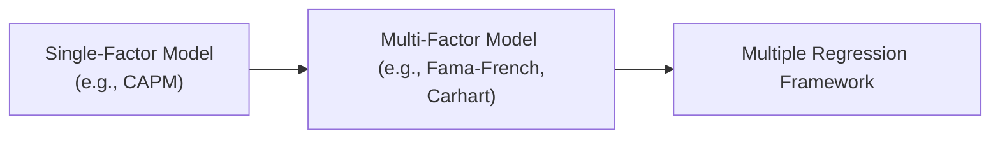

## Overview and Motivation

So, have you ever found yourself staring at loads of data—like hundreds of columns of economic indicators, corporate earnings, and market sentiment? And you're thinking, “Um, how on earth do I figure out which of these factors actually moves the needle on stock returns?” That’s where multiple regression models can swoop in to save the day.

Multiple regression is a statistical technique that helps you understand how changes in several independent variables (such as GDP growth or interest rates) simultaneously affect a dependent variable (often an investment outcome like returns or price changes). Instead of relying on a single-factor approach—like that old friend from Level I, the Capital Asset Pricing Model (CAPM)—multiple regression lets you consider a broad set of predictors. That’s super handy in real‑world investing scenarios where, let’s face it, multiple factors usually matter at once.

## Why Multiple Regression in Finance?

There’s a classic piece of advice in investing: Don’t buy a stock just because “momentum is hot.” Equally, you wouldn’t ignore a company’s fundamentals if you believe it’s undervalued. In reality, you’re likely to juggle many factors simultaneously: valuation metrics, economic indicators, industry trends, and so on. This complexity naturally points you toward multiple regression.

• Differentiating Statistical vs. Real Impact. Multiple regression helps you isolate the impact of each factor while holding the others constant. Maybe you want to know: “Is this sector growth factor truly influential beyond the effect of GDP growth?” A multiple regression framework can give you a precise quantitative answer.

• Management of Complex Investment Hypotheses. Whether you’re constructing a multi-factor hedge fund strategy or modeling default risk in credit portfolios, there’s rarely a single driver. Multiple regression ensures you keep track of many potential influences without losing the forest for the trees.

• Enhanced Explanatory Power. With multiple regression, you often gain a higher R-squared or adjusted R-squared than you would with single-factor models, which suggests a better overall fit. More importantly, you’ll be better able to interpret how each variable influences the dependent variable—for instance, how a 1% change in treasury yields might alter an equity portfolio’s return.

## From Single-Factor to Multi-Factor Models

You might recall that the CAPM was your first introduction to factor-based modeling. It considered just one factor: the market. In advanced finance, though, multi-factor models—like the Fama-French three-factor or Carhart four-factor models—show how size, value, market, and momentum factors can simultaneously explain returns. This shift from single-factor to multiple factors exemplifies the power of multiple regression.

Below is a simple Mermaid diagram to illustrate the conceptual jump:



The diagram is straightforward: single‑factor approaches feed into multi-factor approaches, and multiple regression is the statistical engine that underlies them.  


## Common Applications in Investment Analysis

### Equity Research
In equity research, analysts often run regressions to figure out what drives an individual stock or a sector’s performance. Suppose you suspect “value” (like book-to-market ratio) and “momentum” (like recent returns) are key drivers. You can plug them into a multiple regression alongside market risk and see which factors truly matter.

### Risk Modeling
Portfolio managers might incorporate factors such as credit spreads, liquidity indicators, or macroeconomic variables (e.g., unemployment rate, inflation rate) into a multiple regression model. The goal is to figure out how each risk driver contributes to portfolio volatility or expected shortfall. By controlling for many inputs, you can differentiate crucial risk exposures from the noise in your data.

### Fundamental Analysis
Earnings forecasting is another big one. Let’s say an analyst wants to forecast a company’s earnings per share (EPS). Independent variables might include sector-wide growth, marketing expenses, R&D spending, and operating margins. Multiple regression helps the analyst measure the relative importance of each. It’s like having an equation that tells you precisely how a 1% change in operating margins might shift next quarter’s EPS.

### Credit Analytics
For credit risk assessment, you might model default probability as the dependent variable. Independent variables could be leverage, interest coverage, or trends in the borrower’s industry. While logistic regression is often used for binary outcomes (default or no default), you can still extend multiple regression concepts because logistic models (and other nonlinear models) essentially approximate the same principle: isolating the effect of each variable on the outcome.

## The Multiple Regression Model

In its simplest form, a multiple regression model can be written in KaTeX as:


Y = \beta_0 + \beta_1 X_1 + \beta_2 X_2 + \dots + \beta_k X_k + \epsilon


Where:

• \\( Y \\) is your dependent variable (say, a stock’s weekly return).  
• \\( X_1, X_2, \ldots, X_k \\) are your independent variables (macro factors, industry metrics, or company fundamentals).  
• \\( \beta_0 \\) is the intercept term.  
• \\( \beta_1, \beta_2, \dots, \beta_k \\) are the coefficients that capture the marginal effect of each independent variable on \\( Y \\).  
• \\( \epsilon \\) represents the error term (or noise), capturing everything not explained by your chosen factors.

In practice, you’ll estimate these coefficients via Ordinary Least Squares (OLS) or other methods that best fit your data structure.

Just a quick personal reflection: I remember the first time I built a multi-factor stock return model. I thought I’d found a holy grail—predicting everything from interest rate changes to CEO tweets. But I quickly learned about overfitting the moment real-world out-of-sample data rolled in. So keep that in mind: more factors can lead to more complexity, which isn’t always a friend to robust model performance.

## Example of a Simple Multiple Regression in Python

Below is a mini demonstration using Python. Imagine you’ve got a dataset with a column “stock_return” as the dependent variable and three columns—“market_return,” “size_factor,” and “momentum_factor.”

```python
import pandas as pd
import statsmodels.api as sm

# df.head() might look like:
#        ...    |       ...     |     ...     |        ...

X = df[['market_return', 'size_factor', 'momentum_factor']]
y = df['stock_return']

X = sm.add_constant(X)

model = sm.OLS(y, X).fit()
print(model.summary())
```

The `.summary()` output typically includes estimated coefficients, standard errors, t‑statistics, and p‑values. This helps you see which factors truly matter. In a real exam item set, you might be given partial regression outputs and asked to interpret which factor is statistically significant—or maybe to compute a forecast based on the fitted equation.  

## Interpreting the Results

### Coefficients and Incremental Effects
The main benefit of multiple regression? You can interpret each coefficient as the incremental or partial effect on \\( Y \\). For instance, if \\(\beta_2\\) for “size factor” is 0.03, you’d say: “If size factor increases by 1 unit (e.g., 1 standard deviation), the stock’s return is expected to increase by 3%, controlling for other variables.”

### Goodness of Fit
You’ll likely see measures like R-squared and Adjusted R-squared. The adjusted version penalizes you for adding more variables that don’t explain much. So, if you’re adding factors just because they happen to look good historically, that might inflate your R-squared but won’t necessarily hold up for out-of-sample testing.

### Understanding the Noise (Error Term)
No matter how many variables you include, there’s always some random variation—especially in financial data. The error term captures the “unknown unknowns” or simply the randomness in markets. The best you can do is keep that error term as small and uncorrelated with your predictors as possible.

## Key Considerations and Pitfalls

• Overfitting. Including too many variables can make your model look fabulous on historical data but fail in real time.  
• Endogeneity. If your independent variables are correlated with your error term, your coefficient estimates can be biased. In finance, for instance, variables like “leverage” might be influenced by past performance, which is also captured in the current error term.  
• Multicollinearity. When your factors are highly correlated with each other, it becomes difficult to discern their individual impacts.  
• Omitted Variable Bias. Excluding crucial factors can lead to incorrect estimates for the included factors.  

## Glossary (Key Terms)

• Dependent Variable (Y): The main outcome you’re trying to explain or predict.  
• Independent Variables (Xᵢ): Predictors that provide explanatory power for \\( Y \\).  
• Multi-factor Model: When you have more than one explanatory variable—like plugging multiple risk factors into your return model.  
• Deterministic vs. Stochastic Components: The deterministic part is the linear combination of factors (\\(\beta_0 + \beta_1 X_1 + \dots\\)), while the stochastic component is \\(\epsilon\\), the random noise.  
• Noise (Error Term): The portion of \\( Y \\) not explained by your X variables.  
• Endogeneity: Occurs when an independent variable is correlated with the error term, often due to simultaneity or omitted variables.

## Final Exam Tips

• Practice reading regression output under time pressure. Expect to see abbreviated output in item sets—maybe just coefficients and standard errors, so you must know how to interpret them fast.  
• Be ready to handle multi-factor scenarios, including partial correlations and controlling for multiple variables simultaneously.  
• Look out for “trap” questions involving endogeneity or multicollinearity. The exam might present a situation where an independent variable is obviously correlated with the error term, leading to biased estimates.  
• Don’t forget the fundamentals: hypothesis testing (t-tests, p-values, confidence intervals) is still critical for deciding if a factor is significant.  

## References and Further Reading

• CFA Institute Level II Curriculum, “Quantitative Methods” Reading on Multiple Regression.  
• Brooks, C. (2019). “Introductory Econometrics for Finance.” Cambridge University Press.  
• Wooldridge, J. M. (2016). “Introductory Econometrics: A Modern Approach.” Cengage Learning.  
• Articles on SSRN (https://www.ssrn.com/) for applied multi-factor modeling case studies.

---

## Practice Questions on Multiple Regression in Investment Analysis



### Which of the following best explains the principal advantage of multiple regression over single-factor models?

- [ ] It can only be applied to time-series data.
- [ ] It assumes all factors are perfectly correlated.
- [x] It isolates the effect of each predictor while controlling for others.
- [ ] It eliminates the error term.

> **Explanation:** Multiple regression allows you to control for multiple factors at once, so you can see each factor's effect on the dependent variable separately.  

### In a regression of stock returns on market returns, size factor, and value factor, the coefficient on the value factor is 0.05. Which of the following interpretations is most accurate (assuming all other independent variables are held constant)?

- [ ] A 1% increase in the size factor is associated with a 5% decline in stock returns.
- [x] A 1-unit increase in the value factor corresponds to a 5% increase in stock returns.
- [ ] R-squared cannot exceed 0.05.
- [ ] Value factor must be negatively correlated with market returns.

> **Explanation:** The coefficient on the value factor implies that if the value factor increases by 1 unit, the dependent variable (stock returns) increases by 0.05 or 5%, holding other variables constant.  

### A multiple regression model shows a very high R-squared but very few factors are statistically significant. Which pitfall could this indicate?

- [x] Overfitting.
- [ ] Strong exogeneity.
- [ ] Perfect hedging.
- [ ] Error autocorrelation.

> **Explanation:** A high R-squared combined with insignificant variables often results from overfitting, where too many factors capture noise rather than genuine relationships.  

### When an independent variable is correlated with the error term, this is referred to as:

- [ ] Heteroskedasticity.
- [ ] Multicollinearity.
- [x] Endogeneity.
- [ ] Serial correlation (autocorrelation).

> **Explanation:** Endogeneity occurs when the explanatory variable is correlated with the error term.  

### How can Adjusted R-squared help analysts in multiple regression?

- [x] By penalizing the model for adding variables that provide minimal explanatory power.
- [ ] By indicating the severity of heteroskedastic errors.
- [ ] By automatically correcting for serial correlation.
- [ ] By ensuring the independence of residuals.

> **Explanation:** Unlike regular R-squared, the adjusted version accounts for the number of variables, providing a more realistic view of a model’s explanatory power.  

### In a multi-factor model of portfolio returns, which of the following best describes the noise term (ε)?

- [x] The random part of returns unexplained by the included factors.
- [ ] The deterministic part of the model.
- [ ] A measure of factor loadings.
- [ ] A tool for eliminating p-values.

> **Explanation:** ε (the error term) captures the portion of the dependent variable that cannot be explained by the independent variables in the regression.  

### An analyst is using a multiple regression model to forecast EPS, with variables including GDP growth, marketing spend, and industry R&D. Which potential problem arises if GDP growth is highly correlated with industry R&D?

- [x] Multicollinearity.
- [ ] Endogeneity.
- [ ] Serial correlation.
- [ ] Omitted variable bias.

> **Explanation:** When two or more independent variables are highly correlated, it becomes hard to isolate the effect of each variable on the dependent variable, hence multicollinearity.  

### In an investment returns model, adding a variable that remains insignificant across many periods may still cause an unadjusted R-squared to increase. What does this suggest?

- [ ] Heteroskedasticity has been introduced.
- [x] The variable may be capturing random noise rather than explanatory power.
- [ ] The sample size is too small.
- [ ] There is no correlation among the variables.

> **Explanation:** Simply adding variables—even irrelevant ones—can make the unadjusted R-squared climb, suggesting the factor might be capturing randomness.  

### Which of the following describes a major difference between regression-based mean return forecasts and a single-factor CAPM approach?

- [ ] CAPM estimates mean returns using all available macroeconomic data.
- [x] Multi-factor regression can incorporate multiple explanatory variables, whereas CAPM uses solely market risk (β).
- [ ] CAPM is inherently more accurate than multifactor regressions.
- [ ] Multiple regression cannot be used for time-series analysis.

> **Explanation:** CAPM is a single-factor model focusing on market beta. In contrast, multiple regression can include a range of variables, potentially offering a more nuanced analysis.  

### True or False: In financial modeling, using more independent variables guarantees a decrease in the error term.

- [x] True
- [ ] False

> **Explanation:** This is actually a trick statement. Sometimes adding more variables can reduce the error term in-sample by overfitting. But it doesn’t guarantee a true systematic improvement, especially out-of-sample.  


