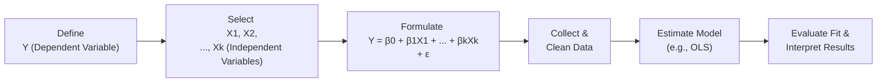

## Introduction
Well, let’s jump right into it: multiple regression is a powerful statistical tool that—when used correctly—can answer a lot of “why” and “how” questions in finance. Ever wonder how analysts predict corporate earnings or estimate the drivers of stock returns? That’s where multiple regression really shines. It helps us see how several factors might collectively influence a single outcome variable (often referred to as the dependent variable). 

In this section, we’ll explore how to formulate a multiple regression model, from picking the right independent variables to cleaning your data so your final model doesn’t end up being just a fancy way to fit random noise (which is the dreaded “overfitting” problem). We’ll also chat about practical considerations, like missing values or the heartbreak of outliers that can throw your entire analysis off course. 

So, if you’ve got your coffee ready, let’s begin with the basics.

## The General Multiple Regression Equation
Let’s get that standard formula right out in the open. The general multiple regression equation is typically presented as:


Y = \beta_{0} + \beta_{1} X_{1} + \beta_{2} X_{2} + \dots + \beta_{k} X_{k} + \epsilon,


where:

- \\(Y\\) is your dependent variable (the outcome you’re trying to predict or explain). 
- \\(X_{1}, X_{2}, \ldots, X_{k}\\) are your independent (or explanatory) variables. 
- \\(\beta_{0}\\) is the intercept, basically the average value of \\(Y\\) when all \\(X\\)s are zero (or at their baseline). 
- \\(\beta_{i}\\) for \\(i = 1, 2, \ldots, k\\) are the slope coefficients that capture how \\(Y\\) changes as each \\(X\\) changes, holding all else constant.
- \\(\epsilon\\) is the random error term that accounts for all the stuff we haven’t included in the model (or measurement errors, or random shocks).

### A Symbolic Representation
Below is a small flowchart using Mermaid to visualize how these pieces fit together in a very conceptual sense:

This chart is a (very) simplified depiction of how you would approach constructing your multiple regression. In real life, you’ll usually go back and forth between these steps in an iterative process—modeling can be messy, but that’s how it goes.

## Selecting Independent Variables
Everyone always asks: “How many variables should I include?” or “Which variables matter?” Well, the short answer: use theory and a dash of practicality to guide you.

### Theoretical Underpinnings
If you’re analyzing stock returns, you’ll see folks often include fundamental ratios (like the price-to-earnings ratio or the book-to-market ratio) or macroeconomic variables (like GDP growth or interest rate changes). Why these choices? Because there’s academic and professional literature suggesting these are relevant drivers of asset prices or corporate performance. 

A personal anecdote: I once had a boss who insisted I include 15 different macro indicators in a single regression to “cover all bases.” It was, shall we say, an adventure in collinearity, and not a particularly enlightening model. This kind of approach often yields more confusion than clarity. That’s why it’s really key to pivot back to well-established economic or financial theory. If there’s no logical reason a variable might explain changes in your \\(Y\\), you might pass on it. 

### Practical Considerations
Sometimes, you need to pick variables based on data availability or reliability. Do you have quarterly or monthly data? Are there big, gaping holes in your series because the provider updated it only sporadically? If you’re dealing with corporate fundamentals, is the reporting consistent across firms or countries? A data set with 10-year monthly updates might handle fewer macro-variables reliably than a weekly data feed. 

The bottom line is: your final list of variables doesn’t just come down to theoretical significance; it also comes down to data coverage, frequency, and quality. 

## Data Quality and Cleaning
Suppose you’ve decided on a few variables you think matter. That’s excellent—but wait, is your data set a mess? Because data cleaning is a huge part of any well-respected analysis. If you’re missing values in key fields or have suspicious outliers (like a 10,000% monthly return?), you might end up with misleading results. 

### Handling Missing Values
A straightforward approach is often to drop observations (rows) if only a few data points are empty. But we can’t always do that. If too many values are missing for a particular variable, you might consider an imputation method—like replacing them with mean values, median values, or using more advanced techniques (e.g., chained equations or machine learning models that estimate missing slices). 

### Dealing with Outliers
Ah, outliers. Those pesky data points that are far away from the rest. Sometimes, they’re legitimate and hold valuable information (like a market crash or a genuinely unexpected surge in a company’s earnings). Other times, they’re just errors. A quick example: I once had a data set with a negative P/E ratio of -999, which turned out to be placeholder code for “unavailable.” That’s definitely a cause for manual review. 

You can do the “trim” approach—cut the top 1% or 5% of suspicious values. Or use transformations that dampen the effect of outliers, like taking a logarithm instead of raw values. The approach should be consistent with the norms in your domain.

### Addressing Data Transformations
We often take logs (ln) of variables like market cap or earnings because these variables can span orders of magnitude. Log transformations can help normalize distributions and linearize relationships that might otherwise be curved. For instance, an exponential relationship might become linear after a log transform. So test it out carefully—maybe your model performs better that way.

## Steps in Setting Up Your Regression
Let’s walk through a more tangible process:

1. **Define the Question Clearly.**  
   Are you trying to forecast next quarter’s earnings or explain last year’s stock returns? The question itself determines your dependent variable and the time horizon.

2. **Identify and Collect Relevant Data.**  
   Gather what you need: historical returns for your \\(Y\\), plus your chosen independent variables (like interest rates, GDP growth, sector performance, etc.).  

3. **Formulate the Equation.**  
   Using your theoretical underpinnings, decide which variables provide a strong rationale. Construct \\(\beta_0 + \beta_1 X_1 + \beta_2 X_2 + \ldots\\).  

4. **Validate or Refine the Model Specification.**  
   You might run a preliminary regression, check the significance of each variable, review residual plots, and confirm there’s no glaring violation. Maybe you realize one variable is consistently out to lunch, or there’s a better transformation you missed.  

### A Quick Example
Let’s say you want to explain quarterly changes in a stock index (S&P 500). A basic model might be:


\Delta \text{Index}_t = \beta_0 + \beta_1 \Delta \text{GDP}_t + \beta_2 \Delta \text{CPI}_t + \beta_3 \Delta \text{Earnings}_t + \epsilon_t.


- \\(\Delta \text{Index}_t\\) is your dependent variable: percentage change in the S&P 500.  
- \\(\Delta \text{GDP}_t\\), \\(\Delta \text{CPI}_t\\), \\(\Delta \text{Earnings}_t\\) are the independent variables that might plausibly explain the index’s changes.  

You’ll collect data from reliable sources (e.g., a major economic database, central bank websites, or financial statements aggregator) for the same frequency (quarterly). Then, standardize or transform them if needed. Next, run an Ordinary Least Squares (OLS) estimation, check if the model assumptions hold (normal residuals, homoskedasticity, etc.), and refine as necessary.

## Parsimonious Models (a.k.a. Avoiding Overfitting)
You might be tempted to keep adding variables—unemployment rate, exchange rates, commodity prices, consumer sentiment, insider transactions, and so forth. And you’ll definitely see your \\(R^2\\) climb up and up as you do. But remember, a good model is “parsimonious.” That’s just a fancy term for “no frills.” Don’t fling half of your economic library in there simply because you can. 

Overfitting is a serious hazard. A model that’s too complex might look stellar inside your sample data but could fail spectacularly when you try to predict new observations. The last thing you want is an extremely complicated set of coefficients that reflect historical noise instead of genuine relationships.

In practical finance, overfit models can prompt bad investment decisions. So test how your model performs out-of-sample or over different time windows. If the predictive power relies heavily on one unusual data period or a random spike, it may be time to scale back.

## Common Pitfalls and Challenges
• **Multicollinearity:** When variables are correlated, it’s hard to tell which is truly causing the effect. You might have trouble interpreting individual coefficients.  
• **Poor Definition of \\(Y\\):** If you’re not crystal clear on what exactly you’re trying to model, the rest can fall apart quickly.  
• **Ignoring Residual Diagnostics:** You do need to peek at how the model is performing. Are the residuals randomly scattered, or do they show patterns? Patterns often mean you missed a variable or a transformation.  
• **Overlooking Data Cleaning:** Messy data sneaks in errors and produces weird results. If you skip the cleaning step, you might chase ghosts in your regression output. 

## Mini Visual Case Study
Imagine you’re integrating monthly stock returns of a large technology company with global macro variables. The technology company has occasionally missing yield data in certain markets. Meanwhile, the macro data from some emerging countries is pretty inconsistent. If all that is thrown into a single regression without carefully cleaning or adjusting for missing data, you can end up with huge standard errors and suspiciously large or small coefficients.

In my earlier days, I once graphed the partial regressions–those are subplots that show the relationship of one independent variable with the dependent variable, holding others constant—and discovered the variable for consumer sentiment was basically static in half of the dataset. Turned out that the provider had “imputed” values incorrectly for about two years. That’s the kind of gaffe that can happen if you skip thorough data checks.

## Glossary
• **β₀ (Intercept):** The value of \\(Y\\) when all \\(X\\)s are zero or at their baseline.  
• **βᵢ (Slope Coefficient):** How \\(Y\\) changes as the i-th \\(X\\) changes by one unit (with other variables constant).  
• **Overfitting:** Producing a model that fits historical noise rather than the underlying relationship. Usually discovered when the model fails to generalize.  
• **Model Specification:** The careful selection and structuring of variables for your regression.  
• **Data Cleaning:** The process of checking for and resolving missing or inconsistent entries, outliers, and other data problems before final analysis.

## Final Thoughts for Exam Success
• Don’t skip the “why” question. Always ask why a certain variable could truly affect your outcome of interest.  
• Keep an eye on your data’s quirks—unusual or missing data can sabotage even the prettiest regression output.  
• Check your model’s parsimony. If that new variable doesn’t add incremental insight, ditch it.  
• On the exam, they might show you a vignette with a messy dataset. Practice how you would address anomalies, or identify a better set of independent variables.  

Models that look complicated aren’t necessarily more accurate or more meaningful. In many cases, the best model is the simplest one that explains the data reliably—one that stands the test of new data.

## References and Suggested Readings
- Greedy, M. & Frost, L. (2020). “Best Practices in Financial Modeling.”  
- “Regression Analysis for Financial Applications,” YouTube lecture series from leading universities.  
- LNCS (Lecture Notes in Computer Science) volumes on data preprocessing for big data.

Remember, a regression is only as good as the thoughtfulness you apply when formulating it. Make sure your variables and data reflect sound theory, and you’ll be well on your way to building strong, predictive models.

---

## Test Your Knowledge: Multiple Regression Model Formulation



### Which statement best describes the role of β₀ (the intercept) in a multiple regression model?

- [ ] It measures the estimated change in the dependent variable when all independent variables are 1.  
- [x] It captures the average value of the dependent variable when all independent variables are zero.  
- [ ] It indicates an error term that accounts for unobservable factors in the regression.  
- [ ] It describes the slope of the regression line when all other variables are constant.

> **Explanation:** β₀ is the intercept of the regression equation, representing the average or expected value of the dependent variable when every independent variable is at a baseline (often zero).

### If an outlier is found to be a simple data entry mistake (e.g., a placeholder for missing data), the analyst should most likely:

- [x] Correct or remove the erroneous outlier before re-estimating the model.  
- [ ] Keep the outlier to avoid losing degrees of freedom.  
- [ ] Multiply the entire variable by a constant to scale down outliers.  
- [ ] Exclude the entire dataset from the analysis.

> **Explanation:** Outliers caused by data entry errors or placeholder codes should be corrected where possible or removed if they are clearly invalid, ensuring your model isn’t distorted.

### What is a parsimonious model?

- [ ] A model with the highest number of independent variables.  
- [x] A model that uses the fewest variables necessary to explain the dependent variable adequately.  
- [ ] A model that always uses only one independent variable.  
- [ ] A model that maximizes correlation by including as many factors as possible.

> **Explanation:** Parsimonious models strike a balance between explanatory power and simplicity. They include only those variables that add real value.

### Which of the following steps is crucial before formulating a well-specified multiple regression model?

- [x] Cleaning the data to handle missing values and outliers.  
- [ ] Finalizing the model solely by increasing the sample size.  
- [ ] Selecting only categorical variables to ensure easier interpretation.  
- [ ] Removing the intercept term for simplicity.

> **Explanation:** Data cleaning, including addressing missing values and outliers, ensures the data is accurate and consistent prior to running the regression.

### When deciding on which independent variables to include in your model:

- [ ] Always include all macroeconomic indicators available to increase R-squared.  
- [x] Use theoretical underpinnings and practical data considerations as guidance.  
- [ ] Pick only variables that have zero correlation with each other.  
- [ ] Focus on variables that are already used in other unrelated studies.

> **Explanation:** Variable selection depends on real economic or financial rationale, plus data quality and availability. The presence of some correlation is common, so excluding variables solely for correlation reasons can remove relevant predictors.

### Which model is at higher risk of overfitting?

- [ ] A model with just one independent variable.  
- [x] A model that has too many independent variables relative to the sample size.  
- [ ] A model that is tested in multiple economic environments.  
- [ ] A well-validated model with a high adjusted R-squared and stable coefficients.

> **Explanation:** Overfitting often occurs when a model has too many variables relative to the amount of data, leading to spurious relationships.

### In a quarterly stock return regression, you suspect that the effect of inflation on returns is exponential rather than linear. A recommended approach:

- [ ] Drop the inflation variable entirely.  
- [ ] Increase the sample size by combining monthly and weekly data.  
- [ ] Remove all other variables to isolate inflation’s effect.  
- [x] Transform the inflation variable by taking its logarithm or another suitable function.

> **Explanation:** If your theory or residual diagnostics suggest a nonlinear relationship, applying a log or other transformation can help linearize the effect in regression.

### Which best describes why an analyst might use difference values (e.g., ∆X) instead of levels (X) in a regression?

- [x] The relationship might be better captured as changes rather than absolute levels, reducing non-stationarity issues.  
- [ ] It forces the data to become normally distributed.  
- [ ] It is a method to inflate the R-squared.  
- [ ] It eliminates the need to check for outliers and missing data.

> **Explanation:** Using differences can remove certain trends or reduce non-stationarity, making the regression more reliable, especially in time-series contexts.

### Suppose you have a model predicting corporate bond yields using five macroeconomic variables. Upon preliminary tests, you notice excessive collinearity among four of them. What is a sensible next step?

- [ ] Keep all variables regardless of collinearity.  
- [ ] Exclude your dependent variable to eliminate the problem.  
- [x] Reevaluate which macroeconomic factors are essential and possibly remove or combine highly correlated variables.  
- [ ] Switch to weekly data to hide collinearity.

> **Explanation:** Reducing multicollinearity often involves removing or combining variables that are closely related, relying on theoretical support to determine which ones matter most.

### True or False: Missing data can always be safely removed from the dataset with no consequences.

- [ ] True  
- [x] False  

> **Explanation:** Simply removing all missing data can lead to selection bias or significantly reduce sample size, potentially harming the representativeness and reliability of your model.


