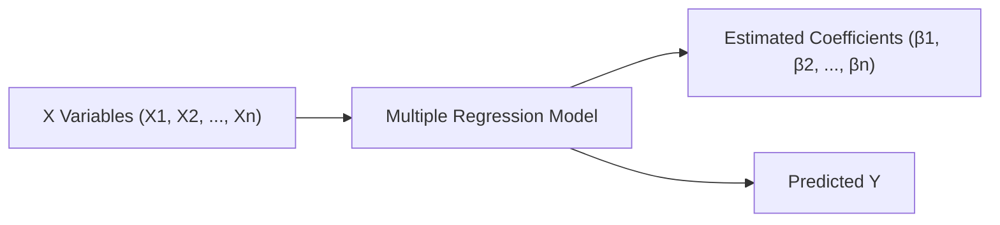

## Introduction

Sometimes, interpreting those regression coefficients can feel like trying to crack a secret code—one that you’re sure is important for your portfolio decisions but also slightly intimidating when you first see all the numbers. Yet understanding how to read and interpret these coefficients is at the heart of using regression in investment analysis. So let’s talk through the key points, step by step, in plain language, but we’ll keep our eyes on the more advanced nuances relevant for CFA Level II exams.

In multiple regression, each slope coefficient (often denoted as βᵢ) is meant to capture how an independent variable (Xᵢ) influences the dependent variable (Y) when you hold all the other variables constant. Of course, whether that influence is just noise or actually something your portfolio strategy should pay attention to is where the statistical tests come in—particularly t-statistics, p-values, and confidence intervals. Let’s walk through how to interpret these elements and what they really mean for your investment decisions.

## Interpreting Slope Coefficients

First, let’s clarify how you interpret a single slope coefficient in a multiple regression model. Suppose you have a model like this:

(
Y = β₀ + β₁X₁ + β₂X₂ + ... + βₙXₙ + ε
)

where:  
• Y is your dependent variable (e.g., a stock’s return or an economic indicator),  
• X₁, X₂, …, Xₙ are your independent variables (e.g., interest rates, GDP growth, sector returns),  
• β₀ is the intercept and β₁, β₂, …, βₙ are the slope coefficients,  
• ε is the error term capturing the randomness or unpredictability not explained by the model.

When you interpret βᵢ, the typical phrasing is:

• “A 1-unit increase in Xᵢ is associated with a βᵢ-unit change in Y, on average, holding all the other independent variables constant.”

The “holding other variables constant” part is crucial. It basically says: “Ignore movements in the other X’s; if you tweak Xᵢ by one unit, this is how Y is expected to move.”

This concept is especially important in finance, where many factors move simultaneously. For instance, let’s say X₁ is the short-term interest rate, X₂ is inflation, and Y is the return on a particular stock. Interpreting β₁ = 0.5 means that if the short-term interest rate goes up by 1 percentage point (and inflation doesn’t change), the stock’s return is predicted to go up by 0.5 percentage points. That’s the straightforward interpretation, but it’s only reliable if your model is well-specified and the relationships hold historically.

## Visual Representation of Regression Inputs and Outputs

Below is a mermaid diagram that can help visualize how each X variable feeds into the regression model to produce predicted values for Y and the resulting coefficients.

This simple flowchart reminds us that multiple inputs (X1, X2, …, Xn) contribute to our model, which generates estimates of the coefficients and predicted values of Y.

## The t-statistic for Hypothesis Testing

Once you’ve estimated each βᵢ, the next question is: “Is that coefficient really significant?” The usual starting point is the t-statistic.

For each βᵢ, you often test the null hypothesis:  
(
H₀: βᵢ = 0
)  
against the alternative hypothesis:  
(
Hₐ: βᵢ ≠ 0
)

If you find that βᵢ is significantly different from zero, it suggests that the corresponding variable might actually have a statistically significant effect on Y.

The formula for the t-statistic of a coefficient typically looks like this:

$$
t_i = \frac{\hat{\beta}_i - 0}{SE(\hat{\beta}_i)}
$$

where:  
• \\( \hat{\beta}_i \\) is the estimated coefficient,  
• \\( SE(\hat{\beta}_i) \\) is the standard error of the estimated coefficient.

If the absolute value of the t-statistic is larger than a critical value from the t-distribution (matching your sample size and significance level), you reject the null hypothesis. For a quick approximation in finance settings with moderately large samples, a t-value above roughly 2 can be significant at the 5% level.

In practical exam scenarios, you might be given either the t-statistic directly or enough information to compute p-values. Either way, keep an eye out for whether you’re performing a one-sided or two-sided test, though in most finance research contexts, the two-sided test is standard.

## p-values and Significance Levels

The p-value is another (often more intuitive) way to judge significance. Formally, the p-value is the probability of observing a result as extreme (or more extreme) than your sample estimate, assuming the null hypothesis is true. If that probability is super low—say below 0.05—then we say the evidence is strong enough to reject the null.

In typical CFA contexts, you’ll see:

• 5% significance level (α = 0.05)  
• 1% significance level (α = 0.01)  
• 10% significance level (α = 0.10)

You pick your α in advance based on how certain you want to be. If the p-value is less than the significance level you set, then you conclude that βᵢ is statistically significant. Now, be sure to check exam instructions or item set hints about the chosen α. They might say they’re using a 1% alpha or 10% alpha for a given test.

Statistical significance suggests there’s a small chance that the coefficient’s effect is purely random noise. But it does not automatically mean the effect is large enough to matter for investment decisions.

## Confidence Intervals for Coefficients

The confidence interval for each coefficient is another way to reveal whether a coefficient might be zero (or near zero). A 95% confidence interval for βᵢ might look like:

$$
\hat{\beta}_i \pm \Bigl(t_{\alpha/2}\Bigr)\times SE(\hat{\beta}_i)
$$

where \\( t_{\alpha/2} \\) is the critical value from the t-distribution (for a 95% CI, \\( \alpha = 0.05 \\) and \\( \alpha/2 = 0.025 \\)). If zero doesn’t appear inside that range, you can infer that βᵢ is statistically significant at the 5% level. This approach is often more intuitive than simply stating “the variable is significant” because the confidence interval also shows you the range in which the true coefficient might lie. 

For example, if your 95% CI for βᵢ is (0.30, 0.70), you have evidence that the coefficient is statistically different from zero, and it suggests the slope might be anywhere between +0.30 and +0.70. In finance, that range might help you see if the effect is meaningful for your portfolio.

## Distinguishing Statistical from Economic Significance

While it’s exciting to say “We found a statistically significant result,” it’s just as crucial to check whether that result is relevant for your decision-making. At times, you might find a coefficient that’s significant but has such a small magnitude that even if it’s real, it might not be worth trading on (or it might not cover your transaction costs). Conversely, you could have a large coefficient that’s not statistically significant if your data sample is tiny or noisy.

• Statistical significance = “I have good evidence that the coefficient isn’t zero.”  
• Economic significance = “This coefficient is large enough to matter in real-world outcomes.”

Always keep in mind that financial markets are dynamic. A statistically significant factor in one historical period might become irrelevant if the market environment changes. That’s where controlling for structural breaks or analyzing out-of-sample performance can prove valuable.

## Real-World Example: Regressing a Stock’s Excess Returns on Macroeconomic Factors

Imagine a scenario where you run a regression to see how a company’s stock excess return (over the risk-free rate) relates to changes in interest rates, inflation, and GDP growth. You might find that the coefficient on interest rates (βᵢ) is 0.70 with a standard error of 0.15. That yields a t-statistic of \\(0.70 / 0.15 \approx 4.67\\). Because 4.67 is quite large (well above 2, typically used as a reference point for significance at the 5% level), you can say the interest rate factor is likely significant at standard confidence levels. The p-value might be extremely small (say, < 0.0005).

But let’s say the coefficient on inflation is 0.05 with a standard error of 0.02, giving a t-statistic of \\(0.05/0.02 = 2.5\\). It’s also statistically significant, although the effect is smaller than that of interest rates. You might ask yourself: “Is 0.05 economically meaningful?” That depends on your portfolio scale and how inflation changes over time. It could matter if inflation rapidly shifts by 3 or 4 percentage points. But if inflation is barely changing a fraction of a point, a 0.05 coefficient might not be enough to shift your investment strategy.

## Pitfalls and Best Practices

Opposing directions and collinearity: If two macro factors are correlated, it might muddy your interpretation. Be watchful for multicollinearity, which can inflate standard errors and make it tricky to separate out the individual effects of each X variable.

Mis-specification: If your model is missing critical variables (like ignoring a major macro input), you can wind up with biased coefficients. Check your residual plots, as described in Chapter 2.5, to spot possible violations of assumptions.

Overfitting: If you cram a million factors into your regression, you might find spurious significance. Always look into out-of-sample tests and see if the significance holds up under new data.

Historic vs. forward-looking: Historically significant relationships might break down in new regimes (for instance, if monetary policy changes drastically). This is one reason you might do rolling regressions or keep a watchful eye on structural breaks (see Chapter 10, “Nonlinear and Advanced Regression Methods,” for more on that).

## Conclusion and Exam Tips

Whenever the CFA exam shows you a multiple regression output, remember to:  
• Identify the slope coefficients that matter.  
• Look at their t-statistics or p-values to gauge significance.  
• Consider the confidence intervals to see the likely range for those coefficients.  
• Distinguish statistical significance from economic viability.  

In the context of investment decisions, it pays to keep your eyes open for whether a factor is truly relevant based on the magnitude of its effect, not just whether it passes a 5% significance test.  

And in actual practice—maybe after you pass the CFA exam—you’ll see that markets can throw curveballs. A factor might be truly important for some time and then become irrelevant. Your ability to interpret coefficients, validate their significance, and remain open-minded to the dynamic nature of markets is what separates effective data-driven analysts from the rest.

## Glossary

p-value: The probability of observing a result as extreme or more extreme than the observed one, assuming the null hypothesis is true. A lower p-value typically indicates stronger evidence against the null hypothesis.

t-statistic: The ratio of your estimated coefficient minus its hypothesized value (often zero) to its standard error. A large absolute t-statistic indicates that the estimated coefficient is significantly different from zero at the chosen alpha level.

Confidence Interval (CI): The range of values within which the true parameter is expected to lie with a specified level of confidence (commonly 95%). When zero is not in the interval, the coefficient is statistically significant at that level.

Economic Significance: Whether the magnitude of the estimated effect is large enough to be relevant for real-world financial decisions (e.g., profitable trading strategies, portfolio allocations).

## References, Suggested Readings, and Further Insights

• CFA Institute Level II Curriculum (2025). “Quantitative Methods,” particularly the sections on linear regression and hypothesis testing in a multiple regression framework.  
• Kansas, B. (2018). “Statistical Significance vs. Economic Significance in Financial Analysis,” Journal of Finance.  
• UMich Open Courseware on Econometrics:  
  https://michiganonline.umich.edu/  

You may also want to revisit Chapter 2.5 for more on identifying violations from residual plots. For deeper dives into advanced model specs, see Chapter 4 (Model Misspecification) and Chapter 10 (Nonlinear Reg. Methods).  

## Practice Questions on Interpreting Regression Coefficients and Statistical Significance



### Understanding Basic Coefficient Interpretation

- [x] A 1-unit increase in Xi is associated with a βi-unit change in Y, holding other variables constant.
- [ ] A 1-unit increase in Xi is always associated with a 1-unit change in Y. 
- [ ] βi has no relationship to the magnitude of change in Y. 
- [ ] The intercept is the slope coefficient for Xi.

> **Explanation:** By definition, βi shows how Y changes for a one-unit increase in Xi, controlling for other factors.

### Testing a Single Coefficient

- [x] The null hypothesis is typically that βi = 0.
- [x] The alternative hypothesis is typically that βi ≠ 0.
- [ ] The null hypothesis is that βi > 0.
- [ ] The null hypothesis is that βi < 0.

> **Explanation:** The usual two-sided test in multiple regression is H0: βi = 0 vs. H1: βi ≠ 0.

### Interpreting T-Statistics

- [x] A large absolute t-value indicates a higher chance of rejecting H0.
- [ ] A t-statistic near 0 indicates strong evidence against H0.
- [ ] You always need t > 10 to reject H0 in CFA contexts.
- [ ] The t-statistic is insignificant if above 2 in absolute value.

> **Explanation:** A large absolute t-value suggests the coefficient is significantly different from 0. Typically, |t| > 2 often indicates significance at the 5% level, but exact thresholds depend on degrees of freedom.

### p-values and Significance

- [ ] If p-value > 0.10, then the coefficient is always significant.
- [ ] If p-value < 0.95, the coefficient is significant at the 5% level.
- [x] If p-value < 0.05, the coefficient is significant at the 5% level.
- [ ] p-values only exist for large sample sizes.

> **Explanation:** The standard threshold for a 5% significance level is a p-value < 0.05.

### Confidence Interval Logic

- [ ] If the 95% CI for βi includes 0, βi is definitely positive.
- [x] If 0 is not in the 95% CI, βi is statistically significant at the 5% level.
- [ ] Confidence intervals are never used in regression analysis.
- [ ] A wide confidence interval implies zero standard error.

> **Explanation:** If the entire interval stays on one side of zero, we reject H0: βi = 0 at the chosen significance level.

### Statistical vs. Economic Significance

- [x] A coefficient can be statistically significant but economically insignificant.
- [x] A large coefficient might be statistically insignificant if the standard error is large.
- [ ] If a coefficient is significant, it must always matter for investment decisions.
- [ ] Economic significance means the coefficient’s t-statistic equals 3 or more.

> **Explanation:** Statistical significance depends on p-values and t-stats, whereas economic significance is about the coefficient’s magnitude in real-world terms.

### Multiple Regression Setup

- [x] Each slope coefficient indicates the effect of one variable while holding others constant.
- [x] Multicollinearity can distort the interpretation of individual coefficients.
- [ ] Holding other variables constant is irrelevant in multiple regression.
- [ ] A multiple regression cannot handle more than two independent variables.

> **Explanation:** Multiple regression allows for multiple X variables, and each coefficient is interpreted ceteris paribus. But collinearity between X's can complicate interpretation.

### Practical Significance in Finance

- [x] Even a small coefficient may matter if the variable changes by large magnitudes.
- [x] Coefficients should be interpreted with transaction costs and volatility in mind.
- [ ] Large t-statistics guarantee the coefficient’s real-world impact.
- [ ] All significant variables guarantee profitable trading strategies.

> **Explanation:** Real-world conditions such as magnitude of changes, transaction costs, and market volatility influence whether a coefficient is practically useful.

### Common Pitfalls

- [x] Omitting key variables can lead to biased coefficients.
- [ ] T-tests are unaffected by sample size.
- [x] High correlation among X variables makes it hard to interpret the coefficients.
- [ ] The presence of a large t-statistic means the model has no errors.

> **Explanation:** Omitting critical variables and high multicollinearity can undermine reliability. Larger sample sizes generally make t-tests more reliable.

### True or False: Significance Levels

- [x] True
- [ ] False

> **Explanation:** It's true that researchers often set an alpha, such as 5%, before seeing the data. This pre-determined alpha helps avoid bias in deciding whether a coefficient is “significant.”




