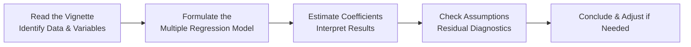

## Hypothetical Scenario

Let’s imagine a portfolio manager, Lisa, who wants to predict the quarterly returns of XYZ Mutual Fund. She suspects several factors play a big role in driving these returns, such as:  
• Overall market performance (proxied by the S&P 500 quarterly return)  
• Changes in interest rates (quarterly change in short-term interest rates)  
• Sector performance (e.g., a specific industry index return)  
• Quarterly GDP growth  

Lisa’s goal is to build a multiple regression model using Ordinary Least Squares (OLS) with historical data spanning the last 20 quarters (five years). She hopes the model will help forecast future fund performance and guide investment decisions.  

Now, let’s see how this might show up on a CFA-style vignette. We’ll show some data, walk through it carefully, interpret exactly what’s going on, and figure out if any assumption is violated. Strap in—this is exactly how you might see it on exam day, but we’ll take it step by step.

## Vignette-Style Data and Summary

Below is a simplified summary of the data Lisa collected for 20 quarters:

• Dependent Variable: Fund Return (Y), measured in percentage points each quarter.  
• Independent Variables:  
  1. Market Return (X₁), measured in percentage points (S&P 500 quarterly return).  
  2. Change in Interest Rate (X₂), measured as the difference in short-term rates from one quarter to the next (in percentage points).  
  3. Sector Return (X₃), measured in percentage points (quarterly return on a specific industry index that heavily influences the mutual fund).  
  4. GDP Growth (X₄), measured in percentage points from one quarter to the next.

Lisa’s regression equation (hypothesized) is:

Y = β₀ + β₁·X₁ + β₂·X₂ + β₃·X₃ + β₄·X₄ + ε

The following table shows some aggregated summary statistics from the regression output (for illustration, not actual raw data points for all 20 quarters):

| Statistic                       | Value         |
|---------------------------------|--------------:|
| β₀ (Intercept)                  | 0.50          |
| β₁ (Market Return Coefficient)  | 0.80          |
| β₂ (Interest Rate Coefficient)  | -0.40         |
| β₃ (Sector Return Coefficient)  | 0.65          |
| β₄ (GDP Growth Coefficient)     | 0.10          |
| Standard Errors (β₁, β₂, β₃, β₄)| 0.15, 0.12, 0.20, 0.05 |
| R-squared                        | 0.72          |
| Adjusted R-squared              | 0.68          |
| F-Statistic (p-value)           | 12.56 (0.001) |
| Durbin–Watson Statistic         | 1.10          |
| Observations (n)                | 20            |

From a quick glance, you might see a few potential highlights: a relatively high R-squared (0.72), some interesting coefficients (especially that negative sign for interest rate changes), and a Durbin–Watson statistic possibly pointing toward some autocorrelation concerns (typically, we like to see a Durbin–Watson around 2 for no autocorrelation).

## Step-by-Step Interpretation and Walkthrough

### Reading the Vignette Carefully and Collecting Data

On the exam, the first thing you’d do is read the entire item set from top to bottom—paying special attention to:  
• The time frame (20 quarters, or 5 years of data)  
• The dependent variable (Fund Return)  
• The independent variables (Market Return, Interest Rate Changes, Sector Return, GDP Growth)  
• The given statistical measures (R-squared, standard errors, Durbin–Watson, p-values, etc.)  
• Any context clues about data issues (e.g., mention of outliers, non-constant variance, patterns in residuals)  

It might sound obvious, but it’s so easy to skip details under time pressure. Anyway, once you’ve identified these bits, you’ll see how they connect—and which ones might indicate trouble if the assumptions aren’t met.

### The Regression Equation

From the vignette (and from Lisa’s assumptions), you’ll note:

(1) Y = β₀ + β₁·X₁ + β₂·X₂ + β₃·X₃ + β₄·X₄ + ε

Where:  
• Y = Quarterly Return on XYZ Mutual Fund  
• X₁ = S&P 500 Quarterly Return  
• X₂ = Change in Short-Term Interest Rates  
• X₃ = Sector Quarterly Return  
• X₄ = GDP Growth  

Lisa performed an OLS regression and found:

• Intercept, β₀ = 0.50  
• β₁ = 0.80 (Statistically significant if t-stat > 1.96 in absolute value at ~5% significance)  
• β₂ = -0.40 (Check if statistically significant)  
• β₃ = 0.65 (Check if statistically significant)  
• β₄ = 0.10 (Check if borderline or significant)  

### Estimating Coefficients and Interpreting Them

Suppose each coefficient has the following standard error:  
• SE(β₁) = 0.15  
• SE(β₂) = 0.12  
• SE(β₃) = 0.20  
• SE(β₄) = 0.05  

And let’s do a quick t-stat check:  

• t(β₁) = 0.80 / 0.15 ≈ 5.33 → likely highly significant (p-value < 0.01).  
• t(β₂) = -0.40 / 0.12 ≈ -3.33 → likely significant (p-value < 0.01).  
• t(β₃) = 0.65 / 0.20 ≈ 3.25 → fairly significant (p-value between ~0.01 to 0.005).  
• t(β₄) = 0.10 / 0.05 = 2.00 → borderline significant (p-value at or around 0.05).  

Interpretation:  
• β₀ = 0.50: If all other factors are zero, you’d expect the fund to return about 0.50% in a quarter.  
• β₁ = 0.80: For every 1 percentage point increase in the market (S&P 500) quarterly return, the fund’s return tends to increase by 0.80 percentage points (holding everything else constant).  
• β₂ = -0.40: For every 1 percentage point increase in interest rates (which is big), the fund’s return is expected to decrease by 0.40 percentage points. This negative sign implies an inverse relationship—makes sense if rising rates typically weigh on equity returns.  
• β₃ = 0.65: For every 1 percentage point increase in the relevant sector’s quarterly return, the fund’s return increases by 0.65 percentage points.  
• β₄ = 0.10: For each 1 percentage point increase in quarterly GDP growth, the fund’s return increases by 0.10 percentage points. A smaller coefficient, but still potentially significant.  

### Checking Assumptions with Residual Diagnostics

Now we come to the detective work: see if the assumptions are met.  

1. **Linearity**: Does the relationship between each X and Y appear linear? We assume yes for now, though in a real scenario you might see a residual plot or a mention of curvature in the data.  

2. **No Perfect Multicollinearity**: Possibly check correlation among the independent variables. If the item set says “The correlation between interest rates and GDP growth is 0.90,” that’s a red flag for multicollinearity. Our scenario doesn’t mention extreme correlations, so we’ll assume we’re good.  

3. **Error Term Has a Mean of Zero**: Typically, the regression intercept is meant to handle that, so no direct concern from a quick read.  

4. **Homoskedasticity**: We want constant variance of the residuals. If the vignette says “No pattern is observed in the plot of residuals vs. fitted values,” that’s encouraging. If we see something like “Non-constant variance (heteroskedasticity) is present,” that’s obviously an assumption violation.  

5. **No Autocorrelation**: The Durbin–Watson (DW) statistic is 1.10, which often suggests possible positive autocorrelation (DW < 1.5 might be suspicious). Because we have time-series data (quarterly data often have momentum or correlation across time), there could be a big question mark about autocorrelation here.  

6. **Normality of Errors**: Typically tested with something like a Q-Q plot or Shapiro–Wilk test, but often exam vignettes simply say “residuals appear normally distributed,” or they provide a chart. We’ll assume normal errors unless told otherwise.  

Given the data, the largest red flag is the Durbin–Watson statistic of 1.10, which might indicate some auto-correlation in the errors. If the exam question highlights this, we might need to mention that “Yes, the model might violate the assumption of no autocorrelation.”  

### Evaluating Potential Violations

• **Autocorrelation**: With DW = 1.10, and a sample size of 20, the critical values might suggest the presence of positive autocorrelation. This is common in time-series. You might need a remedy like a Newey–West approach or a first-difference model or an AR(1) error correction.  

• **Heteroskedasticity**: We don’t see direct evidence, but we can’t be sure. If the vignette specifically notes “there is a pattern in residuals that widen over time,” that would be a sign.  

If the question asks, “Is the standard error estimate likely biased given the residual pattern?” you’d probably say “Yes” if there was persistent autocorrelation or heteroskedasticity.  

### Conclusion on Model Reliability

From the data, we see a fairly strong R-squared of 0.72, and most coefficients appear significant. The model could be quite useful. However, the presence of autocorrelation might suggest that the standard errors we’re using could be understated—meaning that some of the “t-stats” might be higher than they should be if we accounted for the correlation.  

In a real exam scenario, you’d highlight:  
• The overall significance looks good (F-stat is 12.56 with p = 0.001).  
• Each factor matters in the expected direction (market and sector returns positively correlated, interest rates negatively correlated, GDP growth is positive but not huge).  
• You do need to address serial correlation, which can be done by adjusting your standard errors or using a time-series approach that accounts for autocorrelation.

## Exam-Taking Strategies

So how in the world do we do all this under a time crunch? Here are some tips:

• **Scan for Keywords**: Terms like “non-constant variance,” “increasing spread,” “patterned residuals,” “Durbin–Watson = 1.1,” or “p-values below 0.05.” These are signposts pointing to assumption violations or significance.  
• **Mark Up the Vignette**: Under exam conditions, highlight or underline the key data. Jot quick notes in the margins about which assumption might be in trouble.  
• **Watch the Clock**: Resist the temptation to overthink. Item sets have multiple questions. If you get stuck on one detail for too long, you lose valuable time.  
• **Use the Tools**: You have a calculator—use it for quick t-stat approximations. If you see a coefficient is 0.80 and standard error is 0.10, you can do 0.80 / 0.10 in two seconds.  
• **Logical Flow**: Approach each question systematically:  
  1. Identify the relevant piece of data in the vignette.  
  2. Recall the conceptual framework or formula.  
  3. Perform any needed calculation or interpretation.  
  4. Select your answer based on that logic.  

## Mermaid Diagram: Regression Walkthrough

## Detailed Solution Key Example

Think you might need a roadmap? Here’s a mini-solution key blueprint:

1. **Identify the question**: “Which variables are statistically significant?” → Check t-stats or p-values.  
2. **Plug in the numbers**: Coefficient / Standard Error. Compare the t-stat to the critical t-value.  
3. **Read the residual diagnostic clues**: “Durbin–Watson = 1.1.” → Red flag for positive autocorrelation.  
4. **Conclusion**: “We suspect some standard errors might be biased, so we’d look to correct for that. However, the model overall seems to have predictive power.”  

Always link these steps back to the data. The exam might present 4–6 multiple-choice items about these details (like “Which assumption is most likely violated?” or “Which coefficient is not statistically significant?”).

## Glossary

• **Vignette-Style Questions**: CFA item sets that present a mini-case with relevant data. You have to interpret that data to answer multiple sub-questions.  
• **Exam-Taking Strategy**: A structured approach that focuses on scanning for critical data, diagnosing any assumptions or typical pitfalls, then calculating or interpreting results in a streamlined way.

## References, Suggested Readings, and Further Insights

• Past CFA Institute Level II mock exams: Look for questions involving multiple regression output.  
• Third-party CFA prep providers: Many offer specialized guides on answering item set questions under time constraints.  
• Online tutorials that show you step-by-step how to read regression output. These can help you practice pattern recognition for assumption violations.

## CFA Multiple Regression: Practice Vignette Knowledge Check



### Which assumption is MOST likely violated given a Durbin–Watson statistic of 1.10 in a quarterly regression?

- [ ] Heteroskedasticity
- [x] Autocorrelation
- [ ] Multicollinearity
- [ ] Normally distributed residuals

> **Explanation:** A Durbin–Watson statistic notably below 2 suggests positive autocorrelation in the error terms, a direct violation of the no-autocorrelation assumption.

### What is the regression equation typically used by Lisa to predict XYZ Mutual Fund returns?

- [ ] Y = β₀ + β₁·X₁ + β₂·X₂ + ε
- [ ] Y = β₀ + β₁·X₁ + ε
- [x] Y = β₀ + β₁·X₁ + β₂·X₂ + β₃·X₃ + β₄·X₄ + ε
- [ ] Y = β₀ + β₄·X₄ + β₂·X₂ + β₃·X₃ + ε

> **Explanation:** The vignette clearly lists four independent variables: Market Return (X₁), Change in Interest Rate (X₂), Sector Return (X₃), and GDP Growth (X₄), in addition to the intercept β₀.

### How do you evaluate whether β₂ is statistically significant at the 5% significance level in Lisa’s model?

- [x] Compare the t-statistic (coefficient ÷ standard error) to the critical value of ~1.96
- [ ] Calculate the ratio of R-squared to Adjusted R-squared
- [ ] Look for non-constant variance in the residuals
- [ ] Use the Durbin–Watson statistic directly

> **Explanation:** Significance of an individual coefficient is determined by dividing the coefficient by its standard error and comparing to a t-distribution’s critical value (often ±1.96 at 5% level).

### If the critical t-value at 5% for 20 observations is approximately 2.093, which coefficient is MOST likely borderline significant?

- [ ] β₁ with a t-stat of 5.33
- [ ] β₂ with a t-stat of -3.33
- [ ] β₃ with a t-stat of 3.25
- [x] β₄ with a t-stat of 2.00

> **Explanation:** A t-stat of 2.00 is only slightly under the typical 2.09 threshold, so that suggests β₄ is borderline or marginal in terms of significance.

### Which of the following best describes “multicollinearity”?

- [ ] Errors correlated with themselves over time
- [ ] Non-constant variance of residuals
- [x] High correlation among two or more independent variables
- [ ] A negative correlation between dependent and independent variables

> **Explanation:** Multicollinearity refers to the correlation between independent variables in a multiple regression, often leading to large standard errors and unstable estimates.

### When the model’s F-statistic (p-value) is 0.001:

- [x] At least one of the predictors is significantly different from zero
- [ ] All predictors have high p-values
- [ ] No predictors are significant
- [ ] The Durbin–Watson test must be less than 2

> **Explanation:** A low p-value for the overall F-test means the model is statistically significant—i.e., at least one coefficient (beyond the intercept) is different from zero.

### If the item set mentions “The residuals broaden as fitted values increase,” you should suspect:

- [x] Heteroskedasticity
- [ ] Multicollinearity
- [ ] Autocorrelation
- [ ] Normal residuals

> **Explanation:** A broadening pattern of residuals as fitted values increase generally suggests non-constant variance or heteroskedasticity.

### Which approach could help correct for potential positive autocorrelation in Lisa’s residuals?

- [ ] A White test for heteroskedasticity
- [ ] Variance Inflation Factor (VIF)
- [x] Newey–West standard errors
- [ ] Use a Beta distribution for the errors

> **Explanation:** Adjusting standard errors for serial correlation can be done with Newey–West or other robust standard error corrections.

### If the regression is intended for forecasting and we detect significant autocorrelation, the next best step might be:

- [ ] Disregard the model
- [ ] Rerun the model with more independent variables
- [x] Consider a time-series model (e.g., AR or ARIMA) or correct for autocorrelation
- [ ] Assume the forecast results will remain valid

> **Explanation:** When you have autocorrelation in time-series data, you either need to fix it through specialized regression approaches or shift to a more appropriate time-series modeling framework.

### True or False: A high R-squared always indicates that regression assumptions (such as no autocorrelation) are satisfied.

- [x] False
- [ ] True

> **Explanation:** A high R-squared does not guarantee that assumptions like homoskedasticity or no autocorrelation are met. It only tells us how much variance in Y is explained by the model.



 

Remember, the best way to build accuracy and speed is to practice with as many item sets as possible. Time yourself, focus on reading carefully, note the given data, identify any disclaimers or red-flag phrases like “residual pattern,” “serial correlation,” or “non-constant variance,” and interpret accordingly. And hey, don’t be too hard on yourself—part of becoming proficient is messing up occasionally and learning from it. Good luck, and see you in the next chapter!
