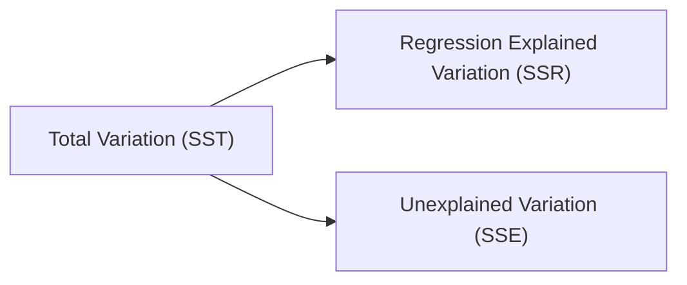

## Introduction and Context

So, let’s talk about one of the core metrics in regression analysis: R-Squared (R²) and its more cautious sibling, Adjusted R-Squared (R̄²). When we run multiple regression models for investment analysis—say, to forecast returns or to figure out which macroeconomic variables best explain security price movements—R² and Adjusted R² are often the first numbers we check to judge whether the model is “good.” But, um, it’s not that simple. Sure, a nice, big R² might look impressive on the surface, but adding new variables can “artificially” inflate that figure. Adjusted R², on the other hand, gives us a more refined view by penalizing extra variables that don’t really contribute to explaining the data. In this section, we’ll dig deep (informally but thoroughly) into these metrics, ensuring you can interpret them correctly and apply them to your own data-driven financial decisions.

## Understanding the Basics of R-Squared

R² is essentially a measure of how much of the total variability in the dependent variable (for instance, stock returns) can be explained by the set of independent variables (like economic indicators or company fundamentals) in your model. Sometimes you’ll hear it called the “coefficient of determination,” which may sound fancy, but it just means the fraction of the total variation that’s “determined” by the model’s predictors.

Mathematically, R² is computed as:


R^2 = \frac{\text{SSR}}{\text{SST}} \;=\; 1 \;-\; \frac{\text{SSE}}{\text{SST}}


where:  
• SSR = Regression Sum of Squares (part of the variation explained by the independent variables).  
• SSE = Residual Sum of Squares (the unexplained portion, i.e., the errors).  
• SST = Total Sum of Squares (the total variation in the dependent variable around its mean).

### Visualizing Sum of Squares

Sometimes folks find it easier to see the relationships among SSR, SSE, and SST in a simple diagram:

Think of it as a pie: SST is the entire pie of variation. SSR is the slice explained by your regression, and SSE is the leftover slice that the regression model fails to explain. R² = SSR/SST is effectively the ratio of the explained slice to the entire pie.

## Interpreting R-Squared in Practice

An R² around 0.85 tells you that 85% of the variation in your dependent variable (say, monthly returns on a particular equity fund) is accounted for by your chosen independent variables. That’s usually considered “good.” But are we done? Not exactly. A high R² could also mean you’ve included a bunch of variables (maybe some questionable ones) that artificially inflate explanatory power without improving out-of-sample forecasting ability. You know, the type of scenario where everything looks perfect on paper, but once you try to forecast real data, it crumbles.

### Common Pitfalls with R-Squared

• Overfitting: Adding more variables will almost always increase R² (or at least, it won’t decrease). This can lead to artificially high R² values that don’t genuinely reflect predictive power.  
• No Causation Guarantee: Even a high R² doesn’t prove cause-and-effect. Maybe the variables are highly correlated by random chance.  
• Potential for Irrelevant Variables: Thanks to data mining or “throwing in the kitchen sink,” you might end up with variables that have no real economic rationale behind them.

From an exam perspective, you might get a question asking you to critique a regression that shows a surprisingly high R² but is grounded in questionable logic—like using the previous quarter’s rainfall in Tokyo to predict US treasury yields. It’s important not to rely on R² alone.

## Adjusted R-Squared: The Next Step

That’s where Adjusted R² comes to the rescue. Adjusted R² tries to figure out if adding another variable actually improves the model beyond what you would expect by chance. This measure imposes a penalty on each additional variable, especially if that variable adds little explanatory power to the model. The formula for Adjusted R² is:


\overline{R}^2 \;=\; 1 \;-\; \frac{\text{SSE}/(n - k - 1)}{\text{SST}/(n - 1)}


where:  
• n = number of observations.  
• k = number of independent variables in the model.

Notice the denominators: SSE is now divided by (n–k–1) instead of (n–2) or (n–1), and SST is divided by (n–1). This ratio attempts to compare the unexplained portion per degree of freedom to the total variation per degree of freedom.

So, if you add a brand-new variable that doesn’t do much, SSE won’t go down enough to justify losing a degree of freedom. In plain language, you get “punished” for cluttering up your model. As a result, Adjusted R² can actually go down if you toss in extraneous regressors.

## Why Adjusted R-Squared Matters

I recall once, early in my career, I was so proud of a model that generated an R² of like 0.98. I confidently told everyone it was bulletproof. Turned out my dataset had just 40 observations and I was using 15 variables (yikes). Adj. R² was significantly lower, which was my first clue that my model might have been overfit. Ultimately, it didn’t forecast well.

In a real-world portfolio management scenario, high R² plus a drop in Adjusted R² for an additional variable signals that the variable is probably not adding genuine value. And that’s the gist: Adjusted R² is more appropriate if you’re deciding whether the “marginal” improvement from a new variable is worth the complexity cost.

## Step-by-Step Calculation and Interpretation

1. Obtain SSR, SSE, and SST. Many statistical software packages or spreadsheet tools can do this for you automatically. Be sure you know how to locate these in typical regression output.  
2. Calculate R² = SSR/SST or 1 – (SSE/SST). This part is straightforward.  
3. Calculate Adjusted R². Keep careful track of your sample size (n) and the number of explanatory variables (k).  
4. Compare R² and Adjusted R². If R² is large but Adjusted R² is significantly lower (or even goes down) when you add a variable, it might be a sign of overfitting or an unnecessary predictor.  
5. Combine these with theoretical or economic reasoning. If a variable doesn’t make sense from a finance or economic standpoint, it’s often best to exclude it—even if it marginally raises R².  

## Real-World Financial Example

Let’s say you’re building a model to explain the monthly returns of a broad equity index (e.g., S&P 500). You incorporate the following independent variables:

• GDP growth rate (quarterly, annualized).  
• Inflation rate changes (CPI).  
• Corporate earnings surprises.  
• A random “extra” variable, such as something you suspect *could* be correlated but have no strong fundamental story for.

You run the regression first without the extra variable, then with it:

• Model 1: R² = 0.65, Adjusted R² = 0.63  
• Model 2: R² = 0.68, Adjusted R² = 0.62

Notice that R² went up from 0.65 to 0.68, which might look good at first glance. Meanwhile, Adjusted R² actually fell from 0.63 to 0.62. This is a giant clue that the “extra” variable is not contributing enough explanatory power to justify including it. It’s likely more noise than signal.

## Best Practices and Common Pitfalls

• Always Evaluate Both R² and Adjusted R²: R² alone can be misleading when comparing models with different numbers of independent variables.  
• Guard Against “Data Snooping”: In finance, it’s easy to test dozens of candidate variables (oil prices, exchange rates, random macro data). The more you test, the likelier you’ll find “something” that fits your historical data, even if it’s spurious.  
• Remember the Degrees of Freedom: Big data sets let you add more variables without losing significant degrees of freedom. But if your data set is small—watch out. Overfitting becomes a real risk.  
• Check Economic Intuition: Even if Adjusted R² goes up slightly, ask if the variable offers any sound theoretical or practical reason to be there. If not, you might hamper interpretability.  

## Additional Considerations for Exam Settings

In Level II item sets, you could be presented with two competing models. One might have a bigger R², while the other has a higher Adjusted R². You might be asked to choose which model is more appropriate for forecasting or for explaining a certain phenomenon. Another typical exam angle: you see a table of regressors, standard errors, and p-values. The question might lead you to check whether a newly added variable has a significant coefficient or whether it’s just fluff. Adjusted R² is your friend in these scenarios.

## Ethical and Professional Implications

From a CFA Institute Code and Standards perspective, be mindful of “misrepresentation.” Claiming your model is robust just because it has a high R² might be misleading if you haven’t considered out-of-sample testing, validation sets, or Adjusted R². As a charterholder (or candidate), it’s your responsibility to ensure your statements about a model’s effectiveness are accurate and thorough, reflecting all relevant measures.

## Further Exploration

If you want to go deeper, it might be worth reading references like Damodaran’s “Applied Corporate Finance” for practical investment and corporate finance applications. For a purely econometric approach, Wooldridge’s textbook is excellent. The official CFA Institute Level II curriculum will contain practice item sets that specifically target your ability to interpret R², Adjusted R², as well as other regression diagnostics.

## Final Pointers for the Exam

• Don’t just memorize formulas—understand them. Know how SSE, SSR, and SST interrelate and what each quantity represents.  
• Practice reading regression output. Many exam questions give you partial output with SSE, SSR, or even just an R² and partial sums of squares, expecting you to fill in the blanks.  
• Watch for trick variables. If a variable in a vignette has no real financial justification, you can guess it’s potentially inflating R².  
• Time management: You may need to recalculate Adjusted R² quickly if the exam question changes the model’s variables. Keep the formula close at hand and know it by heart.

## References

• CFA Institute Level II Curriculum (Quantitative Methods Readings).  
• Wooldridge, J. Introductory Econometrics.  
• Damodaran, A. Applied Corporate Finance.  

---

## Test Your Knowledge: R-Squared and Adjusted R-Squared Essentials



### Which statement best describes R-squared in a multiple regression model?

- [x] It measures the proportion of total variation in the dependent variable explained by the independent variables.
- [ ] It is a measure of causality between the dependent and independent variables.
- [ ] It is always higher than the Adjusted R-squared for the same model.
- [ ] It measures the significance of individual coefficients in the model.

> **Explanation:** R-squared (coefficient of determination) tells us how much of the total variation in the dependent variable is explained by the regressors. It does not imply causality.  

### Why is Adjusted R-squared often preferred over R-squared when adding new variables?

- [x] It penalizes irrelevant variables, thus preventing inflation of explanatory power.
- [ ] It automatically forecasts better out-of-sample.
- [ ] It always remains lower than R-squared.
- [ ] It remains constant regardless of the number of variables.

> **Explanation:** Adjusted R-squared imposes a penalty if a newly added variable fails to add meaningful explanatory power, preventing artificial inflation.  

### In the formula for Adjusted R-squared, which term in the denominator accounts for adding new variables?

- [ ] (n – 1)
- [ ] (n – 2)
- [x] (n – k – 1)
- [ ] (n – k)

> **Explanation:** Adjusted R-squared uses (n – k – 1) in its denominator to penalize the inclusion of each additional explanatory variable k.  

### Suppose you add a variable to your regression, and R-squared increases but Adjusted R-squared decreases. What does this typically indicate?

- [x] The newly added variable might be unnecessary or irrelevant.
- [ ] The newly added variable explains the model better.
- [ ] The total sum of squares (SST) is zero.
- [ ] The dependent variable is measured incorrectly.

> **Explanation:** This is a classic case of the variable inflating R-squared without providing genuine explanatory power; hence Adjusted R-squared goes down.  

### What does SSE represent in a regression output?

- [ ] The total variation about the dependent variable’s mean.
- [x] The unexplained portion of the dependent variable’s variation.
- [ ] The sum of squares of the coefficients.
- [ ] The explained portion (fitted) by the regression model.

> **Explanation:** SSE stands for Residual Sum of Squares, measuring the portion of variance not explained by the regression.  

### Which of the following is the correct relationship among SSE, SSR, and SST?

- [ ] SSR = SSE + SST
- [x] SST = SSR + SSE
- [ ] SSE = SST + SSR
- [ ] SST = SSE – SSR

> **Explanation:** The total sum of squares (SST) is the sum of the regression sum of squares (SSR) and the residual sum of squares (SSE).  

### If a model has a very high R-squared but a relatively low Adjusted R-squared, what could be a main cause?

- [x] The model has too many random or irrelevant regressors.
- [ ] The model perfectly fits the data with no room for improvement.
- [ ] The total sum of squares is zero.
- [ ] The regression is likely linear.

> **Explanation:** Adding many variables can inflate R-squared while not truly improving explanatory or predictive power, causing Adjusted R-squared to reveal the overfitting.  

### A model’s R-squared is 0.97 but fails to forecast well out-of-sample. Which phenomenon might explain this?

- [x] Overfitting due to too many variables or data snooping.
- [ ] High significance of the coefficients.
- [ ] Multicollinearity among coefficients.
- [ ] The model is robust under all conditions.

> **Explanation:** A surprisingly high R-squared with weak out-of-sample performance is likely signaling overfitting in the model.  

### Which of the following best captures the main benefit of Adjusted R-squared versus R-squared?

- [ ] It guarantees reduced SSE.
- [x] It accounts for model complexity by penalizing additional variables.
- [ ] It always remains the same value as R-squared.
- [ ] It is always lower than 0.

> **Explanation:** Adjusted R-squared helps avoid model over-complexity by reducing the benefit of adding less relevant predictors.  

### True or False: A high R-squared always indicates good predictive power out-of-sample.

- [x] False
- [ ] True

> **Explanation:** A high R-squared might reflect overfitting. Real predictive power must be validated by additional tests such as out-of-sample evaluation or using Adjusted R-squared.  


