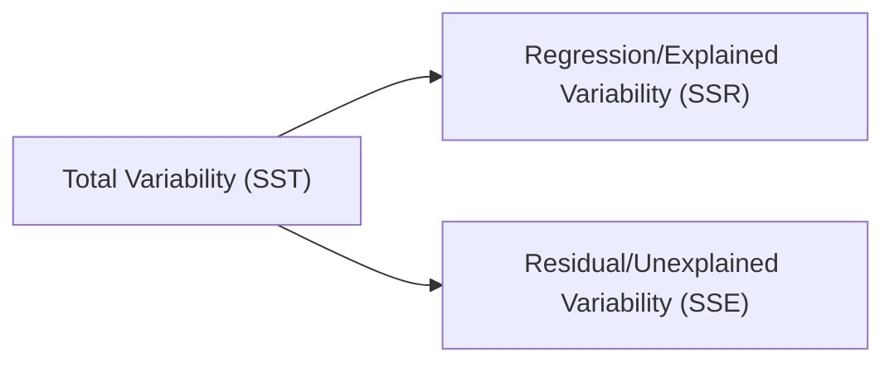

## Overview of ANOVA in Multiple Regression

Sometimes, when I first learned about multiple regression, I got a little overwhelmed by the volumes of output: we have a bunch of coefficients, t‑stats, confidence intervals, p‑values… you know, the works. Then I discovered ANOVA – Analysis of Variance – which is that lovely table that breaks down the total variance in your dependent variable into explained variance and unexplained variance. In other words, ANOVA is the scoreboard that helps you see just how effective your model is at explaining the data overall. If you’ve ever wondered, “Okay, so do these independent variables collectively matter or what?” the ANOVA framework is your friend.

From a CFA Level II perspective, ANOVA in multiple regression helps us run an overall F‑test. This test quickly checks whether at least one of our independent variables explains a significant portion of the variability in our dependent variable (e.g., asset returns, bond yields, or valuations). Trust me, in the exam vignettes, the ANOVA results can save you a bunch of time because they give you an at-a-glance sense of whether the entire model achieves significance. Below, we’ll dig into the structure of ANOVA tables, the critical F-statistics, degrees of freedom, and some best practices to ensure you don’t mix up your sums of squares or interpret significance incorrectly.

## ANOVA Table Structure

When you run a multiple regression, the software (or your calculator, if you’re old-school) typically generates an ANOVA table. This table essentially breaks down the total variability of your dependent variable, letting you see how much variation is “explained” by your regression model and how much is left unexplained (or “residual”).

Here’s the typical layout of an ANOVA table:

• Source of Variation: Divided into Regression (sometimes called Model or Explained) and Residual (sometimes called Error or Unexplained). A third line, labeled Total, combines both.  
• Degrees of Freedom (df):  
  – Regression df = k, where k is the number of independent variables in your model.  
  – Residual df = n – k – 1, where n is the total number of observations and the extra “1” accounts for the intercept.  
  – Total df = n – 1.  
• Sum of Squares (SS):  
  – SSR: Sum of Squares due to Regression (explained by the model).  
  – SSE: Sum of Squares due to Error (residual or unexplained).  
  – SST: Total Sum of Squares, so SST = SSR + SSE.  
• Mean Square (MS):  
  – MSR: Mean Square Regression = SSR / k.  
  – MSE: Mean Square Error = SSE / (n – k – 1).  
• F‑Statistic and p‑value: The ratio of MSR to MSE. The p‑value measures the probability that you would see such an F‑ratio (or more extreme) if the model had no explanatory power.

Below is a quick visual flow diagram to illustrate how ANOVA partitions total variability into its components:

## F‑Test for Overall Significance

At the heart of ANOVA is the question: Is this model statistically significant as a whole? In more technical terms, the F‑test looks at whether at least one slope coefficient in the regression is nonzero. Because we’re dealing with k independent variables, the F‑test streamline is:

• Null hypothesis H₀: All slope coefficients are zero (β₁ = β₂ = … = βₖ = 0).  
• Alternative hypothesis Hₐ: At least one slope coefficient is nonzero.

Mathematically, the F‑statistic is computed as:


F = \frac{\text{MSR}}{\text{MSE}} = \frac{\frac{\text{SSR}}{k}}{\frac{\text{SSE}}{n-k-1}}


A large F‑value (relative to a critical value from F distribution tables or relative to a threshold p‑value) indicates that we should reject H₀ and conclude that the model is, overall, statistically significant.

• If the p‑value for the F‑statistic is less than your significance level α (e.g., 0.05), you conclude that the regression model has at least some explanatory power as a whole.  
• If the p‑value is not sufficiently small, you fail to reject H₀, implying that the model might not improve predictions beyond a simple average or naive baseline.

For exam purposes, it’s super important to remember that the F‑test deals with the entire set of independent variables simultaneously. It doesn’t tell you which specific variable is significant – that’s where the individual t‑tests come in (covered in Section 3.3). Instead, the F‑test is the doorman telling you whether the party is worth attending in the first place. Then, the bouncer (each variable’s t‑test) checks individual guests for their invite.

## Practical Financial and Investment Implications

Now, how does this matter for the real world of finance and investments? Let’s say you’re modeling returns on a stock portfolio based on factors like GDP growth rate, interest rates, inflation, and maybe a corporate governance index. ANOVA helps you see if these variables collectively do a decent job in explaining the fluctuation in returns. If your overall F‑test is significant, you have some reason to believe that these factors, in combination, have real predictive power. Conversely, if the F‑test fails, maybe your choice of factors is off or your specification is incomplete. It’s kind of a big deal in finance when your model can’t even pass the “Does it do anything?” test!

Moreover, from an exam standpoint, the question might be set in a macroeconomic context: “Does a set of macro factors significantly explain bond yields?” or “Do certain style factors (value, growth) collectively predict equity returns?” The ANOVA framework and the resulting F‑test figure crucially in these scenarios.

## Exam Vignette Interpretation

Imagine you’re reading your typical CFA vignette, and you see an ANOVA table that’s partially complete. You might have to:

• Compute missing degrees of freedom (often the question might give you n and k).  
• Solve for SSE, SSR, or MST (mean squares) if something is missing.  
• Calculate the F‑statistic.  
• Interpret the result (i.e., do we reject or fail to reject H₀?).  
• Tie that interpretation to an economic or strategic conclusion.

So perhaps the vignette states that a manager is testing multiple fundamental factors to explain a stock’s price. The item set table includes SSR, SSE, k, partial degrees of freedom, and an incomplete column for MSE. They may ask you to fill in a missing entry or to interpret whether the model is significant at the 5% level. Then they might follow it up with a question about next steps if the overall regression passes or fails – maybe it’s to refine the model, gather more data, or dismiss certain factors as irrelevant.

## Common Pitfalls

This is where I admit I’ve tripped up myself a few times – it’s so easy to confuse the significance of the entire model with the significance of any one factor! Don’t do that. A brilliant F‑test result doesn’t guarantee each variable is individually significant. It just says that collectively, something in there is working.

Another pitfall is messing up your degrees of freedom. For example, you might see a problem where k is 3, n is 50, so the Residual df is 46 (which is n – k – 1 = 50 – 3 – 1 = 46). That’s correct. But mix that up, and your entire F‑value might get botched.

Last but not least, a big conceptual pitfall is ignoring the story behind the data. Even if your F‑test says, “Yes! We’re good! The model is significant,” you still need to check if the model is well-specified. Are there any lurking variables not included? Is there a time-series structure that you ignored? (Hint: see Chapter 4 on Model Misspecification and Chapter 6 on Time‑Series Analysis for more on these topics.)

## Example: Setting Up an ANOVA Table

Let’s consider a quick example. Suppose we have a regression with the following partial data:

• Number of observations (n) = 30.  
• Number of independent variables (k) = 2.  
• SSR (Sum of Squares Regression) = 150.  
• SSE (Sum of Squares Error) = 90.  

We want to fill in an ANOVA table:

1) SST = SSR + SSE = 150 + 90 = 240.  
2) df (Regression) = k = 2.  
3) df (Residual) = n – k – 1 = 30 – 2 – 1 = 27.  
4) df (Total) = n – 1 = 29.  

So we have:

• MSR = SSR / k = 150 / 2 = 75.  
• MSE = SSE / (n – k – 1) = 90 / 27 ≈ 3.3333.  

The F‑statistic then is:


F = \frac{75}{3.3333} \approx 22.50


Depending on the significance level, that’s likely a pretty big F. If the critical value for an F-test with df1=2 and df2=27 at a 5% level is around 3.35, then 22.50 definitely exceeds that. We reject the null hypothesis that all slope coefficients are zero. Yay – from a portfolio manager’s perspective, it means those two independent variables collectively explain a significant portion of variance in your dependent variable (maybe a portfolio return or other financial measure).

## Glossary of Key Terms

• Degrees of Freedom (df): The number of observations that can vary in the estimation process.  
• Sum of Squares Regression (SSR): Total explained variability by the regression model.  
• Sum of Squares Error (SSE): Remaining unexplained (residual) variability.  
• Total Sum of Squares (SST): SSR + SSE, the overall variability in the dependent variable.  
• Mean Square Regression (MSR): SSR / k.  
• Mean Square Error (MSE): SSE / (n – k – 1).  
• F‑Statistic: Ratio of MSR to MSE, used to test the null hypothesis that the model has no explanatory power.

## References and Further Reading

• CFA Institute Level II Curriculum, Quantitative Methods: Sections on ANOVA in Multiple Regression.  
• Neter, Wasserman, and Kutner, “Applied Linear Statistical Models,” advanced coverage of ANOVA in multiple regression.  
• Chapter 2.6 of this text (Practice Vignette and Detailed Walkthrough) for deeper examples on how ANOVA calculations integrate with the rest of regression analysis.  
• Chapter 3.3 (Hypothesis Testing for Individual and Joint Coefficients) to explore how the F‑test for the entire model complements t‑tests for individual variables.  

## Test Your Knowledge: Analysis of Variance in Multiple Regression



### Which component in an ANOVA table represents unexplained variation in the dependent variable?

- [ ] SSR (Sum of Squares due to Regression)
- [x] SSE (Sum of Squares Error)
- [ ] SST (Total Sum of Squares)
- [ ] MSR (Mean Square Regression)

> **Explanation:** SSE corresponds to the residual or unexplained variation left after accounting for the regression model. SSR represents explained variation, and SST is the total variation.

### When performing an F‑test for overall model significance, which is the correct null hypothesis?

- [ ] At least one slope coefficient is different from zero.
- [ ] The intercept is significantly different from zero.
- [ ] Exactly one coefficient is different from zero.
- [x] All slope coefficients are equal to zero.

> **Explanation:** The standard null hypothesis for the overall significance test in multiple regression is that all slope coefficients are zero, implying the model has no explanatory power.

### If the computed F‑statistic is larger than the critical F‑value for a given significance level, which statement best describes the conclusion?

- [x] Reject H₀ and conclude the model is significant.
- [ ] Fail to reject H₀ and conclude the model is not significant.
- [ ] Conclude the model has serial correlation issues.
- [ ] Collect more data to confirm significance.

> **Explanation:** A computed F‑statistic that exceeds the critical F‑value means we reject H₀ (that all slopes are zero). The model is considered statistically significant at the chosen level.

### What is the relationship among SST, SSR, and SSE in a regression ANOVA framework?

- [ ] SSE = SSR + SST
- [x] SST = SSR + SSE
- [ ] SSR = SSE × SST
- [ ] SST – SSR = SSE + MSR

> **Explanation:** The total sum of squares (SST) equals the sum of squares due to regression (SSR) plus the sum of squares error (SSE).

### In a multiple regression with three independent variables (k = 3) and 50 observations (n = 50), which of the following is the correct calculation for Residual df?

- [ ] 3
- [x] 46
- [ ] 50
- [ ] 47

> **Explanation:** Residual degrees of freedom = n – k – 1 = 50 – 3 – 1 = 46.

### Which term describes the ratio of SSR/k to SSE/(n–k–1)?

- [x] F‑statistic
- [ ] t‑statistic
- [ ] Adjusted R‑squared
- [ ] R‑squared

> **Explanation:** By definition, F = MSR / MSE = [SSR / k] / [SSE / (n–k–1)].

### What does a significant F‑test tell you about the model?

- [x] That at least one of the independent variables has a significant relationship with the dependent variable.
- [ ] That every independent variable is significant individually.
- [x] That the model as a whole is statistically significant.
- [ ] That the intercept is definitely nonzero.

> **Explanation:** A significant F‑test indicates the model, in aggregate, has explanatory power. It does not guarantee individual significance for each independent variable.

### If an ANOVA table shows a very large SSR but also a correspondingly large SSE, which statement is most accurate?

- [x] The model may explain some variation, but a large SSE indicates substantial unexplained variation remains.
- [ ] The model perfectly fits the data.
- [ ] The regression is guaranteed to be significant.
- [ ] The degrees of freedom must be incorrectly calculated.

> **Explanation:** A large SSR means the model explains a fair share of variation, but if SSE is also large, there is still a significant portion that the model fails to capture. The overall significance depends on the balance between SSR and SSE, as well as the degrees of freedom.

### Which of the following best describes the difference between the F‑test and t‑tests in a multiple regression scenario?

- [x] The F‑test evaluates the collective significance of all independent variables, while each t‑test evaluates the significance of an individual coefficient.
- [ ] The t‑test can only be used if the number of independent variables is one.
- [ ] The F‑test explicitly accounts for heteroskedasticity corrections.
- [ ] None of the above.

> **Explanation:** In multiple regression, the t‑tests check individual coefficients, whereas the F‑test checks if all coefficients are simultaneously zero (i.e., the model’s overall significance).

### True or false? A large F‑statistic in an ANOVA automatically implies that each independent variable’s coefficient is also individually significant.

- [ ] True
- [x] False

> **Explanation:** The F‑test is about overall model significance. You can have a large F‑statistic and still find that certain individual variables are not statistically significant upon performing separate t‑tests.


