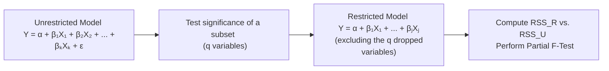

## Overview

Picture this: you’re sitting in an investment committee meeting, confidently presenting the results of your fancy multiple regression model that predicts, say, quarterly equity returns based on macroeconomic factors. Suddenly, one of your colleagues asks why you bothered including an interest rate variable because—according to them—there’s no evidence that it matters. Another colleague says, “I see your p‑values, but are you sure none of these factors are significant collectively?” And next thing you know, you’re knee‑deep in the world of individual t‑tests and partial F‑tests, trying to defend your model. If that sounds a little nerve-wracking, don’t worry: we’ve all been there. 

In this section, we’ll dive into how to use hypothesis testing to determine which coefficients in your regression are statistically significant, both individually and as a group, and how to interpret these tests in a finance context. We’ll also chat about potential pitfalls, how to keep an eye on economic significance, and how you might see all of this show up in an exam vignette. Let’s dig in.

## T‑Tests for Individual Coefficients

### Setting the Stage

When we say “t‑test for individual coefficients,” we’re typically testing whether a given slope coefficient in the regression is zero (meaning the explanatory variable has no linear effect on the dependent variable). The standard setup is:

- Null Hypothesis (H₀): βᵢ = 0  
- Alternative Hypothesis (H₁): βᵢ ≠ 0 (for a two‑sided test)

Sometimes, we might be interested in the sign of the coefficient (positive or negative), in which case you might use a one‑sided test, such as H₀: βᵢ ≤ 0 vs. H₁: βᵢ > 0. But on the CFA exam, and in many textbook treatments, two‑sided tests are the norm unless otherwise indicated.

### The T‑Statistic Formula

If β̂ᵢ is your estimated slope coefficient for variable Xᵢ, and SE(β̂ᵢ) is the standard error of that estimate, the t‑statistic is:


t = \frac{\hat{\beta}_i - 0}{\text{SE}(\hat{\beta}_i)}


(We put “0” in the numerator because that’s our hypothesized value under H₀.)

This statistic follows a t‑distribution with (n − k − 1) degrees of freedom, where n is the number of observations and k is the number of predictors. If the absolute value of t is greater than the critical t‑value (based on your chosen significance level and degrees of freedom), you reject H₀ and conclude that the coefficient is significantly different from zero.

### Interpreting Results

• If p‑value < α (common α values are 0.01, 0.05, or 0.10), you reject the null hypothesis. Congratulations—your variable is statistically significant.  
• If p‑value ≥ α, you fail to reject H₀. That doesn’t automatically mean the variable has zero effect; it just means you don’t have statistically convincing evidence that it’s nonzero.

Be careful, though. Failing to reject H₀ is not the same as “proving the coefficient is zero.” It merely suggests that, given your sample and method, you haven’t found strong enough evidence that βᵢ is different from zero.

## Partial F‑Tests for Joint Significance

### Why Partial F‑Tests Matter

Let’s say you have a bunch of macroeconomic indicators in your model: inflation rate, GDP growth, unemployment rate... the works. You might individually test each coefficient’s significance with separate t‑tests. But maybe you suspect that these three macro factors together tell a cohesive story. Is there a scenario where they’re jointly significant even if individually they seem borderline?

This is exactly where partial F‑tests come into play. A partial F‑test lets you check whether a subset of coefficients (like the three macro variables) are jointly zero or not. Put more formally:

- Null Hypothesis (H₀): βᵢ = βⱼ = βₖ = 0 (for all coefficients in the subset)  
- Alternative Hypothesis (H₁): At least one of βᵢ, βⱼ, or βₖ ≠ 0

### Restricted vs. Unrestricted Models

The partial F‑test compares two versions of your regression:

• Restricted Model (RM): The model without the subset of variables you’re testing (i.e., you restrict those coefficients to zero).  
• Unrestricted Model (UM): The full model that includes the subset of variables.

You compute the residual sum of squares (RSS, or SSE) for each model. Then the partial F statistic is:


F = \frac{(RSS_R - RSS_U)/q}{RSS_U/(n - k - 1)}


Here,  
• RSS_R = RSS of the restricted model,  
• RSS_U = RSS of the unrestricted model,  
• q = number of restrictions (i.e., the number of variables you’re jointly testing),  
• n = total sample size,  
• k = total number of predictors in the unrestricted model.

If the F value is sufficiently large, you reject H₀, suggesting the subset of variables in question is jointly significant.

### Practical Interpretation

If your partial F‑test indicates significance, it means at least one variable in the group matters—even if each individual t‑test did not clearly show significance. This often happens when variables within the subset are correlated with each other. So in practice, you might want to keep them in your model as a group instead of dropping them individually.

## Recognizing Type I and Type II Errors

• Type I Error (False Positive): Rejecting a true null hypothesis. If you’re using a 5% significance level, that’s roughly a 5% risk of concluding something is significant when it’s actually not.  
• Type II Error (False Negative): Failing to reject a false null hypothesis, missing a relationship that truly does exist.  

In finance, Type I errors might lead you to include worthless factors (“noisy variables”) in your trading or asset allocation model. Type II errors might cause you to ignore genuinely price-relevant signals.

## Economic Significance vs. Statistical Significance

Sometimes we see a p‑value so tiny we want to dance with joy—like we found the Holy Grail of return predictors. But hold on. Let’s also look at the magnitude of that coefficient. Is it big enough to really matter in practice, or is it just barely shifting your portfolio’s risk‑return profile?

• If the coefficient is significant but the effect size is tiny, it might not move the needle in real investment decisions.  
• On the other hand, some finance pros keep certain variables with borderline p‑values if domain knowledge strongly supports their inclusion.  

I remember once running a regression that showed a small but statistically significant relationship between a specialized commodity index and stock returns. The effect was so minuscule that it wouldn’t cover trading costs. So sure, it was “statistically significant.” But from an economic perspective, it was a total snooze.

## Real‑World Example: Testing an Equity Return Model

Let’s say you have the following model for monthly excess returns on a broad equity index:

Excess Return = α + β₁(Interest Rate) + β₂(Inflation) + β₃(Consumer Sentiment) + ε

• Individual T‑Tests:  
  - You find that Interest Rate and Consumer Sentiment have p‑values < 0.05, suggesting they’re individually significant.  
  - Inflation is borderline, with a p‑value of 0.07.  

• Partial F‑Test:  
  - You suspect that while Inflation alone isn’t shining, it might be meaningful when combined with Interest Rate. So you conduct a partial F‑test on the pair (Interest Rate, Inflation).  
  - The partial F‑test yields an F‑stat larger than the critical value at the 5% level, so you reject H₀ that both β₁ = β₂ = 0.  

Result? You keep both Interest Rate and Inflation in the model, given they jointly explain variation in returns, even though individually, Inflation was less impressive.

## Best Practices and Common Pitfalls

• Always articulate your hypotheses clearly. Are you doing a two‑sided or one‑sided test?  
• Beware of data mining. Including too many variables can lead to false positives (Type I error).  
• Check for multicollinearity. Highly correlated regressors may confuse your individual t‑tests while a partial F‑test might show they’re collectively important.  
• Use both significance levels and effect sizes. Don’t get hypnotized by p‑values alone.  
• In exam vignettes, watch for tables of regression output that present coefficient estimates, standard errors, or t‑statistics. They might ask you which variables are significant at a given α. Or they might show you two different versions of a model and nudge you to do the partial F‑test.

## Practical Steps in a Nutshell

1. Identify the estimated coefficients and standard errors for each predictor.  
2. For each coefficient, form the t‑statistic and compare with the critical t‑value or check the p‑value.  
3. Decide whether to reject or fail to reject H₀.  
4. For joint significance, run a partial F‑test comparing a restricted model (excludes certain variables) and an unrestricted model (includes them).  
5. If partial F is greater than the critical F or the associated p‑value is below your threshold α, conclude that the subset of variables is jointly significant.  
6. Reflect on economic significance: even if your variables are significant, do they matter in a real‑world sense?

## Using a Diagram to Illustrate Restricted vs. Unrestricted

Below is a simple Mermaid diagram showing how you move from an unrestricted model to a restricted model by “dropping” certain coefficients to zero.

## Links to Other Chapters

You might find it helpful to revisit “3.1 Analyzing Goodness of Fit: R-Squared, Adjusted R-Squared” to see how overall model fit can complement your coefficient significance tests. Also, check “2.5 Identifying Violations from Residual Plots” for diagnosing assumptions that can affect your inference and significance tests.

## References for Further Exploration

• CFA Institute Level II Curriculum – Hypothesis Testing for Regression Coefficients  
• Damodar N. Gujarati, “Basic Econometrics.” A classic guide covering advanced regression diagnostics and hypothesis testing.  
• For deeper dives, see specialized academic papers on the interplay of partial F‑tests and multicollinearity in macroeconomic models.

## Final Exam Tips

• You’re likely to see multiple independent variables with partial significance. Be prepared to explain whether you’d keep or drop a variable.  
• Know how to read a regression output table: watch the t‑stats, the standard errors, and the p‑values.  
• Remember partial F‑tests for checking joint significance. This skill is especially important if you see “versions” of a regression in the item set.  
• Manage your time: scanning the regression output for the relevant stats early in the vignette can save you from flipping pages back and forth.

## Test Your Knowledge: Hypothesis Testing for Regression Coefficients



### When is a variable typically considered statistically significant in a t‑test?

- [ ] When t = 0
- [x] When its p‑value < α
- [ ] When Another variable is also significant
- [ ] Only at α = 10%

> **Explanation:** A variable is considered significant if the probability of observing its coefficient under the null hypothesis (p‑value) is less than the chosen significance level α.

### In a two‑sided test, if you reject H₀: βᵢ = 0, you are concluding:

- [ ] βᵢ must be negative
- [ ] βᵢ must be positive
- [x] βᵢ is likely different from zero
- [ ] βᵢ must be exactly zero

> **Explanation:** Rejecting the null in a two‑sided test only tells you that the coefficient is different from zero. You need further analysis to determine the sign.

### A partial F‑test is used to:

- [ ] Test one individual coefficient
- [x] Test a set of coefficients simultaneously
- [ ] Test stationarity of a time series
- [ ] Test the normality of error terms

> **Explanation:** Partial F‑tests evaluate the joint significance of multiple coefficients. Individual t‑tests evaluate coefficients one at a time.

### Suppose you fail to reject H₀ for a coefficient. This means:

- [ ] The coefficient is proven to be zero
- [ ] You should remove it immediately
- [x] There is insufficient evidence to conclude the coefficient is different from zero
- [ ] The coefficient is always positive

> **Explanation:** Failing to reject H₀ doesn’t prove that the coefficient is zero, only that you lack evidence to say otherwise with the given data.

### Which statement describes economic significance?

- [x] The practical impact an estimated coefficient has on financial decisions
- [ ] The probability a sample statistic lies outside a confidence interval
- [ ] The difference between a restricted and unrestricted model’s RSS
- [ ] The size of a test statistic relative to its critical value

> **Explanation:** Economic significance focuses on the real-world impact of the coefficient, not just its statistical significance.

### A Type I error occurs when:

- [ ] You correctly fail to reject H₀
- [ ] You include all variables in your model
- [x] You reject a null hypothesis that is actually true
- [ ] You fail to reject a null hypothesis that is false

> **Explanation:** Type I error is a “false positive,” meaning you concluded significance when none exists.

### If three variables jointly have a p‑value = 0.04 in a partial F‑test at the 5% level:

- [x] You would reject the null that these three have no collective effect
- [ ] You must do a t‑test on each variable to confirm
- [ ] You fail to reject the null
- [ ] You cannot determine the significance

> **Explanation:** A p‑value under 0.05 leads to a rejection of H₀ at the 5% significance level for that joint test.

### Which of these best describes a restricted model?

- [x] It excludes certain variables, setting their coefficients to zero
- [ ] It allows all possible variables
- [ ] It has more regressors than the unrestricted model
- [ ] It uses unusual significance levels

> **Explanation:** A restricted model omits specific variables (or sets them equal to zero) to compare against the full model in a partial F‑test.

### One reason inflation might not appear statistically significant alone, but be jointly significant with interest rates is:

- [x] Multicollinearity reduces individual t‑test power but the partial F‑test can show joint significance
- [ ] p‑values are meaningless in regression analysis
- [ ] The two variables must have negative t‑statistics
- [ ] The partial F‑test uses stricter significance levels

> **Explanation:** If variables are correlated, it can reduce each variable’s individual significance but collectively they can still explain variance.

### True or False: Economic significance always implies statistical significance.

- [ ] True
- [x] False

> **Explanation:** A variable may have a large or meaningful coefficient in practice (economic significance) but might not be statistically significant—especially in small samples or noisy data.


