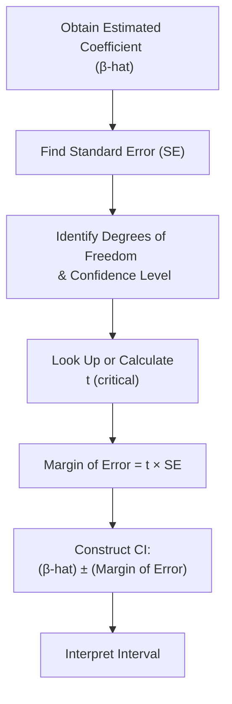
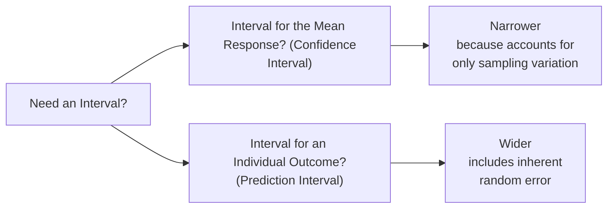

## Introduction
Sometimes, when I first learned about confidence intervals in my early finance days, I remember thinking, “Wait, so you’re telling me that a number plus or minus a margin of error gives me a range—and somehow that range, not just the single number, is the best tool for decision-making?” Well, if you’ve ever had that moment of mild confusion, you’re not alone. Confidence intervals (CIs) can initially feel a bit abstract. But trust me, they are one of the most practical and reassuring tools when dealing with uncertainty in regression analysis.

In a nutshell, constructing and interpreting confidence intervals for regression coefficients helps us figure out how precise our estimated parameters actually are. In the context of a multiple regression, these intervals can indicate whether a variable’s coefficient is reliably different from zero and thus whether it truly influences whatever we’re trying to model, such as stock returns, bond yields, or corporate earnings growth.  

Below, we’ll break down the nuts and bolts of a confidence interval: how to construct it, what it means (and doesn’t mean), how it fits into your exam preparation for the CFA Level II vignette-style item sets, and how to avoid the most common pitfalls.

## Core Concepts of Confidence Intervals

### Basic Formula for Confidence Intervals
One of the first things to understand is the formula. Confidence intervals for a regression slope coefficient (βᵢ in many textbooks) often look like this:


\hat{\beta}_i \pm t_{\alpha/2,\,df} \times \mathrm{SE}(\hat{\beta}_i)


• \\(\hat{\beta}_i\\) is the estimated coefficient from your sample.  
• \\(t_{\alpha/2,\,df}\\) is the critical t-value from the t-distribution for the desired confidence level (e.g., 95%) and for the degrees of freedom (df). Typically, df is \\(n - k - 1\\) in a multiple regression, where \\(n\\) is the sample size and \\(k\\) is the number of predictors.  
• \\(\mathrm{SE}(\hat{\beta}_i)\\) is the standard error of the estimated coefficient.  

Sometimes, folks confuse a 95% confidence interval with saying “we’re 95% confident that the true coefficient is in here.” It’s more subtle (and correct) to say: if we repeated the same sampling process indefinitely, around 95% of those confidence intervals would capture the true underlying coefficient.  

### Interpretation in Plain Language
So, if you compute a 95% CI for βᵢ, and that CI is (1.2, 2.7), it literally suggests that if you were to repeat your data collection and regression process many times, in about 95% of those samples you’d find that βᵢ’s true value lies within that range of 1.2 to 2.7.  

Quantity aside, the direction of this interval is also crucial. If the entire CI is positive, that means zero is not in that confidence interval. Hence, you reject the hypothesis that the true βᵢ is zero at the 5% significance level and conclude that your independent variable has a statistically significant positive effect (with some margin of error, of course).

## Role in Regression Analysis
In Chapter 2, you might have encountered the concept of formulating a multiple regression model, and in Chapter 3.1 or 3.2, you probably got a sense of the goodness of fit via R-squared or tested individual coefficients using t-statistics. Confidence intervals complement these approaches beautifully.  

• Hypothesis Testing Link: If zero is not in your CI, that aligns with rejecting \\(H_0 : \beta_i = 0\\).  
• Practical Significance vs. Statistical Significance: CIs help highlight not just whether the effect is nonzero but also quantify how big or small it might be in plausible real-world scenarios.  

## Constructing Confidence Intervals Step by Step

### 1. Estimate the Parameter
You start with your regression output. Let’s say you have run a multiple regression with a sample of \\(n\\) observations and \\(k\\) independent variables. Your software (or your manual calculations) yields an estimated coefficient \\(\hat{\beta}_i\\), typically the slope on the ith regressor.

### 2. Identify the Standard Error
Next, check the standard error (SE) for that estimated coefficient. The standard error reflects how spread out your coefficient estimates would be if you repeated your sampling process. You might see something like “Std. Error = 0.45” for \\(\hat{\beta}_i\\).

### 3. Determine the Critical t-value
At a 95% confidence level and with df = \\(n - k - 1\\), you determine the relevant t-value. For instance, if df is large (like over 120), the critical t-value might be approximately 1.98 for a 95% CI. For smaller samples, t-values get larger.

### 4. Multiply and Construct
Multiply the t-value by the standard error:  

t_{\alpha/2,\,df} \times \mathrm{SE}(\hat{\beta}_i)
  
This product becomes your margin of error. Then add and subtract that margin of error to/from \\(\hat{\beta}_i\\). Boom! You have your confidence interval.

### 5. Interpret
Interpret how wide or narrow that range is. Also note whether it includes zero or any other hypothesized value you’re testing.

## Practical Example
Let’s try a short numeric example that we might see in an exam vignette, but keep it simple enough to process without a calculator meltdown.

Suppose you have:  
• \\(\hat{\beta}_i = 2.5\\)  
• \\(\mathrm{SE}(\hat{\beta}_i) = 0.60\\)  
• \\(df = 45\\) (which might result from a sample size \\(n=50\\) and \\(k=4\\) total regressors, including the intercept)  
• For a two-tailed 95% CI, the critical t-value is approximately 2.014 (you’d typically look this up in a t-table or rely on software).  

Therefore, the margin of error is \\(2.014 \times 0.60 = 1.2084\\). The 95% confidence interval would be:  

2.5 \pm 1.2084 \quad\Rightarrow\quad (1.2916,\ 3.7084).
  

Interpretation: We’re 95% confident that the true slope βᵢ lies between 1.2916 and 3.7084. Since this interval does not cross zero, we can say the variable in question has a statistically significant positive relationship with the dependent variable, at least at the 5% level.

## Mermaid Diagram: Confidence Interval Construction
Below is a simple flowchart showing the steps in constructing a confidence interval for a regression coefficient. This diagram helps you visualize the process from your raw coefficient estimate to the final, interpretative interval.



## Factors Affecting CI Width
Multiple influences determine how wide or narrow your interval is:

• Sample Size (n): The bigger your sample, the smaller your standard error—usually. That shrinks your margin of error, making your confidence interval narrower.  

• Data Variability (\\(\sigma^2\\)): If your data points are scattered far apart or your residual variance is large, your standard errors creep up. That means your intervals widen.  

• Significance Level: A 99% confidence interval is obviously going to be wider than a 95% interval (all else equal) because you’re demanding more certainty, so the margin of error increases.  

• Model Mis-Specification or Multicollinearity: In Chapter 4, we’ll discuss how ignoring relevant variables or including highly correlated variables can inflate standard errors of individual coefficients, broadening your intervals.  

## Common Pitfalls
A few things can derail even the most careful candidate:

• Mixing up a Confidence Interval with a Prediction Interval: Remember that a prediction interval is for an individual forecasted value (much wider) whereas the CI for a mean response is narrower. Don’t confuse them!  

• Overlooking Non-Normal Residuals: The classic formula for confidence intervals assumes that the residuals (and hence the coefficients) are approximately normally distributed, especially for smaller samples. If the normality assumption is severely violated, or n is tiny, your intervals might be inaccurate.  

• Neglecting Degrees of Freedom: People often incorrectly look up the critical value for an infinite df. If your sample is relatively small (especially under 30), the difference can be large.  

• Not Re-checking Hypothesis Tests: If 0 is in your CI, it typically means you fail to reject H₀: βᵢ = 0 at that significance level. This is a fundamental test to ensure your inferences about significance line up with the intervals.  

## Personal Anecdote on Overconfidence
I once saw a junior analyst get way too excited about obtaining a slope estimate of 5.3. He was absolutely thrilled and started making bold statements like “Yes, that means a 1 percentage-point change in X increases Y by 5.3 points for sure!” We had to step back and note that the standard error was pretty large, and we’d only tested at a 90% confidence level. When you ran the numbers carefully, the 90% CI was about (–0.2, 10.8). Not exactly a guaranteed strong positive effect, is it? That’s a prime example of why confidence intervals matter.

## Python Snippet for Constructing a Basic CI
If you’re a tech-savvy candidate who likes to confirm your hand calculations, you can quickly compute confidence intervals in Python. Here’s a short snippet:

```python
import numpy as np
import scipy.stats as st

beta_hat = 2.5
se_beta = 0.60
df = 45
confidence_level = 0.95

alpha = 1 - confidence_level
t_critical = st.t.ppf(1 - alpha/2, df)

margin_of_error = t_critical * se_beta
lower_bound = beta_hat - margin_of_error
upper_bound = beta_hat + margin_of_error

print(f"Confidence Interval: ({lower_bound:.4f}, {upper_bound:.4f})")
```

This quick code block will yield the same ~ (1.2916, 3.7084) range we computed by hand. A very straightforward way to confirm your computations.

## Best Practices for Using Confidence Intervals
• Always Check Assumptions: Ensure your residuals are reasonably normal and that you have no crazy outliers.  
• Keep an Eye on n: A large sample usually yields more precise (narrow) intervals.  
• Look for Zero or Other Hypothesized Values: This is crucial in hypothesis testing. If your entire interval is above or below zero, that suggests significance. If it straddles zero, the variable may not be significant at that confidence level.  
• Use CIs to Communicate Uncertainty: Rather than quoting “the slope is 3.0,” it’s often better to say, “the slope is between roughly 2.0 and 4.0 at the 95% level,” showing that you respect the uncertainty inherent in statistics.

## Exam-Focused Applications
On the CFA Level II exam, you may be asked to compute a CI for:  
1. A slope or intercept coefficient in a multiple regression.  
2. A forecasted mean value of the dependent variable.  
You’ll likely see a short vignette describing a scenario—maybe analyzing the relationship between corporate leverage and interest rates, or identifying a link between GDP growth and stock returns—and you must interpret or calculate intervals on the coefficient.  

Watch for:  
• Whether the question provides a t-statistic or the standard error.  
• The degrees of freedom or the total sample size.  
• The confidence level they specifically request (95% vs. 99%).  

## Brief Comparison: Confidence Interval vs. Prediction Interval
It’s worth repeating that a confidence interval for the fitted mean response at a particular value of X is different from a prediction interval for an individual new observation of Y. The latter is always wider because it accounts not just for the variation in β-hat but also the idiosyncratic variation in individual outcomes.

## Additional Mermaid Diagram: CI vs. Prediction Interval
Here’s another quick diagram showing the branching paths in deciding which interval you might need:



## Connecting to Other Topics
• **Hypothesis Testing**: Confidence intervals are intimately linked. If zero lies outside the interval, we reject \\(H_0: \beta_i=0\\).  
• **Model Fit**: In earlier subsections, you learned about R-squared. R-squared alone doesn’t tell you if each coefficient is stable or precise—CIs show you that nuance.  
• **Misspecification**: In Chapter 4, we’ll see how issues like heteroskedasticity and autocorrelation can damage the reliability of standard errors, which directly affects your confidence intervals.  

## Conclusion
Confidence intervals are one of the key insights you’ll use both for exam success and for day-to-day discussions with clients or colleagues. Rather than making definitive claims like “this coefficient is definitely 3.2,” you can say, “we’re pretty confident the effect is between about 2.3 and 4.1,” which is often the more prudent reality in financial analytics.  

Stay mindful of sample size, data variability, your chosen significance level, and potential model issues. That combination of vigilance and nuance will serve you well on exam day—and in the real world, where acknowledging uncertainty is often more credible than feigning absolute precision.

## References and Further Reading
• CFA Institute Level II Curriculum (sections on Regression Output Interpretation and Hypothesis Testing).  
• “Quantitative Investment Analysis,” CFA® Program Curriculum, especially chapters that delve into interval estimates and linear regression.  
• Various academic articles on regression assumptions and confidence intervals, such as those in the Journal of Finance or the Financial Analysts Journal.

## Test Your Knowledge: Constructing and Interpreting Confidence Intervals Quiz



### A portfolio strategist wants to construct a 95% confidence interval for a regression coefficient. Which of the following is necessary?  
- [ ] The F-statistic from the ANOVA table.  
- [x] The standard error of the regression coefficient.  
- [ ] The slope of the other independent variables.  
- [ ] The correlation coefficient among the independent variables.  

> **Explanation:** To construct a 95% CI for a given coefficient, you need its estimated slope and the standard error, plus the critical t-value.  

### A 99% confidence interval for a slope coefficient in a multiple regression is (−0.5, 2.5). Which is the most accurate conclusion?  
- [ ] The slope of this variable is definitely zero.  
- [x] The slope might be negative, zero, or positive, given this range.  
- [ ] The slope’s true value is guaranteed to lie between −0.5 and 2.5.  
- [ ] You should reject the null hypothesis at the 1% level.  

> **Explanation:** Because zero is within the interval, it’s possible that the true slope is zero or negative or positive. We cannot reject the null that it’s zero at the 1% level if the interval crosses zero.

### Which of the following best describes a 95% confidence interval for a coefficient in a regression context?  
- [ ] It implies the coefficient must be significant if the upper bound is above zero.  
- [x] If the sampling process is repeated many times, about 95% of those intervals will contain the true coefficient.  
- [ ] The coefficient has a 95% chance of being in that interval in a single sample.  
- [ ] It is the same as a 95% prediction interval.  

> **Explanation:** The frequentist interpretation of the CI is that 95% of intervals from many repeated samples should capture the true parameter.  

### Suppose an analyst’s 95% confidence interval for β₁ is (1.20, 3.40). If the null hypothesis is H₀: β₁ = 0, which statement is correct?  
- [x] The null hypothesis can be rejected at the 5% significance level.  
- [ ] The null hypothesis cannot be rejected at the 5% significance level.  
- [ ] The model is definitely free of specification errors.  
- [ ] The standard error of β₁ is zero.  

> **Explanation:** Since the entire confidence interval is above zero, we reject the null at the 5% level.

### A smaller sample size will lead to what effect on the confidence interval for the slope parameter, all else equal?  
- [x] A wider interval due to a higher critical t-value.  
- [ ] A narrower interval because there are fewer data points to vary.  
- [ ] A narrower interval because standard errors go down with fewer observations.  
- [ ] No effect on the interval's width.  

> **Explanation:** Smaller n typically increases the margin of error because the t-distribution’s critical values are larger for lower degrees of freedom.

### An analyst calculates a 95% CI for an estimated slope and finds it is narrower than anticipated. Which factor could have produced this narrower interval?  
- [x] A decreased variance in the data.  
- [ ] A very high level of multicollinearity.  
- [ ] Using a higher confidence level (e.g., 99% vs 95%).  
- [ ] A smaller sample size.  

> **Explanation:** Decreased variance (lower residual variance or more consistent X-values) reduces standard errors, thus narrowing the interval.

### In a multiple regression with five independent variables and 35 observations, what is the degrees of freedom used for constructing the CI for any single slope coefficient (excluding the intercept)?  
- [ ] 35  
- [x] 29  
- [ ] 34  
- [ ] 30  

> **Explanation:** Degrees of freedom is n − k − 1 = 35 − 5 − 1 = 29.

### Why is a 90% confidence interval narrower than a 95% confidence interval, assuming all else equal?  
- [ ] Because the degrees of freedom are larger at 90%.  
- [x] Because the t-critical value is smaller at 90%.  
- [ ] Because the standard error changes with confidence level.  
- [ ] Because sample size is larger at 90%.  

> **Explanation:** A lower confidence level means a smaller t-critical value, thus yielding a narrower interval.

### An equity researcher finds that the 95% CI for a slope estimate is (1.0, 1.5). If the researcher changes the confidence level to 99% (assuming the same data), how does the interval change?  
- [ ] It remains exactly the same.  
- [x] It becomes wider, e.g., (0.8, 1.7).  
- [ ] It becomes narrower, e.g., (1.1, 1.4).  
- [ ] It cannot be determined from the information given.  

> **Explanation:** A higher confidence level requires a bigger t-critical value, which widens the interval.

### Confidence intervals are directly linked to hypothesis testing in regression. Specifically, if zero is not within your 95% CI for βᵢ, which of the following is correct?  
- [x] You reject H₀: βᵢ = 0 at the 5% level.  
- [ ] You fail to reject H₀: βᵢ = 0 at the 5% level.  
- [ ] You also reject H₀: βᵢ = 0 at the 1% level automatically.  
- [ ] The standard error must be equal to zero.  

> **Explanation:** Excluding zero in the 95% CI equates to rejecting the null hypothesis that βᵢ = 0 at the 5% significance level.


