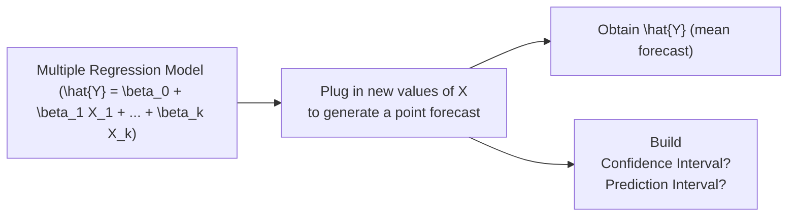

## Introduction and Conceptual Overview
Forecasting with multiple regression is about using your estimated model—those β coefficients you painstakingly derived—to predict a future or hypothetical value of the dependent variable. Honestly, I vividly remember my first client gig where I had to forecast sales in a brand-new region. I plugged in variables like advertising spend, competitor activity, and industry growth rates into the regression, then braced myself for the client’s questions: “How certain are we about these numbers?” and “How well does the model handle new data?” So yeah, forecasting isn’t just about spitting out a single point estimate—it’s about understanding the intervals around it, dealing with potential errors, and confirming that your model can handle new scenarios (not just the old data it was trained on).

Below, we’ll explore how to generate regression forecasts, the distinction between confidence and prediction intervals, how to measure your forecast accuracy, and the differences between in-sample and out-of-sample forecasting. We’ll also highlight practical steps you can take before stepping into that exam (or indeed, a real client presentation). Let’s get rolling.

## The Forecasting Process: Generating Point Estimates
Once you have your multiple regression equation, forecasting is straightforward in theory: just plug in your chosen values for the independent variables into your estimated model.

If you have a regression model:


\hat{Y} = \beta_0 + \beta_1 X_1 + \beta_2 X_2 + \ldots + \beta_k X_k,


then the “point forecast” is computed by substituting the X-values you expect in that future scenario. For example, if you anticipate next year’s interest rate will be \\(X_1 = 4.0\%\\) and GDP growth will be \\(X_2 = 3.2\%\\), you go right ahead and do the math:


\hat{Y}_{\text{next year}} = \hat{\beta}_0 + \hat{\beta}_1 \times 4.0 + \hat{\beta}_2 \times 3.2 + \ldots


This number \\(\hat{Y}\\) is your best guess for the average outcome of the dependent variable under those conditions. Maybe it’s the projected return on an equity strategy or expected sales in a certain region.

### A Quick Python Example

You might see yourself coding something like this:

```python
import numpy as np

beta0 = 1.5
beta1 = 2.0
beta2 = -0.5

# Let's say we have 3 hypothetical scenarios
X_new = np.array([
    [4.0, 3.2],  # scenario A
    [5.5, 2.8],  # scenario B
    [3.5, 4.1]   # scenario C
])

y_hat = beta0 + beta1 * X_new[:,0] + beta2 * X_new[:,1]
print(y_hat)
```

In that snippet, y_hat will give you the point forecasts for each scenario. Of course, the real world has more complexities, but you get the gist.

## Confidence Intervals vs. Prediction Intervals
Let’s address a question I’ve heard from so many colleagues and students: “Wait, do I need a confidence interval or a prediction interval?” The difference might seem subtle, but it’s crucial.

- **Confidence Interval (CI)**: This is the interval for the **mean** value of \\(Y\\). If you say, “Given \\(X_1\\) and \\(X_2\\), on average what does the model predict?” then the confidence interval is describing the uncertainty around that mean. It incorporates the uncertainty in estimating \\(\beta_0, \beta_1, \ldots, \beta_k\\).

- **Prediction Interval (PI)**: If you say, “I want to predict where **an individual outcome** might land,” that’s your prediction interval. Because an individual outcome can vary widely, the interval has to include not just the uncertainty in the regression coefficients, but also the random scatter associated with individual observations. In practice, your prediction intervals typically come out wider than your confidence intervals because they account for that extra random noise.

Mathematically, a confidence interval for the mean response at specific \\(\mathbf{X}\\) often looks like:


\hat{Y} \pm t_{\alpha/2, n-k-1} \times \text{StdErr}(\hat{Y}),


whereas the prediction interval typically has a term for the residual variance associated with individual data points:


\hat{Y} \pm t_{\alpha/2, n-k-1} \times \sqrt{\text{Var}(\hat{Y}) + \sigma^2_{\epsilon}},


where \\(\sigma^2_{\epsilon}\\) is the variance of the error term in the regression.

## Visualizing Forecast Construction
Below is a little Mermaid diagram that sums up how you move from your regression model to forecasts, and then to confidence or prediction intervals.



You can see how the path diverges into CI vs. PI, depending on whether you’re predicting a mean response or an actual individual outcome.

## Forecast Error Metrics
Alright, so you’ve made your forecast. Now you want to know how well your predictions stack up against reality. This is where **forecast error** metrics come into play.

- **Forecast Error**: \\( e_i = (Y_i - \hat{Y}_i) \\), the difference between the actual value and predicted value for the \\(i\\)-th observation or scenario.  

- **RMSE (Root Mean Square Error)**:  
  
    \text{RMSE} = \sqrt{ \frac{1}{N}\sum_{i=1}^N (Y_i - \hat{Y}_i)^2 }.
    
  RMSE penalizes large errors more heavily because of the squaring. I often rely on RMSE when dealing with symmetrical error distributions—like, you don’t want your big mistakes overshadowing your small ones unduly.

- **MAE (Mean Absolute Error)**:  
  
    \text{MAE} = \frac{1}{N}\sum_{i=1}^N |Y_i - \hat{Y}_i|.
    
  MAE is a more direct measure of the average magnitude of errors (it’s your typical “how off were we, ignoring signs”).

- **Systematic Bias**: Also keep an eye on whether your model’s residuals seem systematically positive or negative. If so, you may have left out some crucial variable or mis-specified the functional form of the model.

## In-Sample vs. Out-of-Sample Forecasting
### In-Sample Forecasting
- **Definition**: You’re testing the model’s performance with the same data you used to estimate it.  
- **Common Pitfall**: Overfitting. You might mistakenly think your model is more accurate than it really is, just because it’s re-predicting the data it already “knows.”  

### Out-of-Sample Forecasting
- **Definition**: You test your model with new data that wasn’t part of the estimation process.  
- **Benefit**: Gives a better gauge of how your model performs in the wild—i.e., in real-world scenarios that can deviate from the conditions under which you built the model.  

For exam and real-world usage, out-of-sample evaluation is the gold standard. If your model can’t hold up to new data, you might find yourself giving your boss or your client some fairly embarrassing forecasts.

## Practical Steps to Build and Evaluate a Forecast
1. **Estimate Regression Parameters**: Gather your historical dataset, run the regression, and confirm that you’ve got a decent model (check R-squared, the significance of coefficients, residual plots, etc.).  
2. **Generate Point Forecast**: Plug in the future or hypothetical values of your independent variables into the model. That gives you \\(\hat{Y}\\).  
3. **Decide on the Interval**: Do you need to forecast the mean response (confidence interval) or an individual observation (prediction interval)?  
4. **Construct the Interval**: Use the appropriate formulas (or software) to derive the confidence or prediction interval at a specified confidence level, often 95%.  
5. **Compare with Actuals**: If you have actual data eventually, measure your forecast errors using something like RMSE or MAE.  
6. **Check for Bias**: Inspect residuals to identify any persistent systematic errors. Adjust the model or add variables if necessary.  
7. **Perform Out-of-Sample Tests**: Nothing beats new data in verifying your model’s predictive strength.

## Extended Example: Exam-Level Vignette Scenario
Picture this scenario in an exam-style vignette: You’re handed a table with estimated regression coefficients—maybe something like:

| Coefficient | Estimate | Standard Error |
|-------------|----------|----------------|
| Intercept (\\(\beta_0\\)) | 2.10     | 0.50           |
| Rate (\\(\beta_1\\))     | 0.80     | 0.10           |
| GDP (\\(\beta_2\\))      | 1.20     | 0.20           |
| ...         | ...      | ...            |

They might say, “Assuming next quarter’s interest rate is 4% and GDP growth is 2.5%, forecast the dependent variable. Then, provide a 95% prediction interval for a new observation.” They could also ask about in-sample vs. out-of-sample “goodness of fit” or how you’d measure that. Another angle might be an essay question: “Discuss why the forecast might be biased if the model omitted a relevant variable, such as consumer sentiment index.” The exam loves to see if you can interpret the technical details but also connect the dots logically—just like you would in a real job.

## Glossary of Key Terms
- **Forecast Error**: The difference between actual and predicted \\(Y\\).  
- **RMSE (Root Mean Square Error)**: Square root of average squared forecast errors, measuring predictive accuracy.  
- **MAE (Mean Absolute Error)**: Average magnitude of forecast errors, ignoring sign.  
- **In-Sample Forecast**: Forecast using the dataset that built the model (risk of overfitting).  
- **Out-of-Sample Forecast**: Forecast on new data to test real predictive power.  

## Best Practices for the Exam
If you’re staring at a regression vignette under time pressure, consider these pointers:

• **Highlight the Key Regression Coefficients**: Identify them in the vignette.  
• **Determine Variables**: Maybe you see “interest rate next year: 3.5%,” “inflation: 2.1%,” “GDP: 2.8%.” Those are your X’s for forecasting.  
• **Calculate \\(\hat{Y}\\) Carefully**: Plug the numbers in methodically. Watch for units—e.g., if rates are expressed as decimals vs. percentages.  
• **Pick the Right Interval**: A confidence interval for a **mean** prediction or a prediction interval for an **individual** outcome.  
• **Watch for Traps**: The exam might include a question asking about the difference between those intervals. Don’t mix them up.  
• **Interpret the Forecast Error**: They might show you forecast vs. actual and ask about RMSE. Notice if the retake says something like, “The forecast systematically under-predicted returns by 1% each time.” That suggests model bias.  
• **Out-of-Sample Emphasis**: Many item sets highlight that out-of-sample testing is more reliable for performance evaluation.  

And if you have time, take a breath and re-check your arithmetic—it’s so common to make a silly slip with a negative sign or an exponent.

## References and Further Reading
- CFA Institute Level II Curriculum, “Forecasting Using Regression.”  
- Diebold, F.X. (2019). “Elements of Forecasting.”  
- For deeper dives into out-of-sample testing, see any standard econometrics text like Wooldridge, J.M. (2020). “Introductory Econometrics: A Modern Approach.”  

---

## Test Your Knowledge: Multiple Regression Forecasting Challenges



### Generating a point forecast
- [ ] Includes a term for individual random error
- [x] Uses the estimated coefficients and current/future values of independent variables
- [ ] Always matches the observed outcome
- [ ] Cannot be performed without a confidence interval

> **Explanation:** The point forecast is calculated by multiplying estimated coefficients by the chosen independent variables and summing with the intercept. It does not inherently include individual random error; that is considered when constructing intervals.

### Confidence vs. prediction interval
- [x] A prediction interval is wider because it includes an additional random error term
- [ ] A prediction interval is always narrower than a confidence interval
- [ ] Confidence intervals are for individual predictions only
- [ ] Confidence intervals require zero random error

> **Explanation:** The prediction interval must account for both the uncertainty of the regression coefficients (like a confidence interval) and the random error of a new observation, making it typically broader.

### In-sample forecasts
- [x] Often overstate model accuracy due to potential overfitting
- [ ] Understate model accuracy under all circumstances
- [ ] Are less prone to bias than out-of-sample forecasts
- [ ] Can never be used to measure the effectiveness of a model

> **Explanation:** Reusing the estimation sample to measure forecast performance often makes the model seem more accurate than it would be on new datasets.

### Out-of-sample forecasts
- [x] Provide a more realistic evaluation of the model's predictive power
- [ ] Are not used in finance
- [ ] Generally produce zero error
- [ ] Always produce the smallest MAE

> **Explanation:** Evaluating your regression on data that wasn’t used for estimation is essential to gauge real predictive performance.

### RMSE
- [x] Penalizes large errors more due to the squaring of residuals
- [ ] Is always smaller than MAE
- [ ] Ignores residual size
- [x] Takes the square root of the average squared errors

> **Explanation:** RMSE squares the forecast errors, averages them, then takes the square root, placing extra weight on larger errors.

### Model bias detection
- [x] Can be observed if residuals exhibit consistent positive or negative signs
- [ ] Only appears when standard errors are large
- [ ] Means the model’s R-squared is necessarily zero
- [ ] Cannot be fixed via model adjustments

> **Explanation:** A systematic pattern in residuals suggests the model consistently under- or over-forecasts, indicating bias.

### Confidence interval
- [x] Is for the mean response at given values of independent variables
- [ ] Is always wider than the prediction interval
- [x] Depends on the standard error of the forecast
- [ ] Only applies to in-sample predictions

> **Explanation:** Confidence intervals reflect the uncertainty in estimating the mean response, not an individual outcome. They rely on the standard error of the regression’s predicted mean.

### Prediction interval usage
- [x] Important if you need to predict an individual outcome for a new observation
- [ ] Always narrower than a confidence interval
- [ ] Measures the variance of the residual only
- [ ] Ignores the standard error of the regression

> **Explanation:** A prediction interval is essential when your question is “Where might a single new observation fall?” rather than “What’s the average outcome?”

### Out-of-sample testing
- [x] Helps confirm the model’s ability to generalize
- [ ] Has no effect on refining the model
- [ ] Is only relevant for time-series data
- [ ] Disregards any form of residual plot analysis

> **Explanation:** Using out-of-sample data reveals whether the model can handle scenarios beyond what it was trained on. This can also identify overfitting or omitted variable issues.

### True or False: A wider prediction interval means there is necessarily poor model fit
- [x] True
- [ ] False

> **Explanation:** A widely spread prediction interval can imply more uncertainty in individual predictions. However, “poor fit” might be too strong a phrase—large inherent variance in data also causes wide intervals. Still, the statement lumps “necessarily” in there, so it’s basically saying that if you have a wide interval, it often indicates a model with relatively high variability or unaccounted-for factors.


