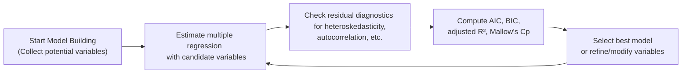

Sometimes, when we’re knee‑deep in regression outputs and a million lines of statistics, it’s easy to think, “Hey, bigger is always better—just pile on more explanatory variables and watch that R² climb!” But, well, that approach can backfire spectacularly. Especially when you’re preparing for the CFA Level II exam, you need a more nuanced strategy to choose the right model. So let’s walk through a set of tried‑and‑true criteria—beyond the usual R² and adjusted R²—and then see how residual diagnostics help confirm whether our chosen model is actually any good.

## Why R² and Adjusted R² Aren’t the Whole Story

You’ve likely relied on R² a ton in earlier finance and statistics coursework. It measures how much variation in the dependent variable (like a stock’s return) is “explained” by your independent variables (like market returns, sector indicators, or interest rates). That’s neat, but:

• R² can overstate how good a model is because it keeps creeping higher as you add more variables, even if those variables are basically random noise.  
• Adjusted R² helps mitigate that by incorporating a penalty: it only goes up if a newly added regressor provides enough incremental explanatory power. However, it still doesn’t fully solve potential overfitting—especially with many regressors.  

I remember the first time I naively added half a dozen “fun” variables (like daily average temperature) to my stock return regression, only to notice that although my R² jumped, my out‑of‑sample predictions were, well, embarrassing. The model looked great on paper—in sample—but it crumbled the moment I tried to forecast next week’s returns. Lesson learned.  

In the CFA exam context, they may ask you to compare two models—one with a higher R² but a suspicious number of variables, and another with a slightly lower R² but fewer, more relevant regressors. Knowing why R² alone isn’t a definitive yardstick is key to picking the best model.

## Revisiting the Goals of a Good Model

A good regression model is not just about high R². It’s about the balance between explanatory power and complexity. In real investing scenarios, simpler models with fewer, more intuitive variables often perform better in the long run. They’re also less prone to picking up spurious relationships.

So we ask ourselves: Does the model make intuitive financial sense? Can it forecast? Or is it so specifically fitted to historical quirks that it fails the moment the market does something unexpected?  

To address these challenges, we turn to additional metrics like the Akaike Information Criterion (AIC) and the Bayesian Information Criterion (BIC), plus an older but still useful approach: Mallow’s Cp. Let’s dissect these one by one.

## Information Criteria: AIC and BIC

### AIC (Akaike Information Criterion)
The Akaike Information Criterion helps us compare multiple, potentially non‑nested models. If your boss or your exam question plops down four different regression models, all fitted on the same data but with varying sets of variables, you could compute the AIC for each and pick the one with the smallest AIC.  

In words, it’s basically:


\text{AIC} = -2 \ln(\mathcal{L}) + 2k


• \\( \mathcal{L} \\) is the likelihood of the model (higher is better).  
• \\( k \\) is the number of parameters in the model (including the intercept).  
• The term \\(-2 \ln(\mathcal{L})\\) gauges the model’s goodness of fit (smaller is better).  
• The \\(2k\\) part is a penalty for complexity.  

The aim? Minimize AIC. The question arises, “Wait, how do we interpret \\(\ln(\mathcal{L})\\)?” You can think of it as a measure of how well your model’s predicted values match the observed data—similar to the concept of errors in linear regression, but from the vantage point of maximum likelihood estimation.

### BIC (Bayesian Information Criterion)
Now, BIC is pretty similar to AIC:


\text{BIC} = -2 \ln(\mathcal{L}) + \ln(n)\, k


Notice that instead of \\(2k\\), it uses a \\(\ln(n)\, k\\) penalty term. That means as your sample size \\(n\\) grows, the penalty for adding extra parameters is more severe. So BIC is often more conservative than AIC. If you want to reduce the risk of including borderline or irrelevant variables, BIC might be the stronger ally.

In practice, you might see a slight difference: the AIC might nudge you to add an extra variable or two, while the BIC might say “nope, that’s not worth the complexity cost.” Both are valid. For exam questions, you may see them present both, and you’ll have to figure out which model “wins” using each criterion.

## Mallow’s Cp

Mallow’s Cp can feel a bit old‑school, but it’s a classic. If your exam vignette references Mallow’s Cp, you want to recall the gist: We like to see a Mallow’s Cp value close to \\(k + 1\\), where \\(k\\) is the number of parameters (excluding the error term). If Mallow’s Cp is dramatically higher than \\(k + 1\\), it suggests that your chosen set of variables might not be adequate—or you may be missing relevant factors. If it’s too low, you might be overfitting.

You could think of Mallow’s Cp as a balance gauge. It’s somewhat like adjusted R² in that it tries to see if each additional regressor is truly contributing something valuable. But it’s also heavily influenced by how big your sample is and how big the unexplained variance is.

## Residual Diagnostics for Model Adequacy

Selecting a model based on the above metrics is only half the story. You also need to confirm the assumptions underlying multiple regression. Otherwise, you might pick a model that passes your AIC test but fails miserably when it comes to homoskedasticity (equal error variances) or independence of errors. So let’s talk about some residual plots and checks:

• Residuals vs. Fitted Values: You want to see a random scatter with no obvious pattern. If you see a funnel shape (residuals grow wider), you might have heteroskedasticity.  
• Residuals vs. Time: If the errors drift upward and downward over time, you could have autocorrelation lurking.  
• Normality Checks: A histogram or Q‑Q plot of residuals helps see if your data roughly follow a normal distribution. For large samples, the Central Limit Theorem might rescue you, but for smaller ones, strong deviation from normal can distort your standard errors and significance tests.  

If problems emerge in these plots, you might need to recheck your model’s functional form (maybe it needs a log transformation) or correct for autocorrelation or heteroskedasticity. The presence of a strong pattern in the residuals often indicates that the model is “missing something” or that the assumptions are simply broken.

## Practical Steps for Model Selection

Many folks say: “Alright, how do I actually do this in a real finance job or on the exam?” Let’s outline a straightforward approach:

1. Start with a baseline model that includes variables with strong financial or economic justification.  
2. Estimate that model and check residual plots. If there’s notable heteroskedasticity, you might consider using robust standard errors or rethinking your variable choices.  
3. Calculate R², adjusted R², AIC, BIC, and Mallow’s Cp for that model.  
4. Gradually add or remove predictors—ensuring you record how each metric changes.  
5. Compare AIC or BIC across these different specifications. Also keep an eye on Mallow’s Cp.  
6. Evaluate if the model still makes sense financially. Even if AIC says “this is better,” always ask whether the variable is actually relevant in theory or practice.  
7. Look for overfitting. One common test is out‑of‑sample forecasting. In short, split the data: build your model on (say) two‑thirds of the data, then see how it performs on the remaining one‑third.  

If you’re in an exam setting, you might not have the luxury to do an out‑of‑sample test. But the question might give you scenarios: “Model A has the lowest BIC but also has evidence of serial correlation in its residuals. Model B has a slightly higher BIC but no sign of autocorrelation. Which do you choose?” That’s when your judgment about model assumptions and economic sensibility comes into play.

## A Quick Visual Overview

Below is a simple mermaid diagram that illustrates a rough flow of how you might iterate between choosing and refining regression models:



The loop may continue until you’re satisfied that you’ve struck the right balance between explanatory power and parsimony (not overcomplicating or overfitting).

## Personal Anecdote: The Danger of “Overkill” in Modeling

I once worked on a project evaluating corporate bond spreads. The original model had only three relevant factors: the issuer’s credit rating, a measure of liquidity, and overall market risk appetite (like the VIX). The R² seemed decent at 0.52. Then we had a bright idea to throw in macroeconomic variables like GDP growth, interest rate volatility, sector dummy variables, momentum factors, you name it. Eventually we got an R² close to 0.78. Looked amazing—until the next quarter’s actual spreads came out. The fancy version’s predictions were wildly off. Meanwhile, that simpler trio of variables did a better job capturing the real movements. The moral? Overloading your model can lead to illusions of mastery that vanish when the data profile changes.

## Exam Relevance

In the CFA Level II exam, you’ll likely see item sets that detail multiple regression outputs. Perhaps the vignette will give you:

• R² and adjusted R² for four different models,  
• AIC/BIC values for these same models,  
• Possibly Mallow’s Cp or partial regression plots,  
• Residual plots indicating potential issues.  

The question might be as straightforward as: “Which model is the best choice based on these diagnostics?” or “Which variable set is most appropriate given Mallow’s Cp?” They might also test whether you recognize an overfitted model by asking about out‑of‑sample implications. Or they may show residual plots that exhibit a pattern (like a wave signifying autocorrelation) and prompt you to rethink the model assumption.

Be sure you can interpret each metric, but also be ready to weigh them collectively—because no single statistic has the complete picture.

## Common Pitfalls to Avoid

• Blindly trusting R² or adjusted R²: A model that looks spectacular in‑sample can collapse out‑of‑sample.  
• Ignoring AIC/BIC: Not comparing models with information criteria, or taking them at face value without checking residual assumptions.  
• Overlooking residual diagnostics: Patterns in your residuals often signal big, red flags.  
• Missing conceptual backing: Even if a variable helps your metrics slightly, it might not be meaningful in a real investment context.  
• Failing to recheck model assumptions before finalizing: A low AIC or BIC doesn’t matter if your residuals show massive heteroskedasticity or autocorrelation.

## Numerical Illustration (Short Example)

Let’s say you have three candidate models for predicting a stock’s excess returns over the market:

Model A:  
• Variables: Market Excess Return, SMB Factor (Small minus Big), HML Factor (High minus Low), Momentum Factor (MOM)  
• R² = 0.87, Adj R² = 0.85  
• AIC = 88, BIC = 93  
• Mallow’s Cp = 5.0

Model B:  
• Variables: Market Excess Return, SMB, HML, MOM, Additional Macro Factor  
• R² = 0.90, Adj R² = 0.86  
• AIC = 87, BIC = 96  
• Mallow’s Cp = 8.5

Model C:  
• Variables: Market Excess Return, SMB, HML  
• R² = 0.84, Adj R² = 0.82  
• AIC = 90, BIC = 94  
• Mallow’s Cp = 4.1

Reading this:  
• Model B has the highest R², but also the largest BIC.  
• Model A has a comparatively lower R², but a lower BIC than B, and a Mallow’s Cp (5.0) that’s suspiciously near \\(k + 1\\) (here \\(k = 4\\) parameters plus the intercept, so \\(k+1=5\\)). This often signals it’s pretty well specified.  
• Model C is simpler but has a higher AIC (90), which suggests it might not fit as well.  

If forced to choose, you might lean toward Model A because it balances a strong fit (R² and adj R²), a decent Mallow’s Cp, and a relatively low BIC. For sure, you’d also check residual plots to confirm no big issue like serial correlation. That’s the type of reasoning you want to master for the exam.

## Best Practices

• Always start by including variables that make good business or economic sense. Don’t just “data mine” because it’s easy.  
• Use AIC or BIC to compare across multiple model specifications, but don’t ignore adjusted R².  
• Keep an eye on Mallow’s Cp, especially in smaller or more academically inclined contexts. In the exam, they love referencing it as an alternative gauge of model adequacy.  
• Validate your final pick with thorough residual diagnostics. If your model is “the best” by an information criterion but shows patterns in the residuals, it’s probably not the best in reality.  
• When possible (in real-world scenarios), test out-of-sample performance. For exam day, at least conceptualize how the model would behave or if the question specifically mentions out-of-sample tests.

## Quick Python Snippet

Below is a simple Python snippet that demonstrates how you might compare AIC across different models using a library like statsmodels. (Don’t worry, you won’t be coding on the CFA exam, but this can help you see how it’s done in practice.)

```python
import pandas as pd
import statsmodels.api as sm

Y = df['Y']
X1 = df['X1']
X2 = df['X2']
X3 = df['X3']

X_full = sm.add_constant(pd.DataFrame({'X1': X1, 'X2': X2, 'X3': X3}))

X_12 = sm.add_constant(pd.DataFrame({'X1': X1, 'X2': X2}))
model_12 = sm.OLS(Y, X_12).fit()
print("Model 1 AIC:", model_12.aic)
print("Model 1 BIC:", model_12.bic)

model_123 = sm.OLS(Y, X_full).fit()
print("Model 2 AIC:", model_123.aic)
print("Model 2 BIC:", model_123.bic)

```

Yes, it’s that straightforward. In a real project, you might jump back and forth among different sets of variables, compute AIC/BIC, and check the residual diagnostics each time.

## Final Exam Tips

• Expect item sets that give you multiple regression stats (R², adjusted R², AIC, BIC, Mallow’s Cp) plus some residual plots. Practice reading the question carefully to see which statistic they prioritize.  
• Resist the temptation to pick the model with the absolute highest R² if the question warns about overfitting or complicated residual patterns.  
• If a question references missing assumptions or a strange pattern in residuals, that might trump your selection based purely on AIC/BIC.  
• Watch out for set traps: a model with great in‑sample performance but obviously poor predictive logic. The exam might give you an out-of-sample MSE or some other error measure that reveals the difference.

## References and Further Reading

• CFA Institute Level II Curriculum, “Multiple Regression and Issues in Regression Analysis” (2025 edition).  
• Burnham, K.P., and Anderson, D.R. “Model Selection and Multimodel Inference.”  
• Gujarati, D.N., Porter, D.C., and Gunasekar, S. “Basic Econometrics,” for a deeper foundation on classical regression assumptions.  
• Statsmodels (Python library): https://www.statsmodels.org  

---

## Check Your Knowledge: Model Selection Criteria and Diagnostics



### Which of the following best explains why adjusted R² might still overrate a model with many variables?

- [ ] It does not penalize additional variables at all.
- [x] It imposes only a modest penalty for adding more regressors.
- [ ] It does not take into account any measure of in-sample fit.
- [ ] It automatically eliminates variables that are insignificant.

> **Explanation:** Adjusted R² does apply a penalty to counteract the fact that R² always rises when you add regressors, but the penalty is relatively modest and may not fully protect against overfitting, especially if many variables only add small incremental explanatory power.


### A model with a lower Akaike Information Criterion (AIC) compared to another model generally indicates:

- [x] A better balance of fit and model complexity.
- [ ] A higher R² value.
- [ ] A higher residual standard error.
- [ ] A penalty term that is always larger for every additional variable.

> **Explanation:** A lower AIC typically implies that the model is better at balancing goodness of fit and complexity. It doesn’t necessarily mean R² is higher—just that the trade-off is more favorable.


### If we want a model selection criterion that generally penalizes additional parameters more severely as sample size grows, we should rely on:

- [ ] AIC.
- [x] BIC.
- [ ] Adjusted R².
- [ ] Residual Degrees of Freedom.

> **Explanation:** BIC (Bayesian Information Criterion) uses ln(n)*k as its penalty, which grows with sample size n, leading to a stronger penalty for additional parameters in large datasets.


### Mallow’s Cp is most useful when:

- [ ] Evaluating nested models for time‑series forecasting.
- [x] Comparing how additional variables influence the balance between fit and complexity in multiple regression.
- [ ] Checking normality of residuals.
- [ ] Conducting autocorrelation tests.

> **Explanation:** Mallow’s Cp helps assess whether adding more variables meaningfully improves a model. Its ideal value is near the total number of parameters (k+1).


### In evaluating regression residuals vs. fitted values, which pattern can indicate the presence of heteroskedasticity?

- [ ] Residuals appearing as a random, consistent cloud around zero.
- [ ] Residuals being mostly positive or mostly negative.
- [x] A funnel or cone shape where residuals spread out as fitted values increase.
- [ ] Residuals systematically curving upward then downward.

> **Explanation:** Heteroskedasticity often appears as a funnel shape in a residuals vs. fitted plot, indicating that the variance of errors is not constant.


### When checking the normality of residuals in a regression model, an effective visual tool is:

- [x] A Q‑Q (quantile‑quantile) plot of the residuals.
- [ ] A scatter plot of predicted vs. actual values.
- [ ] A bar chart of the dependent variable.
- [ ] A pie chart of the error terms.

> **Explanation:** A Q‑Q plot is a standard way of visually assessing if the data (in this case, residuals) approximate a theoretical distribution such as the normal distribution.


### A potential drawback of focusing solely on information criteria (AIC/BIC) for model selection is:

- [ ] They only measure model fit without a complexity penalty.
- [x] They may ignore whether the included variables make economic or financial sense.
- [ ] They are only applicable to nested models.
- [ ] They strictly require normality of residuals.

> **Explanation:** AIC and BIC focus on balancing fit and complexity but can’t judge a variable’s financial relevance. The best approach includes both the metrics and economic reasoning.


### In a regression model comparison, if one model’s residual plots show clear autocorrelation but it has a better AIC than another model with no autocorrelation, which statement is true?

- [x] The model with autocorrelation might violate regression assumptions even with a lower AIC.
- [ ] The model with autocorrelation should always be chosen because of its better AIC.
- [ ] Neither model can be used for in-sample analysis.
- [ ] Both models are invalid if the second model has a higher BIC.

> **Explanation:** A lower AIC is good, but if the model’s errors are autocorrelated, it still violates critical regression assumptions and may not be an appropriate model.


### A sign of overfitting in regression is typically:

- [ ] A low R² but excellent out-of-sample performance.
- [ ] A good residual distribution and stable forecasts.
- [ ] Low AIC but high BIC.
- [x] Excellent in-sample fit but poor out-of-sample results.

> **Explanation:** Overfitted models often look fantastic in-sample but fail when making predictions for new data. If your out-of-sample errors spike, it’s a classic sign of overfitting.


### True or False: A regression model can have a relatively high R² but still suffer from misspecified functional form.

- [x] True
- [ ] False  

> **Explanation:** High R² alone does not guarantee that you chose the correct functional form. You could have omitted variables or the wrong functional structure, and yet R² might look deceptively good.


