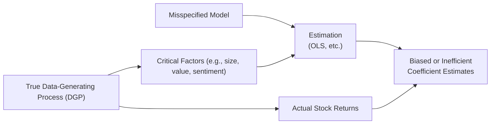

## Understanding Model Misspecification

Imagine you’re trying to predict tomorrow’s stock returns and, well, your model is just not cooperating. You keep seeing bizarre results—or results that sound too good to be true (which usually means they’re false!). This scene often hints at “model misspecification,” a fancy phrase for “You might be missing some essential structure in your regression.” In more precise terms, model misspecification simply means the regression equation doesn’t mirror the real mechanisms behind your data. Perhaps you excluded a critical factor, or you used a linear model when you should have used a non-linear one.

For CFA Level II candidates, spotting and correcting these issues is crucial. Misspecified models can skew everything from factor exposures to risk estimates. If you’re an investment analyst relying on data insights to pick stocks, an overlooked variable or a wrong functional form can lead you astray. Let’s dig in and see where these mistakes can creep up, how to detect them, and what they mean for your forecasting and policy decisions.

## Definition and Scope

Model misspecification occurs when the functional form or variables included in a regression do not properly reflect the true relationship between the dependent variable and the independent variable(s). In other words, it’s like trying to fit a square peg into a round hole: the mathematical structure you assume just won’t match the reality of the data. And because markets aren’t forgiving, your model parameters—coefficients, inference statistics, everything—can be off.

Below is a quick diagram showing how misspecification can happen in a simplified regression context:



As you can see, the model labeled “D” may not account for certain critical factors (like “C”), leading to inaccurate (biased or inefficient) coefficient estimates in “F.”

## Omitted Variable Bias

### The Basic Idea
Omitted Variable Bias (OVB) is what you get when you leave out something important that actually matters to your regression. If that left‑out variable is correlated with one of the variables you’ve kept in the model, your coefficient estimates for the included variable(s) are likely to be off—sometimes significantly. This is the most classic form of misspecification.

### Example in Finance
Let’s say you’re modeling expected stock returns with factors including market beta and momentum. But you forget firm size—a known influencer of stock returns. If the size factor happens to be correlated with momentum, your estimated momentum coefficient might be either spuriously inflated or deflated.

Why does this matter? If you’re an analyst deciding whether a small cap is undervalued, ignoring the size factor may cause you to misjudge the real effectiveness of momentum signals. The end result: misguided portfolio positions and potential loss.

Mathematically, consider you have a true data‑generating process (DGP):

(1)  
y = β₀ + β₁x₁ + β₂z + ε  

But you estimate:

(2)  
y = α₀ + α₁x₁ + ν  

If z is correlated with x₁, the coefficient α₁ in the misspecified model will be biased (i.e., E[α₁] ≠ β₁). This means your entire analysis built on α₁ is potentially misleading.

## Irrelevant Variable Inclusion

### The Basic Idea
Including irrelevant variables—those not correlated with your dependent variable—doesn’t necessarily create bias. But it can introduce a fair bit of “noise.” In other words, your model might feel inflated or cluttered. This often increases the variance of your estimated coefficients, which means:

• Higher standard errors  
• Lower t‑statistics  
• Less precise estimates

### Inefficiency and Overfitting
The classic pitfall is overfitting. You throw everything into your model (maybe because you think more is better) and end up with an equation so tailor‑made to your sample that it fails to generalize out of sample. When you go to forecast, performance can tank. Overfitting is the ultimate frenemy: it looks super on in-sample metrics, but out of sample, it might collapse.

## Measurement Error

Measuring your variables incorrectly is notorious for causing trouble. Depending on whether the error is random (classical measurement error) or systematic (biased measurement tool), the implications differ.

• Classical Measurement Error  
  – If it’s in the dependent variable, your coefficient estimates remain unbiased but become less precise.  
  – If it’s in the independent variable, the coefficient estimates tend to be biased toward zero (attenuation bias).

• Systematic Measurement Error  
  – This occurs when your measuring tool systematically underestimates or overestimates the true value. For example, systematically under‑reporting intangible assets on a balance sheet.  
  – You end up with biased estimates, and in our portfolio or equity analysis context, that can cause big misinterpretations of risk exposures or factor loadings.

### A Personal Anecdote
I once worked on a project involving credit default swaps (CDS) spreads where the data vendor systematically reported certain emerging market CDS quotes on a rolling two-day lag. Didn’t realize the mismatch until results started looking… messy. In hindsight, that was measurement error at its finest—systematic, not random. We had to rebuild the entire dataset with correct timing, and only then did the regression coefficients behave as expected.

## Functional Form Misspecification

### Nonlinear Relationships
If your model is purely linear but the real relationship is curved (like a quadratic), you’ll see patterns in your residual plots (e.g., residuals fanning out or systematically curving around zero). This is a giveaway that you might need a transformed or polynomial term.

For instance, the relationship between a company’s market capitalization and returns might have diminishing effects after a certain point. If you don’t capture that quadratic effect, you could get biased inferences.

### Interaction Terms
Sometimes two variables interact. For example, in corporate finance, an increase in interest rates might affect large firms differently than small firms. If you think these effects are simply additive, you could be missing cross-effects. Adding an interaction term can significantly improve the model.

### Diagnosing Functional Form Problems
• Residual plots: if you see systematic curvature or patterns, that’s a big red flag.  
• Statistical tests or information criteria (like Akaike Information Criterion—AIC, or the Bayesian Information Criterion—BIC) might suggest adding polynomial or interaction terms.  
• Domain knowledge: if you suspect an effect that’s not purely linear, test it out.

## Consequences for Forecasting and Policy Analysis

Once your model is off, you can expect:

• Biased Coefficients: Wrong estimates of factor exposures or risk sensitivities.  
• Distorted Standard Errors: Leading to misjudgment of significance levels.  
• Spurious Relationships: You might find a “significant” relationship that’s an artifact of misspecification.  
• Poor Forecast Accuracy: GIGO—Garbage In, Garbage Out. If your specification is wrong, your predictive power falls apart.  
• Suboptimal Decisions: In portfolio management or policy analysis, flawed inferences can translate to the wrong capital allocation, misinformed strategic moves, or risk that is systematically overlooked.

## Why This Matters for CFA Level II Candidates

You’ll likely face complex item sets on the CFA exam that test your ability to pick apart regression outputs. So, you want to be a pro at recognizing:

• Telltale signs of omitted variables (maybe through strange residual patterns or large shifts in coefficients when a new variable is introduced).  
• Overfitting and how it can lead to seemingly strong R² but weak out‑of‑sample performance.  
• Correctly specifying the functional form and looking out for potential interactions.  
• Ensuring your data is accurate and not systematically off, which can hamper your entire analysis.

In real-world finance, your job may be to present or vet models that drive investment strategies, risk measurement, or valuation. If the model is misspecified, you might be underestimating risk exposures or inflating expected returns. That can lead to serious underperformance or unrecognized vulnerabilities in a portfolio.

## Best Practices and Practical Tips

• Consult Residual Plots: A quick check can reveal structural patterns or major red flags.  
• Start Simple, Add Gradually: Begin with parsimonious models and only add variables if there’s a theoretical or data-driven rationale.  
• Watch for Overfitting: Use holdout samples or cross-validation when possible. If your model’s brilliance disappears in the holdout, it’s probably overfitted.  
• Use Domain Knowledge: If there’s a well-known driver (e.g., sector dummy in equity returns), don’t omit it just because you can’t find clean data. Data cleaning is often worth the extra effort.  
• Sensitive Analysis: Vary the specification. If your main results drastically change with minor specification tweaks, you might be dealing with misspecification.

## A Quick Example

Assume a regression (simplified for demonstration):

y = β₀ + β₁ × (Interest Rate) + β₂ × (Firm Size) + ε

Where y is stock return, Interest Rate is your measure of the current interest environment, and Firm Size is a log of market cap. Suppose in reality you also need an interaction term:

y = β₀ + β₁ × (Interest Rate) + β₂ × (Firm Size) + β₃ × (Interest Rate × Firm Size) + ε

If β₃ ≠ 0 but you fail to include it, your coefficients on β₁ and β₂ might incorrectly reflect the effect of interest rates and size on returns. A negative interest rate environment might be catastrophic for smaller firms but less so for large, diversified blue-chips. Without the interaction, your final recommendation might ignore the unique vulnerabilities of small firms, leading to a potentially flawed portfolio tilt.

Below is a short snippet of Python-like pseudocode that checks for an interaction:

```python
import statsmodels.formula.api as smf
import pandas as pd


model_simple = smf.ols("ret ~ irate + size", data=df).fit()
print(model_simple.summary())

df['interaction'] = df['irate'] * df['size']
model_interact = smf.ols("ret ~ irate + size + interaction", data=df).fit()
print(model_interact.summary())
```

If the coefficient on “interaction” is significant and the residual plots look healthier, you’ve likely corrected a functional form misspecification.

## Glossary

• Omitted Variable Bias: Distortion in estimated coefficients from excluding a relevant factor.  
• Functional Form: The assumed mathematical structure (linear, log‑linear, polynomial, etc.) of a regression.  
• Measurement Error: Discrepancy between actual and recorded values, which can bias or reduce the efficiency of estimates.  
• Overfitting: Including too many variables or using an overly complex specification that fits noise rather than true relationships.  
• Bias: Systematic deviation between an estimator’s expected value and the true parameter.  
• Efficiency: The precision of an estimator (lower variance is more efficient).  
• Systematic Error: Error that consistently skews the measurement or estimates in one direction.  
• Noise: Random variation not explained by the model.

## Final Exam Tips

• Read the Vignette Carefully: Identify relevant variables the passage hints at. A missing factor or interaction may point to potential misspecification.  
• Inspect the Tables: Look at the residual patterns or note if R² improvements are suspiciously large when you add or remove variables.  
• Time Management: Don’t get bogged down in re-deriving formulas. Focus on conceptual understanding for quick detection of misspecification.  
• Know the Common Culprits: Omitted variables, incorrect functional forms, and measurement error are tested frequently.  
• Keep the Big Picture in Mind: If the scenario implies a nonlinear effect or cross-factor synergy, check for an interaction term or polynomial expansion in the answer choices.

## References

• Greene, W. H. Econometric Analysis (7th ed.). New York: Pearson.  
• Wooldridge, J. M. Introductory Econometrics: A Modern Approach (6th ed.). Boston: Cengage.  
• Kennedy, P. A Guide to Econometrics. Malden, MA: Blackwell Publishing.  
• Academic Journals: The Journal of Finance, The Review of Financial Studies.  

---

## Test Your Knowledge: Common Model Misspecification Pitfalls



### Which of the following best describes Omitted Variable Bias in a regression model?

- [ ] The error term is perfectly uncorrelated with all regressors.
- [ ] A variable is included in the model even though it is uncorrelated with the dependent variable.
- [x] A relevant variable is excluded from the model, and it is correlated with an included variable.
- [ ] The regression residuals display no systematic pattern.

> **Explanation:** Omitted Variable Bias occurs specifically when a relevant factor is left out of the regression and is correlated with one or more included independent variables, causing biased coefficient estimates.

### Suppose you have a linear model but the true relationship is nonlinear. Which of the following is the most likely symptom?

- [x] Systematic patterns in the residuals that suggest curvature.
- [ ] Coefficients and residuals follow a perfect normal distribution.
- [ ] The coefficient of determination (R²) is always low.
- [ ] The model has no intercept.

> **Explanation:** If the relationship is nonlinear, a linear model will likely leave patterns in the residuals (they might fan out or have clear curvature) rather than being randomly scattered.

### How does adding irrelevant variables usually affect parameter estimates?

- [ ] It creates a large structural break in the time series.
- [ ] It introduces negative autocorrelation in the model.
- [x] It does not bias coefficient estimates but may reduce their precision.
- [ ] It causes R² to be lower than before.

> **Explanation:** Adding irrelevant variables generally does not create bias (since these variables do not correlate with the dependent variable), but it does increase the variance of estimates, leading to less precision (i.e., higher standard errors).

### Which of the following is a key difference between classical measurement error in the dependent variable versus the independent variable?

- [ ] There is no difference; all measurement error has identical consequences.
- [ ] Dependent variable error leads to biased estimators, while independent variable error does not.
- [ ] Dependent variable error introduces omitted variable bias, while independent variable error leads to a different parametric form.
- [x] Dependent variable error generally does not bias the coefficient estimates, while independent variable error can attenuate them.

> **Explanation:** Classical measurement error in the dependent variable introduces noise without biasing the slope coefficients, whereas measurement error in the independent variables tends to bias coefficient estimates toward zero (attenuation bias).

### In the context of Omitted Variable Bias, which condition is necessary for bias to exist?

- [x] The omitted variable must be correlated with at least one included regressor.
- [ ] The omitted variable is uncorrelated with every included regressor.
- [x] The omitted variable must have an impact on the dependent variable.
- [ ] The omitted variable has no theoretical relevance to the model.

> **Explanation:** Two things are needed for omitted variable bias: (1) the omitted variable influences the dependent variable, and (2) it is correlated with an included regressor. If both conditions are met, the included regressor absorbs the effect of the omitted variable, creating bias.

### If a financial analyst finds that adding a polynomial term in a regression reduces systematic patterns in residual plots, this suggests:

- [ ] The new model is overfitted and thus inferior.
- [ ] The linear specification was more efficient.
- [ ] No comedic effect besides the model looking fancier.
- [x] The relationship likely exhibits nonlinearity that was captured by the polynomial term.

> **Explanation:** Polynomial terms help capture curvature that a purely linear model cannot. Reducing residual patterns after adding the polynomial indicates improved specification.

### Overfitting typically leads to which scenario?

- [ ] Lower standard errors and unbiased estimates.
- [x] Great in-sample fit but poor out-of-sample predictive performance.
- [x] Inclusion of too many irrelevant variables.
- [ ] Accurately capturing all relevant factors without any downside.

> **Explanation:** Overfitting often appears to improve the in-sample fit but performs poorly when predicting new data. It also frequently involves unnecessary variables that do not enhance true predictive power.

### What effect can systematic measurement error in the independent variables have on regression estimates?

- [ ] It lowers the correlation between variables to zero.
- [ ] It always reduces model significance to below 5%.
- [x] It can produce biased coefficient estimates.
- [ ] It only affects the random component of the error term.

> **Explanation:** Systematic measurement error skews estimates by consistently misrepresenting the true values. This can push the coefficients away from their true values.

### An analyst suspects a missing interaction term in her model. Which of the following steps is the most direct way to test this suspicion?

- [ ] Remove all variables except one.
- [x] Explicitly include the interaction term in the regression and assess statistical significance.
- [ ] Switch from linear regression to logistic regression.
- [ ] Omit the intercept from the model.

> **Explanation:** If you suspect an interaction for variables X and Z, you should add the interaction term (X×Z) to the model, then evaluate whether it significantly reduces systematic pattern in residuals or improves model fit.

### True or False: Identifying and correcting omitted variables or incorrect functional forms is critical for accurately assessing factor exposures in equity returns.

- [x] True
- [ ] False

> **Explanation:** Yes, specifying the model correctly is essential for capturing the true effects of factors on equity returns. Misspecification can lead to spurious conclusions about exposures, risks, and performance drivers.


