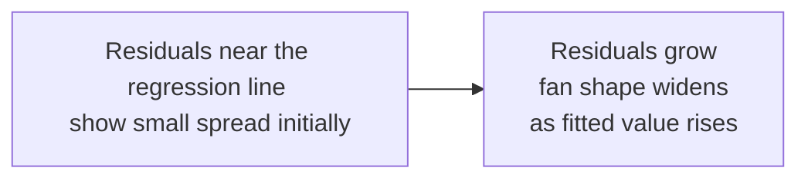
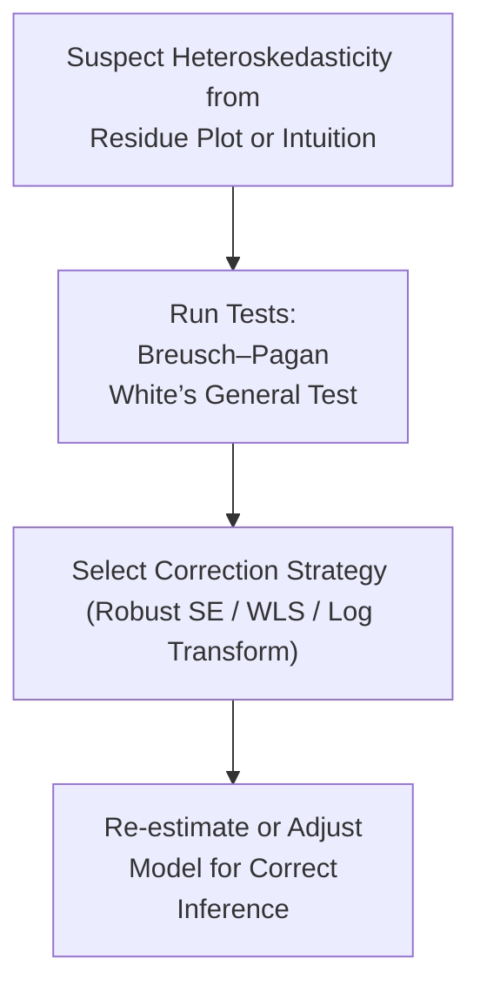

## Introduction

Heteroskedasticity might sound fancy, but at its core, it just means that the “spread” (variance) of your error terms is not the same across all observations in a regression. If you’re analyzing returns for a volatile emerging market stock, you may find that on days with big price swings, your model’s error variance is a lot larger than on “calmer” days. This phenomenon is central to many real-world finance problems: riskier securities often exhibit periods of wide dispersion in returns, while stable or mature companies might have steadier (and lower variance) returns. 

Below, we’ll explore what heteroskedasticity is all about, why it matters, how to detect it, and how to fix or mitigate its effects in your regression-based analyses.

## Defining Heteroskedasticity

Heteroskedasticity occurs when the variance of the error term in a regression model is not constant. In other words, we assume a linear regression model:

(1)  
yᵢ = β₀ + β₁x₁ᵢ + … + βₖxₖᵢ + εᵢ  

The assumption of homoskedasticity says Var(εᵢ) = σ² for every i. When this assumption is violated and Var(εᵢ) is not the same for all observations, we have heteroskedasticity. This issue is especially common in finance, where periods of market stress can inflate residual variance and periods of tranquility can reduce it.

### Why It Often Happens in Finance

• Volatile Periods: During market turbulence, returns scatter more than usual, creating a larger “spread” in your residual plot.  
• Differing Scales of Firms or Assets: Some companies are just bigger and have more variable earnings, while others are small and stable but with consistent returns.  
• Structural Breaks: Changing economic regimes can lead to abrupt shifts in the volatility of your dependent variable (for instance, in time-series of interest rates or exchange rates).

## Consequences of Heteroskedasticity

Although heteroskedasticity won’t bias your coefficient estimates (β’s remain consistent under the Gauss–Markov assumptions if other conditions hold), it affects the reliability of inference. You may find that:

• Standard Errors Become Misleading: If the usual Ordinary Least Squares (OLS) formulas for standard errors assume constant variance but your data is actually heteroskedastic, your t-statistics (and thus p-values) are off.  
• Type I and Type II Errors: You might reject a true hypothesis (Type I error) or fail to reject a false hypothesis (Type II error) due to incorrect standard error estimates.  
• Distorted Confidence Intervals: If standard errors are unreliable, so are the confidence intervals around your coefficient estimates.

In short, you might draw very wrong conclusions about which predictors are statistically significant, and that’s not something you want when you’re making real financial decisions—like whether to include a factor in a multi-factor equity model or how to price a fixed-income security.

## Detecting Heteroskedasticity

### Visual Inspection of Residuals

Possibly the first step you’ll take is to look at the residuals (εᵢ) from your regression plot. Check out how the residuals behave relative to fitted values (ŷᵢ) or key independent variables:

• Scatter Plots: Plot residuals on the y-axis versus the fitted values on the x-axis. If the scatter “fans out” (i.e., the variability grows as fitted values increase) or “fans in,” that’s a red flag.  
• Time Plots (for Time‑Series Data): If your model residuals show increasing volatility over time (e.g., a volatility cluster in certain months), that suggests heteroskedasticity.

Here’s a small personal anecdote: I once worked on a project that involved daily returns for an emerging market bond fund. The fund had calm periods with near-constant small changes, followed by intense bursts of volatility every time political uncertainty emerged. The residuals basically looked like a tight cluster followed by an explosion. Clear sign of heteroskedasticity.

Below is a simple depiction in Mermaid format, showing how residuals might “fan out”:

### Formal Statistical Tests

Visual checks are valuable, but for exam settings—and for more rigorous application—you need formal tests:

#### Breusch–Pagan Test (or Cook–Weisberg Test)

This test regresses the squared residuals (εᵢ²) on the original independent variables (x₁ᵢ, x₂ᵢ, …, xₖᵢ). If the regression finds a statistically significant relationship between squared residuals and any independent variable, it flags heteroskedasticity.

• Null Hypothesis (H₀): Homoskedasticity (variance is constant).  
• Alternative Hypothesis (Hₐ): Heteroskedasticity (variance is not constant).

If the p-value of the test is below your chosen significance level (often 5%), you reject H₀ and conclude that heteroskedasticity is present.

##### Breusch–Pagan Test Steps

1. Estimate your initial OLS regression, get residuals (εᵢ).  
2. Compute εᵢ² (the squared residuals).  
3. Regress εᵢ² on the explanatory variables (x₁, …, xₖ).  
4. Conduct an F-test on the R² from Step 3 to see if it’s significant.  

#### White’s General Test

White’s Test doesn’t require guessing a particular form for the variance. It’s more general and typically includes cross terms and squared terms of independent variables as regressors for εᵢ². It’s handy when you just suspect heteroskedasticity, but you’re not sure how it might be triggered in your data.

## Remedies for Heteroskedasticity

### Robust (White) Standard Errors

One of the simplest and most practical solutions—especially in large datasets—is to recalculate your standard errors in a way that’s robust to heteroskedasticity. These “White Standard Errors” ensure that your t-statistics and p-values are valid even if your error variance is not constant. Most modern statistical software can produce these robust standard errors with a simple option or command.

• Advantages: Easy to implement, doesn’t require you to model the changing variance.  
• Disadvantages: Provides no direct insight into the structure of heteroskedasticity; you lose some efficiency compared to modeling the variance properly if you do indeed know the correct structure.

### Weighted Least Squares (WLS)

If you have a good idea of what drives the changing variance—for instance, if you know that variance is σᵢ² = f(xᵢ) or is proportional to a certain variable—WLS can be a more precise fix. In WLS, each observation gets a weight wᵢ that is inversely proportional to its variance (i.e., 1/σᵢ²).

In practice, you might not know σᵢ² exactly, so you estimate it from the data. Then you’d transform your regression model accordingly and run a weighted OLS with those estimated weights. Typically, you’ll see WLS used in cross-sectional equities data where the variance of returns might be proportional to firm size or something else tangible.

### Logarithmic Transformation

In contexts like modeling stock prices or returns, using a log scale can sometimes stabilize variance. If the variation in your dependent variable grows with the value of the variable (e.g., a stock at $1,000 may move more dramatically in absolute terms than one at $20), log transformations can reduce the difference in magnitudes.

• Caution: Taking logs changes the interpretation of your coefficients (they become elasticities if you log the dependent variable). Make sure a log transform is meaningful for your data (non-negative, ideally positively valued).  
• Example: In many finance applications (like modeling trading volume or certain macro variables), a log transform is considered standard practice.

## Practical Considerations

If you’re tackling an exam question or a quick model in practice, using robust standard errors is often the fastest remedy. Weighted Least Squares can be more accurate if you know the variance relationship, but realistically, it’s not always feasible or known. Log transformations can help, but only if the data is suitable and if you’re comfortable interpreting results in multiplicative rather than additive terms.

Anyway, if you see those “fan-shaped” residual plots, you can bet heteroskedasticity is an issue. But don’t panic—there’s a reason software packages have a “robust errors” button just waiting for you.

 

## Glossary of Key Terms

• **Heteroskedasticity**: Non-constant variance of the error term in your regression model.  
• **Breusch–Pagan Test**: A statistical test that regresses squared residuals on your independent variables to check for heteroskedasticity. Sometimes called Cook–Weisberg when done in a certain statistical package.  
• **Robust Standard Errors (White Standard Errors)**: Adjusted standard errors that remain consistent in the presence of heteroskedasticity.  
• **Weighted Least Squares (WLS)**: A technique that assumes or estimates each observation’s variance and weights it accordingly; used when you have a known or reliable guess about how variance scales with certain variables.  
• **White’s Test**: A general, more flexible test for heteroskedasticity that doesn’t assume a particular relationship between the variance and the regressors.  
• **Residual Plots**: Graphs of residuals against either fitted values or key explanatory variables, an essential diagnostic tool in any regression analysis.

## Practical Example (Short Case Study)

Suppose you’re modeling daily returns of a high-tech growth portfolio (yᵢ) using factors like market returns (x₁ᵢ), size factor (x₂ᵢ), and momentum factor (x₃ᵢ). You notice the model’s residuals appear small and nice on calm days but absolutely blow up on high-volatility days—this is exactly where you suspect heteroskedasticity. 

You run a Breusch–Pagan test:

• H₀: Var(εᵢ) is constant  
• Hₐ: Var(εᵢ) depends on the factors  

The test results show a p-value of 0.01, so you reject H₀. Now you apply robust standard errors. Upon rechecking your t-statistics, you realize that momentum factor’s significance actually changed from borderline to clearly insignificant once the correct standard errors are used. 

If you want to be more sophisticated and you believe the variance is a function of the market factor only, you might try Weighted Least Squares with a weight based on an estimate of Var(εᵢ) ∝ MarketVolatility(x₁ᵢ). Alternatively, if your data suggests that returns are best modeled on a log scale (e.g., you’re dealing with large daily price swings in absolute terms), you might log-transform returns. 

## Exam Tips

• On the CFA exam, watch for vignettes that describe a fanning out of residuals or mention rising variance in a time-series. That’s the tip-off!  
• They often ask about the effect on standard errors if heteroskedasticity is present: the usual OLS standard errors are not reliable, but coefficient estimates remain unbiased.  
• Remember that robust standard errors are a quick fix. Weighted Least Squares is a second-level approach and might be tested in more advanced question sets.

## References for Further Exploration

• Wooldridge, J. M. Introductory Econometrics: A Modern Approach. Boston: Cengage.  
• Gujarati, D. N. & Porter, D. C. Basic Econometrics. New York: McGraw-Hill.  
• CFA Institute. Advanced Regression Diagnostics and Statistical Inference (Level II Curriculum).

 

## Sharpen Your Skills: Heteroskedasticity Detection and Remedies Quiz



### Which of the following best describes heteroskedasticity in a regression model?

- [ ] It refers to errors with both positive and negative signs.  
- [ ] It arises when error terms are correlated over time.  
- [x] It arises when the variance of the error terms differs across observations.  
- [ ] It occurs when you use an incorrect functional form in a regression.  

> **Explanation:** Heteroskedasticity specifically refers to non-constant variance of errors. It does not inherently concern the sign of errors or the use of an incorrect model specification.

---

### Which test specifically regresses the squared residuals on the independent variables to detect heteroskedasticity?

- [ ] White’s General Test  
- [x] Breusch–Pagan Test  
- [ ] Durbin–Watson Test  
- [ ] Jarque–Bera Test  

> **Explanation:** The Breusch–Pagan (and Cook–Weisberg) test involves regressing the squared residuals on the original regressors to detect heteroskedasticity.

---

### Which statement correctly summarizes the impact of heteroskedasticity on OLS estimates?

- [ ] Coefficients become biased.  
- [ ] Coefficients become both biased and inconsistent.  
- [x] Coefficients remain unbiased, but their standard errors may be unreliable.  
- [ ] Heteroskedasticity has no impact on either coefficients or standard errors.  

> **Explanation:** Under Gauss–Markov assumptions (other than constant variance), the coefficient estimates remain unbiased, but standard errors are distorted.

---

### In a residual-vs.-fitted-values plot, which pattern most strongly suggests heteroskedasticity?

- [ ] Residuals centered evenly around zero.  
- [x] Residuals that increase in spread as fitted values increase.  
- [ ] Residuals that alternate signs in a cyclical pattern.  
- [ ] Residuals that follow a normal distribution shapefile.  

> **Explanation:** A “fan-shape” pattern with increasing (or decreasing) spread in residuals as fitted values grow is a common visual indicator of heteroskedasticity.

---

### One quick remedy if you detect heteroskedasticity in your regression is to:

- [x] Use robust standard errors.  
- [ ] Increase the sample size only.  
- [ ] Discard outliers and proceed without transformation.  
- [ ] Ignore it if your coefficients remain significant.  

> **Explanation:** Adjusting your standard errors to be robust (a.k.a. White standard errors) is a straightforward fix when you detect heteroskedasticity.

---

### Which of the following best describes Weighted Least Squares (WLS)?

- [ ] A method of dealing with correlated errors in AR(1) processes.  
- [x] An approach that weights observations inversely proportional to the error variance.  
- [ ] A technique used only in logistic regression.  
- [ ] A substitute for robust standard errors in ANOVA.  

> **Explanation:** WLS is specifically designed to handle scenarios where each observation has a different variance. You weight each observation by 1/σᵢ² for more efficient estimates, assuming you know or can estimate σᵢ².

---

### Assume you suspect heteroskedasticity in your cross-sectional stock returns data due to market cap differences. A logical next step might be:

- [x] Estimate each observation’s variance based on market cap and apply WLS.  
- [ ] Use random effects modeling.  
- [x] Use robust standard errors in your OLS regression.  
- [ ] Abandon the standard linear model entirely.  

> **Explanation:** If market cap is believed to affect the variance of returns (e.g., large caps have different variability than small caps), you can try WLS with an estimated variance function. Alternatively, you can simply use robust standard errors.

---

### White’s General Test differs from Breusch–Pagan in that:

- [ ] It is simpler to implement and strongly parametric.  
- [ ] It only works for time-series data.  
- [x] It does not assume a specific functional form and may include cross terms and squared terms.  
- [ ] It is designed solely for detecting autocorrelation.  

> **Explanation:** The hallmark of White’s Test is that it’s a more general test for heteroskedasticity that doesn’t rely on specifying how variance depends on regressors.

---

### When is log-transforming the dependent variable particularly useful in addressing heteroskedasticity?

- [ ] When the data is purely nominal.  
- [x] When the dependent variable’s variance grows with its level.  
- [ ] When the data contains many negative values.  
- [ ] When the regression is only for a small sample.  

> **Explanation:** If the spread grows proportionally as the variable itself grows, a log transform can often stabilize variance. However, the data should be strictly positive for a direct log transform.

---

### True or False: Heteroskedasticity can lead to inflated or deflated t-statistics, causing potentially incorrect inferences about significance.

- [x] True  
- [ ] False  

> **Explanation:** Because standard errors are misestimated when heteroskedasticity is present, the resulting t-statistics can be either overstated or understated, leading researchers to incorrect conclusions about significance.


