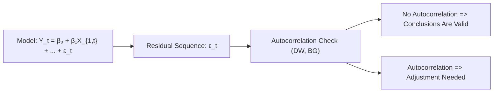

## Introduction
Serial correlation—often called autocorrelation—appears when residuals from your regression or time-series model are correlated over successive periods. Even if this term sounds fancy, it basically means your model’s errors are not purely random across time. Instead, each error is dancing a bit too closely with the errors that came before it. As soon as you suspect serial correlation, you have to pay closer attention, because it can mess up everything from test statistics to forecasting accuracy.

I remember the first time I built a regression on stock returns, thinking it was a straightforward approach. Then—surprise—my professor pointed out that my residuals were not random; they showed a persistent pattern. This was my cue to dive deep into serial correlation and discover that ignoring it can lead to some pretty misleading conclusions.

Below, we’ll jump into what serial correlation means, why it’s so crucial, how to detect it, and how to fix it without tearing your hair out. Let’s get started.

## Serial Correlation in a Nutshell
In a perfect linear regression world (as we often assume), the error terms (residuals) should be independent and identically distributed. If you’ve studied earlier chapters (particularly Chapter 2 on multiple regression basics and Chapter 3 on model diagnostics), you’ll recall one of the big assumptions: no autocorrelation among error terms.

However, when data have a time-series structure—think daily stock returns, monthly macroeconomic indices, or any sequential financial measurement—there’s a risk that the error at time t might be related to the error at time t−1 (or even further back). This correlation can happen for many reasons:

• Momentum or mean reversion in returns.  
• Lagged effects of news, announcements, or policy decisions.  
• Incomplete model specification, omitting relevant lagged factors.  

When these patterns slip into your residuals, it’s a telltale sign that something interesting is happening below the surface—or that something is missing in your model.

### Why Should You Care?
• If error terms are correlated over time, your standard errors won’t be estimated correctly.  
• Your t-statistics and F-statistics could be off the mark—leading you to misguided conclusions about which variables are significant.  
• Autocorrelation commonly arises in financial series where shocks and trends have a habit of persisting.  

Even if the coefficient estimates remain unbiased under certain forms of autocorrelation (like simple first-order serial correlation with no omitted variables), your entire inference—confidence intervals, hypothesis tests, everything—can become fragile. This is obviously not what you want when trying to impress your boss with a new forecasting strategy or when prepping for the exam.

## Consequences of Autocorrelation
Let’s be super clear about the potential fallout:

• Biased Standard Errors: The crux of the matter is that your standard errors often end up understated or overstated. You might find “significant” results where there are none (Type I error) or miss significance where it actually exists (Type II error).  
• Faulty Hypothesis Testing: Because your standard errors are off, your t-ratios (and F-ratios) for testing coefficient significance are unreliable. If you’re leaning on regression to make investment decisions (like forecasting returns), you’re basically trusting shaky results.  
• Overly Optimistic Goodness-of-Fit: Sometimes, ignoring autocorrelation can give an inflated impression of how well the model explains the data. This can lead to overconfidence in the model’s predictive abilities.

By the way, it’s worth noting that the standard formula for the ordinary least squares (OLS) estimator still gives unbiased estimates of the coefficients if the model is otherwise correctly specified (i.e., no omitted variables and correct functional form). But as soon as that assumption is violated, watch out. And even if you keep unbiasedness, your standard errors—and thus your inference—are in trouble.

## Detection Methods
So how do you figure out if you have serial correlation? Let’s look at several detective tools:

### Durbin–Watson (DW) Test
This is the most common test for identifying first-order autocorrelation in the residuals. It’s easy to run and interpret:

(1) Fit your regression and obtain the residuals eₜ.  
(2) Compute:


DW = \frac{\sum_{t=2}^{T} (e_t - e_{t-1})^2}{\sum_{t=1}^{T} e_t^2}.


(3) If DW is around 2, there’s no strong evidence of first-order autocorrelation. Values significantly below 2 suggest positive autocorrelation, while values significantly above 2 suggest negative autocorrelation.

Small note: The Durbin–Watson test is primarily for first-order autocorrelation. If your data may have higher-order autocorrelation (like eₜ correlated with eₜ₋₂ or eₜ₋₃), you might need something a bit heavier.

### Breusch–Godfrey (BG) Test
Enter the Breusch–Godfrey LM test. This one is more general than Durbin–Watson because it can handle higher-order autocorrelation. The mechanics basically revolve around running an auxiliary regression of the OLS residuals against the original regressors plus lagged residuals. If the test statistic is large (beyond critical values or p-values), it indicates the presence of autocorrelation of relevant orders.

### Graphical Residual Analysis
Sometimes, the simplest route is to just eyeball it—plot your residuals or the autocorrelation function (ACF) of residuals. If you see clear cyclical patterns, peaks rising above standard error bounds, or a slow decay in the ACF, you may be looking at autocorrelation in the flesh.

#### Quick Mermaid Diagram
Here’s a quick visual to outline the chain of events when you suspect serial correlation:

## Remedies and Corrections
You’ve detected autocorrelation. Now what?

### 1. Newey–West Standard Errors
If you suspect or detect that your error terms are correlated (and potentially also heteroskedastic), you can use Newey–West standard errors. These are sometimes referred to as HAC standards (heteroskedasticity- and autocorrelation-consistent). They adjust your coefficient standard errors to account for autocorrelation up to a certain lag.

• Pros: Easy to implement in many statistical software packages. Often the first go-to solution if you just want to fix standard errors without altering your original regression.  
• Cons: They do not necessarily “fix” the model specification per se; they just correct the inference. The underlying autocorrelation is still present in the data, so if you’re forecasting or simulating, you might still want a dynamic approach like an AR model.

### 2. Inclusion of Lagged Dependent Variables (AR Models)
Sometimes your data are inherently dynamic—past values of the dependent variable help explain present values. If you neglect that aspect, you get serial correlation in the residuals. By explicitly modeling the time-series structure (e.g., adding lagged Y terms), you can soak up that pattern.

This approach basically says: if your process is Yₜ = α + βXₜ + γYₜ₋₁ + εₜ, let’s put the Yₜ₋₁ term in the regression so that the leftover residuals become more random. But keep in mind:

• Once you introduce a lagged dependent variable, your standard OLS assumptions shift, and you need to pay attention to potential endogeneity issues and the correctness of your dynamic specification.  
• The sign and magnitude of the lag coefficient can reveal mean-reverting tendencies or persistent momentum in your financial series (like certain bond yield processes or macro indicators).

### 3. Generalized Least Squares (GLS) and Prais–Winsten Transform
There’s also a “structural fix” approach in the form of GLS or the Prais–Winsten transformation. The idea is to re-estimate the model in a way that removes autocorrelation from the error term. For first-order autocorrelation, we often assume:


ε_t = ρ ε_{t-1} + u_t  \quad \text{where } |ρ| < 1,


and transform the model accordingly. Feasible GLS (like Cochrane–Orcutt or Prais–Winsten procedures) tries to estimate ρ from the data, then “de-correlate” the series. This is quite powerful, especially if you strongly believe in a specific structural form of the autocorrelation.

### Quick Summary Table of Remedies

| Method                                   | Primary Use                 | Pros                                          | Cons                                                     |
|------------------------------------------|-----------------------------|-----------------------------------------------|----------------------------------------------------------|
| Newey–West Standard Errors               | Correcting standard errors  | Straightforward implementation                | Underlying autocorrelation not removed                  |
| Including Lagged Dependent Variable (AR) | Dynamic processes           | Reflects real process dynamics                | Possible endogeneity; need correct specification        |
| GLS/Prais–Winsten                        | Structural fix of residuals | Removes serial correlation systematically     | Requires correct assumptions about autocorrelation form |

## Practical Steps and Decision Points
So, how do you decide which approach is right for you?

• First, run diagnostic tests—DW, BG, or just plot residuals.  
• Next, identify if the autocorrelation arises from neglected dynamic structure (e.g., is it obviously an AR(1) or AR(2) pattern?).  
• If your focus is primarily on inference (hypothesis testing about coefficients), you might do well with robust standard errors (like Newey–West).  
• If your focus is on forecasting or truly capturing the time-series process, consider adding AR terms or performing a GLS-type correction.

Honestly, in real-world finance, it’s quite common to see analysts run regressions and just “Newey–West” the results—especially if their main interest is to see whether a factor is statistically significant. On the other hand, for time-series forecasting jobs, an AR specification is usually more suitable.

You might ask: “But do I need to go big and do something specialized like a Prais–Winsten transformation?” Possibly. If you’re in an academic or particularly complex setting (like yield curve modeling with persistent daily data), feasible GLS can yield more precise parameter estimates than a naive OLS approach. Just weigh the complexity overhead against your data, your purpose, and your time constraints.

## Glossary
• Serial Correlation / Autocorrelation: Correlation of a time series with its own past residuals.  
• Durbin–Watson (DW) Test: A popular first-order autocorrelation test statistic. Values around 2 imply minimal autocorrelation.  
• Breusch–Godfrey (BG) Test: A more flexible test for detecting higher-order autocorrelation.  
• Newey–West Standard Errors: Adjust standard errors for both autocorrelation and heteroskedasticity.  
• Prais–Winsten Estimation: A feasible GLS approach to correct for first-order autocorrelation by transforming the model.  
• Autocorrelation Function (ACF): Plots the correlation of a time series with its own lagged values across increasing time lags.

## Conclusion
Serial correlation can be a tricky customer: it creeps in quietly and undermines your confidence in your entire regression output. But by testing for it (using DW or BG tests, or just by plotting residuals) and then applying the right remedies (Newey–West for inference, AR for capturing dynamics, or GLS if you need a structural fix), you can rest assured that the next big decision—like an investment strategy based on your regression results—stands on firmer ground.

At the end of the day, the best approach depends on your specific data, your modeling goals, and how complex you want to get. Keep an eye out for autocorrelation whenever you’re dealing with time-series data. It’s a frequent flyer in financial applications, so get comfortable adjusting your approach to ensure robust, reliable results.

## References
• Enders, W. Applied Econometric Time Series. Hoboken, NJ: Wiley.  
• CFA Institute – Assigned Readings on Time-Series Analysis.  
• Hamilton, J. D. Time Series Analysis. Princeton, NJ: Princeton University Press.

--------------------------------------------------------------------------------

## Practice Questions on Serial Correlation: Detection and Remedies



### Which of the following is the primary consequence of serial correlation in a regression’s residuals?
- [ ] It always biases coefficient estimates.
- [x] It leads to incorrect estimates of standard errors, affecting inference.
- [ ] It has no impact if the sample size is large enough.
- [ ] It guarantees the presence of omitted variables.

> **Explanation:** When residuals are autocorrelated, the biggest concern is that standard errors become unreliable, leading to incorrect t-statistics and F-statistics. Coefficient estimates themselves can remain unbiased if the model is correctly specified.

### A Durbin–Watson (DW) statistic significantly below 2.0 most likely indicates:
- [x] Positive first-order autocorrelation.
- [ ] Negative first-order autocorrelation.
- [ ] No evidence of autocorrelation.
- [ ] Homoskedastic errors.

> **Explanation:** A Durbin–Watson value below 2 typically suggests residuals are positively autocorrelated, meaning εₜ and εₜ₋₁ are positively related.

### An analyst suspects higher-order autocorrelation (beyond first-order). Which test is best suited for this scenario?
- [ ] Durbin–Watson test
- [ ] White test
- [x] Breusch–Godfrey LM test
- [ ] Chow test

> **Explanation:** The Breusch–Godfrey test is more flexible and can detect higher-order autocorrelation, unlike Durbin–Watson, which focuses on first-order.

### A researcher adds a lagged dependent variable to her regression model for a stock returns time series. One major caution with this approach is:
- [ ] The model can no longer be estimated by standard OLS.
- [x] Potential endogeneity and the need to consider dynamic panel data methods or special techniques.
- [ ] It automatically corrects for heteroskedasticity.
- [ ] It leads to negative autocorrelation in the residuals.

> **Explanation:** Once you include lagged dependent variables, you may run into endogeneity. You should consider advanced methods (like Instrumental Variables) as appropriate. Standard OLS can still be used, but with caution about the standard errors.

### Newey–West standard errors primarily address:
- [x] Both autocorrelation and heteroskedasticity in error terms.
- [ ] Multicollinearity and omitted variable bias.
- [ ] Non-normal distributions.
- [ ] Random effects in panel data.

> **Explanation:** Newey–West standard errors adjust for heteroskedasticity and autocorrelation (HAC). They do not solve other issues like multicollinearity or omitted variable bias.

### Which statement best describes how GLS (generalized least squares) methods correct for autocorrelation?
- [x] They transform the model to remove correlation from residuals.
- [ ] They penalize the coefficient estimates based on their size.
- [ ] They apply shrinkage to the regression coefficients.
- [ ] They entirely eliminate the need for data stationarity.

> **Explanation:** GLS transforms the original regression (often by removing an estimated correlation structure) so that the transformed residuals are no longer autocorrelated.

### Including an AR(1) term directly into a regression model is most appropriate when:
- [ ] The statistical software fails to calculate Durbin–Watson properly.
- [ ] You suspect heteroskedastic errors only.
- [x] The dependent variable depends on its past values in a dynamic fashion.
- [ ] You need to impose exogeneity in all regressors.

> **Explanation:** An AR(1) specification is used when past values of the dependent variable appear to influence the current value, creating a dynamic relationship.

### Which of the following indicates positive autocorrelation in the residual plots of a time series?
- [x] ACF spikes at lag 1 that significantly exceed confidence bounds.
- [ ] The presence of uniform random scatter.
- [ ] Plot points in the shape of a horizontal band around zero.
- [ ] Residuals with large negative consecutive values only.

> **Explanation:** The autocorrelation function (ACF) is a handy diagnostic tool: if the lag-1 ACF of residuals is significantly positive, that usually indicates positive serial correlation.

### If an analyst detects autocorrelation but only cares about the reliability of coefficient inference (not predicting future values), which method is commonly used?
- [ ] 2SLS
- [ ] GARCH
- [ ] Box–Jenkins
- [x] Newey–West standard errors

> **Explanation:** Newey–West adjusts the standard errors for autocorrelation (and heteroskedasticity) without changing the estimated coefficients, making them popular for inference-oriented research.

### True or False: The ordinary least squares estimate of the slope coefficient is always biased in the presence of first-order serial correlation.
- [ ] True
- [x] False

> **Explanation:** In many standard linear regression settings, the OLS estimate of the slope coefficient remains unbiased (though not necessarily efficient) if the model is not otherwise misspecified. The big problem is that the standard errors and test statistics become unreliable.


