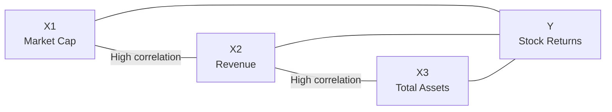

## Introduction

Ever tried to juggle too many variables in a regression and ended up with some really strange results, like massive swings in coefficient signs or t-statistics that suddenly turn insignificant? That can be multicollinearity at work. It’s a phenomenon that pops up in countless real-world financial datasets, and it can seriously mess with your ability to interpret your regression model. This section explores what multicollinearity is, how to detect it, and most importantly, how to handle it when it rears its head in your analyses.

## Definition and Sources

Multicollinearity happens when two or more explanatory variables in a regression model are highly correlated with each other. Now, I know “high correlation” can sound a bit vague, but the gist is: if one independent variable can be (roughly) predicted by a combination of the others, you’re facing collinearity issues. In finance, it’s really common to see collinearity when variables like market capitalization, revenue, and total assets track one another closely because they all measure facets of a firm’s size.

Reasons multicollinearity occurs can include:
- Multiple size-related metrics in the same model (like total revenue and total assets).  
- Macro indicators that move together (inflation and interest rates during certain economic regimes).  
- Constructed ratios that partially overlap in numerator or denominator (e.g., debt-to-equity and debt-to-assets).  
- Highly granular factor exposures in multifactor models.

Here’s a simple conceptual diagram of how interrelationships among correlated variables can converge on a dependent variable:



You can imagine that if “X1,” “X2,” and “X3” are all telling more or less the same story, the regression algorithm gets confused about which variable is pulling the most weight.

## Impact on Regression Results

When your independent variables are highly correlated, you may notice:

- Large Standard Errors and Unreliable t-Statistics: The presence of correlated predictors inflates the variance of the coefficient estimates. This inflation—in turn—renders certain coefficients statistically insignificant even if they genuinely matter to the model.

- Coefficient Instability: If you keep adding or removing a single data point (or slightly revise your sample), the coefficients can flip signs or drastically change magnitude.

- Overinterpretation Hazards: Multicollinearity can trick you into drawing incorrect conclusions about variable importance. A variable that is truly crucial might seem irrelevant (due to a suppressed t-statistic) or might even appear to have a reversed sign if there’s another overlapping variable in the mix.

- Difficulty in Evaluating Individual Effects: It becomes challenging to tell which independent variable is actually responsible for explaining changes in the dependent variable, because correlated predictors overlap in what they explain.

I remember once adding both “total assets” and “market cap” into a regression trying to explain stock returns—thinking, “Surely more data is better, right?” But neither variable was significant, even though each one alone was a powerful predictor. Turns out, they were so correlated that the regression singled out neither as individually significant. That’s a classic example of how multicollinearity can hamper your analysis.

## Detection Methods

### Variance Inflation Factor (VIF)

The Variance Inflation Factor (VIF) is a classic measure for diagnosing multicollinearity. For each independent variable (call it \\(X_i\\)), we regress \\(X_i\\) on all the other explanatory variables. This produces an \\(R^2\\) for that “auxiliary regression.” The VIF formula is:

$$
VIF_i = \frac{1}{1 - R_{i}^2}
$$

- If \\(VIF_i \approx 1\\), there’s no strong correlation between \\(X_i\\) and the others.  
- If \\(VIF_i > 5\\) or \\(VIF_i > 10\\) (cutoffs vary by source), it signals that \\(X_i\\) is highly correlated with one or more other predictors.

### Condition Number

The condition number focuses on the design matrix (the matrix of your independent variables). In a broad sense, a large condition number (e.g., above 30 or 50, depending on the rule of thumb) indicates near-collinearity. The condition number can be seen as reflecting the ratio of the largest to smallest eigenvalue of the design matrix. When we see very large condition numbers, it means that at least one eigenvalue is super small, suggesting some linear dependency in your variables.

### Correlation Matrix Inspection

A quick scan of the correlation matrix is always a good start, especially in financial applications. For instance, if you see that revenue and total assets have a correlation of 0.95, you might suspect they are telling the same story in your model. However, watch out for cases where two variables aren’t obviously correlated just by pairwise correlation, but they become correlated in the presence of one or more other variables—a phenomenon sometimes called multivariate collinearity.

### Example Using Python (Optional)

Below is a short snippet in Python demonstrating how you might quickly run a VIF analysis (though remember, for the CFA exam, you’d likely rely on direct formulas or financial calculators, not Python code):

```python
import statsmodels.api as sm
from statsmodels.stats.outliers_influence import variance_inflation_factor
import pandas as pd

X = df[['MarketCap', 'Revenue', 'TotalAssets']]
X = sm.add_constant(X)

vif_data = pd.DataFrame()
vif_data["feature"] = X.columns
vif_data["VIF"] = [variance_inflation_factor(X.values, i) for i in range(X.shape[1])]

print(vif_data)
```

## Remedies

### Dimension Reduction

When dealing with many highly correlated variables, dimension reduction techniques such as Principal Component Analysis (PCA) come in handy. PCA transforms your correlated variables into a smaller number of uncorrelated “principal components.” That can significantly reduce collinearity:

- Suitability: PCA or factor analysis is appealing in big panels of macro or firm-level data.  
- Trade-Off: The components are linear combinations of your original variables, so interpretability can become trickier.

### Dropping or Recombining Variables

If two or three variables essentially measure the same construct (like different size metrics), consider dropping or combining them:

- Dropping: Eliminating redundant predictors often sharpens the clarity of your model.  
- Recombining: Sometimes you might form a ratio (e.g., revenue per share) or an average of correlated variables so that you capture the “size effect” in a single measure.

Be cautious with outright dropping: if you remove a variable that’s theoretically important, you risk omitted variable bias.  

### Regularization (Ridge, Lasso)

If your data set is large and you suspect high-dimensional correlations, you can employ regularization methods:

- Ridge Regression: Shrinks coefficients but doesn’t force them to zero. Great for handling multicollinearity by spreading some penalty across correlated predictors.  
- Lasso Regression: Shrinks some coefficients to zero, effectively performing both variable selection and regularization in one step.

These methods are extremely popular in machine learning and can be a lifesaver when you have more predictors than you can comfortably interpret or handle in a standard OLS framework.

## Balancing Model Complexity

Sometimes, we might be tempted to toss every conceivable predictive variable into a regression, expecting the model to do all the heavy lifting. Overly complex models are prime breeding grounds for collinearity.

Maintaining a balance between including enough explanatory variables and ensuring that they don’t crowd each other out can be tricky. Here are useful considerations:

- Domain Knowledge: Keep essential variables that serve distinct theoretical roles.  
- Model Parsimony: The simpler the model that explains your data well, the better.  
- Economic Rationale: If two variables measure a similar phenomenon, it might be best to choose one based on predictive power or interpretability.

The general advice: Don’t blindly delete variables. But also don’t blindly keep everything. Leverage your knowledge of the financial or economic context to craft a solid, rationale-backed model.

## Glossary

**Multicollinearity**  
A situation where two or more independent variables in a regression are highly correlated.

**Variance Inflation Factor (VIF)**  
A diagnostic that measures the extent to which the variance of a coefficient is inflated by correlation with other independent variables.

**Condition Number**  
A numeric indicator detecting near-collinearity in the design matrix (the higher, the more likely collinearity is present).

**Regularization (Ridge/Lasso)**  
Methods introducing a penalty term to the regression objective function, shrinking coefficients to mitigate overfitting and address multicollinearity.

**Principal Component Analysis (PCA)**  
A dimensionality reduction technique that converts a set of correlated variables into a smaller set of uncorrelated principal components.

**Dimensionality Reduction**  
Broad term for techniques (like PCA or factor analysis) that reduce the number of independent variables.

## References

- Jolliffe, I. T. Principal Component Analysis. New York: Springer.  
- Tibshirani, R. “Regression Shrinkage and Selection via the Lasso.” Journal of the Royal Statistical Society.  
- CFA Institute materials on multiple regression.

## Multicollinearity in Regression – Practice Questions



### Which of the following best describes multicollinearity?

- [x] When two or more independent variables in a regression are highly correlated.
- [ ] When the dependent variable is correlated across time periods.
- [ ] When the regression coefficients have negative signs.
- [ ] When the regression residuals are not normally distributed.

> **Explanation:** Multicollinearity refers to the correlation among two or more predictors, making it challenging to isolate their individual effects.


### One major impact of multicollinearity on a multiple regression model is:

- [x] It inflates the standard errors of the estimated coefficients.
- [ ] It improves the interpretability of the regression coefficients.
- [ ] It reduces the estimated errors of the model.
- [ ] It prevents the model from converging during estimation under all circumstances.

> **Explanation:** Multicollinearity tends to inflate the variance of coefficients, thus increasing their standard errors.


### A Variance Inflation Factor (VIF) value exceeding 10 typically indicates:

- [x] The presence of significant multicollinearity among independent variables.
- [ ] A well-specified model with no major issues.
- [ ] That the dependent variable is correlated with lagged values.
- [ ] The condition number is also extremely low.

> **Explanation:** VIF > 10 is often seen as strong evidence for multicollinearity issues, though some practitioners use a lower threshold (like 5).


### Which method can be used to reduce the dimensionality of highly correlated variables?

- [x] Principal Component Analysis (PCA).
- [ ] Granger Causality Analysis.
- [ ] Random Effects.
- [ ] Dickey-Fuller Test.

> **Explanation:** PCA transforms correlated variables into a smaller number of uncorrelated components, helping mitigate multicollinearity.


### In which situation is it most likely beneficial to drop or combine variables?

- [x] When variables measure nearly the same underlying construct, such as multiple size metrics.
- [ ] When you want to increase the complexity of your model.
- [ ] When none of the variables have any theoretical justification for inclusion.
- [ ] When the t-stats are all positive.

> **Explanation:** Dropping or combining redundant variables that target the same phenomenon (like firm size) can help address collinearity and improve model stability.


### What might happen to the coefficients in a model rife with multicollinearity if you remove a single data point?

- [x] They can flip signs or drastically change magnitude.
- [ ] They will always remain the same because regression coefficients are stable estimates.
- [ ] They will become perfectly correlated.
- [ ] They will become many times larger and unbounded.

> **Explanation:** One hallmark of multicollinearity is that small changes in data can produce large swings in estimated coefficients.


### Ridge regression is a technique used to:

- [x] Shrink coefficients to handle correlated predictors without eliminating them.
- [ ] Strictly remove one of the correlated predictors from the model.
- [ ] Guarantee that all coefficients will be zero.
- [ ] Simplify the correlation matrix without changing any coefficients.

> **Explanation:** Ridge regression introduces a penalty on the size of coefficients, shrinking them toward zero but generally not forcing them to be zero.


### In a correlation matrix, two variables show very high correlation (0.95). Which of the following is most appropriate?

- [x] Investigate whether these two variables are essentially capturing the same effect and consider combining or dropping one.
- [ ] Force them both into the regression without any adjustments.
- [ ] Immediately discard all other variables in the model.
- [ ] Assume that multicollinearity is guaranteed to disappear in the final model.

> **Explanation:** High pairwise correlation implies that the two variables might be redundant. A deeper analysis is warranted before deciding which variable(s) to keep.


### Why might you avoid dropping highly correlated variables too hastily?

- [x] You might introduce omitted variable bias if you remove an essential predictor.
- [ ] It always leads to a model with a higher R-squared.
- [ ] It is guaranteed to cause perfect correlation among remaining variables.
- [ ] Regulators forbid removing any financial variables.

> **Explanation:** While dropping is an option, you must ensure the dropped variable isn’t carrying unique explanatory content in the model.


### True or False: A high VIF for some variables can be ignored as long as the model’s R-squared is sufficiently high.

- [x] True
- [ ] False

> **Explanation:** A high R-squared may not protect against inflated standard errors due to multicollinearity. Sometimes analysts do tolerate higher VIFs if the main purpose is prediction and interpretability of coefficients is less critical. However, “ignoring” is not always best practice, so an acceptable approach under certain contexts might allow it—but it definitely requires careful judgment.  




