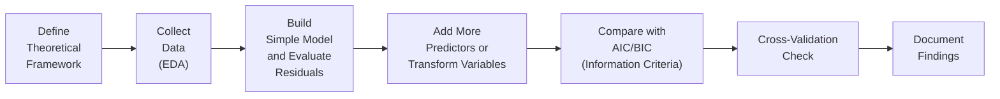

## Why Model Misspecification Matters

The stakes are high for any quantitative analyst. A well-structured model can help you estimate returns, gauge risk exposures, and guide investment decisions with confidence. But if your model is misspecified—whether through omitted variables, incorrect functional forms, or ignoring underlying assumptions—your conclusions might be misleading. In the high-pressure environment of the CFA® Level II exam, or in real-world portfolio management, guesswork and shortcuts can lead to big headaches down the line.

I remember one time, back when I was working on a simple market behavior study, I left out a known macroeconomic variable (inflation surprises) just because I thought it wouldn’t matter. Guess what? My regression residuals practically screamed at me to pay attention. After weeks of confusing results and strange patterns, it turned out that a structural break related to unexpected inflation was driving half the variability in my data. So yeah, ignoring the fundamentals can come back to bite you.

Below are practical steps you can follow to avoid similar pitfalls in your own modeling (and to help you ace those tricky exam vignettes).

## Start with a Theoretical or Conceptual Framework

A solid foundation begins with a clear understanding of the financial relationships you’re trying to capture. Before you run any fancy regressions, make sure you can explain why variable X should affect variable Y based on recognized theories or well-documented empirical evidence.

• Leverage Domain Knowledge: If your goal is to forecast stock returns, consider which macro, industry, or firm-specific factors are known to drive those returns. For instance, interest rates, GDP growth rates, or a company’s earnings surprises might be core components.  
• Recognize Economic Intuition: Financial theory might tell you that higher market volatility often leads to larger risk premiums. If that’s relevant to your investment thesis, incorporate it.  
• Align with Real Data: Once you’ve identified plausible variables, ensure that data is both available and of reasonable quality.

Anchoring your approach in established principles helps you focus on factors that truly matter. And in the exam context, if a vignette discusses bond yields, inflation rates, and economic growth, don’t just pick them arbitrarily—link these variables to the logic of how bond pricing actually works.

## Data Exploration

Data is your model’s fuel, so do not take it for granted. Exploratory Data Analysis (EDA) can help you uncover landmines—outliers, patterns, or anomalies—that might sabotage your results if left unaddressed.

• Plot Everything: Scatter plots, box plots, correlation heatmaps, and time-series plots are your first line of defense. They help visualize potential relationships and catch any glaring irregularities.  
• Uncover Outliers and Missing Data: Outliers, especially in financial contexts, can be game-changers. Maybe a single day’s massive drop in the market is skewing your entire dataset. Decide whether to remove, winsorize, or investigate it further.  
• Residual Investigations: Even at this early stage, a quick “test run” regression can reveal suspicious patterns in residuals (e.g., cyclical patterns that might indicate seasonality or omitted variables).

Think of EDA as your detective work before the official business of modeling begins. It’s much easier to fix a problem at the beginning than to chase weird residual plots later.

## Iterative Modeling and Diagnostics

Honestly, building a well-specified model can feel like having a conversation with your data—start small, and let the results guide you incrementally.

• Start Simple: A small, bare-bones model might only have one or two predictor variables. Check the regression diagnostics: are the residuals random (i.e., no clear patterns), normally distributed, and independent?  
• Add Complexity Slowly: Gradually introduce additional variables or transformations. Monitor how these changes affect your residuals, R-squared, and other diagnostic measures. This ongoing feedback loop helps you recognize—and fix—problems as they arise.  
• Watch Out for Nonlinearities: If your data suggests a possible curvature in relationships, a polynomial term or log-transform might be warranted. Also be mindful of interactions between variables (e.g., interest rate changes having a different effect depending on credit rating).

Below is a simple visual diagram illustrating how you might structure this iterative modeling process:



Notice how after each step, you circle back to evaluate whether you’ve introduced any new patterns in the residuals or other forms of misspecification. That cyclical approach is the essence of iterative modeling.

## Use of Diagnostic Tools

Your best allies in the quest to avoid misspecification are diagnostic checks. The CFA® exam loves to test your familiarity with these techniques, so it’s worth mastering them.

• Residual Analysis:  
  - Plot residuals vs. fitted values. If you see any structure (like a funnel shape or wave-like pattern), that’s a sign something’s off—heteroskedasticity, autocorrelation, or missing variables might be at play.  
  - Check normality, perhaps through a histogram or Q-Q plot, ensuring that residuals approach a bell-curve shape.  
  - Residual = \\( e_i = y_i - \hat{y}_i \\). The closer these are to zero and random, the happier your model will be.

• Information Criteria (AIC, BIC):  
  - Akaike Information Criterion (AIC) and Bayesian Information Criterion (BIC) help you balance model fit against complexity. In short:  
    - \\( \text{AIC} = -2\ln(\mathcal{L}) + 2k \\)  
    - \\( \text{BIC} = -2\ln(\mathcal{L}) + k \ln(n) \\)  
    where \\( \mathcal{L} \\) is the likelihood, \\( k \\) is the number of parameters, and \\( n \\) is the sample size. The model with the lowest AIC or BIC is generally preferred.  
  - BIC penalizes complexity more harshly than AIC, which can be useful when you have a smaller sample or want to avoid overfitting.

• Cross-Validation:  
  - Splitting your dataset into training and testing sets (or using k-fold cross-validation) checks how well the model generalizes. If a model has great in-sample performance but flops on new data, it might be overfitted or missing robust explanatory power.

Here’s a quick Python snippet illustrating how to run a k-fold cross-validation on a linear model. This is not super complicated, but it demonstrates how you might implement one important diagnostic check:

```python
import numpy as np
import pandas as pd
from sklearn.linear_model import LinearRegression
from sklearn.model_selection import KFold, cross_val_score

X = df[['X1', 'X2']]
y = df['Y']

model = LinearRegression()
cv = KFold(n_splits=5, shuffle=True, random_state=42)

scores = cross_val_score(model, X, y, cv=cv, scoring='neg_mean_squared_error')
rmse_scores = np.sqrt(-scores)

print("Cross-Validation RMSE scores:", rmse_scores)
print("Average RMSE:", rmse_scores.mean())
```

In an exam scenario, you likely won’t be asked to produce code, but you might see a vignette describing a cross-validation approach or a result from a statistical software output. Recognizing how these scores reflect model performance can be a major advantage.

## Documentation and Justification

If you’ve ever tried to replicate an old model (yours or someone else’s) without proper documentation, you can empathize with the confusion that ensues. Good documentation is not just an administrative chore—it’s an integral part of long-term model health and validity.

• Rationale for Each Variable: Keep a record explaining why each variable was included, referencing theoretical backing or empirical evidence.  
• Record of Transformations: If you used logs, differencing, or polynomials, detail why. Maybe the data distribution improved or the functional relationship demanded it.  
• Structural Break Awareness: When markets shift (like in 2008 or 2020), be prepared to justify model changes or disclaimers. Mark these breakpoints and consider separate models if necessary.

On the exam, clarity in your reasoning can translate to points. If a question asks, “Why did the analyst transform variable X?” providing a straightforward, theory-aligned explanation demonstrates both technical competence and a real-world mindset.

## Glossary

Exploratory Data Analysis (EDA)  
Initial investigation of data to discover patterns, spot anomalies, and check assumptions.  

Residual Analysis  
Study of fitted model errors to assess any departures from model assumptions (e.g., nonlinearity, autocorrelation).  

Akaike Information Criterion (AIC)  
A model selection metric that penalizes model complexity less stringently.  

Bayesian Information Criterion (BIC)  
Similar to AIC but imposes a stronger penalty for additional parameters.  

Cross-Validation  
Method that splits data into multiple subsets to test a model’s predictive power, helping prevent overfitting.  

Structural Break  
A sudden and lasting change in the relationship between variables, often due to regime shifts or market events.

## References

• CFA Institute Learning Ecosystem – Practice item sets and diagnostic checks  
• Montgomery, D. C., Peck, E. A., & Vining, G. G. Introduction to Linear Regression Analysis  
• Chatfield, C. The Analysis of Time Series: An Introduction  
• (Optional) Tsay, R. Analysis of Financial Time Series – For those who want deeper coverage of structural breaks  

In real-world or exam item sets, watch for explicit mentions of omitted variables, suspiciously patterned residuals, or abrupt market shifts. These are prime signals that a question is testing your knowledge of misspecification. A methodical approach—rooted in sound theory, thorough data exploration, iterative building, robust diagnostics, and proper documentation—will help you both avoid model misspecification and provide a clearer, more dependable analysis.

## Test Your Knowledge: Practical Steps to Avoid Misspecification Quiz



### Which of the following best describes the purpose of using Exploratory Data Analysis (EDA) in model building?

- [ ] To remove all statistically insignificant variables automatically.
- [x] To identify anomalies, outliers, and suspicious patterns before formal modeling.
- [ ] To compute standard errors for regression coefficients.
- [ ] To replace the need for residual analysis by visual inspection alone.

> **Explanation:** EDA is primarily aimed at uncovering data issues—such as outliers, rugged distributions, or potential missing data. It doesn’t automatically remove insignificant variables.

### What is a key advantage of starting with a simple, few-variable model rather than a complex one?

- [x] It helps detect potential model defects early by analyzing simple residual patterns.
- [ ] It guarantees higher R-squared values from the start.
- [ ] It completely removes autocorrelation issues.
- [ ] It eliminates the need for iterative modeling.

> **Explanation:** Beginning with a simple framework allows you to identify glaring flaws quickly, making it easier to debug potential misspecification before adding more layers of complexity.

### When comparing multiple regression models, a lower Akaike Information Criterion (AIC) typically indicates:

- [x] A model that strikes a better balance between goodness-of-fit and complexity.
- [ ] A model that definitely includes all relevant variables.
- [ ] The necessity to remove intercept terms.
- [ ] A guaranteed improvement in interpretability.

> **Explanation:** A lower AIC is usually preferred because it signifies an improved fit without overly complicating the model.

### In cross-validation, if a model exhibits strong performance on the training set but poor performance on the validation set, it suggests:

- [ ] That the selected variables align perfectly with theory and data.
- [ ] There must be an issue with the data collection process.
- [x] Overfitting, meaning the model fails to generalize well.
- [ ] The model has omitted variables that strongly affect out-of-sample data.

> **Explanation:** A model that performs well in-sample but poorly out-of-sample is likely overfitted to the training data.

### Which of the following issues might be caused by omitting a key variable that is economically meaningful?

- [x] Biased estimates of other regression coefficients.
- [ ] Lower R-squared values but no effect on coefficient bias.
- [x] Inaccurate interpretation of relationships and significance.
- [ ] Improvement in the BIC metric.

> **Explanation:** Omitting a relevant variable can lead to biased coefficients and distort your understanding of the system. This can also degrade metrics like AIC/BIC.

### What type of pattern in a residual plot might indicate heteroskedasticity?

- [x] A “fan-shaped” pattern where residuals grow larger in absolute value with fitted values.
- [ ] Residual points clustering in a straight horizontal line.
- [ ] Random scatter of points around zero.
- [ ] Perfect correlation between residuals and the predicted variable.

> **Explanation:** A funnel or fan pattern, where variability increases with fitted values, strongly suggests heteroskedasticity.

### How does the Bayesian Information Criterion (BIC) differ from the Akaike Information Criterion (AIC)?

- [x] BIC imposes a stronger penalty for additional parameters compared to AIC.
- [ ] AIC cannot be used in models with more than five variables.
- [x] BIC is unaffected by sample size, whereas AIC depends heavily on it.
- [ ] AIC is only for linear regression, while BIC is for logistic regression.

> **Explanation:** BIC penalizes complexity more heavily than AIC, particularly for larger sample sizes. This typically leads to more conservative model selections.

### Why is documenting your modeling process crucial, particularly in a professional setting?

- [x] It makes it easier to replicate results and justify modeling choices.
- [ ] It automatically corrects your omitted variable bias.
- [ ] It eliminates structural breaks altogether.
- [ ] It removes the need for cross-validation.

> **Explanation:** Thorough documentation ensures clarity, facilitates replication, and allows you to explain why certain decisions were made—even as market conditions evolve.

### If your residuals show an obvious cyclical pattern that corresponds with monthly data, which step would you most likely take?

- [x] Include seasonal dummy variables or transformations to capture seasonality.
- [ ] Remove the intercept term from the regression model.
- [ ] Increase the significance level for hypothesis testing.
- [ ] Perform a log transform of every variable.

> **Explanation:** A cyclical pattern in residuals may indicate seasonality, so incorporating seasonality adjustments (like monthly dummies) is a common corrective approach.

### True or False: A lower AIC always guarantees that the chosen model is the best possible specification for predictive accuracy.

- [x] True
- [ ] False

> **Explanation:** This statement is actually false in a strict sense because “predictive accuracy” can also be influenced by factors not captured in the model. However, picking the model with the lowest AIC is a generally accepted approach for balancing fit and complexity. In practice, you often evaluate multiple model criteria (BIC, cross-validation) to confirm.




