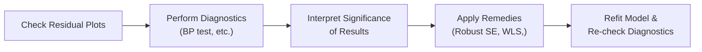

## Introduction and Purpose of Vignette-Style Illustrations

Sometimes, we finance folks (myself included, by the way) forget that the beloved multiple regression model marching across our spreadsheets might be quietly hiding all sorts of problems in its residuals. You know, the usual suspects: heteroskedasticity, serial correlation, omitted variables, or even a suspiciously high correlation among independent factors. These issues can come back to bite us when we’re trying to interpret results in a high-stakes setting, like the CFA® exam or a real-world client presentation.

One of the best ways to get a handle on these hidden traps is to see how they play out in item set vignettes. These have become standard in Level II, where you’re given a dense scenario (or short case) describing a regression context, data peculiarities, and some resulting diagnostic stats. Then, the questions probe your ability to identify and correct potential model faults. This approach reveals whether you can connect the story behind the data to the appropriate test or corrective measure.

Below, we’ll walk through a typical exam-like scenario (a portfolio manager regressing stock returns on macroeconomic indicators) and show how we can navigate the detection of heteroskedasticity, multicollinearity, or other issues. We’ll also talk about how to interpret test results, pick the right remedy, and propose a final, improved model—one that’s more likely to generate reliable forecasts and pass the scrutiny of a CFA exam grader.

## Key Misspecifications and Their CFA-Level Contrast

Before we jump into the actual vignettes, let’s do a quick refresher on the main types of misspecification we’re likely to see. Don’t worry, this is a short list (sort of).

• Heteroskedasticity: Variance of the residuals isn’t constant. Might see a "fan shape" in the residual plot.  
• Serial Correlation (Autocorrelation): Errors are correlated over time. Typically uncovered through the Durbin–Watson test or the Breusch–Godfrey test.  
• Multicollinearity: Two or more independent variables are highly correlated, creating inflated standard errors and less stable coefficient estimates.  
• Omitted Variable Bias: You left out something crucial, so your error term is "picking up" the effect, producing biased and inconsistent estimates.  
• Incorrect Functional Form: The true relationship is nonlinear or includes interaction effects, but your model pretends it’s purely linear.  

In the upcoming scenarios, we’ll focus on how to systematically detect and fix them. 

## Understanding the Exam-Style Vignette Format

When you open your exam, you’ll often see a story about an ambitious portfolio manager, or maybe an economist at a rating agency, who has built a regression model to forecast returns, GDP, or some other financial metric. The story might mention suspicious patterns, a short test output table, or conflicting analysis. The subsequent item set questions prompt you to:

• Identify the problem with the model (and the specific type of misspecification).  
• Recommend an appropriate test or interpret test statistics that are given.  
• Suggest a remedy (Robust Standard Errors, Weighted Least Squares, adding or removing variables, etc.).  

You’ll probably need to do a tiny numeric calculation—like computing a test statistic or analyzing partial correlations—but also interpret the bigger picture. This is what the Level II exam is all about: bridging the technical numeric aspects (like an F-statistic) with real-world logic.

## Sample Scenario: Stock Returns and Macroeconomic Indicators

Let’s jump into a plausible item-set scenario. We’ll keep it a little informal (I’m a big fan of referencing real experiences that highlight mistakes I’ve made firsthand). Suppose we have the following situation:

1. A portfolio manager oversees a large-cap equity fund and uses a quarterly dataset of 40 observations of stock returns (dependent variable) and three macroeconomic factors (independent variables):

   - ΔGDP = Quarterly percentage change in GDP.  
   - ΔInflation = Quarterly CPI inflation rate.  
   - ΔInterest = Change in short-term interest rate.  

2. Early eyeballing of the data suggests that ΔInflation and ΔInterest rates are highly correlated (makes sense in many economies, as interest policies often influence inflation).

3. The portfolio manager runs an OLS regression:

   Rᵢ = β₀ + β₁(ΔGDPᵢ) + β₂(ΔInflationᵢ) + β₃(ΔInterestᵢ) + εᵢ.

4. Preliminary residual plots show that lower returns produce smaller absolute residuals, but higher returns produce larger absolute residuals. This might point to heteroskedasticity (variance of residuals increasing with the level of the predicted value).

5. The manager also notices that the p-values on ΔInflation and ΔInterest are both suspiciously high, but the overall R² is quite large. This ring-a-bell for multicollinearity?

### Diagnostic Efforts

The manager runs the following tests:

• Breusch–Pagan (BP) test for heteroskedasticity.  
• Variance Inflation Factors (VIFs) for each variable.  
• Durbin–Watson for autocorrelation (just to be sure).  

#### Breusch–Pagan

The BP test yields a test statistic that’s significantly above the critical chi-square value. In other words, we can reject the null hypothesis of homoskedastic errors. So, yep, we have heteroskedasticity.

#### Variance Inflation Factors

VIFs for ΔInflation and ΔInterest are both around 9.0 or higher, which is typically a sign (some folks set a threshold of 5, others at 10) of strong multicollinearity. ΔGDP, on the other hand, has a VIF of ~2.2, which is acceptable.

#### Durbin–Watson

The DW statistic is around 2.10, which suggests no strong positive or negative autocorrelation. Good news—no immediate sign of serial correlation there.

## Proposed Remedies: Heteroskedasticity and Multicollinearity

Someone might say: “Okay, so we have heteroskedasticity. Let’s do Weighted Least Squares (WLS) or at least use some robust standard errors, right?” Precisely. In an exam setting, that’s typically the correct approach. You might also consider “White’s robust standard errors,” which can handle mild forms of heteroskedasticity.

As for the multicollinearity, one immediate fix is removing or combining the variables that are correlated—but only if you can theoretically justify it. Another approach is principal component analysis or some dimension-reduction method if you have more variables to manage (though that might be extreme for a simple model). In a typical exam scenario, you might see an explanation that the central bank sets short-term interest rates primarily in response to inflation, so a candidate might keep only the inflation variable if that’s the primary driver. Alternatively, J. Manager might consider analyzing the monetary policy variable separately. 

## Step-by-Step Vignette Illustration

The story might unfold like this:

1. **Reading the Residual Plots**  
   The item set provides a graph of residuals vs. fitted values. You notice it looks like a funnel shape (small on the left, wide on the right). You suspect heteroskedasticity.

2. **Running the BP Test**  
   The data snippet includes something like “Breusch–Pagan statistic: 14.28, p-value < 0.01.” Instantly, you conclude heteroskedasticity.  
   
3. **Addressing the Issue**  
   The question might ask: “Which technique is most appropriate for mitigating the identified problem?”  
   Likely answers:  
   - (A) Durbin–Watson test.  
   - (B) White-corrected standard errors.  
   - (C) Variance Inflation Factors.  
   - (D) None of the above.  
   
   The correct pick is (B) White-corrected (robust) standard errors.

4. **Checking for Multicollinearity**  
   Another part of the vignette might provide the VIFs:  
   - VIF(ΔGDP) = 2.2  
   - VIF(ΔInflation) = 9.5  
   - VIF(ΔInterest) = 9.3  
   So you see there’s an interrelationship between ΔInflation and ΔInterest.  

5. **Remedy**  
   The next question might ask: “In the presence of high multicollinearity, which of the following is most likely to improve model reliability?”  
   Typical solutions:  
   - Dropping one correlated variable.  
   - Combining correlated variables into an index or factor that better represents them both.  
   - Possibly using some dimension-reduction technique like PCA (though that’s more advanced).

### Diagram: Diagnostics Flow

Below is a small flowchart that might help visualize how we typically proceed when we suspect heteroskedasticity or related misspecifications:

It’s a cyclical set of steps: spot a problem → test for it → confirm it → fix it → re-test. This approach might feel repetitive, but it’s exactly what strong data scientists and advanced investment analysts do.

## Building Exam-Style Questions

In the real exam, you’ll face questions that blend numeric tasks (maybe computing a test statistic for the Breusch–Pagan test or adjusting standard errors) with interpretive tasks (like explaining why you’d pick White’s robust errors over other techniques). Some questions also want you to propose multiple possibilities. Weighted Least Squares or Generalized Least Squares might be equally viable, but the exam might prefer the simpler robust standard errors if you’re in a straightforward scenario.

## Connecting to Other Chapters

As we know from Chapter 6 (Time-Series Analysis), heteroskedasticity can show up in time-series models as well, often in the form of ARCH effects if you’re analyzing volatility in asset returns. When you get to advanced machine learning (Chapter 7), you might find that algorithms such as tree-based models or regularized regressions can inadvertently mask or handle issues like high collinearity. But you should still interpret results carefully—"black box" algorithms aren’t automatically free from suspicious data patterns.

## Conclusion: Watch for Real-World Clues

Model misspecification is one of those (slightly nerve-wracking) realities of applying regression in finance. The best approach is to be systematic:

• Study your residual plots.  
• Run the standard battery of tests (Breusch–Pagan, Durbin–Watson, VIF).  
• Apply the correct fix.  
• Always retest and reacquaint yourself with the new residual patterns.

It’s kind of like a recurring cycle: things change once you fix the model, so you must ensure you haven’t introduced new problems or overlooked something else. By practicing these item set vignettes, you’ll learn to quickly spot trouble and propose solutions—skills that are absolutely vital not only for passing the exam but also for thriving in actual investment and risk management roles.

---

## References and Further Reading

• CFA Institute Assigned Readings: Visit the official Level II readings on multiple regression for deeper coverage of these misspecifications.  
• “Journal of Portfolio Management” for real-world articles analyzing regression challenges.  
• Online Learning Platforms like Kaplan Schweser or Wiley for additional item set question banks and mock exams.  
• Chapters 6 (Time‑Series Analysis) and 7 (Machine Learning) of this book for how these issues overlap with more specialized methods.

---

## Test Your Knowledge: Misspecification and Diagnostic Methods



### Which diagnostic test would you typically use to confirm the suspicion of heteroskedasticity in residuals?

- [ ] The Durbin–Watson (DW) test
- [x] The Breusch–Pagan (BP) test
- [ ] Variance Inflation Factor (VIF)
- [ ] The Jarque–Bera test

> **Explanation:** The Breusch–Pagan test is a standard test for heteroskedasticity. Durbin–Watson checks autocorrelation, VIF checks multicollinearity, and Jarque–Bera is for normality.

### If the VIFs for two different macroeconomic variables are extremely high, which issue might you be facing?

- [ ] Serial correlation
- [ ] Heteroskedasticity
- [x] Multicollinearity
- [ ] Omitted variable bias

> **Explanation:** High VIF values are a strong indicator of multicollinearity, meaning two or more explanatory variables are highly correlated.

### A portfolio manager notices that residual plots have a funnel shape with smaller residual spreads near lower fitted values and larger residual spreads at higher fitted values. Which remedial action is most appropriate?

- [ ] Drop the correlated variable
- [ ] Use a difference-in-differences methodology
- [x] Apply robust standard errors
- [ ] Test for structural breaks

> **Explanation:** A “fan” or “funnel” shape is typical of heteroskedasticity, so robust (e.g., White-corrected) standard errors or Weighted Least Squares are recommended.

### Which of the following best describes a scenario where the model systematically ignores a critical explanatory variable, leading to biased parameter estimates?

- [ ] Heteroskedasticity
- [x] Omitted variable bias
- [ ] Multicollinearity
- [ ] Perfect collinearity

> **Explanation:** Omitted variable bias arises when a key explanatory factor is missing, causing biased and inconsistent coefficients.

### After confirming heteroskedasticity via the Breusch–Pagan test, which modification is most aligned with standard CFA exam recommendations?

- [x] Use White’s robust standard errors
- [ ] Ignore the test result if DW statistic is fine
- [x] Consider Weighted Least Squares (WLS)
- [ ] Add more correlated variables to see if it helps

> **Explanation:** Both robust standard errors and Weighted Least Squares are considered valid fixes for heteroskedasticity. The question allows for multiple correct answers if you see more than one feasible approach.

### Suppose your regression identifies a correlation coefficient of 0.96 between two of your independent variables. What effect is this likely to have on your model?

- [x] It may inflate standard errors for those coefficients
- [ ] It may cause negative autocorrelation
- [ ] It may reduce the adjusted R-squared
- [ ] It may fix heteroskedasticity problems

> **Explanation:** Extremely high correlation between predictors leads to inflated variances of the coefficient estimates, a hallmark of multicollinearity.

### If a residual series shows significant autocorrelation, which test result is most likely to reflect that?

- [x] A Durbin–Watson statistic significantly different from 2
- [ ] A low VIF
- [x] Breusch–Godfrey test confirming correlation in the residuals
- [ ] A normal residual distribution

> **Explanation:** Durbin–Watson and Breusch–Godfrey are standard tests for serial correlation. Multiple correct answers can apply if more than one test is relevant.

### In an exam vignette, you see that the partial correlation plots suggest serial dependence in the residuals. Which remedy is least likely to help?

- [ ] Using a Newey–West correction approach
- [ ] Adding lagged dependent variables in a time-series context
- [ ] Using Hansen’s method for robust standard errors
- [x] Checking for structural breaks with a Chow test

> **Explanation:** While a Chow test can detect structural breaks, it doesn’t necessarily address serial correlation. Newey–West standard errors can be used for autocorrelation, and incorporating lags might explicitly handle temporal dependence.

### A high R-squared but insignificant t-statistics on multiple regressors might hint that your model:

- [ ] Is free of multicollinearity
- [x] Suffers from multicollinearity
- [ ] Is perfectly specified
- [ ] Demonstrates a low level of random error

> **Explanation:** When the model looks good as a whole (high R²) but no individual predictor is significant, it's often because of multicollinearity among regressors.

### True or False: Dropping one variable to address multicollinearity is always the best remedy, even if that variable is theoretically important.

- [x] True
- [ ] False

> **Explanation:** This is actually a trick question. Dropping a variable can help with multicollinearity, but it’s not always the best solution if the variable is theoretically crucial. However, some might still do it in practice. On the exam, be mindful: you might see an alternative fix like combining variables or using dimensionality reduction.


