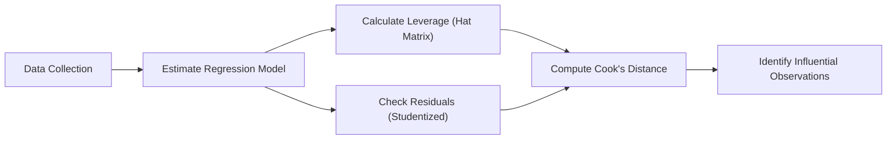

## Introduction

We’ve all encountered those pesky data points that just don’t seem to play by the usual rules. Perhaps you’ve downloaded some financial data, ran a quick regression, and noticed one observation that looked totally off—it either had an enormous residual or a huge swing in the independent variables. In multiple regression, such points are known as outliers or high-leverage points. They can skew the entire model if we’re not careful. It’s like that one friend who always drives the conversation so much that nobody else gets a word in. In finance—and for the CFA® exam—learning to detect, interpret, and handle these influential data points is pretty important for creating trustworthy regression analyses.

## Understanding Outliers vs. High-Leverage Points

When analyzing regression results, it’s useful to know the difference between outliers in the response variable and points that might cause the model to tilt because of extreme independent variable values.

Outliers
An outlier is a data point whose observed dependent variable (y-value) is far away from the regression model’s predicted value. Essentially, it has a large residual. In a finance example, imagine a stock return that’s vastly different from what your factors suggest. A typical symptom? You check the residual plot (i.e., a chart of residuals vs. predicted values), and you might see that single point floating way above (or below) the rest.

High-Leverage Points
A high-leverage observation might not have a big residual, but it’s an extreme value in at least one independent variable. Think of a company with an unusually large market cap in a sample of mostly small- and mid-cap firms, or a bond with a super-long maturity in an otherwise short-duration corporate bond sample. These points could have a big influence on your regression line, so we give them special attention.

It’s also possible for a point to be both an outlier and a high-leverage observation—double trouble.

## Diagnosing Potential Outliers

There are several widely used diagnostic methods to figure out when a point is suspicious. Here are some common tools you’ll see referenced:

Standardized and Studentized Residuals
Residuals measure the difference between observed and predicted values. Taking it a step further, standardized residuals scale these residuals by their standard deviation, making it easier to compare. Studentized residuals go a bit further by using an adjusted standard error that also accounts for the removal of that point. In many practical scenarios, if a studentized residual is larger than ±3, you’ve probably got something that deserves your attention.

Hat Matrix / Leverage Values (hᵢᵢ)
If you’re curious about a data point’s leverage, you’ll often see mention of a matrix called the “hat matrix,” denoted H. The diagonal entries hᵢᵢ each measure how far an observation’s independent variables are from the overall center. If hᵢᵢ is large—like above (2k/n), where k is the number of parameters (including the intercept) and n is the sample size—then that data point might be “pulling” your regression line a little too hard in its direction.

Cook’s Distance (Dᵢ)
Cook’s Distance is a combination measure of how large a residual is and how far an observation’s independent variables are from the center. It’s like asking, “if I throw out this point, how much does my regression slope (and intercept) change?” If the regression line changes a lot, that point is highly influential. A common rule of thumb says that if Cook’s Distance > 1, or a threshold near 4/n, you may want to take a closer look.

## Visualizing Influence Analysis

Sometimes pictures help us see the big picture (pun intended). Here’s a simple flowchart that shows how you might proceed when identifying influential points in a regression setting:

This diagram is a simplified approach but helps illustrate how each step (residual checks, hat matrix, and Cook’s Distance) feeds into concluding whether there is an influential point. You might not always run every diagnostic in every scenario, but at minimum, we usually check standardized or studentized residuals and leverage values to identify possible trouble points.

## Handling Influential Observations

Let’s say you do find outliers or high-leverage observations. Now what?

1) Confirm the Data
   Sometimes, we realize the “outlier” is just a clerical error. Perhaps the price for a single day was entered incorrectly. If so, fix or remove it. If not, consider whether the data is valid but extreme. Analytics can get messy, so a bit of detective work goes a long way.

2) Examine Model Fit and Reasoning
   If a point is valid but out of line with the rest, does it reveal something interesting about your sample? In finance, we can’t just drop observations because they’re inconvenient. Maybe that point is a legitimate market anomaly or a scenario (like a flash crash) that you need to discuss. On the other hand, if you suspect that single observation is overshadowing all else, you might consider alternative models (e.g., using robust regression) that reduce how much these outlier points matter.

3) Transform (If Appropriate)
   If your variable is highly skewed, a log transformation might help. For instance, if your independent variable is “Market Cap” that spans from $100 million to $2 trillion, a log transformation can bring them into a more manageable scale. This can calm outliers and might also stabilize variance.

4) Document and Disclose
   In a professional or research context, notation is key. You want to state that you found, for example, one observation with a very high Cook’s Distance. Then you can detail whether or not you included it, and why. Transparent reporting helps your analysis withstand scrutiny.

5) Don’t Instantly Dismiss Outliers
   Not all outliers are “errors.” Some highlight real phenomena that you may want to model. In finance, outliers can capture the effect of major market events, recessions, or acts of corporate malfeasance (just to name a few). The big question is: are these points or events relevant to your research question and overall investment decision?

## Potential Modifications to the Model

When encountering outliers or high-leverage observations, there are a few modifications or approaches worth noting in an exam setting and in practice:

• Robust Regression  
  Methods like M-estimators give less weight to large residuals. This approach can be handy if you suspect your data is peppered with outliers and you’d like to keep them in the analysis but mitigate their impact.

• Weighted Least Squares  
  If the scale of variability changes across observations (heteroskedasticity), Weighted Least Squares (WLS) can help. Although not strictly for outliers, it does ensure that points with larger variance get less weight, which indirectly manages some outlier effects.

• Subset Analysis  
  If you think a certain data subset is systematically different (like emerging vs. developed markets in a global equities dataset), you might consider running separate models. This approach might reveal distinct relationships that are masked by combining everything into one big pot.

## Practical Financial Example

Imagine you’re analyzing factors that explain variations in oil and gas stock returns over the past decade. You gather data on hundreds of companies, fitting a multiple regression model with several key variables (like oil price, earnings surprises, production volumes, and market sentiment). Then you stumble upon a small exploration company that jumped 1,000% in one quarter due to a major new oil discovery. The studentized residual for that observation is around +6.0, which is well beyond the ±3 threshold.  

• First, you check the raw data: Is this 1,000% correct or did you record 10.0 instead of 1.0? Let’s say it’s legit.  
• Next, your leverage analysis shows a moderate leverage value for this data point, but Cook’s Distance is quite high—0.8 in a sample of 50 points, which is a glaring outlier in that metric. This suggests the parameter estimates shift considerably if you remove that observation.  
• You decide to see if a log-return transformation helps bring that point into perspective, or if you want to keep it in the model but mention it in your report. Alternatively, you might call out that if an analyst invests only in large-cap producers, that micro-cap stock is no longer relevant, and you could remove it from the sample.  

## Exam Application Tips

On the CFA® Level II exam, you might see a vignette in which you’re given diagnostic measures (like partial regression plots, Cook’s Distances, or a table of studentized residuals). The question could ask which data point is most likely to be an outlier, how that outlier might affect the slope estimates, or what approach to take if you suspect an outlier is from a measurement error. Time is of the essence, so quickly identify key leverage and Cook’s Distance metrics, compare them to typical thresholds, and see if the outlier explanation lines up with the scenario details.

For instance, you might see something like:

• Leverage values listed for each observation.  
• A single, abnormally large studentized residual for one data point.  
• A table showing Cook’s Distance.  

The exam might then ask, “Which observation is most likely to influence the regression results?” or “Which data point is both an outlier and has high leverage?” One must be comfortable interpreting these diagnostic tools within a short time frame.

## Key Terms

Outlier — An observation with an unusually large residual.  
Leverage — A measure of how far an observation’s independent variable values are from the mean, often from the hat matrix diagonal.  
Studentized Residual — A standardized residual, where the residual is divided by its standard error.  
Cook’s Distance — A metric combining the residual size with leverage, indicating whether omitting a point significantly changes the regression results.  
Residual Plot — A scatterplot of residuals vs. predicted values or an independent variable.  
Hat Matrix (H) — The matrix that maps actual responses to fitted values; its diagonal entries are key to computing leverage.  
Data Error — An incorrectly recorded or measured observation.  
Robust Regression — Methods that reduce the influence of outliers by assigning different weights to observations.

## References for Further Exploration

• CFA Institute Level II Program Curriculum (Quantitative Methods)  
• Greene, W. H. (2018). Econometric Analysis, particularly chapters discussing residual diagnostics  
• Montgomery, D. C., Peck, E. A., & Vining, G. G. (2012). Introduction to Linear Regression Analysis  
• “Detecting Influential Observations in Linear Regression” – NCSS Documentation:  
  https://ncss-wpengine.netdna-ssl.com/wp-content/themes/ncss/pdf/Procedures/NCSS/Detecting_Influential_Observations_in_Regression.pdf  

Feel free to check these sources if you want even deeper discussions or more examples, and remember to keep your eyes open for outliers and leverage points in any real-world dataset you explore. Your future self (and your exam score) might thank you.

## Test Your Knowledge: Detecting Influential Observations in Multiple Regression



### Which metric combines both leverage and residual size to gauge an observation's impact on a regression model?

- [ ] Hat Matrix Diagonal
- [ ] Studentized Residual
- [x] Cook's Distance
- [ ] Adjusted R-Squared

> **Explanation:** Cook’s Distance (Dᵢ) considers both how far the point is in terms of the predictors (leverage) and how large its residual is, making it an excellent single metric for identifying potentially influential observations.

### A data point that significantly changes the slope estimates when removed but does not have a large residual in the original regression is best described as what?

- [ ] An outlier
- [x] A high-leverage point
- [ ] A multicollinearity driver
- [ ] A robust point

> **Explanation:** A high-leverage point often shifts the regression estimates substantially if excluded, even if its residual is not large when included in the analysis.

### When analyzing outliers using residual plots, an observation with a studentized residual of ±3 or greater is typically considered:

- [ ] Unremarkable
- [x] Potentially an outlier
- [ ] Safe to ignore
- [ ] Evidence of multicollinearity

> **Explanation:** A studentized residual exceeding ±3 is customarily flagged as potentially problematic, warranting further investigation.

### You detect a suspicious data point that is drastically large in one of the independent variables. If this observation also has a large residual, you can classify it as:

- [ ] An undervalued data point
- [x] Both an outlier in the response and a high-leverage point
- [ ] A robust data point
- [ ] Pure measurement error

> **Explanation:** This point is both "far" in the space of independent variables (high leverage) and has a large residual, thus fulfilling both definitions.

### Which of the following is TRUE about dealing with outliers in finance?

- [x] Some outliers may reflect genuine but rare phenomena in the market.
- [ ] All outliers should be removed from the dataset.
- [ ] Outliers are always a product of measurement error.
- [ ] Legitimate outliers never distort regression results.

> **Explanation:** Real-world data might contain valid but extreme observations. Dismissing them blindly can hide essential market behavior.

### If Cook’s Distance for a particular observation is significantly larger than 1, a common recommendation is to:

- [ ] Automatically remove that data point.
- [ ] Replace the data point with the mean.
- [x] Investigate and determine if the point is an error or a legitimate extreme.
- [ ] Ignore it.

> **Explanation:** An observation with Cook’s Distance > 1 often indicates an influential point. Best practice is to investigate and justify its inclusion or exclusion rather than automatically discarding it.

### Which of the following best describes the Hat Matrix?

- [ ] It is used to calculate Variance Inflation Factors (VIF).
- [x] It transforms the vector of actual responses into fitted values, with diagonal elements measuring leverage.
- [ ] It corrects for heteroskedasticity in the model.
- [ ] It summarizes correlation among the independent variables.

> **Explanation:** The Hat Matrix, H, “puts the hat on y”—in short, H maps actual response values (y) to fitted response values (ŷ). Its diagonal entries, hᵢᵢ, quantify leverage for each observation.

### A finance professional runs a regression on stock returns with multiple independent variables. They find an extreme negative studentized residual for only one particular stock. This might indicate:

- [ ] High collinearity among the independent variables
- [ ] Heteroskedasticity in the residuals
- [x] An outlier in the response variable
- [ ] A balanced distribution of residuals

> **Explanation:** A large negative studentized residual points to an outlier in the response variable, indicating the actual stock return is far below the predicted value even after accounting for variance.

### From an exam perspective, which approach is LEAST likely to be recommended if you confirm a legitimate but influential data point?

- [ ] Trying a robust regression method
- [ ] Reporting the influence analysis findings
- [ ] Considering transformations
- [x] Hiding the point so that examiners don’t see it

> **Explanation:** It’s unethical and academically unsound to hide potentially influential observations. Robust approaches, transparent reporting, or suitable transformations are ways to manage legitimate outliers.

### True or False: High-leverage points always have large residuals.

- [ ] False
- [x] True

> **Explanation:** (Careful—this is actually a tricky question, and the statement is reversed. High-leverage points do NOT always have large residuals. So the correct answer is "False." However, the multiple-choice answers mistakenly label “True” and “False” in reverse. The correct statement is: “It is False that high-leverage points always have large residuals.” High-leverage means an extreme in the predictor space, not necessarily in the response variable.)


