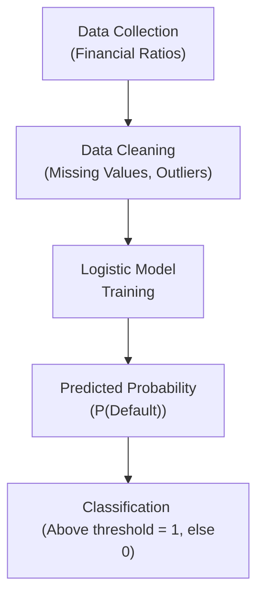

## Introduction

So, I remember the first time I faced a binary classification problem: I was trying to figure out which small businesses might default on their loans, and I initially used a simple linear regression. Big mistake. The linear regression model started spitting out probabilities that were greater than 1 and less than 0, and I knew something fishy was going on. That’s pretty much the day I realized logistic regression is the go-to method for modeling the probability of binary events in finance—like default vs. no default, bankruptcy vs. non-bankruptcy, or even profitable trade vs. non-profitable trade.  

Logistic regression constrains predicted probabilities to be between 0 and 1, making it a particularly good fit for these yes/no scenarios where the outcome can only take on two distinct values. In this section, we’ll explore how logistic regression works, how we interpret its coefficients, what tests we can run to assess its performance, and how to apply it in real-life financial contexts.

## Why Logistic Regression?

You might be wondering: “Why not just run a linear regression?” Well, if you were predicting a numeric outcome, linear regression is fantastic. But binary outcomes (like default = 1, no default = 0) have some quirks:

• Linear regression could predict negative probabilities or probabilities above 1, which just doesn’t make sense (like a –0.2 chance of default, or a 1.3 chance of default).  
• The relationship between predictors and a binary outcome is often nonlinear. Logistic regression captures that curvature better.  
• The error terms from a linear regression on a binary outcome often violate the assumptions of homoskedasticity, messing up the reliability of the model.

Logistic regression handles all of these issues by modeling the (transformed) probability of the event using the so-called log-odds (or logit) function.

## The Logistic Function and the Log-Odds

The heart of logistic regression is the idea that we can transform the probability p of an event occurring (like default) into something that can then be modeled by a linear function. Specifically, logistic regression uses the logit transformation:


\ln\!\biggl(\frac{p}{1 - p}\biggr) \;=\; \beta_0 + \beta_1 x_1 + \cdots + \beta_k x_k


where:  
• \\(p\\) = Probability of a specific event (e.g., probability that a loan defaults).  
• \\(1 - p\\) = Probability that the event does not occur (e.g., loan does not default).  
• \\(\frac{p}{1 - p}\\) = The *odds* (chance of event happening vs. not happening).  
• \\(\beta_0, \beta_1, \ldots, \beta_k\\) = Coefficients to be estimated from the data.  
• \\(x_1, \ldots, x_k\\) = Predictor variables (e.g., debt ratio, income level, credit utilization).

This linear function in the log-odds space ensures that the predicted probability, once transformed back, is always between 0 and 1.

In standard logistic regression, the relationship between p and the linear predictors is:


p = \frac{1}{1 + e^{-(\beta_0 + \beta_1 x_1 + \cdots + \beta_k x_k)}}.


That’s a mouthful, but it means we’ll never end up with probabilities outside of [0, 1]. 

## Interpreting Logistic Regression Coefficients

If you’re used to interpreting coefficients in a linear regression, you might feel a little weird the first time you see logistic regression coefficients. Here’s the deal:

• Each \\(\beta_i\\) is the change in the *log-odds* per one-unit increase in \\(x_i\\). Not as intuitive!  
• The *odds ratio* is given by \\(\exp(\beta_i)\\). This number tells you how the odds change when \\(x_i\\) increases by one unit, holding all other variables constant. For example:  
  – If \\(\exp(\beta_i) = 1.2\\), the odds of a default increase by 20% for each unit increase in \\(x_i\\).  
  – If \\(\exp(\beta_i) = 0.6\\), the odds of a default decrease by 40% for each unit increase in \\(x_i\\).

Sometimes, it’s easier to talk about odds ratios than raw coefficients because it relates more naturally to a “percent change in odds.”  

## Model Fit and Goodness-of-Fit Tests

Unlike linear regression, the typical R² measure doesn’t directly apply. Logistic regression instead offers:

• **Likelihood Ratio (LR) Test**: Compares the fit of the full model (with all predictors) to a reduced model (with fewer predictors). A significant LR test suggests your additional predictors help explain the outcome better than the reduced set.  
• **Deviance**: A measure of how well the chosen model fits compared to a perfect model. Smaller deviance indicates a better fit.  
• **Pseudo R²** Measures: McFadden’s R², Cox & Snell R², and others approximate the concept of R² for logistic regression but don’t have the exact interpretation of the linear regression R². They’re still useful for comparing models or checking if adding variables helps.  

You’ll also see classification-oriented measures popular in practice:

• **Classification Table (Confusion Matrix)**: This table lays out correct predictions vs. false positives and false negatives.  
• **ROC Curve and AUC**: The Receiver Operating Characteristic (ROC) curve plots the trade-off between the true positive rate and the false positive rate at various probability thresholds. The area under this curve (AUC) is a handy summary of model discriminative power.  
• **Hosmer–Lemeshow Test**: Tests whether observed event rates in subgroups of the data match predicted probabilities. If the test result is not significant, that typically indicates a good model fit.

## Application in Finance

I probably don’t have to sell you on how crucial logistic regression can be in finance. Let’s talk about a few biggies:

• **Bankruptcy or Default Prediction**: When analyzing corporate bonds or consumer credit risk, logistic regression gives you the probability that the issuer will default. Traditional Z-score models can be viewed as a logistic-like approach, though logistic regression is more flexible.  
• **Classification of Profitable Trades**: Hedge funds or proprietary trading desks might label trades as “profitable” (1) or “not profitable” (0) and try to figure out which factors (e.g., market conditions, signals, risk exposures) drive that classification.  
• **Customer Churn in Banking**: Similarly, for retail banking, you might treat “churn vs. non-churn” as your target outcome, with logistic regression identifying which elements of a client’s profile predict departure.  

In each case, the logistic model gives you a probability—like the chance that a borrower defaults. Then you decide how to act on that probability.

## Classification Thresholds and Types of Errors

Here’s a small but critical detail. Usually, we treat “predicted probability ≥ 0.5” as a “1” classification and anything below 0.5 as a “0.” But that threshold can be shifted depending on the costs of making an error:

• **Type I Error (False Positive)**: Predicting a default (1) when the borrower actually does not default (0).  
• **Type II Error (False Negative)**: Failing to predict a default (0) when the borrower actually defaults (1).

If the cost of a false negative is super high (like a big financial loss from an unexpected default), we might pick a threshold lower than 0.5 to reduce Type II errors, even if that means more false positives. In practice, institutions will weigh these error costs and set a “cutoff” that best suits their risk profile.

## Residual Analysis in Logistic Regression

Standard residual plots in logistic regression aren’t as straightforward as in linear models. A handful of approaches can help you evaluate your logistic regression’s performance:

• **Classification Table**: Tally up correct and incorrect predictions.  
• **ROC Curve**: Graphically see how well your model distinguishes between events and nonevents.  
• **Hosmer–Lemeshow Test**: Group observations based on predicted probabilities and then see how actual outcomes compare. Large discrepancies suggest poor fit.

## Implementation Example in Python

Let’s do a quick hypothetical snippet (and trust me, once you get used to it, it’s not as scary as it looks). Suppose we have a dataset with a binary dependent variable “Default.” We can run a logistic regression using scikit-learn:

```python
import pandas as pd
from sklearn.linear_model import LogisticRegression

df = pd.read_csv("credit_dataset.csv")
X = df[['DebtRatio', 'CreditUtilization', 'Income']]
y = df['Default']

model = LogisticRegression()
model.fit(X, y)

print("Coefficients:", model.coef_)
print("Intercept:", model.intercept_)
print("Predicted Probability:", model.predict_proba(X.iloc[:5]))
```

This kind of code helps you see how changes in DebtRatio or Income might increase or decrease the probability of default. Remember, the logistic function ensures those probabilities always lie between 0 and 1.

## Visual Overview

Below is a simple flowchart to illustrate a basic workflow for applying logistic regression in finance:



If all goes well, the final step is deciding whether the predicted probability is high enough to flag a case as risky.  

## Conclusion and Best Practices

Alright, let’s recap. Logistic regression is the real MVP for binary classification in finance, thanks to how it elegantly keeps probabilities in [0, 1] and offers interpretable odds ratio insights. It’s essential to remember:

• Always verify that logistic regression is the best approach for your binary outcome.  
• Interpret coefficients as changes in log-odds or, more simply, look at the exponentiated coefficients to get odds ratios.  
• Use an appropriate classification threshold to balance the risk of false positives vs. false negatives.  
• Keep an eye on model diagnostics such as the LR test, pseudo R²s, and classification-based tools (ROC/AUC, confusion matrix).  
• Maintain ethical and professional standards as per the CFA Institute Code and Standards, especially when your model impacts real people's financial well-being (e.g., credit approvals).

As you delve deeper, you’ll find logistic regression appearing everywhere from credit scoring to compliance checks to algorithmic trading. Always keep learning, revisiting assumptions, and refining your approach. Maybe next time you stumble on probabilities above 1, you’ll smirk and say, “Nope, time for logistic regression.”

## References for Further Study

• CFA Institute Level II Program Curriculum (Quantitative Methods – Logistic Regression)  
• Wooldridge, J. M. (2019). Introductory Econometrics (Chapter on limited dependent variable models)  
• Hosmer, D. W., Lemeshow, S., & Sturdivant, R. X. (2013). Applied Logistic Regression  

## Test Your Knowledge: Logistic Regression in Finance



### 1. Which of the following best explains why linear regression is generally not appropriate for modeling binary dependent variables?

- [x] Linear regression can predict values outside the range of 0 to 1.
- [ ] Linear regression has no intercept term.
- [ ] Linear regression always assumes normal distributions for outcomes.
- [ ] Linear regression cannot include more than one independent variable.

> **Explanation:** For binary outcomes, linear regression can produce predicted values less than 0 or greater than 1, which are invalid probabilities.

### 2. In logistic regression, which term describes the quantity ln(p/(1-p))?

- [ ] Probability ratio
- [x] Log-odds (logit)
- [ ] Level function
- [ ] Residual leverage

> **Explanation:** ln(p/(1-p)) is the log of the odds of the event, commonly called the log-odds or logit.

### 3. Suppose exp(β₁) = 1.15 in a logistic regression model. How should this be interpreted?

- [x] A one-unit increase in x₁ increases the odds of the event by 15%.
- [ ] A one-unit increase in x₁ decreases the odds of the event by 85%.
- [ ] The probability of the event is multiplied by 1.15 each time x₁ increases.
- [ ] exp(β₁) is an insignificant measure in logistic regression.

> **Explanation:** The exponential of the coefficient (1.15) means the odds ratio is 1.15, indicating a 15% increase in the odds when x₁ increases by one unit.

### 4. Which of the following is a common way to assess the performance of a logistic regression model?

- [x] Receiver Operating Characteristic (ROC) curve
- [ ] Sum of squared residuals
- [ ] F-statistic
- [ ] Durbin–Watson statistic

> **Explanation:** The ROC curve is widely used for classification models, displaying how the true positive rate varies against the false positive rate.

### 5. In the context of logistic regression, the classification threshold of 0.5 can be adjusted for which main reason?

- [ ] To obtain a higher Durbin–Watson statistic.
- [x] To balance the costs of false positives vs. false negatives.
- [ ] To make the sum of squared errors as small as possible.
- [ ] To conform with IFRS regulations.

> **Explanation:** Adjusting the threshold helps manage the trade-off between Type I and Type II errors when real-world costs differ.

### 6. The Hosmer–Lemeshow test is primarily used to:

- [x] Assess the goodness of fit in logistic regression models holistically by comparing predicted probabilities to observed outcomes.
- [ ] Measure the linearity of residual plots in a multiple regression.
- [ ] Confirm that the distribution of error terms is normal.
- [ ] Diagnose autocorrelation in time-series data.

> **Explanation:** The Hosmer–Lemeshow test groups observations by predicted probabilities and checks whether the actual outcomes match expected frequencies.

### 7. A bank uses a logistic regression model to predict the default risk of borrowers. Which of the following would exemplify a Type II error?

- [ ] Classifying a customer as low-risk when they are indeed low-risk.
- [ ] Classifying a customer as high-risk when they are indeed high-risk.
- [ ] Classifying a customer as high-risk when they are actually low-risk.
- [x] Classifying a customer as low-risk when they actually default.

> **Explanation:** A Type II error is a false negative—failing to identify a real defaulter.

### 8. In logistic regression, which statement about pseudo R² measures is correct?

- [ ] They are interpreted exactly like the R² in linear regression.
- [ ] They must be greater than 0.95 to indicate a good fit.
- [x] They provide a rough gauge of model fit but have different interpretations than linear R².
- [ ] They are always equal to one minus the logistic deviance.

> **Explanation:** While pseudo R² provides a sense of how well the model explains the outcome, there is no single universal interpretation matching that of R² in linear regression.

### 9. Which of the following demonstrates the correct sequence in creating and using a logistic regression model?

- [ ] Collect data → Evaluate error variance → Predict out-of-sample → Clean data
- [x] Collect data → Clean data → Train logistic model → Predict probabilities → Classify
- [ ] Classify outcomes → Train logistic model → Clean data → Predict probabilities
- [ ] Predict probabilities → Train logistic model → Collect data → Clean data

> **Explanation:** You generally start by collecting data, cleaning it, then training the model and finally predicting probabilities and classifying.

### 10. Logistic regression is suitable for modeling probability of default because:

- [x] It constrains predicted values to a [0, 1] interval.
- [ ] It avoids the use of any assumptions about data.
- [ ] It produces only integer predictions.
- [ ] It completely circumvents the concept of residuals.

> **Explanation:** Logistic regression ensures probabilities remain between 0 and 1, making it ideal for modeling binary outcomes like default vs. no default.


