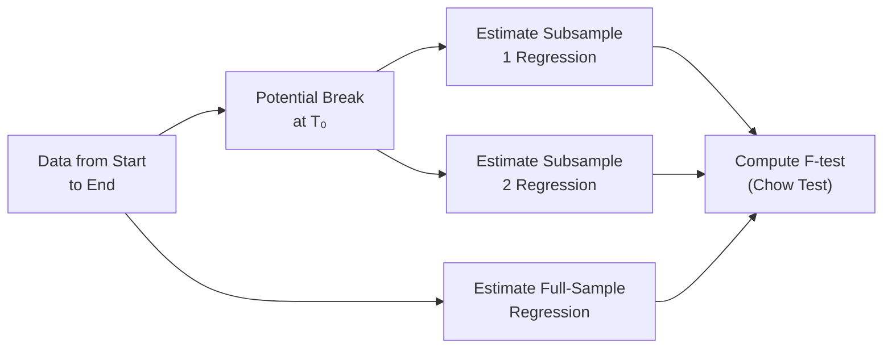

## Introduction

So, let’s say you’ve spent months building a beautiful multiple regression model to predict stock returns. Everything looks great. The regression line is almost hugging your data points, your p-values are nicely below your significance threshold, and you’re feeling like a rock star. Then, suddenly, a major regulatory change hits—boom!—and your model just doesn’t predict stock returns as reliably as before. You might scratch your head: “Did I do something wrong, or did the market just change?”

In that scenario, you may be dealing with a structural break. Structural breaks can disrupt the stability of regression parameters, especially in finance where external shocks, new legislation, or notable events (think market crashes or paradigm-shifting new technologies) can shake up relationships between variables. And that’s precisely the subject of our discussion here. We’ll explore how to detect structural breaks, handle them in practical modeling, and then pivot to how you can incorporate interaction terms to reflect more nuanced relationships between your regressors and outcomes.

## Understanding Structural Breaks

A structural break is essentially a shift in the underlying economic or financial process that generates your data. If you’re analyzing a time series of returns, you may discover that pre-2008 your model worked great, but after 2008—thanks to the global financial crisis— the world looks wildly different. It’s like trying to apply 1990s cell phone technology to the age of smartphones. Models can’t stay accurate if the fundamentals that gave rise to the relationship have changed.

1. Causes of Structural Breaks in Finance  
   - Regulatory changes (e.g., new financial regulations, deregulations)  
   - Economic regime changes (e.g., recessions, expansions, or currency crises)  
   - Geopolitical events (e.g., wars, trade disputes, large-scale political shifts)  
   - Technological innovations (e.g., high-frequency trading, new blockchain technology)

2. Why It Matters  
   - Your parameter estimates (like slope coefficients in a regression) may no longer be stable over time.  
   - Forecast accuracy tends to collapse if the model doesn’t account for the structural break.  
   - Risk assessments can be misleading, especially if volatility regimes shift.

## Detecting Structural Breaks with the Chow Test

One of the classic statistical tools to detect whether a structural break has occurred is the Chow Test. In simpler terms, the Chow Test checks whether your regression coefficients differ significantly before and after a suspected break date.

Let’s break down how it works:

- Suppose you suspect a break at a specific time T₀. You split your sample into two sub-samples:  
  1) Period 1: from the start of your data to T₀.  
  2) Period 2: from T₀+1 to the end of your data.  
- You estimate three regressions:  
  1) A “restricted” regression on the entire data (no break).  
  2) An “unrestricted” regression on sub-sample 1.  
  3) An “unrestricted” regression on sub-sample 2.  
- You compute the sum of squared errors (SSE) for each set of regressions:  
  SSEᴿ for the restricted model (full sample), and SSE₁ + SSE₂ for your two separate sub-samples.

The test statistic (F) is something like:


F = \frac{\left(\text{SSE}^{R} - (\text{SSE}_{1} + \text{SSE}_{2})\right) / k}{(\text{SSE}_{1} + \text{SSE}_{2}) / (n_{1} + n_{2} - 2k)},


where:  
- k is the number of parameters in the model (including the intercept).  
- n₁ + n₂ is the total number of observations combined in both sub-samples.  

If F is large enough relative to the critical value from the F-distribution, you conclude there is a structural break at T₀—meaning the relationships before and after T₀ are statistically different.

Here’s a simple visual flow of the logic:

If the break date T₀ is not exactly known, you might test multiple candidate break points or use more sophisticated models (like regime-switching or rolling estimation). But the overall idea remains: we want to see if the parameters differ across different segments of the data.

## Practical Approaches to Handling Structural Breaks

Well, so you find a break. Now what? In practice, there are a few ways to adjust your model:

- Separate Regressions in Each Regime  
  You simply estimate one model for the pre-break period and another for the post-break period. This approach is straightforward but can be unwieldy if you have multiple breakpoints or uncertain break dates.

- Dummy Variables for Time Periods  
  You can introduce a binary variable (dummy) that turns “on” after the suspected break date. This dummy can shift either the intercept or the intercept plus slopes in your model. For instance, if Dᵢ = 1 for t≥T₀ and 0 otherwise, you can interact it with your independent variables to allow them different slopes in different regimes.

- Advanced Regime-Switching Models  
  You can use Markov-switching or threshold models in which the data “switch” between regimes based on some latent or observable factor. This method can handle more subtle changes but is more advanced and typically not the first line of defense unless you’re building sophisticated econometric or trading models.

## Real-World Usage: Structural Breaks in Macroeconomic Analysis

Picture analyzing bond yields. Historically, you might see that yields track inflation plus a real rate fairly well. But after a major central bank policy shift (say, adopting a zero-interest-rate policy), you may discover the old yield-inflation relationship no longer holds. A structural break has occurred. From a modeling standpoint, if you continue to ignore the break, you could end up with poor predictions, inaccurate risk assessments, and misguided portfolio tilt decisions. This can directly impact interest-rate-sensitive assets, from mortgage-backed securities to corporate bonds.

## Introducing Interaction Terms

Now let’s pivot to something that’s both exciting and surprisingly tricky: interaction terms. An interaction term is simply the product of two independent variables, such as X₁×X₂, inserted into your regression model. But it can reveal a wealth of subtlety: how the impact of X₁ on Y changes as X₂ changes (and vice versa).

For example, imagine you’re analyzing how a firm’s stock returns (Y) depend on interest rate levels (X₁) and economic growth (X₂). You might suspect that the effect of higher interest rates is more pronounced when economic growth is also high. To capture that synergy (or offsetting phenomenon), you’d include an interaction term: X₁×X₂. This allows the coefficient of interest rates to evolve with economic growth.

## Interpretation of Interaction Terms

Let’s consider a simplified multiple regression:


\text{Return}_t = \beta_0 + \beta_1 (\text{Interest Rate}_t) + \beta_2(\text{Growth}_t) + \beta_3 (\text{Interest Rate}_t \times \text{Growth}_t) + \varepsilon_t.


- β₁ is the partial effect of the interest rate on returns when Growth = 0.  
- β₂ is the partial effect of growth on returns when Interest Rate = 0.  
- β₃ is the additional effect on returns due to the combination: for each unit increase in the interaction term, how does that combined factor drive returns?

In other words, when you have an interaction term, the “marginal effect” of one independent variable is no longer constant—it depends on the level of the other variable. This is powerful but can be confusing at times.

If you want to reduce complexity or potential collinearity, consider “centering” your variables (subtracting their means) before you create the interaction. Doing so often helps interpret the coefficients too, since setting Growth = 0 and Interest Rate = 0 might not be realistic in actual data.

## Real-World Usage: Interaction Terms to Assess Amplification

Imagine analyzing whether certain firm characteristics amplify the impact of macro shocks. For example, do highly leveraged firms (X₁) suffer more when GDP growth (X₂) slips? An interaction term X₁×X₂ helps you see if the negative effect of a slowdown on returns is greater or smaller for heavily indebted firms, allowing for a deeper understanding of how financial structure interacts with economic dynamics.

## Common Pitfalls

- Double-Dipping on Interaction Terms  
  If you add an interaction term but forget to include the main effects (X₁, X₂) themselves, your model might produce strange or incomplete results. By definition, your model loses interpretive clarity if the main variables are missing.

- Overfitting with Too Many Interactions  
  If you start including every possible pairwise or three-way interaction, you quickly blow up your parameter space. That can lead to overfitting, especially in a smaller sample.

- Misinterpretation of Coefficients  
  This is the big one. A coefficient on an interaction term is rarely read in isolation. You need to consider how it modifies the slope of the other variables.  

- Structural Break Overlaps  
  If your data has a structural break, your interaction terms might themselves change meaning across regimes. So, ironically, you might need separate models or dummy variables to account for how the interaction changes before/after the break.

## Glossary of Key Terms

- Structural Break: A shift in the regression relationship at a specific (often unknown) point in time that invalidates the assumption of stable coefficients.  
- Chow Test: A formal test for detecting a structural break at a known point.  
- Regime-Switching or Markov-Switching Model: Advanced methods allowing different parameter values in different “states” or “regimes.”  
- Interaction Term: A product of two variables used to allow their combined effect to influence the dependent variable in a non-additive way.  
- Centering: Subtracting the mean from explanatory variables before creating an interaction to reduce collinearity and enhance interpretability.  
- Dummy Variable for Structural Break: A 0/1 variable indicating before/after the break to allow different intercepts or slopes in different time periods.

## Conclusion and Exam Tips

Structural breaks and interaction terms are two subtle but powerful concepts that add nuance to your regression analysis. Just remember:

- Always test for breaks if there’s any reason to suspect your data might have shifted regimes (like a crisis or major market event).  
- If a break is present, consider either splitting your sample, introducing dummy variables, or employing advanced regime-switching models.  
- When using interaction terms, clearly articulate how one independent variable’s impact changes as another variable changes. This is key to providing meaningful interpretation.  
- For the CFA exam, watch out for exam questions where a break is introduced at a known date, or where they ask about synergy or offsetting effects. It’s likely an invitation to discuss structural breaks or interaction terms.  

Take a moment to review your approach to regression. If you see an abrupt change in model performance or contradictory signs in your coefficients, consider a structural break. If you sense that the effect of one variable just “isn’t the same” in the presence of another variable, explore interactions. And watch your time on the exam—work swiftly but carefully, especially when identifying these issues in a vignette.

## References

- CFA Institute Level II Program Curriculum, Quantitative Methods – Advanced Multiple Regression.  
- Stock, J. H. & Watson, M. W. (2020). Introduction to Econometrics.  
- “Regime Shifts in Fiscal Policy and Their Impact on Macroeconomic Indicators.” Journal of Applied Econometrics.

## 10 Sample Exam Questions: Structural Breaks & Interaction Terms



### Which of the following is true regarding a structural break in time-series data?

- [ ] It only occurs in datasets with dummy variables.
- [X] It reflects a change in the underlying relationship between dependent and independent variables at a certain point in time.
- [ ] It has no effect on forecasting accuracy.
- [ ] It only applies to regression models with more than two independent variables.

> **Explanation:** A structural break represents a shift in the regression relationship, often linked to economic or policy changes. Ignoring it may lead to poor forecasts.

### In the Chow Test, which of the following sums of squared errors (SSE) do you need?

- [ ] Only the SSE from the two separate sub-sample regressions.
- [ ] Only the SSE from the full-sample regression.
- [X] The SSE of the full-sample regression and the SSEs of each sub-sample regression.
- [ ] An average SSE across sub-samples but not the full sample.

> **Explanation:** The Chow Test compares SSE from the restricted (full-sample) model against the sum of SSEs from the two sub-sample (unrestricted) models to determine if there’s a break.

### If you identify a structural break at time t = T₀, what is one common approach to address it?

- [ ] Combine all data and ignore T₀.
- [ ] Use logistic regression.
- [X] Incorporate dummy variables to capture different intercepts or slopes before and after T₀.
- [ ] Discard all data before T₀.

> **Explanation:** Adding dummy variables for time segments is a standard approach for handling structural breaks, allowing coefficients to differ before and after the break.

### A primary drawback of separately estimating regressions for pre-break and post-break periods is that:

- [X] It can be cumbersome for multiple breakpoints and may reduce sample size in each period.
- [ ] It introduces a positive correlation in the errors.
- [ ] It always requires Bayesian techniques.
- [ ] It inflates your model’s R-squared automatically.

> **Explanation:** Splitting the sample can reduce the number of observations in each sub-sample and fails to account for transitions if there are multiple breakpoints.  

### Which of the following best describes an interaction term?

- [ ] A hypothesis test for seasonality.
- [X] A product of two independent variables allowing one variable’s effect to vary with changes in the other variable.
- [ ] A re-labeled intercept in a regression.
- [ ] A method for detecting outliers.

> **Explanation:** An interaction term is created by multiplying two independent variables so as to capture non-additive relationships.

### When a coefficient on an interaction term is statistically significant, it implies:

- [X] The effect of one predictor depends on the level of the other predictor.
- [ ] The main effects can be omitted from the model.
- [ ] Multicollinearity is not present.
- [ ] The regression model must be a time-series model.

> **Explanation:** A significant interaction coefficient indicates that the slope of one variable changes as the other variable changes, which is exactly why we use interaction terms.

### Under what circumstances is centering variables before creating interaction terms especially useful?

- [ ] When the dependent variable is binary.
- [X] When you want to reduce collinearity and interpret coefficients more directly.
- [ ] When no main effects are included in the model.
- [ ] Centering is never recommended in regression analysis.

> **Explanation:** Centering can reduce collinearity and helps interpret the intercept and slopes at the “average” value, facilitating clearer interpretation.

### How might you interpret a negative interaction coefficient between debt ratio (X₁) and GDP growth (X₂) in a stock returns model?

- [ ] As GDP growth rises, the effect of debt ratio on returns becomes more positive.
- [ ] As GDP growth rises, debt ratio has no effect on returns.
- [X] As GDP growth rises, returns are more negatively impacted for firms with higher debt ratios (an amplifying effect).
- [ ] The effect of GDP growth doubles at high debt ratios.

> **Explanation:** A negative interaction implies that having a higher debt ratio combined with higher GDP growth drives returns in a more negative direction than one would expect from each variable separately.

### What is a suitable strategy if a time series shows both a structural break and relevant interaction terms among explanatory variables?

- [X] Combine structural break detection strategies with the inclusion of interaction terms in the model, possibly adding break dummies and interactive effects.
- [ ] Drop all interaction terms and only test for the break.
- [ ] Assume the break is random and ignore it.
- [ ] Rely on plain OLS without further modifications.

> **Explanation:** If both phenomena exist, you can incorporate dummy variables for the break and add interaction terms for the relationships that you want to model with non-additive effects.

### True or False: Including too many interaction terms can lead to overfitting?

- [x] True
- [ ] False

> **Explanation:** While interaction terms are powerful, adding many of them—especially in smaller samples—can inflate the risk of overfitting, making your model more brittle in out-of-sample predictions.


