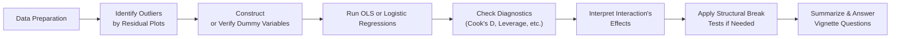

## Introduction
Sometimes, when folks dive into advanced regression, they get so wrapped up in the complexities—multiple dummy variables, logistic transformations, structural breaks—that they forget how to efficiently tackle an exam vignette under time pressure. I’ve definitely done that “head-scratching at 2 a.m.” routine a few too many times. Anyway, the good news is that with a plan, you can figure out what to look for, which details to ignore, and how to piece together a final answer quickly and accurately.

This section focuses on test-style item set questions that integrate advanced regression concepts. We’ll walk through practical scenarios—outliers and leverage points, multi-category dummy variables, logistic regression classification, structure shifts from “break events,” and those sometimes-baffling interaction terms. Each example leads you through a step-by-step approach:

• Scrutinizing the vignette for relevant data.  
• Checking diagnostic flags (like Cook’s Distance and structural break indicators).  
• Interpreting logistic regression outputs (e.g., confusion matrices).  
• Evaluating dummy variable specifications.  
• Considering the effect of an interaction term.

By the end of these examples, you should be able to apply the same template in an exam environment. Let’s get rolling.

## Integrating Advanced Regression Concepts Under Exam Conditions
Picture yourself on exam day: you see a five- or six-paragraph vignette packed with regression output, partial standard errors, a mention of a “possible break after the 2008 financial crisis,” and a table showing classification predictions. Don’t panic; let’s outline a methodical approach. The main steps:

• Extract the core regression specification from the vignette.  
• Identify the dependent variable and whether it’s continuous (OLS) or binary (Logistic).  
• Pinpoint any critical diagnostic measures mentioned (residual plots, Cook’s Distance, etc.).  
• Understand how dummy variables are coded (including reference categories).  
• Look for mention of breaks or changes in the data over time (structural breaks).  
• Check for interaction terms and interpret them carefully.  

A quick diagram can help visualize your workflow:

In an exam-time crunch, keep this flow in your head. Mark important details and move swiftly.

## Example Scenario: Influence Analysis with Outliers
Imagine a vignette describing a regression model that predicts real estate returns based on local unemployment, population growth, and interest rates. The item set provides Cook’s Distance values for each observation (or a mention that certain points have high leverage).

• First, note whether any observation’s Cook’s Distance or leverage stat is abnormally high. A typical rule of thumb:  
  – Cook’s Distance > 1 might be suspicious, or  
  – Observations whose leverage exceeds 2(k+1)/n (where k is number of parameters) might be flagged as outliers.  

• The question might ask: “Which single observation shows the greatest influence on the regression estimates based on the provided Cook’s Distance values?”  
• Or: “How would removing the outlier shift the coefficient estimates?”

If you see a table like:

| Observation | Residual | Cook’s Distance | Leverage |
|-------------|---------:|----------------:|---------:|
| 1           |   -0.20  |         0.05    |   0.15   |
| 2           |    0.15  |         0.80    |   0.65   |
| 3           |    0.45  |         0.02    |   0.05   |
| 4           |   -1.10  |         1.15    |   0.85   |

Observation 4 in this example might be the big influencer. The correct approach typically involves checking if you need a robust regression method or if you remove (or “winsorize”) outliers altogether. For the exam, just answer exactly what the question requests: many times, it’s simply “identify the outlier,” not “rewrite the entire analysis from scratch.”

## Example Scenario: Using Dummy Variables for Multiple Categories
Dummy variables are not just for binary splits. You might see a case with multiple rating categories (like AAA, AA, A, BBB) coded as dummies. The question might read something like:

“An analyst sets AAA as the reference category and uses three dummy variables: D_AA, D_A, and D_BBB. The partial regression results are as follows…”

Then you see something like:

| Coefficient       | Estimate  | t-Stat  | p-Value |
|-------------------|----------:|--------:|--------:|
| Intercept         |     2.30  |  5.20   |  0.001  |
| D_AA             |    -0.15  | -1.10   |  0.270  |
| D_A              |    -0.25  | -2.00   |  0.045  |
| D_BBB            |    -0.50  | -3.20   |  0.002  |

If asked, “How do we interpret the coefficient on D_A?” you’d note that relative to AAA bonds, A-rated bonds (when all else stays the same) show an expected 0.25% lower return (since it’s negative) if that’s the dependent variable. The key is to always reference the base (omitted) category—here, AAA.

## Example Scenario: Logistic Regression for Default Predictions
Sometimes you’ll see a banking scenario. Suppose the regression is logistic, predicting whether a corporate borrower defaults (1) or not (0). The vignette might show:

• Probability of default = 1 / [1 + e^-(β0 + β1Business_Risk + β2Credit_Score + ... )].  
• A confusion matrix showing true positives, false positives, etc.  

Example confusion matrix:

|                   | Predicted No Default | Predicted Default |
|-------------------|----------------------|-------------------|
| Actual No Default | 400 (TN)            | 50 (FP)           |
| Actual Default    | 20 (FN)             | 30 (TP)           |

The item set could ask: “What is the classification accuracy?” You’d add the correct predictions (400 + 30 = 430) and divide by total (400 + 50 + 20 + 30 = 500), yielding 86%.

They might also ask about Type I vs. Type II errors or the interpretation of the logistic coefficient for “Credit_Score”: a positive coefficient suggests that higher credit scores reduce the log-odds of default, meaning a lower probability of default. Be sure to address precisely what the question asks—sometimes it’s about “odds ratio,” other times it’s about “accuracy,” or about how you’d adjust the classification threshold.

## Example Scenario: Structural Break Detection (Chow Test / Break Dummy)
Let’s say we have a time-series regression of a stock index return on a set of macro factors from 2000 to 2020, and there’s suspicion that after 2008, the relationship changes drastically. The item set might show two sets of regression results—one for the 2000–2008 subsample, another for 2009–2020. Or it might show a single regression with a “break dummy” that’s 0 when t < 2008 and 1 when t ≥ 2008.

If you see a table like:

| Variable            | Coeff (Pre-2008) | Coeff (Post-2008) |
|---------------------|-----------------:|-------------------:|
| Intercept           |          0.01    |   -0.02            |
| GDP_Growth          |          0.40    |    0.25            |
| Unemployment_Rate   |         -0.30    |   -0.55            |
| p-value (Chow Test) |          0.035   |      –             |

The question might ask whether the model experiences a structural break. If the Chow Test’s p-value is < 0.05, that’s typically evidence that the model’s parameters differ before and after the break date. Alternatively, if using a break dummy in a single regression, you’d interpret significance of the dummy or the dummy-interaction terms more or less the same way as you do with standard dummy variables—except it’s specifically capturing a shift around 2008.

## Example Scenario: Interaction Terms
Interaction terms can cause confusion, especially if you see something like:  
Return = β0 + β1 Rating + β2 Market_Vol + β3(Rating × Market_Vol) + ε  

Suppose the item set specifically calls out that Rating is coded as 1 for “BBB or below” and 0 otherwise. Then, β3 measures the additional slope from Market_Vol for below-BBB bonds. If the question says, “Explain how the coefficient of (Rating × Market_Vol) modifies the effect of Market_Vol,” you’d note that the marginal effect of Market_Vol depends on Rating. If Rating = 0, the effect is just β2. If Rating = 1, it’s (β2 + β3). If β3 is negative, that synergy might mitigate Market_Vol’s effect for below-BBB bonds, and so on.

## Test Strategy and Timing
• Start by scanning the vignette. Identify which advanced concept is the target (outlier, logistic classification, dummy variables, structural break, etc.).  
• Don’t overdo your analysis. If the question is purely about identifying the outlier, you don’t need to re-check every single model assumption.  
• Summarize the key data in bullets or a quick table.  
• If you see logistic output, watch for confusion matrices or “accuracy” references. If you see time-series output, look for mention of a potential break date.  
• Watch your watch. In exam conditions, you have (roughly) 18 minutes per item set. If you get stuck, pick your best guess and move on—don’t let one question sink you.

## Common Pitfalls
• Mixing up the reference category in a multi-dummy setup.  
• Overlooking the meaning of an interaction term.  
• Confusing logistic regression coefficients with OLS coefficients. (Logistic coefficients are in log-odds space.)  
• Not checking whether a break dummy or test is actually significant.  
• Getting lost in extraneous details the question doesn’t ask about.  

## Glossary
• Vignette-Style Question: Scenario-based question requiring deeper analysis of a data exhibit or case study.  
• Classification Accuracy: The ratio of correct predictions to total predictions in a classification model.  
• Confusion Matrix: A table comparing predicted vs. actual classifications. It includes true positives, false positives, true negatives, and false negatives.  
• Chow Test Statistic: Used to test for structural breaks; compares sum of squared residuals before and after a suspected break date (or across subsamples).  
• Calculation Efficiency: Minimizing the time spent on routine calculations to preserve time for conceptual reasoning.  
• Break Dummy Variable: A dummy that indicates periods before/after an identified structural break (e.g., 1 after 2008, 0 before 2008).  

## References for Further Study
• CFA Institute Level II Program Curriculum, in particular the practice problems for Multiple Regression and for Time-Series modules.  
• CFA Learning Ecosystem practice exams for item-set style examples.  
• “Scoring High on CFA Level II Vignette Questions” – [ARX (Asia-Pacific Research Exchange)](https://www.arx.cfa).

## Final Exam Tips
• Always confirm the model type (OLS, logistic, or otherwise) before diving into interpretation.  
• For logistic regressions, be mindful of classification thresholds and confusion matrices.  
• Re-check the sign of the interaction coefficient to interpret synergy correctly.  
• If the question references a suspicious data point, glean whether it’s an outlier or a high-leverage point (they’re not always the same!).  
• For potential breaks, keep an eye out for a reported test statistic (like Chow) or break dummy significance.  
• Above all, answer the actual question—no need to show off extra computations the exam didn’t request.

---------------------------------------------------------------------------------

## Advanced Regression Concepts Item Set Quiz



### Which statistic is most appropriate for identifying a highly influential observation in an OLS regression context?

- [ ] The value of the intercept.
- [ ] The t-statistic of the slope coefficient.
- [x] Cook’s Distance.
- [ ] The logistic log-likelihood.

> **Explanation:** Cook’s Distance is a common measure of influence. A high Cook’s Distance can indicate an observation that significantly affects the regression estimates.

### In a multiple regression setting, how should a reference category be treated when you’re modeling using multiple dummies?

- [x] The reference category is omitted from the model, and coefficients on the included dummies measure deviations from that omitted category.
- [ ] An additional dummy for the reference category must be added, ensuring no category is excluded.
- [ ] A separate regression is run for each category to avoid confusion.
- [ ] The reference category is given a coefficient of zero by default.

> **Explanation:** With categorical variables, one category is left out (the reference), and the included dummy coefficients measure changes relative to that omitted baseline.

### If a logistic regression’s confusion matrix shows 50 false positives and 20 false negatives, what other information is needed to calculate the classification accuracy?

- [ ] The values of the regression coefficients.
- [x] The total number of true positives and true negatives.
- [ ] The standard errors of the estimates.
- [ ] The p-values of each predictor.

> **Explanation:** To compute classification accuracy (correct predictions / total predictions), you need the counts of true positives and true negatives along with the false positives and false negatives.

### Suppose a time-series regression indicates a probable structural break after 2010. Which of the following is a valid approach to test this systematically?

- [ ] Evaluate the correlation matrix of residuals before and after 2010.
- [x] Perform a Chow Test comparing regressions from the two subperiods.
- [ ] Compare logistic classification accuracy before and after 2010.
- [ ] Replace the dependent variable with a dummy for post-2010.

> **Explanation:** The Chow Test is the classic method for testing a structural break at a known break date by comparing sum of squared residuals in subperiods.

### In a regression with an interaction term (X1 × X2), the interpretation of β3 on that interaction is:

- [x] It measures how the slope of X1 changes as X2 changes (and vice versa), above and beyond their individual linear effects.
- [ ] It only measures the constant effect of X1 across all values of X2.
- [ ] It is always negative if X2 is a dummy.
- [ ] It indicates how the dependent variable changes one unit for each variable.

> **Explanation:** An interaction coefficient modifies how one independent variable’s effect changes with another variable’s value.

### A logistic regression model for default predictions has a coefficient for “Credit_Score” of -0.02. How would you interpret this coefficient?

- [ ] For each unit increase in Credit_Score, the predicted log-odds of default increases by 0.02.
- [ ] The expected default rate improves by 2% for each point increase in Credit_Score.
- [x] For each unit increase in Credit_Score, the log-odds of default decreases by 0.02.
- [ ] It has no interpretative significance in logistic regressions.

> **Explanation:** In logistic regression, coefficients relate to the log-odds. A negative coefficient on Credit_Score means higher scores lower the log-odds (and thus probability) of default.

### An item set provides partial output indicating an unusually large positive residual at observation #27, accompanied by a high leverage statistic. What might this suggest?

- [x] Observation #27 could be an outlier with undue influence on coefficient estimates.
- [ ] Observation #27 enhances model stability.
- [ ] The intercept is likely mis-specified.
- [ ] The model fails the Chow Test.

> **Explanation:** A high leverage observation that also has a large residual is potentially a highly influential outlier.

### When a dummy variable for a suspected structural break (Break_D) is added to a regression and found to be positive and statistically significant, it strongly suggests:

- [x] The dependent variable’s intercept changes significantly after the break point.
- [ ] No structural shift occurred.
- [ ] Model residuals are automatically white noise.
- [ ] The slope effects also changed, but in the negative direction.

> **Explanation:** A break dummy that is positive and significant implies a jump in the intercept after the break date. That doesn’t necessarily speak to slope changes unless interaction terms are included.

### In the context of multi-category dummy variables (e.g., AAA, AA, A, BBB), which statement is correct?

- [x] You should include K-1 dummy variables if there are K categories, leaving one category as the baseline.
- [ ] You must have exactly one dummy per category, including the baseline.
- [ ] The number of dummies equals the number of continuous variables.
- [ ] You should never use dummy variables for more than three categories.

> **Explanation:** The general rule for categorical variables with K categories is to include K-1 dummy variables to avoid the “dummy variable trap.”

### A confusion matrix shows that out of 500 predictions, 450 are correct. True or False: The classification accuracy is 90%.

- [x] True
- [ ] False

> **Explanation:** Accuracy = (Correct Predictions / Total Predictions) × 100. Here, 450/500 = 0.90, or 90%.


