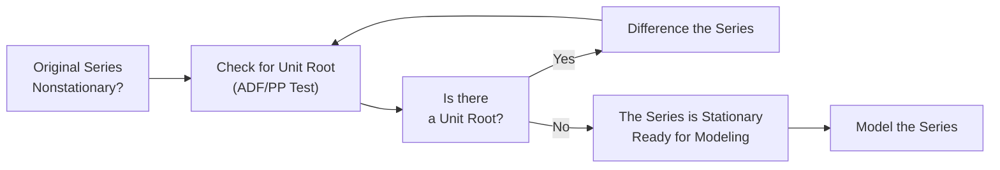

Introduction  
Sometimes, you’ll be looking at a financial time series—maybe daily stock prices or monthly inflation rates—and you’ll notice that the series just keeps drifting up (or down) over time, or its ups and downs seem to get wilder. In other words, the series might not have a stable average or a predictable fluctuation range. That’s precisely when you suspect the data might be nonstationary. A common culprit is the presence of a unit root, which can wreak havoc on standard forecasting procedures. This section explores what stationarity is, why it’s crucial for time-series modeling, how nonstationary data can lead to misguided inferences, and how to detect and fix it using accepted tests and practical techniques.

Why Stationarity Matters  
Stationarity essentially means that a time series behaves the same way across different time periods. While that might sound straightforward, trust me—detecting and enforcing stationarity is one of the biggest tasks in time-series modeling. When a series is stationary, you can apply many conventional tools (like certain regression methods, ARMA models, or standard hypothesis tests), and your forecasts or statistical inferences won’t be off because of structural shifts in what you’re measuring.

Covariance Stationarity in Finance  
For financial applications, the term “stationarity” typically refers to covariance stationarity. Covariance stationarity has three key properties:  
• Constant mean over time.  
• Constant variance over time.  
• Constant autocovariance structure that depends only on the lag (the distance between time points), not on the specific point in time.  

In more technical terms, a time series {Yₜ} is covariance stationary if for all t, the expected value E[Yₜ] = μ (a constant), Var(Yₜ) = σ² (a constant), and Cov(Yₜ, Y₍ₜ₋ₖ₎) depends only on k, not on t.  

A quick personal anecdote: I once tried modeling a monthly stock index using a simple linear regression, assuming it was stationary. But guess what? The variance grew enormously over time, which completely violated the assumption. My initial statistical tests pointed to spurious results. That’s how I first learned that ignoring stationarity can lead to modeling fiascos.

Nonstationarity and Its Consequences  
If the data’s mean or variance changes over time—or if its memory structure (autocorrelation) shifts—then the series is nonstationary. Many real-world economic and financial variables are nonstationary because they evolve with systemic changes: new technologies, regulatory shifts, and macroeconomic policy changes.

Common issues arising from nonstationarity include:  
• Spurious regression results: You might see high R² and significant t-statistics even though there’s no real underlying relationship.  
• Unreliable forecasts: Future projections based on patterns that hold only in certain time frames often fail.  
• Invalid statistical tests: Confidence intervals and p-values from standard ordinary least squares (OLS) methods may be distorted.  

Unit Roots: A Key Source of Nonstationarity  
One frequent driver of nonstationarity is a so-called unit root. If you’re dealing with an autoregressive model of order 1 (AR(1)):

(1)  Yₜ = ϕY₍ₜ₋₁₎ + εₜ  

where εₜ is a white noise error term, a “unit root” occurs if ϕ = 1. In that special (but common) case, the process becomes:

(2)  Yₜ = Y₍ₜ₋₁₎ + εₜ  

This series is a random walk: every new value is just the previous value plus some random shock. If you get a big shock today, you’ll see its effect forever, because the process never returns to a constant mean.

Implications of a Unit Root  
When ϕ = 1, the process does not gravitate around a fixed mean, meaning historical data can’t simply be used in standard ways to predict future behavior. Traditional regression or AR models requiring stationarity can be misleading. To cope with a unit root, a typical strategy is differencing. For instance, define:

(3)  ΔYₜ = Yₜ – Y₍ₜ₋₁₎.  

If the original series Yₜ is a random walk, the differenced series ΔYₜ is likely to be approximately white noise (i.e., stationary). This differencing approach is often the easiest route to restore stationarity.

Formal Tests for Unit Roots  

Augmented Dickey-Fuller (ADF) Test  
The Augmented Dickey-Fuller (ADF) test is used to detect whether a unit root is present. Conceptually, it checks whether an AR(1) coefficient is equal to 1 in the presence of lagged differences to control for higher-order autocorrelation. The test can be run in various forms: with intercept, with intercept plus time trend, or with no intercept. Typically, you look at the p-value: if it’s low (often below 0.05), you reject the null hypothesis of a unit root (i.e., you conclude the series is likely stationary).  

Phillips-Perron Test  
Another commonly used test is the Phillips-Perron (PP) test. It modifies the approach used in the ADF test to account for potential issues like heteroskedasticity or correlation in the error terms without adding lagged difference terms. It often complements the ADF test and can yield more robust results under certain data conditions.  

Example: Testing for a Unit Root in Python  

```python
import pandas as pd
from statsmodels.tsa.stattools import adfuller

result = adfuller(time_series_data, autolag='AIC')
print("ADF Statistic:", result[0])
print("p-value:", result[1])
print("Critical Values:", result[4])

if result[1] < 0.05:
    print("Reject the null hypothesis: the series is likely stationary.")
else:
    print("Fail to reject the null hypothesis: the series is likely nonstationary (has a unit root).")
```

Trend-Stationary vs. Difference-Stationary Processes  
Not all nonstationary series are the same. One subtle but crucial distinction is between “trend-stationary” and “difference-stationary” processes.

• Trend-Stationary: The data can be made stationary by removing a deterministic trend. For example, if stock prices tend to grow by a fixed rate over time, you can subtract out that linear trend, and what’s left might be stationary.  
• Difference-Stationary: The process doesn’t become stationary by removing a mere deterministic trend; instead, it requires differencing (one or more times) to become stationary.

To figure out which category applies, you can do a simple check: If the series becomes stationary upon subtracting a linear (or polynomial) trend, it’s likely trend-stationary. But if you need to difference it, you’re probably dealing with a unit root process.  

Common Financial Examples  

Stock Prices  
Equity price data often appear nonstationary with a strong upward drift. Daily or monthly returns, however, are more likely to be stationary because differencing is essentially the same concept as calculating returns over time.  

Gross Domestic Product (GDP)  
GDP over decades usually shows a clear upward trajectory from economic growth. You may interpret it as a trend-stationary series—if that trend is deterministic—or as difference-stationary if growth is stochastic and large shocks have permanent effects.  

Inflation  
Inflation rates can vary. In some periods, inflation hovers around a stable mean. In other periods, it might drift or jump. Checking for a unit root helps you decide whether a shock to inflation continues into the future or dissipates over time.

Transforming Data into a Stationary Form  
The general recipe for dealing with nonstationary data boils down to:  
1. Test for Stationarity: Use the ADF or PP test (or other stationarity diagnostics such as visual inspection of plots or the KPSS test) to check if the series is stationary.  
2. If Nonstationary: Identify the source—does it contain a deterministic trend or do we have a unit root?  
3. Remove Trend or Difference the Series:  
   • Subtract the estimated linear (or polynomial) function of time for trend-stationary.  
   • Take the first difference (sometimes second difference) for difference-stationary data.  
4. Confirm Stationarity: Re-run stationarity tests.  
5. Model the Stationary Process: Apply your chosen forecasting model (AR, MA, ARMA, ARIMA, etc.).  

Flowchart to Approach Nonstationary Data  



Best Practices and Pitfalls  
• Always plot the data first. Visual inspection can give clues about whether mean or variance changes over time.  
• Check for structural breaks. Sometimes, a single regime change (say, a shift in monetary policy) can make the series appear nonstationary.  
• Don’t rely on a single test—sometimes the ADF might say one thing, while the PP test claims another. Investigate further if results conflict.  
• If you’re combining multiple series in a regression (like a multi-factor model), ensure all variables are integrated of the same order or truly stationary to avoid spurious regression.

Exam Tips  
• Expect a time-series vignette that asks about the right way to handle a trending or drifting variable.  
• They might ask you to interpret p-values from an ADF test or to choose whether differencing or trend-removal is the proper fix.  
• Keep an eye out for tricky pitfalls: sometimes the test statistics differ if you include a trend term or not.  
• If you see a series that looks random-walk-ish, automatically suspect a unit root.  
• In item sets, you might see large t-statistics for regressions using trending variables—classic sign of spurious correlation if stationarity isn’t addressed.

Glossary  
• Stationarity: A property of a time series whose statistical features (especially mean and variance) do not change over time.  
• Covariance Stationary: A weaker form of stationarity where mean and covariance do not vary with shifts in time.  
• Unit Root: Exists if the characteristic equation of an autoregressive process has a root equal to 1, indicating a nonstationary process (often requiring differencing).  
• Trend-Stationary Process: A process that achieves stationarity by removing a deterministic trend.  
• Difference-Stationary Process: A process requiring differencing for stationarity.  
• Augmented Dickey-Fuller (ADF) Test: Statistical test for unit roots, controlling for higher-order autocorrelation via additional lagged terms.  
• Phillips-Perron (PP) Test: Alternative approach to detect unit roots, robust to certain forms of heteroskedasticity and correlation in errors.

References and Further Reading  
• CFA Institute Level II (2025), “Time‑Series Analysis” Reading.  
• Hamilton, J.D. (1994), Time Series Analysis. Princeton University Press.  
• Tsay, R.S. (2010), Analysis of Financial Time Series. Wiley.  

## Test Your Knowledge: Stationarity, Unit Roots, and Time-Series Fundamentals



### Which of the following best describes covariance stationarity in a time series?

- [ ] The time series has a constant trend over time.
- [x] The mean, variance, and autocovariance structure do not depend on time.
- [ ] The time series moves around a fixed average that changes every period.
- [ ] The time series always has a drift term of zero.

> **Explanation:** Covariance stationarity means the time series has a constant mean, constant variance, and an autocovariance that depends only on the lag between observations.

### In an AR(1) model, which parameter value indicates the presence of a unit root?

- [ ] φ = -1
- [ ] φ = 0
- [x] φ = 1
- [ ] φ = 2

> **Explanation:** A unit root in an AR(1) occurs when φ = 1, implying the process is a random walk (nonstationary).

### You have a series where subtracting a deterministic linear trend makes it stationary. Which term describes this type of process?

- [ ] Difference-stationary
- [x] Trend-stationary
- [ ] Random walk
- [ ] Seasonally adjusted

> **Explanation:** A trend-stationary series becomes stationary once its deterministic trend component is removed.

### The Augmented Dickey-Fuller test primarily helps you:

- [ ] Estimate the slope of a time-series trend.
- [x] Determine if the series has a unit root.
- [ ] Forecast the transformation needed for cointegration.
- [ ] Detect autocorrelation in an AR(2) model.

> **Explanation:** The ADF test is designed to detect the presence of a unit root (i.e., nonstationarity) in the data.

### A time series that has a shock whose effect persists forever is most likely:

- [ ] Trend-stationary
- [ ] Cointegrated
- [x] A random walk (or unit root process)
- [ ] Covariance stationary by definition

> **Explanation:** A shock persisting indefinitely suggests a random walk, typical of a unit root process.

### If the ADF test fails to reject the null hypothesis at the 5% level, the most appropriate conclusion is:

- [x] The series is likely nonstationary (cannot reject the presence of a unit root).
- [ ] The series is definitely cointegrated with another variable.
- [ ] The variance of the series is zero.
- [ ] The series is difference-stationary at all lags.

> **Explanation:** The null hypothesis in ADF is that the series has a unit root. Failing to reject means you do not have strong evidence that the series is stationary.

### When you first-difference a random walk time series, the resulting process is likely to be:

- [x] Stationary or close to stationary.
- [ ] Still nonstationary because differencing has no effect.
- [ ] A cointegrated series with an external variable.
- [ ] Trend-stationary.

> **Explanation:** Differencing a random walk often yields a series of independent or weakly autocorrelated increments (stationary in many cases).

### Which statement correctly distinguishes a trend-stationary series from a difference-stationary series?

- [ ] Trend-stationary series require multiple lags to become stationary, while difference-stationary require only one lag.
- [ ] Trend-stationary series have seasonal lags, while difference-stationary have cyclical lags.
- [x] Trend-stationary series can be detrended by removing a deterministic component, whereas difference-stationary series need differencing.
- [ ] Trend-stationary series always pass the ADF test, while difference-stationary series never do.

> **Explanation:** Removing a deterministic trend is enough for trend-stationary data; difference-stationary data need differencing to remove the stochastic trend.

### What is the typical outcome when nonstationary series are regressed on each other without recognizing their integration properties?

- [x] Spurious regression, often featuring artificially high R².
- [ ] A higher likelihood of cointegration.
- [ ] Perfect forecasting accuracy, as the trending variables align.
- [ ] No effect on the distribution of residuals.

> **Explanation:** Regressing two (or more) nonstationary series often leads to spurious statistical significance and misleading R² values unless you confirm stationarity or cointegration.

### True or False: If the p-value from the ADF test is less than 0.05, you should conclude that the series definitely has a unit root.

- [ ] True
- [x] False

> **Explanation:** If the p-value < 0.05, you typically reject the null hypothesis of a unit root, implying the series is likely stationary. You do not conclude it has a unit root; rather, you conclude it does not.


