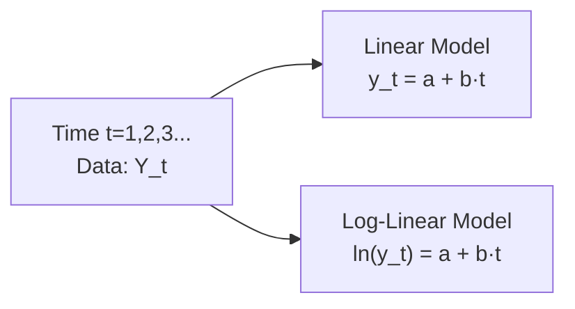

## Overview

Time‑series analysis often involves modeling how variables evolve over time, a topic that comes up frequently in both academic and professional finance settings. At some point, most of us have tried taking a dataset—say, monthly GDP data or a long‑term stock market index—and fitting a simple trend line to see if it grows consistently over time. If you’ve ever done that, you know that one of the earliest choices you face is whether to use a linear trend model or a log‑linear trend model.

In a nutshell, linear trend models are best when we think a variable increases (or decreases) in roughly constant increments. Log‑linear models come in handy when we expect the variable to grow (or decline) in percentage terms—basically, when the data is more likely to exhibit exponential‑type behavior. 

Anyway, let’s dig deeper into both approaches, interpret their coefficients, consider their assumptions, and discuss how you’d implement them in practice.

## Key Concepts

### Deterministic Trends

A “deterministic trend” is a predictable pattern in a time series. In other words, we assume that part of our series can be explained purely by time—like a constant slope or a gradually accelerating path. Trend models attempt to capture that predictable portion so that what remains in the residual might be interpreted as noise, cyclical effects, or other complexities.

### Linear vs. Log‑Linear

• Linear Trend:  
  A linear trend model says that the variable changes by a fixed amount each period. If a stock market index (Y) grows by 50 points each year consistently, that’s a linear growth pattern. The simplest form is  
  (1) Yₜ = a + b·t + eₜ,  
  where t is the time index (1, 2, 3, …).

• Log‑Linear Trend:  
  A log‑linear model implies that Y changes by a certain percentage each period. For instance, if GDP grows by about 2% to 3% every quarter, a log‑linear model is often more appropriate. The mathematical expression is  
  (2) ln(Yₜ) = a + b·t + eₜ,  
  or equivalently Yₜ = exp(a + b·t + eₜ).  

If b is positive, it suggests exponential growth; if b is negative, it implies exponential decay.

To visualize how these two approaches differ, consider the following diagram:



In the linear diagram, we have a straight line that either slopes upward or downward. In the log‑linear version (tracking the natural log of Y over time), the slope is constant in log space, translating to exponential changes in the original data.

## Interpreting Coefficients

### Linear Trend Model

• Intercept (a): The value of Y when t = 0.  
• Slope (b): The average unit change in Y per one‑unit change in time. So if b = 10, that means on average Y increases by 10 units per period.

One personal anecdote: I remember the very first time I tried to model a stock index with a simple linear trend in a hurried attempt for a class project—I ended up with a slope that said the index went up by something like 400 points per year. That figure alone was straightforward, but I later realized the stock index in question grew at very different rates across economic cycles. In other words, it was never that “straightforward.” So even though the interpretation of b is easy, you do have to watch out for unusual or cyclical data. 

### Log‑Linear Trend Model

• Intercept (a): In ln(Y) terms, a = ln(Y₀) when t = 0. In original Y terms, exp(a) is roughly the predicted value of Y at t = 0.  
• Slope (b): The average percentage change in Y per one‑unit change in time (multiplied by 100). More precisely, for small b, b × 100 is the approximate percent change in Y for every 1‑period increase in t.  

So if b = 0.03, that implies about a 3% growth per period. This is why log‑linear models become super useful when dealing with growth processes—like inflation, GDP, population, or stock market indices that grow faster as they get larger.

## Choosing Between Linear and Log‑Linear Models

In practice, you’d typically plot your data first (yes, old-fashioned but crucial) to see if it looks more or less linear or if it seems to accelerate. 

• If the data visually suggests a straight line, or you suspect the differences in Y from one period to the next are more or less constant, a linear trend might be best.  
• If the data is obviously “curving upward” in a roughly exponential pattern, or if you suspect the variable is growing by a certain proportion each period, a log‑linear model will usually do a better job capturing that.

Another way to decide is to fit both, compare goodness-of-fit measures (like R² or adjusted R²), or run tests on the residuals to see which model leaves less systematic pattern unaccounted for.

## Estimating These Models (OLS Approach)

Both linear and log‑linear trend models are typically estimated via Ordinary Least Squares (OLS). The steps are quite direct:

1. Gather your time‑series data: (t, Yₜ) for t = 1, 2, …, N.  
2. For a linear model, you simply regress Yₜ on t.  
3. For a log‑linear model, you transform your dependent variable as ln(Yₜ) and then regress ln(Yₜ) on t.  
4. Review the estimated coefficients â (the intercept) and b̂ (the slope).  
5. Examine standard errors, p-values, and confidence intervals to ensure your coefficients are statistically significant.

In Python, you could do something along these lines (super simplified example):

```python
import numpy as np
import pandas as pd
import statsmodels.api as sm

df = pd.DataFrame({
    'time': np.arange(1, 11),
    'Y': [100, 105, 111, 120, 124, 131, 138, 144, 150, 158]  # hypothetical data
})

X = sm.add_constant(df['time'])          # for linear model
model_linear = sm.OLS(df['Y'], X).fit()
print(model_linear.summary())

df['logY'] = np.log(df['Y'])
X_log = sm.add_constant(df['time'])
model_log = sm.OLS(df['logY'], X_log).fit()
print(model_log.summary())
```

The slope parameter in the linear model printout is the per-period change in Y, while in the log‑linear model, you’d interpret the slope as the approximate percentage growth per period (multiply by 100).

## Trend Stationarity and Residual Diagnostics

A deterministic trend model (either linear or log‑linear) is often said to be “trend stationary” if, once you subtract (or divide out, in log space) the fitted trend, the resulting residual is stationary. “Stationary,” in time‑series lingo, means the statistical properties (mean, variance) don’t systematically shift over time. If the remainder after removing the trend is still drifting, then your model might not be capturing that pattern adequately.

One quick check is to plot the residuals or run a test like the Augmented Dickey‑Fuller (ADF) test on the residuals to see if they appear stationary. If they do, you’re in better shape. If not, you might need to consider adding more variables or moving to more advanced time‑series frameworks (like ARIMA models, which we handle in Section 6.3 and beyond).

### Autocorrelation in Residuals

One extremely common issue is that fitting just a linear or log‑linear trend might ignore seasonal or cyclical fluctuations, leaving behind times where the residual is systematically positive or negative for months or years. That’s a classic sign of autocorrelation: your residual from time t is correlated with the residual from time t−1 or even t−12. If the residual is serially correlated, the OLS standard errors become unreliable, and it hints that more advanced techniques are needed—like adding lagged terms or using an AR process to model the correlated part.

To diagnose autocorrelation quickly, you can:

• Look at autocorrelation function (ACF) or partial autocorrelation function (PACF) plots of the residuals.  
• Compute the Durbin‑Watson statistic or use the Breusch‑Godfrey test.  

If you see significant autocorrelation, well, a simple linear or log‑linear trend model might be insufficient for capturing all the behavior in your time series.

## Practical Example: Fitting a Linear vs. Log‑Linear Model

Imagine you have data on a stock index, Sₜ, at monthly intervals over 10 years. Suppose your initial visual inspection shows that Sₜ grew from around 1,000 to 3,500, but the growth looked somewhat faster toward the later years (that’s typical of many real stock indices). You suspect exponential or near-exponential growth.

1. Linear Model:  
   You run: Sₜ = a + b·t + eₜ. The estimated b̂ is 25, meaning the index is estimated to grow 25 points per month on average. The R² might be decent, but you notice strong patterns in the residuals that shift with economic expansions and recessions.  

2. Log‑Linear Model:  
   You run: ln(Sₜ) = a + b·t + eₜ. The estimated b̂ might be 0.015, implying about a 1.5% monthly gain. You look at the residual plot and see if it’s more stable. If this looks better, you might choose the log‑linear version.  

In practice, you would do a more rigorous test—like comparing adjusted R² or analyzing residuals with the Durbin‑Watson statistic—to confirm which specification fits best. But from personal experience, especially in equity markets or macro growth data, log‑linear trends often do a much better job capturing compounding growth.

## Limitations of Simple Trend Models

While linear or log‑linear models can be powerful first steps, they do have limitations:

• They ignore any kind of cyclical or seasonal components.  
• They also can’t incorporate external explanatory variables that might influence Y.  
• They assume that the slope b is constant over time. Real life can be much messier—there might be structural breaks where everything changes, or major economic events that reset the growth path.  

So keep in mind: if your data shows strong cyclical patterns (like monthly retail sales with a holiday spike every December) or major breaks, you might need additional complexities. We’ll cover more advanced topics, like autoregressive processes and seasonality corrections, in subsequent sections of this volume.

## Conclusion

Linear and log‑linear trend models are a major stepping stone in time‑series analysis. They’re great for getting a quick snapshot of how a variable evolves over time, and for certain datasets—especially those that exhibit steady or exponential trends—they can be surprisingly good at capturing the big picture. But that doesn’t mean they’re always enough. If the data’s residuals show strong autocorrelation or systematic patterns, or if the growth rate changes significantly over time, it’s probably a sign to move on to more advanced techniques.

That said, understanding these two models, their assumptions, and their limitations is absolutely essential. It will not only help you pick the right trend structure but also highlight the need for more refined models when the data calls for it. After all, the best models are the ones that capture the data’s real dynamics—rather than forcing the data to fit a convenient but incorrect mold.

## Glossary

• Linear Trend Model: A time‑series model expressing a variable as a linear function of time: Yₜ = a + b·t.  
• Log‑Linear Trend Model: A model where the natural log of the variable is a linear function of time: ln(Yₜ) = a + b·t, implying exponential growth or decay in Y.  
• Deterministic Trend: A trend that can be captured with a function of time.  
• Autocorrelation in Residuals: Occurs when residuals from one period are systematically related to residuals in another period, suggesting an unmodeled pattern in the data.

## References

• CFA Institute, “Time‑Series Analysis,” CFA® Level II Curriculum, 2025.  
• Enders, W., “Applied Econometric Time Series,” Wiley.

## Practice Questions: Trend Models: Linear vs. Log‑Linear



### Which model is typically preferred when analyzing data that grows by a constant rate over time?

- [ ] Linear trend model
- [x] Log‑linear trend model
- [ ] Quadratic trend model
- [ ] No trend model is suitable

> **Explanation:** If the data grows by a constant percentage rather than a constant amount, the log‑linear trend model better captures that behavior.

### In a linear trend model (Yₜ = a + b·t), what does b represent?

- [x] The constant rate of change of Y per unit time
- [ ] The percentage change in Y per unit time
- [ ] The random error component
- [ ] The expected value of Y at t = 0

> **Explanation:** b is the amount by which Y changes for each one‑period increase in t, representing a constant incremental growth (or decline) over time.

### In a log‑linear trend model, ln(Yₜ) = a + b·t, what is b commonly interpreted as?

- [ ] The mean of Y over time
- [ ] The time at which Yₜ is maximized
- [x] The approximate percent change in Y per unit increase in t
- [ ] The elasticity of Y with respect to t

> **Explanation:** In a log‑linear trend, b indicates how ln(Y) changes with time. Because ln(Y) changes by b for each increment of t, Y changes by approximately 100×b percent.

### Which statement best describes a time series that exhibits a deterministic trend?

- [x] A series whose overall path can be explained by a function of time
- [ ] A series that includes cyclical and seasonal patterns but no trend
- [ ] A random walk
- [ ] A stationary process with constant mean

> **Explanation:** A deterministic trend is one in which the main movement of the series is explained by time (often linear or log‑linear), separate from random fluctuations or cycles.

### Why would an analyst check the Durbin‑Watson statistic after fitting a trend model?

- [x] To detect autocorrelation in the residuals
- [ ] To test for heteroskedasticity
- [ ] To measure the goodness of fit
- [ ] To compare linear and nonlinear models

> **Explanation:** The Durbin‑Watson statistic specifically addresses whether the errors exhibit autocorrelation. If autocorrelation is present, the model’s assumptions may be violated.

### What is the typical result if a time series with a strong exponentiating pattern is modeled using a linear trend instead of a log‑linear trend?

- [x] The linear model will likely have systematically biased residuals
- [ ] The linear model will show a perfect fit
- [ ] The slope coefficient will be interpreted as a growth rate
- [ ] The model perfectly captures all cyclical behaviors

> **Explanation:** If the data truly grows exponentially, a linear model will often produce residuals that are larger as Y grows, leading to systematic patterns in the residuals.

### When using a logarithmic transformation on Y (i.e., ln(Yₜ)), the error term in the model can be interpreted as?

- [ ] Influencing only the slope parameter
- [x] Multiplicative in the original Y space
- [ ] Having no effect on Y
- [ ] Determining the intercept’s sign

> **Explanation:** If ln(Yₜ) = a + b·t + eₜ, then Yₜ = exp(a + b·t)×exp(eₜ). Thus, the error term eₜ is multiplicative when converting back to the original Yₜ scale.

### A trend model’s residuals are said to be stationary if:

- [ ] Their mean is nonzero
- [ ] They increase at a constant rate over time
- [ ] They show an upward trend after removing the estimated model
- [x] Their statistical properties (mean, variance) do not change over time

> **Explanation:** Stationarity requires that the residual series has constant mean and variance over time, among other properties.

### One key limitation of basic trend models is that:

- [ ] They incorporate seasonal components automatically
- [ ] They never show autocorrelation
- [x] They often ignore cyclical or structural changes
- [ ] They are too complex to implement in practical scenarios

> **Explanation:** Simple trend models typically don’t address cyclical or rising/falling component shifts that occur beyond a mere linear or log‑linear path.

### In log‑linear models, the slope coefficient b is 0.02. This implies:

- [x] About a 2% increase in Y per time period
- [ ] Exactly a 2% increase in Y per time period
- [ ] A 2-unit absolute increase in Y
- [ ] Y stays constant over time

> **Explanation:** For small values of b, 0.02 implies approximately a 2% growth rate in Y per time period. (Technically, 100·b = 2% for small b.)


