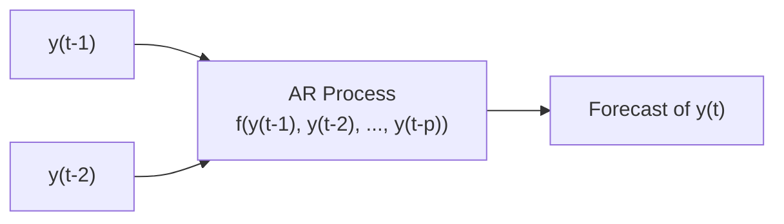

## Understanding Autoregressive (AR) Processes

So, you’re looking at historical data and notice your variable of interest—call it yₜ—seems to have elements of its own past “echoing” into the present. In finance, this often pops up with interest rates, inflation, exchange rates, even volatility measures. When the current value of a time series depends on some combination of its own past values, we call it an autoregressive (AR) model.

Put more formally (but don’t worry, it’s actually not as scary as it looks):

$$
y_{t} = c + \phi_{1} y_{t-1} + \phi_{2} y_{t-2} + \dots + \phi_{p} y_{t-p} + \epsilon_t
$$

where:  
• yₜ is the value of the series at time t.  
• c is a constant term (often interpreted as a long-run mean anchor).  
• φᵢ are the parameters capturing how much past observations yₜ₋ᵢ contribute to today’s value.  
• p is the “order” of the AR process (i.e., how many lags we include).  
• εₜ is the error term (also referred to as white noise).

In words, an AR(p) model says: “Today’s value is a sum of (1) a constant, (2) some fraction of yₜ₋₁, (3) some fraction of yₜ₋₂, … all the way up to (p) lags, plus an error term.” Many financial data series—like monthly inflation—can be reasonably well modeled by an AR(1) or AR(2). I remember once we tried an AR(6) for yield spreads, and it felt like we were reading tea leaves back six months—sometimes it’s simply too much history.

### Visualizing the AR Process

Below is a small Mermaid diagram to illustrate the general flow of an AR(p) model. Each new observation depends on its recent historical values:

## Stationarity Conditions

A critical requirement for AR models to be valid in forecasting is stationarity. Roughly, a stationary process has a constant mean and variance over time, and its autocorrelations depend only on the lag, not on the specific time period. If the process keeps drifting or its variance grows indefinitely, the AR model as stated isn’t going to do its job well.

Mathematically, stationarity often requires that the roots of the characteristic polynomial:

$$
1 - \phi_{1}z - \phi_{2}z^{2} - \dots - \phi_{p}z^{p} = 0
$$

lie outside the unit circle in the complex plane. Put more simply, we need |φ| < 1 in the AR(1) case (and analogous constraints in higher-order processes) to ensure the series doesn’t explode over time.

If you spot a time series that’s trending upward or downward too strongly, you might suspect nonstationarity. In real-world terms, if your process is heavily trending or has a structural break (like a sudden change in policy or market regime), you’d typically difference the series or apply other transformations before applying a standard AR model.

## Model Selection for AR(p)

How do you decide how many lags to include (the order p)? If you include too few lags, you might leave out important dynamics. If you include too many, you can overfit—a big no-no when your ultimate goal might be forecasting. Two common metrics to guide you are:

• Akaike Information Criterion (AIC)  
• Bayesian Information Criterion (BIC)

Both weigh goodness-of-fit against model complexity, punishing you for each additional parameter introduced. The difference is that BIC tends to impose a heavier penalty on extra parameters, often leading to a more parsimonious model. 

Let’s say you’ve tested AR(1), AR(2), AR(3), and so forth. For each, you calculate:

AIC = −2 ln(L) + 2k  
BIC = −2 ln(L) + k ln(n)

where L is the likelihood of the model, k is the number of estimated parameters, and n is the number of observations. In practice, you pick the model that yields the smallest AIC or BIC ( often you’ll check both and see if they coincide). 

## Forecasting with AR Models

Once you have your AR(p) specification, you’re ready to forecast future values. Let’s keep it simple with an AR(2) example:

$$
y_{t} = c + \phi_{1} y_{t-1} + \phi_{2} y_{t-2} + \epsilon_t.
$$

Here’s how you might forecast one period ahead, at time T:

$$
\hat{y}_{T+1|T} = c + \phi_{1} y_{T} + \phi_{2} y_{T-1}.
$$

Notice there’s no ε term in the forecast—because that’s an error with mean zero, so the best prediction for it is 0. For a multi-period forecast, we do it iteratively. For instance, a two-step-ahead forecast:

$$
\hat{y}_{T+2|T} = c + \phi_{1} \hat{y}_{T+1|T} + \phi_{2} y_{T}.
$$

Then for the next step, you keep replacing future terms with their own forecasts. This iterative process can quickly accumulate uncertainty, so keep in mind that multi-step forecasts can get fuzzy.

### Practical Example

Imagine you have monthly data on a short-term interest rate, and you suspect an AR(2) model:

1. You estimate the parameters: say c = 0.05, φ₁ = 0.7, φ₂ = 0.2.  
2. Your last two observed values are y₁₋ = 2.0% and y₂₋ = 2.5%.  
3. One-month-ahead forecast: 0.05 + 0.7(2.0) + 0.2(2.5) = 0.05 + 1.4 + 0.5 = 1.95% (some rounding used).  
4. Two-months-ahead forecast: 0.05 + 0.7(1.95) + 0.2(2.0) = 0.05 + 1.365 + 0.4 = 1.815%.  

It’s not perfect, but it’s a straightforward approach for short-term forecasting.

## Forecast Error, Confidence Intervals, and Accuracy Metrics

### Forecast Error

Forecast error is simply (actual − forecast). Over multiple observations, you’d check whether errors systematically deviate from zero. If they do, that’s a sign your model might have bias.

### Confidence Intervals

Typically, you’d place a confidence interval around forecasts to reflect the uncertainty. For an AR(1) model, the forecast variance for a 1-step-ahead forecast often looks like:

$$
\mathrm{Var}(\hat{y}_{T+1|T} - y_{T+1}) = \sigma_{\epsilon}^2
$$

but grows as you move further out. In practice, you’d estimate the variance of εᵗ and incorporate the effect of multiplying past forecast terms (because each forecasted lag has its own variance).

### Root Mean Squared Error (RMSE)

To evaluate how well your model’s doing, one popular measure is RMSE:

$$
\mathrm{RMSE} = \sqrt{\frac{1}{n}\sum_{t=1}^{n}( \hat{y}_t - y_t )^2}.
$$

A smaller RMSE means your forecasts, on average, deviate less from actuals. Note that it does not penalize positive and negative forecast errors differently—it’s a symmetric measure.

## Residual Diagnostics for AR Models

After you fit the AR(p), you want to confirm that your residuals (the difference between the fitted values and actual observations) are basically white noise—no remaining autocorrelation patterns. One widely used test is the Ljung-Box Q test, which checks the joint significance of autocorrelations at multiple lags. If your residuals are showing strong autocorrelation, your AR(p) might be incomplete or misspecified.

Additionally, you might:

• Plot the autocorrelation function (ACF) of residuals to see if any patterns remain.  
• Use the partial autocorrelation function (PACF) to glean any additional structure.  
• Check for any sign of structural breaks—maybe the data generating process changed setpoints at some time.

## Potential Pitfalls

• Overfitting: If you choose a very high p, you may capture historical quirks that won’t repeat. This leads to poor forecasts out-of-sample.  
• Ignoring Seasonality: Some series, like monthly sales or GDP, have inherent seasonality. You’d want an ARIMA or seasonal AR approach.  
• Structural Breaks: Economic policy changes or major crises can shift relationships. An AR model calibrated on old data might fail to reflect new conditions.  
• Nonstationarity: If your series is trending or has a unit root, a simple AR may give misleading results or spurious regressions.

I once had a somewhat funny (though frustrating) experience where an AR(3) that fit historically well suddenly went haywire the moment a central bank changed policy. Our estimates for φ₁, φ₂, and φ₃ were basically out the window due to that break.

## Real-World Vignette-Style Illustration

Suppose you have an item set describing a company analyzing monthly commodity prices. The data suggests an AR(2) model. A sample question might ask:

• “Based on the AR(2) model, generate a forecast for the next month’s commodity price.” You’ll have compressed data, and you’d do exactly what we outlined—plugging in the last observed prices, using the estimated φ’s, and providing a forecast.  
• Another question might say: “Examine the residual plot and the autocorrelation in the residuals. What might you conclude about the appropriateness of the AR(2) specification?” If you see leftover autocorrelation, you’d suspect an unmodeled effect—maybe seasonality or a higher AR order.  
• Or the item set could present multiple AR(p) model fits with different AIC/BIC values. Your job is to pick the “best” model. Typically, you’d choose the one with the lowest AIC or BIC.

## Conclusion and Exam Tips

In a test or practical context, remember that the AR process is all about how recent history influences the current value. Keep an eye on stationarity (no unit roots or drifting means), systematically test lags using AIC/BIC, and double-check residuals to confirm you haven’t missed any hidden structure.

On the exam, you can expect to:  
• Identify stationarity issues or a potential unit root from a vignette’s data.  
• Calculate short-term forecasts from a given AR(1) or AR(2).  
• Evaluate residual diagnostics using the Ljung-Box test or an ACF/PACF chart.  
• Spot differences in AIC/BIC and pick an appropriate model order.  

As you practice, watch out for tricky scenarios involving seasonality or structural breaks. Good luck, and don’t forget: sometimes simpler is better. Keep your model as lean as possible—particularly in fast-paced exam conditions.

## References and Further Reading

• CFA Program Curriculum, Level II, “Time‑Series Analysis.”  
• Box, G.E.P., Jenkins, G.M., and Reinsel, G.C., “Time Series Analysis: Forecasting and Control.”  

---

## AR Forecasting Mastery: Test Your Knowledge



### Which condition is necessary for an AR(p) model to be stationary?

- [ ] The sum of the AR coefficients equals 1.
- [x] All roots of the characteristic equation must lie outside the unit circle.
- [ ] The residuals must have a mean of zero.
- [ ] The variance must be zero for large t.

> **Explanation:** Stationarity in an AR(p) model requires that the roots of the characteristic polynomial lie outside the unit circle (i.e., have magnitudes greater than 1). This ensures the process does not explode over time.

### What does the constant term c in an AR(p) process generally represent?

- [ ] The residual error correction factor.
- [ ] The slope of the autoregressive process.
- [x] A long-run average or intercept around which the process fluctuates.
- [ ] A measure of volatility in the time series.

> **Explanation:** The constant term c often represents an intercept or long-run mean component, anchoring the process so it doesn’t necessarily revolve around zero.

### If an AR(2) model is given by yₜ = 0.1 + 0.6yₜ₋₁ − 0.2yₜ₋₂ + εₜ, how would you forecast y at time T+1?

- [x] 0.1 + 0.6yₜ + (−0.2)yₜ₋₁
- [ ] 0.1 + 0.6yₜ₋₁ + (−0.2)yₜ₋₂
- [ ] 0.1 + 0.6yₜ + (−0.2)εₜ
- [ ] 0.1 + (−0.2)yₜ₋₁

> **Explanation:** The one-step-ahead forecast replaces yₜ with the most recent observation and yₜ₋₁ with the second-latest observation. The error term εₜ is assumed to have zero mean.

### Which measure is frequently used for model selection by balancing fit against parameter complexity?

- [ ] Durbin-Watson Statistic
- [ ] Ljung-Box Q
- [x] Akaike Information Criterion (AIC)
- [ ] Mean Absolute Error (MAE)

> **Explanation:** The Akaike Information Criterion (AIC) is a commonly used metric that penalizes model complexity while rewarding good fit.

### When performing multi-step-ahead forecasts in an AR(p) model, what is the usual approach?

- [x] Use iterative forecasts, inserting the forecasted values back into the model for subsequent periods.
- [ ] Rely solely on the immediate last actual observation for all future steps.
- [ ] Perform a single direct calculation for all horizons simultaneously.
- [ ] Only forecast one step ahead, because more steps would be meaningless.

> **Explanation:** Multi-step-ahead forecasting for AR(p) is usually done iteratively: you forecast one step, then use that forecast in place of the actual data for the next step, and so forth.

### If the residuals from an AR(p) model exhibit significant autocorrelation, this typically suggests:

- [x] The model is misspecified or the order p is insufficient.
- [ ] The process is necessarily nonstationary.
- [ ] The variance of the error term is zero.
- [ ] The model is adequate and there are no problems.

> **Explanation:** Residual autocorrelation indicates that the model has not captured some structure in the series. You might need a higher order, or potentially a different model altogether.

### Which of the following is an advantage of using the Bayesian Information Criterion (BIC) over the AIC?

- [ ] BIC always chooses simpler models without evaluating fit.
- [x] BIC imposes a stronger penalty for additional parameters, encouraging parsimony.
- [ ] BIC is better for data sets larger than 100 observations.
- [ ] BIC has no penalty term.

> **Explanation:** BIC typically penalizes complexity more heavily than AIC, making it more likely to select smaller models when sample sizes are large.

### An AR(1) model fits the form yₜ = φ₁yₜ₋₁ + εₜ. Which statement accurately describes a stationarity requirement?

- [ ] φ₁ = 1 to maintain a consistent mean.
- [ ] φ₁ > 1 to ensure the process grows as needed.
- [ ] φ₁ < 0 to ensure cyclical patterns.
- [x] |φ₁| < 1 so values do not explode over time.

> **Explanation:** For an AR(1) process, stationarity hinges on the absolute value of φ₁ being less than 1.

### Choosing an AR(5) model over an AR(1) model might result in:

- [ ] Lower risk of overfitting.
- [ ] Guaranteed better out-of-sample performance.
- [x] A more complex model that may (or may not) improve prediction accuracy.
- [ ] A lower BIC, regardless of the data.

> **Explanation:** Higher-order AR models include more parameters and may fit the in-sample data better. However, they can overfit and may not always perform better on new data.

### True or False: The Ljung-Box Q test is used to detect autocorrelation in the residuals of a fitted time-series model.

- [x] True
- [ ] False

> **Explanation:** The Ljung-Box Q test checks for autocorrelation over multiple lags in the residuals. If the test statistic is significant, it suggests the residuals are not white noise.


