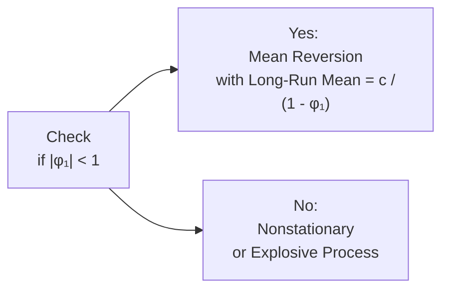

## Overview of Mean Reversion

Mean reversion is the idea that a time-series variable—like an interest rate, a stock price multiple, or even commodity prices—tends to drift back toward some long-term average after it experiences a shock. In other words, if the variable rises excessively, you might expect it to ease back down; if it falls too much, it typically creeps back up, assuming no fundamental shift in the underlying environment.

This concept is central to many finance applications. From risk management to derivative pricing, recognizing and measuring mean reversion can have a profound impact on how models are built and how trades are executed. You might have heard colleagues casually mention that “interest rates revert to 2–3% in the long run” or “Sector P/E ratios eventually return to historical norms.” That is just everyday talk of mean reversion in action.

Sometimes, I think about my own coffee budget: if I go on a splurge and buy super-fancy beans for a week, I eventually revert to my usual budget brand. The concept is the same with time-series data, just with broader consequences if you’re managing an investment portfolio.

## The AR(1) Model and Mean Reversion

A common way to detect and measure mean reversion is to model the time series using an autoregressive process of order 1 (AR(1)). The AR(1) model can be written as:


Y_t = c + \phi_1 \, Y_{t-1} + \varepsilon_t,


where:  
• \\(Y_t\\) = the value of the time series at time \\(t\\).  
• \\(c\\) = the constant term.  
• \\(\phi_1\\) = the coefficient on the lagged value of \\(Y\\).  
• \\(\varepsilon_t\\) = white-noise error term.

### Long-Run Mean (Equilibrium Level)

When \\(\lvert \phi_1 \rvert < 1\\), the process is stationary and has a well-defined long-run mean to which \\(Y_t\\) tends to revert. That long-run mean \\(Y^*\\) is given by:


Y^* = \frac{c}{1 - \phi_1}.


So if \\(\phi_1\\) is 0.8 and \\(c\\) is 0.5, then the long-run mean is:


\frac{0.5}{1 - 0.8} = \frac{0.5}{0.2} = 2.5.


That means if our variable is an interest rate or a ratio, and it gets pushed above 2.5, we expect it to come back down on average, and if it gets pushed below 2.5, we generally anticipate it going back up—again, provided that the structural conditions haven’t changed drastically.

### Speed of Adjustment

The value of \\(\phi_1\\) also dictates the so-called speed of adjustment, or how rapidly \\(Y_t\\) corrects toward its mean after a shock. When \\(\phi_1\\) is closer to zero, the process reverts faster (fewer lags for the deviation to die out). When \\(\phi_1\\) is near 1 in absolute value but still less than 1, the process reverts, but really slowly—like stretching out a rubber band that very gradually returns to its original form.

If \\(\phi_1\\) is negative, the series may oscillate around the mean, potentially overshooting above and below before settling into equilibrium. Think of a pendulum swinging back and forth around the vertical center line.

Below is a simple flowchart summarizing how to determine if a process is mean-reverting under an AR(1) framework.

## Practical Finance Examples of Mean Reversion

### Interest Rates
Short-term interest rates often exhibit mean-reverting tendencies—though “often” is a loaded term because during certain economic regimes, extreme monetary policy can push rates away from historical norms. Nonetheless, historically, many short-term rates do drift around a central tendency, making simple AR(1)-type models a starting point in forecasting or pricing interest rate derivatives.

### Price-Earnings (P/E) Ratios
Market participants sometimes argue that the price-earnings ratio for entire equity markets, such as the S&P 500, oscillates around a long-run mean, say 15 or 16. If you find the market P/E jumping to 22, a classic mean-reversion perspective suggests that it's “expensive” and might drop back. Likewise, if it goes down to 12, it might be “cheap” and drift upward. However, one must be cautious: fundamental changes in technology, growth prospects, or risk premiums can alter that perceived long-run mean.

### Commodity Prices
Commodities often experience cycles: if prices skyrocket, producers may ramp up production, which eventually lowers prices and leads to reversion. You might witness a damping effect around an equilibrium cost of production. But just as with coffee budgets, if there’s a structural shift in demand (e.g., a global shortage), the old mean becomes irrelevant.

## Implications for Asset Pricing and Strategy

1. Risk Management: For risk managers, if a key variable is mean-reverting, extreme moves can be less persistent than a random walk would suggest, and hedging strategies might be adjusted accordingly.  
2. Derivatives Pricing: Many pricing models, especially for interest rate derivatives, incorporate mean reversion to avoid the unrealistic scenario of rates wandering off to extremely high or negative territory indefinitely.  
3. Fundamental Valuation: If you track a ratio believed to have a stable long-run mean, you can adjust your buy/sell strategies based on when the ratio is deviating significantly from that mean.  
4. Momentum vs. Contrarian: Mean-reversion logic can underpin contrarian strategies—buy when the price is well below the long-run mean, sell (or short) when it’s far above it. Meanwhile, momentum strategies benefit if reversion lags or if \\(\phi_1\\) is close to 1, so it’s important to confirm whether the variable truly reverts or just drifts.

## Mean Reversion vs. Nonstationarity

It’s easy to confuse a slow mean-reverting process with a truly nonstationary one (like a random walk). If \\(\phi_1\\) is exactly 1, we have a unit root, and there is no stable long-run mean. The series can wander indefinitely. If \\(\phi_1\\) is near 1, you might detect partial reversion but it could take a long time to manifest.

Even if a formal test suggests that \\(\phi_1 < 1\\), you want to check the standard error around that estimate. If there’s high uncertainty—like \\(\phi_1 = 0.97\\) with a large margin of error—then the data might be consistent with a random walk. So in practice, you’d run stationarity tests, conduct robust analysis, and consider fundamentals (like whether your painfully expensive coffee beans are a new habit or just a fling).

## Structural Breaks and Regime Shifts

Sometimes, mean reversion breaks down because the underlying economic regime changes. For instance, a major shift in technology or regulation can make the historical mean for a variable irrelevant. Many interest rate watchers argue that post-2008 or post-pandemic, the “normal” level of rates changed drastically due to policy decisions. Or a particular commodity might discover new uses, changing its demand outlook.

When such structural breaks occur, your AR(1) model with a fixed \\(c\\) and \\(\phi_1\\) might not be valid. You’d need to adjust or look for segmented models or time-varying parameters. In a CFA item set, they'd love to test whether you can detect that the old model is no longer appropriate. Watch out for data that shifts mid-sample.

## Working Through an Example

Imagine we have a monthly short-term interest rate \\(r_t\\) that follows:


r_t = 0.5 + 0.85 \, r_{t-1} + \varepsilon_t.


• The implied long-run mean is \\(0.5 / (1 - 0.85) = 3.33\%\\).  
• Because \\(\phi_1 = 0.85\\), the speed of reversion is moderate: the rate corrects about 15% of the gap from its equilibrium each month.  
• If \\(r_{t-1}\\) is 5%, then \\(r_t\\) is expected to be \\(0.5 + 0.85 \times 5\% = 4.75\%\\), a downward pull from 5% toward 3.33%.  
• After each shock, the rate inches back toward 3.33%, unless there’s a structural shift that permanently changes the mean.

A typical item-set question might give you the AR(1) equation, possibly show a plot of actual vs. fitted values, and ask you about whether you believe there’s mean reversion, how to calculate that mean, and how this affects a hypothetical bond pricing or interest rate swap.

## Potential Pitfalls

• Overfitting: Believing a series is mean-reverting when the sample period is too short.  
• Ignoring Breaks: Failing to spot regime shifts that render old means invalid.  
• Confusing Unit Roots with Slow Reversion: Probability tests are essential here. A \\(\phi_1\\) estimate near 1 demands thorough stationarity checks.  
• Overconfidence in Speed: If \\(\phi_1\\) changes over subperiods, your estimates of speed of adjustment might be off, leading to poor strategy.

## Vignette-Style Scenario

Suppose you’re an analyst evaluating commodity prices for an agricultural fund. You notice that historically, wheat prices follow a process with \\(\phi_1 = 0.7\\), reflecting moderate mean reversion to some equilibrium cost of production. One day, you see that extreme tariffs and new regulations might permanently change cost structures. In a test question, you’d be asked:

• Does the old model with \\(\phi_1 = 0.7\\) still apply now that these new rules exist?  
• If it doesn’t, how might you adjust your approach?  
• If it does, how would you compute your best forecast next month if the current price is significantly above the historical mean?

Answering carefully, you’d explain that the new structural regime possibly requires a re-estimation of the model with post-tariff data, because the old mean might no longer hold.

## Exam Tips and Strategies

• Memorize the formula for the long-run mean: \\(\frac{c}{1 - \phi_1}\\). This is guaranteed to appear in time-series item sets.  
• Be ready to interpret the size of \\(\phi_1\\). If they show \\(\phi_1\approx 0.9\\) or higher, you should suspect slow reversion or potential nonstationarity.  
• Always watch out for hints of structural breaks. The exam might show a shift or mention “unprecedented changes,” urging you to question the old model.  
• Practice with residual diagnostics. Evaluate whether the error terms are white noise—if not, you might not have specified the model correctly.

## Glossary

Mean Reversion  
: The phenomenon where a variable tends to move toward its long‑term average (often modeled via AR(1) processes in time-series).

Long-Run Mean  
: The stable equilibrium level around which fluctuations occur.

Speed of Adjustment  
: How quickly a process returns to its long‑run mean after a shock. Typically influenced by the magnitude of \\(\phi_1\\) in an AR(1) model.

Regime Shift  
: A change in the underlying process—such as new regulations or structural changes—that invalidates previous relationships (or the old mean).

## References and Further Reading

• CFA Institute Level II Curriculum, “Time‑Series Analysis.”  
• Pindyck, R.S., and Rubinfeld, D.L., Econometric Models and Economic Forecasts.  

## Test Your Knowledge: Mean Reversion in Asset Pricing Quiz



### 1. Which condition on φ₁ in an AR(1) process implies mean reversion?
- [ ] |φ₁| > 1
- [x] |φ₁| < 1
- [ ] φ₁ = 1
- [ ] φ₁ = 0
> **Explanation:** For an AR(1) process Yₜ = c + φ₁Yₜ₋₁ + εₜ to be mean reverting, we need |φ₁| < 1 so that the effects of shocks dissipate over time.

### 2. A mean-reverting time-series with c = 1 and φ₁ = 0.75 has which long-run mean?
- [ ] 0.75
- [ ] 3
- [x] 4
- [ ] 1
> **Explanation:** The long-run mean is c / (1 – φ₁) = 1 / (1 – 0.75) = 1 / 0.25 = 4.

### 3. If φ₁ is close to 1 but still less than 1, which statement best describes the time-series?
- [x] The series reverts slowly to the mean.
- [ ] The series has no mean.
- [ ] The series reverts immediately in one period.
- [ ] The series is trending upward with no return to the mean.
> **Explanation:** When φ₁ is near 1 (e.g., 0.95 or 0.99), it indicates that shocks persist for a long time, resulting in very slow mean reversion.

### 4. In a mean-reverting AR(1) model, a negative φ₁ implies:
- [x] The process may oscillate around the mean.
- [ ] Nonstationary behavior.
- [ ] Explosive growth.
- [ ] Immediate reversion to zero.
> **Explanation:** A negative φ₁ can cause the process to alternate above and below the mean, especially if its magnitude is less than 1.

### 5. Which of the following scenarios most likely indicates a structural break?
- [ ] The magnitude of φ₁ changes by 0.01 between two samples.
- [ ] The regression’s standard error remains roughly constant over the sample.
- [x] An abrupt shift in the series mean after major policy changes.
- [ ] An increase in sample size.
> **Explanation:** A structural break occurs when the underlying rules governing the data have changed significantly, often observed via a sudden shift in the mean or pattern of the data.

### 6. If an AR(1) model yields φ₁ = 1.02, how should you interpret it?
- [x] The process is explosive or nonstationary.
- [ ] The series is strongly mean reverting.
- [ ] The model is definitely correct because φ₁ > 1 ensures quick reversion.
- [ ] This result implies no shock can occur.
> **Explanation:** For stationarity, we need |φ₁| < 1. A φ₁ > 1 suggests an explosive or nonstationary process.

### 7. From a risk management perspective, why is mean reversion important?
- [ ] It ensures all models remain valid under stress scenarios.
- [x] It provides insight into how extreme deviations might revert to normal, affecting hedge strategies.
- [ ] It eliminates the need for regular rebalancing.
- [ ] It guarantees that losses are always recouped in the short term.
> **Explanation:** Recognizing mean reversion helps estimate how quickly or slowly a variable will return to ordinary levels, which is crucial in designing hedges.

### 8. A potential pitfall in mean reversion analysis is:
- [ ] Considering sample size in the regression.
- [ ] Including a constant term.
- [x] Failing to account for regime shifts.
- [ ] Testing for stationarity.
> **Explanation:** If you don’t account for possible regime shifts, you might incorrectly assume the same linear mean reversion holds across very different economic conditions.

### 9. Which best describes overshooting in the context of mean reversion?
- [ ] The process stays at the mean once reached.
- [x] The process surpasses the mean and swings in the opposite direction.
- [ ] The process never returns to the mean at all.
- [ ] The mean moves outward indefinitely.
> **Explanation:** Overshooting refers to the phenomenon where a series goes beyond its mean in the opposite direction before settling back.

### 10. True or False: A price-series with φ₁ = 0.5 in an AR(1) model will converge to its mean faster than one with φ₁ = 0.9.
- [x] True
- [ ] False
> **Explanation:** When φ₁ is smaller (e.g., 0.5 vs. 0.9), the speed of adjustment is higher, so the series will converge to the mean faster.


