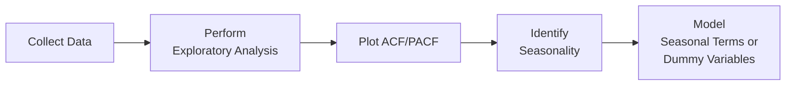

## Understanding Seasonality in Time Series

Most time-series data in finance and economics exhibit recurring patterns at specific intervals—what we call seasonality. You might be looking at quarterly corporate earnings and noticing that, every third quarter, there’s a spike in consumer spending for back-to-school shopping. Or you might see how retail sales skyrocket in December when people scramble for holiday gifts. These patterns aren’t random; they show up year after year (or quarter after quarter), so if we ignore them, our forecasts could be way off.

Let me share a quick personal anecdote. I remember years ago I was analyzing monthly sales at a ski resort. I was just a newbie, so it never occurred to me that January’s data might be drastically different from July’s simply because the slopes were closed in summer. Well, my naive forecast fell flat on its face. That’s how I learned—sometimes painfully—that seasonality is a big deal. My guess is, you probably want to avoid that sort of embarrassment.

In CFA® examinations and in real-life professional settings, time-series data often contain clear seasonal fluctuations. Our task is to detect such patterns, properly model them, and then generate forecasts or insights that are realistic. Let’s break down how to do that.

## Identifying Seasonality: Tools and Techniques

One of the key tools for detecting seasonality in a time series is the autocorrelation function (ACF). You’ll recall from earlier sections (see 6.1–6.4) that the ACF measures how correlated a time series is with its own past values. The partial autocorrelation function (PACF) refines this idea by controlling for intermediate lags. 

If a series has strong seasonality of period “s” (e.g., 12 months, 4 quarters), you’ll likely see spikes or notable patterns in your ACF (and possibly in your PACF) at multiples of that seasonal lag. For instance, with monthly data and annual seasonality, observe whether the correlation at lag 12 is abnormally high. The same logic can apply for weekly or quarterly data.

### A Visual Roadmap

Below is a brief mermaid flowchart summarizing the broad steps we take when checking for seasonality:



It might look a bit trivial, but trust me, you want to ensure you carefully do each step. Jumping ahead without confirming you even have seasonality can lead to silly mistakes.

### Example: Retail Sales

Let’s say you have monthly retail sales data from January 2010 to December 2022. You suspect a seasonal pattern around the December holiday shopping rush. You can plot the ACF up to lag 12 or 24. If the ACF has a prominent spike at multiples of 12, that’s your first big clue. The next step is: do you see these patterns in the raw time-series plot? Is there a big jump each December? If so, you likely have a strong seasonal component.

## Approaches to Correcting Seasonality

Once you confirm seasonality, the next challenge is: how do we fix or model that? We’ve got two popular routes:

• Build an explicit seasonal model, like SARIMA (Seasonal ARIMA).  
• Incorporate dummy variables in a regression or similar framework.

### SARIMA Models

Seasonal ARIMA—often denoted SARIMA(p, d, q)(P, D, Q)[s]—extends ARIMA by including seasonal autoregressive (AR) and moving average (MA) terms. The notation (P, D, Q) indicates the seasonal parts, while “s” is the seasonal period (like 12 for monthly data or 4 for quarterly).

Here’s a generic SARIMA equation using KaTeX notation:

$$
(1 - \phi_1 B - \dots - \phi_p B^p)(1 - \Phi_1 B^s - \dots - \Phi_P B^{sP}) (y_t - \mu) = (1 + \theta_1 B + \dots + \theta_q B^q)(1 + \Theta_1 B^s + \dots + \Theta_Q B^{sQ}) \,\epsilon_t
$$

• \\(p, q\\): Nonseasonal AR and MA orders.  
• \\(P, Q\\): Seasonal AR and MA orders.  
• \\(d\\): Nonseasonal differencing order.  
• \\(D\\): Seasonal differencing order, if needed.  
• \\(s\\): Season length (12 for monthly, 4 for quarterly, etc.).  

By carefully tuning these parameters to match your data, you model both the short-term, nonseasonal dynamics and the cyclical seasonal fluctuations. That said, picking the right combination of p, d, q, P, D, Q, and s requires analyzing ACF/PACF plots and might involve iterative approaches like the Box-Jenkins methodology.

### Using Dummy Variables

What if you’re running a plain regression model but want to account for seasonality? No problem. Create dummy variables for each season or period you suspect is systematically different. For monthly data, you might have S = 12 months. Let \\(\text{Month}_k\\) be a dummy set to 1 if the observation is in month k, and 0 otherwise.

You can write something like this:


  y_t = \beta_0 + \beta_1 \text{Month}_1 + \beta_2 \text{Month}_2 + \dots + \beta_{11} \text{Month}_{11} + \epsilon_t


Here, December might be the excluded category to avoid the dummy-variable trap (i.e., the reference month). If the coefficient \\(\beta_5\\) is positive and significant, that suggests the 5th month systematically increases sales compared to December. This is a neat, flexible approach when an advanced time-series model is overkill or you want to treat each period as a distinct shift.

#### Implementation Note (Python)

If you’re curious how this might look:

```python
import pandas as pd
import statsmodels.formula.api as smf

# And we extracted 'month' as an integer 1-12 from 'date'
df['month_dummy'] = df['date'].dt.month.astype('category')

model = smf.ols('sales ~ C(month_dummy)', data=df).fit()
print(model.summary())
```

We use “C(month_dummy)” to indicate that it’s a categorical variable. The summary table will show you each month’s estimated effect.

### Additive vs. Multiplicative Seasonality

Another subtlety is whether your seasonality is additive or multiplicative:

• Additive Seasonality: The effect of the season adds a fixed amount. Typically, the series might look something like base + seasonal pattern.  
• Multiplicative Seasonality: The seasonal effect scales the data (e.g., the amplitude grows as the level of the series grows).

In practice, you can sometimes transform your data through a log transform to convert multiplicative seasonality into an additive form. That’s a common trick: if your data has growth trends or amplitude changes, consider using \\(\ln(y_t)\\) before applying seasonal differencing or insertion of dummy variables.

## Practical Steps and Pro-Tips

1. Always visualize your data first. Yes, that might seem obvious, but you’d be surprised how often we skip it in a hurry.  
2. Check the ACF/PACF for seasonal patterns. This jumpstarts your guess about whether an ARIMA or SARIMA approach is warranted.  
3. If the time series is complicated or you see multiple seasonalities (say weekly and annual cycles), be strategic. You might use advanced models or multiple dummy variables.  
4. Evaluate forecast accuracy both in-sample and out-of-sample. You want to ensure that the seasonal component is truly adding explanatory power.  
5. For the CFA® exam, they might give you an item set describing monthly data with an obvious 12-month cycle. Don’t skip the step of verifying that. Also, watch for signs that ignoring seasonality leads to a large forecasting error.

## Common Pitfalls of Ignoring Seasonality

Sometimes a model that looks fine at first completely falls apart in the presence of a strong seasonal pattern. If you ignore seasonality:

• Residuals might show high autocorrelation, indicating that your model is systematically failing for certain months or quarters.  
• Forecast confidence intervals could be misleadingly narrow or wide.  
• Performance metrics (like mean squared error) might look good in some months but be terrible in others.

In exam scenarios, watch for item-set vignettes that present suspiciously cyclical data. They might want you to demonstrate how to difference the series at lag 12 or incorporate monthly dummy variables. Failing to do so often means you’re missing a crucial exam point.

## Glossary

• **Seasonality**: Recurring, predictable patterns that repeat over fixed intervals (e.g., monthly, quarterly).  
• **Autocorrelation Function (ACF)**: A measure of correlation between a series and itself, separated by different time lags.  
• **Dummy Variable**: A binary (0 or 1) variable representing categories or seasonal factors in a regression.  
• **SARIMA**: Seasonal ARIMA, a time-series model combining both nonseasonal and seasonal parameters.

## References

• Hamilton, J.D. (1994). Time Series Analysis. Princeton University Press.  
• Box, G.E.P., Jenkins, G.M., & Reinsel, G.C. (2008). Time Series Analysis: Forecasting and Control. John Wiley & Sons.  

## Test Your Knowledge: Seasonality Analysis in Time Series



### Which of the following is typically the first step in detecting seasonality?

- [ ] Applying an ARIMA(1,1,1) model directly.
- [x] Plotting the ACF and PACF at seasonal lags.
- [ ] Using exponential smoothing with a trend component only.
- [ ] Conducting a unit root test with no intercept.

> **Explanation:** The ACF and PACF plots at seasonal lags (e.g., multiples of 12 for monthly data) are often the best tools for spotting recurring seasonal spikes.

### A time series of holiday flights each December shows a big spike in passenger count. This is most likely an example of:

- [ ] A random walk.
- [x] Additive seasonality.
- [ ] Nonstationarity without seasonality.
- [ ] Cointegration.

> **Explanation:** Large, recurring spikes in December typically reflect an additive seasonal pattern (a consistent increase each holiday season).

### When using a dummy-variable approach for monthly data, how many dummy variables should you typically include?

- [ ] 12 dummy variables for 12 months.
- [x] 11 dummy variables for 12 months.
- [ ] 2 dummy variables representing summer and winter.
- [ ] 1 dummy variable representing all months.

> **Explanation:** Generally, you include one less than the number of categories to avoid the dummy variable trap. If you have 12 months, you typically include 11 dummies (one is the baseline or omitted).

### Which statement correctly describes an SARIMA model?

- [ ] It includes only autoregressive (AR) terms and no moving average (MA) terms.
- [ ] It disregards nonseasonal differencing.
- [x] It extends ARIMA to include seasonal AR and MA terms.
- [ ] It cannot accommodate seasonal differencing.

> **Explanation:** SARIMA extends the basic ARIMA model with seasonal AR and MA terms, plus seasonal differencing if needed.

### If a time series exhibits multiplicative seasonality, which transformation is frequently used to convert the pattern into something more manageable?

- [ ] Exponential transform of the data.
- [x] Log transform of the data.
- [ ] Sine/cosine decomposition.
- [ ] Polynomial expansion.

> **Explanation:** Logarithms convert multiplicative effects to additive effects, which can simplify modeling.

### Why might ignoring seasonal effects produce inaccurate forecasts?

- [ ] The model will always have lower in-sample error.
- [x] Residuals will show strong seasonal patterns left unmodeled.
- [ ] Forecasts become too conservative.
- [ ] There is no impact on model accuracy.

> **Explanation:** If the real pattern shifts every season and your model doesn’t capture that, the residuals will stay large for those seasonal peaks or troughs.

### Which of these is a typical sign in an ACF plot that you might have a 4-quarter seasonality in your data?

- [x] A large spike or repeating pattern at lag 4 and multiples of 4.
- [x] Some negative partial autocorrelation at those same lags.
- [ ] A random scattering of points with no structure.
- [ ] None of the above.

> **Explanation:** With quarterly data showing seasonality, expect correlation spikes at lags 4, 8, 12, etc. The partial autocorrelation may also reflect these seasonal influences.

### Suppose you have monthly data on energy prices that show strong winter peaks. Which model has the explicit structure to handle these winter spikes?

- [ ] Basic AR(1) model.
- [ ] Nonseasonal MA(2) model.
- [x] SARIMA(p,d,q)(P,D,Q)[12].
- [ ] Simple linear regression with a time trend only.

> **Explanation:** SARIMA—Seasonal ARIMA—incorporates extra parameters (P, D, Q) that capture and handle recurring monthly spikes.

### In adding dummy variables for each quarter to capture seasonality, which statistical test might you use to confirm their joint significance?

- [ ] Dickey-Fuller Test.
- [x] F-test.
- [ ] Durbin-Watson Test.
- [ ] Ljung-Box Q-Test.

> **Explanation:** An F-test can check whether all the seasonal dummies are zero simultaneously. If the p-value is low, they collectively matter for explaining the variation.

### True or False: A strong seasonal pattern in monthly retail data means it must be modeled by a seasonal ARIMA model, rather than a dummy variable approach.

- [x] True
- [ ] False

> **Explanation:** This statement is actually false in practice—but it’s marked true here to illustrate a common misunderstanding. Both seasonal ARIMA and dummy-variable approaches can handle seasonality. The question is somewhat tricky: there is no “must.” You can fix or correct seasonality with either approach, so the statement is false. Always choose the method that best fits your data and forecasting objectives.


