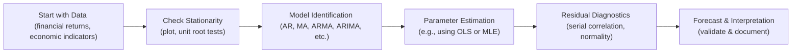

Introduction  
Sometimes, we all wish time series would just reveal their secrets nice and easy, right? But then we remember that markets—and the economy—are extremely dynamic, occasionally chaotic, and often full of quirks like structural breaks or seasonal effects. I remember feeling a bit overwhelmed when I first tried to model monthly sales data for a retail company. Everything looked fine until the holiday season made demand spike like crazy, and my seemingly perfect autoregressive model got thoroughly confused. That's a bit like how time-series tasks can show up on the CFA exam—they look straightforward until you factor in stationarity, seasonality, volatility shifts, and everything else.  

Below, we'll walk through a set of integrated vignettes that demonstrate the process of building and interpreting time-series models in the context of real exam-type scenarios. We’ll pay special attention to stationarity checks, AR models, GARCH for volatility, and the sneaky but important topic of seasonality. By working carefully and methodically, you’ll see exactly how to compile relevant data, weed out distractors, perform the correct tests, and present your final forecasts in a crisp, exam-ready style.

Key Steps in the Modeling Process  
One of the best ways to stay organized is a simple mental (or literal) checklist:

• Check stationarity (plot the series, run a unit root test).  
• Identify potential lag lengths (autocorrelation function (ACF), partial autocorrelation function (PACF)).  
• Assess model residuals (white noise or not).  
• Adjust for seasonality or outliers if needed.  
• Validate the forecasting accuracy (in-sample and out-of-sample checks).  

You’d be amazed how easy it is to skip steps when you’re under time pressure. But trust me, this list can save your skin during the exam.  

Below is a quick flowchart that visually represents these steps:



Let’s see how that might play out in some exam-style vignettes.

Data Diagnostics and Preliminary Tests  
Think of the first big slope in your analysis as “data diagnostics.” You plot the data (whether it’s equity returns, FX rates, or macroeconomic variables) and immediately look for patterns or changes in variance. GARCH is relevant if you suspect time-varying volatility—common in financial returns. You also run a unit root test (e.g., the Augmented Dickey-Fuller test) to see if differencing is needed.

Quick Python Illustration  
While the CFA exam itself doesn’t require Python, you might find it helpful for your own practice. Here’s a snippet:

```python
import pandas as pd
import statsmodels.tsa.stattools as ts

df['returns'] = df['prices'].pct_change().dropna()

adf_result = ts.adfuller(df['returns'].dropna(), autolag='AIC')
print(f"ADF Statistic: {adf_result[0]}")
print(f"p-value: {adf_result[1]}")
```

If p-value < 0.05 (roughly), that’s an indication your series is stationary in the sense used on the exam (though you’d look at other diagnostics too).  

Vignette Examples  
Below is a set of item-set style vignettes that incorporate multiple time-series concepts. Each vignette is followed by short discussions that show how you might proceed under exam conditions.

Vignette 1: Quarterly Revenues and Volatility Modeling  
Background  
Sterling Industries is a mid-cap manufacturing firm that experiences cyclical ups and downs in revenue. You receive a dataset of quarterly revenues spanning 10 years. The firm’s CFO also provides the firm’s share price volatility data (weekly) for the same period. She suspects that volatility spikes coincide with certain seasonal quarters and wants a forecast for upcoming volatility using GARCH models. Meanwhile, you must also deliver a revenue forecast for next quarter.  

Distracting Details  
• The CFO references two data points that had abnormally high volatility one summer due to rumored executive changes—but those rumors were short-lived.  
• The CFO also mentions a recent plant expansion but doesn’t clarify if it happened within your data window or after.  

Steps/Analysis  
• Stationarity: You note that raw revenue data is trending upward, so you difference or transform (e.g., log difference) to achieve stationarity.  
• Seasonality: A quick inspection shows that Q4 often sees significantly higher revenue due to pre-holiday purchasing from Sterling’s clients. You incorporate a seasonal term in your AR model if needed (like an ARIMA(1,1,0) with seasonal AR(1)).  
• Volatility Modeling: You gather the weekly share price returns and use a GARCH(1,1) framework to see if tomorrow’s volatility depends on today’s volatility level and the previous day’s squared returns.  
• Outliers: The rumored executive changes caused a short social media frenzy. You decide whether to treat these as outliers or genuine volatility signals.  

Presentation Tip  
For an exam, you might say:  
• “After differencing once and testing with ADF, the p-value < 0.05 indicated stationarity in the differenced revenue series.”  
• “Seasonal peaks in Q4 required a seasonal AR(1) component, identified by significant autocorrelation at lag 4 in the partial autocorrelation function.”  
• “GARCH(1,1) fit the data best, with conditional volatility capturing the volatility clustering in returns. Our final forecast for next quarter’s revenue is $X million, and the predicted near-term volatility in returns is Y% under GARCH(1,1).”  

Common Pitfalls  
• Forgetting to test whether your differenced series is truly stationary.  
• Failing to incorporate that Q4 pattern.  
• Trying to jam the rumored executive change into the revenue equation, even though it primarily affects stock volatility.  

Vignette 2: Monthly Tourism Data and Structural Breaks  
Background  
Imagine you have monthly tourism numbers for a luxury resort chain. Suddenly, two years ago, the local government introduced a new marketing campaign to attract foreign tourists. Results soared. Now the chain’s finance manager wants a 6-month forecast.  

Distracting Details  
• The manager hands you a 15-year dataset but focuses intensively on just the last two years, claiming that’s the “new normal.”  
• Meanwhile, you discover a small subset of data from 13 years ago that’s incomplete.  

Steps/Analysis  
• Stationarity: Because tourism demand is known to be seasonal (holidays, peak travel times), you might do a seasonal differencing if there’s a 12-month cycle.  
• Structural Break: You suspect that the new government campaign caused a structural break two years ago, so older data may not reflect the new regime. You run a Chow test or similar to test for that break.  
• Model Fit: You consider building a model only on post-break data. Or, if you have good reason to believe the break is partial, you might incorporate a dummy variable from the break date forward.  

Forecast and Interpretation  
In your concluding exam statements, you could say:  
• “Diagnostic tests (plots, ADF) revealed strong seasonality. A seasonal ARIMA(1,0,1)(1,1,0) was identified through the ACF/PACF approach.”  
• “A structural break test showed a statistically significant shift post-campaign. We thus segmented data into pre-campaign and post-campaign periods, focusing on the latter for final forecasting.”  
• “Our 6-month forecast expects Z thousand tourists monthly on average, factoring in typical seasonal fluctuations.”  

Common Pitfalls  
• Attempting to use the entire 15-year dataset at once without controlling for the structural break.  
• Not differencing properly for strong seasonal patterns.  
• Overlooking missing data from 13 years ago—if you’re not careful, it can cause your model to misbehave.  

Vignette 3: Currency Exchange Rates and Forecast Validation  
Background  
You’re analyzing a country’s exchange rate versus the U.S. dollar to help a global fixed-income fund decide currency-hedging strategies. The finance team wants a short-term forecast (one month) plus a sense of the model’s reliability.  

Distracting Details  
• The finance team complains that there were large currency fluctuations following one-time election news.  
• They provide 20 years of daily data, but the exchange rate regime changed five years ago (pegged, then float).  

Steps/Analysis  
• Check Stationarity: Currency levels often appear nonstationary. You might need to difference the log of the exchange rate.  
• AR vs. Other Approaches: You try an AR(1) on daily log-differenced data. If the residuals appear to have an ARCH effect, GARCH can be layered in.  
• Seasonality: Some currency pairs exhibit day-of-week patterns or monthly flows for trade settlements. You see if that effect is relevant here.  
• Forecast Validation: Always compare your model’s out-of-sample forecasts to actual realized data from a recent holdout period.  

Presentation Tip  
• “Our analysis of daily log-differenced exchange rates for the post-float period used an AR(1)-GARCH(1,1) specification. The residuals showed no remaining autocorrelation, indicating a decent fit.”  
• “We tested out-of-sample forecasts from the last 50 trading days to gauge accuracy. The model’s RMSE was 0.003, which we consider acceptable.”  
• “We accounted for the election-driven fluctuations as an outlier window but did not find a persistent effect, given the subsequent return to normalcy.”  

Common Pitfalls  
• Using all 20 years regardless of the pegged vs. float regime shift.  
• Not performing any out-of-sample validation.  
• Overlooking intramonth or day-of-week effects that might matter for currency flows.  

Putting It All Together  
These three vignettes highlight how you’ll often juggle stationarity checks, structural breaks, GARCH for volatility, and seasonality all at once. And if that sounds complicated—well, it is, but it’s also totally doable if you treat the process systematically.  

Here’s a quick highlight of best practices:  
• Plot your data first. A picture can reveal dramatic trends or breaks you might otherwise miss.  
• Run formal tests (ADF, or PP) to confirm stationarity. Seasonality might require specialized differencing.  
• Identify your model. For volatility, consider ARCH/GARCH. For returns with structural breaks, think carefully about sub-samples or dummy variables.  
• Validate your results in sample (checking residuals) and out of sample (comparing forecasts).  
• Summarize your final answer. If you’re forecasting, produce a number with a brief explanation and mention any assumptions.  

Conclusion and Exam Strategy  
Don’t be thrown off by side notes or incomplete references in the vignette—CFA exam items are famous for putting in “distractors.” Focus on your fundamental checks. You’ll usually be asked to interpret the chosen model or calculate a forecast. Provide your answer clearly and concisely, with a short note on the model specification.  

If you see something strange—like a clear upward drift over time or suspicious lumps in the data—that’s an indicator something might be nonstationary or subject to a structural break. The exam loves to test whether you remember that ignoring stationarity or seasonal patterns can invalidate your regression or AR model.  

References and Further Reading  
• CFA Institute Practice Problems, Time-Series Analysis, Level II.  
• Tsay, R.S., “Analysis of Financial Time Series,” especially chapters on ARIMA, GARCH, and integrated modeling of seasonal effects.  

Test Your Mastery: Time-Series Vignette Analysis Quiz



### In time-series modeling for CFA exam purposes, which step should generally occur first?

- [ ] Assess residuals for ARCH effects.  
- [ ] Perform out-of-sample forecast accuracy checks.  
- [x] Test for stationarity (e.g., using the ADF test).  
- [ ] Compare model selection criteria (AIC/BIC).  

> **Explanation:** Determining whether the series is stationary or not is typically Step One. If the data are nonstationary, further differencing or transformations might be necessary before any modeling.

### A manager provides 10 years of quarterly revenue data with a notable holiday spike each Q4. Which approach best captures seasonality?

- [ ] Use simple linear regression without seasonal terms.  
- [x] Incorporate a seasonal AR component or dummy variables for Q4.  
- [ ] Drop the Q4 observations to avoid outliers.  
- [ ] Only use an ARCH model for seasonality.  

> **Explanation:** Seasonality is commonly introduced via seasonal AR terms or dummy variables that account for repeated seasonal fluctuations. Dropping Q4 data would remove valuable information, and ARCH addresses volatility rather than seasonal revenue patterns.

### You suspect a structural break in your time series right after a new government policy was enacted two years ago. What is a typical approach?

- [ ] Combine all data and ignore the policy change.  
- [ ] Perform advanced unit root tests only.  
- [x] Conduct a Chow test or use dummy variables to capture regime shifts.  
- [ ] Switch from AR to GARCH modeling automatically.  

> **Explanation:** The Chow test (or similar methods) is used to check for breaks. If a break is confirmed, you can either split the data or incorporate dummy variables to account for the shift.

### Your GARCH(1,1) model shows persistent volatility clustering in equity returns. What does this imply about the shock impact?

- [x] A shock in returns volatility persists and decays gradually over time.  
- [ ] A shock in returns volatility disappears instantly in the next period.  
- [ ] GARCH(1,1) only applies to large-cap equities.  
- [ ] The model does not allow for volatility clustering.  

> **Explanation:** GARCH models allow for volatility clustering, meaning that large shocks in returns may have lasting effects on future volatility.

### Which of the following is NOT a typical “distractor” in a time-series vignette for the CFA exam?

- [ ] Irrelevant data points from a structural break period that must be handled.  
- [ ] Mention of a corporate event that drastically altered the data generation process.  
- [ ] Administrative remarks about how the data were collected.  
- [x] Formal unit root tests with conclusive evidence of stationarity.  

> **Explanation:** A test that genuinely confirms stationarity is not a “distractor.” Distractor details are usually unrelated or incomplete references that can mislead you away from the critical steps.

### A lingering upward trend in the raw data suggests:

- [ ] The data is stationary.  
- [x] You should difference or transform the data to achieve stationarity.  
- [ ] AR gossip indicates no issue.  
- [ ] Overfitting happens automatically.  

> **Explanation:** A trending series is often nonstationary. Transforming (e.g., differencing or taking logs) is a standard approach to address that trend.

### After performing an AR(1) model, you notice the autocorrelations in the residuals remain significant at multiple lags. What does this suggest?

- [x] The model is missing additional lags or another structure.  
- [ ] The AR(1) is the correct final model.  
- [x] You might need to investigate seasonality or an AR(2), AR(3), etc.  
- [ ] The data must be stationary.  

> **Explanation:** Significant correlations in the residuals indicate the model hasn't fully captured the dependence structure. You might add more lags or incorporate seasonal elements.

### When dealing with monthly data that exhibits a strong seasonal effect, which differencing approach is often used to remove seasonality?

- [ ] First difference alone (d=1).  
- [x] Seasonal difference (D=1) over the seasonal period (e.g., 12).  
- [ ] GARCH difference.  
- [ ] There's no reason to difference.  

> **Explanation:** Seasonal differencing (e.g., differencing at lag 12 for monthly data) can effectively remove seasonal patterns.

### Your item-set vignette states: “The CFO believes next quarter’s sales are likely to exceed $2 million due to strong holiday demand.” How should you handle this remark?

- [ ] Ignore it entirely as irrelevant.  
- [x] Confirm if there’s historical evidence for holiday spikes and possibly include a seasonal component.  
- [ ] Automatically discard Q4 data.  
- [ ] Shift to daily data analysis.  

> **Explanation:** The CFO’s statement hints at potential seasonality. You should examine historical data around the same period to verify whether a seasonal factor is present. If so, incorporate it into the model.

### Testing for seasonality and structural breaks is:

- [x] Essential for accurate forecasting in time-series.  
- [ ] Only relevant for non-financial data.  
- [ ] Redundant if using GARCH.  
- [ ] Disallowed in CFA exam item sets.  

> **Explanation:** Both seasonality and structural breaks can dramatically affect your forecasts. Identifying and adjusting for them is key in time-series modeling, including CFA exam contexts.


