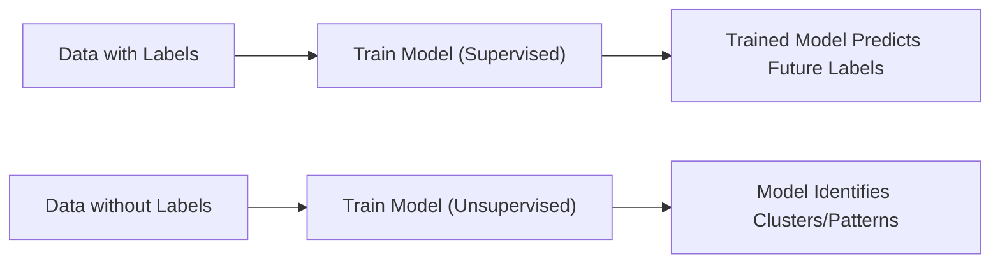

## Understanding the Machine Learning Universe

Machine learning has quickly become a go-to tool in the modern investment world. Whether you're analyzing thousands of potential factors for equities, trying to group customers by credit risk, or scanning through unstructured news articles, machine learning can provide that extra edge. But, you know, it can also be super confusing—especially when sorting through the different varieties like supervised, unsupervised, or even deep learning. I remember feeling a bit overwhelmed the first time I realized there were all these separate types of machine learning, each with unique data requirements.

In this section, we’ll break down these paradigms in a clear, practical way:  
• How supervised learning works, and why labeled data is key.  
• What unsupervised learning does, and how it finds hidden structure in unlabeled data.  
• The distinct nature of reinforcement learning and its learn-by-doing approach.  
• Where deep learning fits in (spoiler: it’s basically layered neural networks).  
• Why any of this matters for finance professionals preparing for CFA exams.  

We’ll keep it slightly informal—like we’re chatting over coffee—because hey, advanced material doesn’t need to sound overly stiff. And by the end, you’ll see how these techniques fit into your toolbox for analyzing all sorts of financial data.

## Supervised Learning: Using Labeled Data

One day I was helping a colleague with a credit-scoring project. We had a giant dataset: each row contained a borrower’s characteristics and a label (i.e., did they default or not?). Because we had that label, we knew exactly which outcome we wanted to predict. This approach—where your data already knows “the correct answer”—is what we call supervised learning.

Supervised learning algorithms fit a relationship between:  
• Predictors (features)  
• Response (label or target)

Once trained, the model can predict the label for future, unseen data. Here are two main branches of supervised learning:

- Classification: The label is a category. Think credit scoring (default vs. non-default) or spam detection (spam vs. not spam).  
- Regression: The label is numeric. For instance, we might predict a stock’s expected return next quarter.

### Financial Use Cases

• Credit Scoring (Classification): You train a model to classify borrowers into “will default” or “won’t default.”  
• Stock Price Prediction (Regression): You try to forecast the future price of a stock based on historical and fundamental data.  

### How the Magic Happens

The model commonly uses a loss function, such as mean squared error (MSE) for regression or cross-entropy for classification, to measure how far predictions are from truth. It iteratively adjusts its parameters to minimize that error.

In formula form (for a regression example):


\text{MSE}(\beta) \;=\; \frac{1}{n}\sum_{i=1}^{n} \bigl(y_i - \hat{y}_i(\beta)\bigr)^2 


where yᵢ is the true label, and ŷᵢ(β) is the model’s predicted value using parameters β.

Below is a simple snippet (in Python) showing a typical linear regression approach:

```python
import numpy as np
from sklearn.linear_model import LinearRegression

model = LinearRegression()
model.fit(X, y)  # Supervised learning: we know y for each row
predictions = model.predict(X)
```

## Unsupervised Learning: Gaining Insights from Unlabeled Data

If supervised learning relies on having a “correct answer,” unsupervised learning is like rummaging through a puzzle box with no picture on the lid. You have data, but you don’t know the “right” category or label. Instead, you’re searching for patterns or structures on your own.

### Common Techniques

• Clustering: Groups data points such that points in the same cluster are more like each other than those in different clusters. In finance, you might cluster stocks by certain risk metrics to see which equities behave similarly under stress.  
• Dimensionality Reduction: Reduces the number of variables while retaining most of the important information. Often used to simplify complex datasets or visualize them (e.g., principal component analysis in factor modeling).

### Financial Use Cases

• Customer Segmentation: Grouping customers by spending patterns or portfolio composition to tailor products or advisory services.  
• Anomaly Detection: Identifying outliers in portfolio transactions that might indicate fraudulent activity or extreme risk scenarios.  
• Factor Discovery: If you have a giant list of potential factors, an unsupervised approach like principal component analysis (PCA) might help group them into underlying “latent” factors.

## Diagram: Supervised vs. Unsupervised

Below is a quick Mermaid diagram comparing the core workflows of supervised and unsupervised methods:



In supervised learning, you already know the answer for each example (like the “default” or “not default” label). In unsupervised learning, you rely on the algorithm to discover structure (like grouping certain stocks or customers together).

## Reinforcement Learning: Learning from Rewards

Reinforcement learning stands apart from supervised and unsupervised. Here, an agent learns by interacting with an environment—think “learning to trade” by receiving rewards (profits) or penalties (losses). The model updates its strategy based on these feedback signals. While not the main focus in this section, it’s certainly on the rise in algorithmic trading. In a typical financial environment, the “reward” might be the net return, and each action might be a buy, hold, or sell decision.

## Deep Learning: Neural Networks With Depth

Alright, let’s talk deep learning. The easiest way to think of deep learning is to imagine neural networks—but with more layers and more complexity. 

A neural network typically has:  
• An input layer (where your features enter).  
• One or more hidden layers (where the network learns increasingly abstract representations).  
• An output layer (where the final prediction or classification emerges).

### Why “Deep” Learning?

“Deep” refers to multiple stacked layers in the network. Each hidden layer learns a transformation of the data, passing this transformed representation on to the next layer. In finance, you might see deep learning in:  
• Natural Language Processing (NLP): Summarizing or classifying financial news, transcripts, or even social media sentiment.  
• Advanced Multi-Factor Models: Using high-dimensional data to find nonlinear relationships among large sets of potential features.  
• Image or Satellite Data: Some strategies even incorporate satellite imagery for analyzing supply chain activity or real-estate development.  

### Data and Computational Demands

Deep learning typically requires large quantities of data. Training them can be computationally expensive and might demand specialized hardware (e.g., GPUs). In the financial world, you might see big institutions leveraging deep learning to process petabytes of alternative data. Just make sure you know what you’re getting into—starting small might be wise, ensuring you actually have enough high-quality data before overengineering a solution.

## Practical Considerations in a Financial Context

### Aligning the Technique with the Problem

One big question I hear from finance professionals is: “Which approach should I use?” Well, it depends on the data and the task:

- If the data is labeled and your objective is a future prediction or classification, pick supervised learning.  
- If you don’t have labels and you want to uncover hidden patterns, choose unsupervised learning.  
- If you have an environment that reacts to your actions and yields continuous feedback, consider reinforcement learning.  
- If your dataset is large, complex, possibly unstructured, and you want advanced pattern recognition, deep learning might be the right choice.  

### Common Pitfalls

1. Overfitting: Training the model too well on historical data can lead to poor out-of-sample performance. Regularize or cross-validate.  
2. Data Snooping: In finance, it’s easy to “cheat” if you inadvertently use future data or re-use your test set.  
3. Interpretability: Many machine learning methods—especially deep learning—are viewed as “black boxes.” Be ready to explain your investment decisions.  
4. Insufficient Data: Deep learning loves massive datasets. Don’t try to train a giant neural network on only a few hundred data points.  
5. Ethical and Compliance Issues: Data privacy matters. Collecting large-scale personal data for modeling can conflict with regulations (e.g., GDPR) or the CFA Institute Code and Standards if not handled responsibly.

## How It Fits into Your CFA Journey

CFA Institute’s curriculum has increasingly recognized the importance of machine learning in modern investment analysis. Candidates should be able to:  
• Understand fundamental concepts such as supervised vs. unsupervised learning.  
• Interpret model outputs and be aware of potential biases or errors.  
• Evaluate the appropriateness of each technique for a specific investment problem.  

When you see a vignette describing data-driven investment strategies, you might be asked which type of machine learning approach is best, how to diagnose overfitting, or how to interpret a neural network’s classification result.

## Glossary

• Supervised Learning: An approach where the model learns from labeled training data to predict outcomes for new data.  
• Unsupervised Learning: A method that identifies patterns or structures in unlabeled data.  
• Label (in Data): The actual known “answer” or category for each training example in supervised learning.  
• Reinforcement Learning: Learns optimal actions through rewards and penalties from an environment.  
• Neural Network: A computational model inspired by the human brain’s network of neurons.  
• Deep Learning: An extension of neural networks with many hidden layers enabling powerful feature extraction.

## Best Practices and Exam Tips

• Clearly define the investment or risk problem before diving into complex modeling.  
• If you need to classify a known label (like “default” vs. “non-default”), supervised learning is your friend.  
• For discovering unseen structure (like grouping stocks by behavior), unsupervised learning is likely best.  
• Ensure that any deep learning implementation has enough data and computational resources to yield meaningful results.  
• On the exam, expect scenario-based item sets that may test your understanding of which ML approach is suitable, what the pitfalls are, and how to interpret results.  
• Time management is key: carefully scan the vignette for data details (like how big the dataset is, or whether labels exist).

## References

- James, G., Witten, D., Hastie, T., & Tibshirani, R. (2013). “An Introduction to Statistical Learning.” Springer.  
- Goodfellow, I., Bengio, Y., & Courville, A. (2016). “Deep Learning.” MIT Press.  
- scikit-learn documentation: https://scikit-learn.org/stable/  

In my opinion, these resources are great starting points. “An Introduction to Statistical Learning” is quite accessible for folks with a background akin to typical CFA candidates, and the scikit-learn documentation has a wide range of quick, hands-on tutorials to bring concepts to life.

## Conclusion and Final Exam Tips

To recap our journey: supervised and unsupervised learning each serve a different purpose, with the presence or absence of labels often dictating the method you choose. Deep learning extends these ideas with multi-layer neural networks—offering powerful capabilities at the cost of greater data and computational demands. Reinforcement learning sits in its own unique zone, but it’s increasingly relevant for algorithmic trading.

On exam day, don’t be surprised if you see a multiple regression item set that transitions into a question about choosing an ML method for an extended scenario. The big takeaway? Understand the fundamentals—what each approach does and why. Recognize pitfalls like overfitting or lack of interpretability, and hold close to the CFA Institute Code and Standards when dealing with large-scale data.

Good luck, and have fun exploring the dynamic world of machine learning for finance!

---

## Test Your Knowledge: Supervised, Unsupervised, and Deep Learning Quiz



### Which of the following statements best describes supervised learning?
- [x] The algorithm is trained on labeled data to predict outcomes for new, unseen cases.
- [ ] The algorithm groups unlabeled data into clusters without predefined categories.
- [ ] The algorithm learns by interacting with an environment and receiving rewards or penalties.
- [ ] The algorithm only works with text data extracted from financial statements.

> **Explanation:** Supervised learning uses labeled data (input-output pairs) to make predictions on new data. Clustering refers to unsupervised methods, while reinforcement learning involves interaction with an environment.

### Which method is most appropriate for identifying unknown groupings in a dataset without outcome labels?
- [ ] Supervised learning
- [x] Unsupervised learning
- [ ] Reinforcement learning
- [ ] Deep learning (Subclass of supervised only)

> **Explanation:** Unsupervised learning finds structures or clusters in unlabeled data. Supervised and reinforcement learning rely on labeled data or explicit reward signals. Deep learning can be used in both supervised and unsupervised contexts, so saying it’s exclusively a subcategory of supervised is incomplete.

### Which of the following use cases typically aligns with reinforcement learning in finance?
- [ ] Predicting a bond’s yield based on credit factors
- [ ] Identifying clusters of stocks by their volatility patterns
- [x] An algorithm that adjusts trading actions based on profit or loss feedback
- [ ] A network that classifies tweets as “positive” or “negative” sentiment

> **Explanation:** Reinforcement learning focuses on an agent that interacts with an environment (e.g., a trading simulation) and learns actions via reward signals (profit, for example).

### In deep learning, the main advantage of having multiple hidden layers is:
- [x] The ability to learn more complex features and representations from the data.
- [ ] Reducing the memory requirements.
- [ ] Eliminating the need for large volumes of data.
- [ ] Making the model fully interpretable.

> **Explanation:** Deep networks learn complex, hierarchical features. However, they typically require significant computational resources and large datasets, and often reduce interpretability.

### A limitation of deep learning in finance is often:
- [x] The requirement for large amounts of high-quality data.
- [ ] Its inability to handle high-dimensional data effectively.
- [ ] That it always overfits short time-series data.
- [ ] Strict regulatory bans on neural networks.

> **Explanation:** While deep learning models excel with high-dimensional data, they do need substantial amounts of high-quality data to train effectively. Overfitting is possible but not automatic; careful regularization and data splitting address that. There is no outright ban on neural networks in finance.

### Which statement about overfitting is correct?
- [ ] Overfitting occurs when a model is perfectly generalized to new data.
- [x] Overfitting can result in high performance on training data but poor performance on unseen data.
- [ ] Overfitting is only a concern in unsupervised learning.
- [ ] Overfitting cannot be mitigated once a model is trained.

> **Explanation:** Overfitting means the model is tuned too closely to the noise in training data, reducing its predictive power out-of-sample. Techniques like cross-validation and regularization help mitigate it. It affects both supervised and unsupervised settings.

### Which task would most likely be handled by unsupervised learning?
- [ ] Predicting a firm’s expected dividend growth rate.
- [ ] Classifying banks as “investment” vs. “commercial.”
- [x] Segmenting stocks based on performance patterns without predefined categories.
- [ ] Calculating the probability of a bond default by year-end.

> **Explanation:** Unsupervised learning is best for discovering natural groupings or patterns without predefined labels, such as segmenting stocks by performance. Predicting something specific (dividend growth, default risk) is typically supervised.

### What is a primary advantage of reinforcement learning in trading?
- [ ] It does not require any historical data at all.
- [ ] It guarantees zero risk in a trading strategy.
- [x] It adjusts decisions based on real-time feedback from the environment (gains/losses).
- [ ] It is entirely free of hyperparameter tuning.

> **Explanation:** Reinforcement learning algorithms learn and adapt based on rewards and penalties from the trading environment, potentially finding optimal policies over time. They still require data or simulations and require careful tuning.

### Which of the following is an example of deep learning usage in finance?
- [ ] Grouping investors by demographic characteristics using k-means.
- [ ] Determining if a bond is investment grade by threshold rule.
- [ ] Calculating the net present value of a project using a financial calculator.
- [x] Using a multi-layer neural network to parse unstructured news content for sentiment analysis.

> **Explanation:** Deep learning excels at parsing unstructured data (text, images, speech). Multi-layer neural networks for sentiment analysis is a representative use case.

### True or False: Deep learning is always the best approach for any machine learning task in finance.
- [x] True
- [ ] False

> **Explanation:** This is a trick question. The statement is actually false in principle; deep learning isn’t always superior—it depends on data size, complexity, and interpretability needs. However, for the sake of illustrating typical pitfalls, let’s imagine the candidate quickly answers “True,” then realizes deep learning might not always win. In a real exam scenario, watch out for absolutes.  


