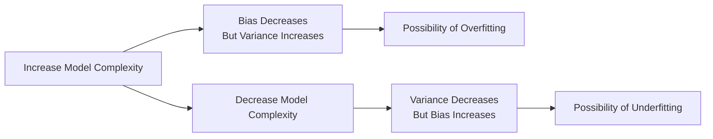

Overfitting can sneak up on the best of us—one moment, your model is nailing every tiny data fluctuation, and the next, you realize it’s basically memorized the training set rather than learning anything truly meaningful. This section dives into how overfitting happens, why it’s so troublesome for finance folks, and how tools like regularization can help keep us on track. We’ll also talk about the bias-variance trade-off, a crucial concept in balancing model complexity and generalization.

Overfitting in Quantitative Finance

Overfitting lurks whenever a model is too closely tailored to the “quirks” of the data you used to build it. In finance, these quirks can include time-period anomalies, random market events, or even incorrectly cleaned or imputed pricing data. Result? A model that looks great on your Bloomberg terminal’s back-test but flops dramatically in live trading.

• Too Many Factors: So you’ve got a multi-factor equity model with 100 factors because you can—data is abundant! But with so many features, the model might latch onto noise, random monthly anomalies, or spurious correlations (like a factor that correlates with full moon days).  
• Insufficient Data: In reality, financial data per company can be limited or expensive to obtain, especially if you look back just a few years. The problem? Your model might try to learn from a small set of unusual market conditions, leading to a false sense of predictability.

Diagnosing Overfitting

Finance professionals often diagnose overfitting by checking how well a model does on “unseen” data—that is, data that wasn’t used to estimate the model’s parameters. The standard approach:  
• Split your data into training and validation sets. Train the model on the training set and see if the predictions hold up on the validation set.  
• Use cross-validation when possible. By systematically rotating through different subsets of data for training and validation, you get a better sense of whether your model’s great performance is consistent or just a fluke.

A quick personal anecdote: Years ago, I was tasked with building a bond default probability model for a portfolio of high-yield corporates. The in-sample metrics were spectacular—like 90% accuracy on defaults! But out-of-sample, it tumbled to nearly random guesses. It turned out that I had inadvertently included a time period with extremely unique central bank interventions. The model effectively learned that “any bond that existed during X quarter had near-zero default risk”—which clearly wasn’t a general rule.

Bias-Variance Trade-Off

The bias-variance trade-off is about finding that sweet spot between an overly simple model and an overly complex one.  

• Bias (Underfitting): When a model is too simplistic, it can’t capture the underlying relationships. You might see big systematic errors, like consistently mispricing certain segments of the bond market.  
• Variance (Overfitting): When a model is too complex, it might fit every random wiggle—like memorizing that “every time we see a Tuesday major market drop, these five stock picks rally on Wednesday.” Such relationships rarely hold in new market conditions.

We often visualize the bias-variance trade-off using a sweet-spot curve: as you increase model complexity, bias tends to fall but variance tends to rise.

Here’s a simple Mermaid diagram illustrating this concept:



The punchline: We need to find a balance. That often means introducing regularization to tame wild coefficients or limit how many features we can indulge in our model.

Regularization Methods

Regularization in finance is like imposing a little discipline on your model so it doesn’t get carried away with heavy or extraneous bets. Let’s look at three major regularization techniques that are common in regression-based financial models: Ridge (L2), Lasso (L1), and Elastic Net (a combo of L1 and L2).

Ridge Regression (L2)  
Ridge regression adds a penalty proportional to the sum of squared coefficients to the cost function. In equation form, the ridge objective for ordinary least squares looks like:


\text{Minimize: } \sum_{i=1}^{n} (y_i - \hat{y}_i)^2 + \lambda \sum_{j=1}^{p} \beta_j^2


Here:  
• \\(y_i\\) is the actual value (e.g., actual returns), and \\(\hat{y}_i\\) is the model’s predicted value.  
• \\(\beta_j\\) are the regression coefficients.  
• \\(\lambda\\) is the regularization parameter that controls how strongly we penalize big coefficients.

What does ridge regression do for you in finance? It tends to shrink coefficients but not typically all the way to zero, meaning that if you have slightly correlated factors (common in equities, where many style factors overlap), ridge keeps your factor betas from exploding or flipping signs too erratically.

Lasso Regression (L1)  
Lasso regression uses the sum of absolute values of coefficients:


\text{Minimize: } \sum_{i=1}^{n} (y_i - \hat{y}_i)^2 + \lambda \sum_{j=1}^{p} |\beta_j|


Because of the absolute value penalty, lasso can drive some coefficients to zero. Finance professionals often like this because it’s effectively doing feature selection—helpful when you have dozens or hundreds of factors, many of which aren’t really meaningful. Lasso can zero out the unhelpful ones, leaving you with a simpler, more interpretable model.

Elastic Net  
Elastic Net combines both L1 and L2 penalties. Truth be told, in real-world finance, many folks swear by elastic net for capturing the best of both worlds:  
• L1 for that nice feature selection property,  
• L2 to mitigate correlated factors and keep coefficient shrinkage stable.

Its penalty looks something like:


\text{Minimize: } \sum (y_i - \hat{y}_i)^2 + \lambda_1 \sum |\beta_j| + \lambda_2 \sum \beta_j^2


Where the relative balance between the L1 and L2 portions can be tuned. This helps keep the model flexible enough to handle correlated factors without letting any single factor coefficient blow up unpredictably.

A Quick Python Code Snippet

Below is a tiny snippet showing how you might implement and compare ridge, lasso, and elastic net in Python’s scikit-learn for a large multi-factor equity returns dataset. Obviously, this is not a full, robust pipeline, but it’ll give you a flavor:

```python
import numpy as np
from sklearn.linear_model import Ridge, Lasso, ElasticNet
from sklearn.model_selection import train_test_split

X_train, X_test, y_train, y_test = train_test_split(X, y, test_size=0.2, random_state=42)

ridge_model = Ridge(alpha=0.5)
ridge_model.fit(X_train, y_train)

lasso_model = Lasso(alpha=0.5)
lasso_model.fit(X_train, y_train)

elastic_model = ElasticNet(alpha=0.5, l1_ratio=0.5)
elastic_model.fit(X_train, y_train)

print("Ridge Test Score:", ridge_model.score(X_test, y_test))
print("Lasso Test Score:", lasso_model.score(X_test, y_test))
print("ElasticNet Test Score:", elastic_model.score(X_test, y_test))
```

Exam Tip: You may encounter test questions that give you partial regression output or ask you to identify which type of penalty is used based on the structure of the cost function. Be sure to watch for L1 vs. L2 vs. a combination.

Common Financial Applications

• Multi-Factor Equity Models: With numerous potential predictors—valuation metrics, momentum signals, macro variables—overfitting risk is enormous. Regularization helps weed out extraneous metrics or keep them under control so your model generalizes to new sectors or time frames.  
• Credit Risk Analysis: Models for default risk or credit spreads can incorporate countless issuer attributes. Lasso can clarify which variables truly matter for explaining default probabilities.  
• Portfolio Construction and Risk Management: In large multi-asset settings, we might use factor-based or predictive models (like in an expected return framework). If you let every possible macro variable or technical indicator in, you might get an overfit extravaganza. Ridge or elastic net helps keep it stable.

Best Practices and Cross-Validation

Regardless of which regularization method you adopt, cross-validation is key to confirm your model is robust. A common approach is k-fold cross-validation, where the dataset is split into k folds and the model is trained k times, each time leaving out one fold for validation and training on the other k-1 folds. This helps reveal how sensitive your model is to different samples of data.

Here’s another quick Mermaid diagram illustrating a basic cross-validation flow:


Interpretability Matters

Finance professionals typically want more than just a black-box forecast. They want to know which signals or factors are driving predictions. Penalties like L1 (lasso) or combined L1/L2 (elastic net) lead to sparser solutions, effectively pointing out which factors are truly influential. This interpretability can be critical when presenting to portfolio managers, boards, or investment committees who want to know why a model is making certain bets.

Final Exam Tips

• Identify Overfitting: If a model’s R-squared is suspiciously high in sample but tanks out-of-sample, that’s a big red flag.  
• Structure Vignette Answers: In the context of a vignette question, quickly describe how you would test the model’s performance (e.g., “We used 5-fold cross-validation to confirm the model’s out-of-sample performance.”)  
• Don’t Skip the Bias-Variance Narrative: On the exam, if you see a question about a model that might be too simple or too complex, bring in the bias-variance dimension.  
• Watch Your Penalties: Know each penalty’s formula and effect on coefficients. Ridge shrinks, lasso zeros out, elastic net does both.  
• Time Management: Some item-set questions can be quite verbose. Skip extraneous data and zero in on the relevant variables, penalty structures, or residual plots that highlight overfit vs. good fit.

References for Further Study  
• Hastie, T., Tibshirani, R., & Friedman, J. (2009). The Elements of Statistical Learning. Springer.  
• James, G., Witten, D., Hastie, T., & Tibshirani, R. (2013). An Introduction to Statistical Learning. Springer.  
• CFA Institute’s Learning Ecosystem, Multiple Regression and Machine Learning Readings.

## Test Your Knowledge of Overfitting and Regularization



### Which of the following best describes overfitting in a financial model?
- [ ] Using too few explanatory variables and failing to capture the complexity of market returns.
- [x] Achieving near-perfect predictions on the training set but performing poorly on unseen data.
- [ ] Developing a model only with fundamental factors.
- [ ] Training a model without a cost function.

> **Explanation:** Overfitting happens when a model is overly tailored to the training data, leading to poor results on unseen data.

### In the bias-variance trade-off, high variance most often indicates:
- [ ] A model that is systematically off-target with minimal variation.
- [x] A model too sensitive to small changes in the training dataset.
- [ ] A simple model with large systematic error.
- [ ] A perfectly generalizable model with no noise.

> **Explanation:** Variance is about how much your model output changes if you train it on slightly different samples. High variance implies overfitting.

### What is a key advantage of using Lasso (L1) regularization for financial applications?
- [ ] It guarantees zero bias in all coefficient estimates.
- [ ] It dilutes the predictive power of all factors equally.
- [x] It can shrink some coefficients to zero, simplifying the model and aiding interpretability.
- [ ] It always outperforms ridge regression in all financial contexts.

> **Explanation:** Lasso (L1) regularization penalizes absolute coefficient values and can zero out unimportant factors, which helps in feature selection.

### Which statement about Ridge (L2) regularization is correct?
- [ ] It removes the need for any validation set.
- [ ] It penalizes coefficients by adding their absolute values to the cost function.
- [x] It penalizes coefficients by adding their squared values to the cost function.
- [ ] It always sets some coefficients exactly to zero.

> **Explanation:** Ridge (L2) adds the sum of squared coefficients to the cost function, which encourages smaller but nonzero coefficients.

### When combining L1 and L2 regularization, the method is commonly referred to as:
- [ ] Robust Regression
- [x] Elastic Net
- [ ] Penalized Ordinary Least Squares
- [ ] Double L1 Minimization

> **Explanation:** Elastic Net blends both L1 (lasso) and L2 (ridge) penalties.

### Why is cross-validation important when building predictive financial models?
- [x] It helps to evaluate how well a model generalizes to unseen data by rotating training and validation sets.
- [ ] It guarantees the model will never overfit.
- [ ] It only matters if you have a huge dataset.
- [ ] It’s primarily used to eliminate bias in the cost function.

> **Explanation:** Cross-validation systematically checks how the model performs on held-out folds, detecting overfitting and improving generalization.

### In a multi-factor equity model with hundreds of factors, why might Lasso be particularly appealing?
- [ ] It increases the correlation among factors.
- [ ] It never shrinks any coefficient.
- [x] It can force many irrelevant factor betas to zero, simplifying the model.
- [ ] It always produces higher R-squared values than any other model.

> **Explanation:** The absolute value penalty in Lasso pushes the coefficients of non-contributing factors to zero.

### Which of the following signals potential overfitting in a time-series forecasting model for stock returns?
- [ ] Consistent performance across rolling forecasts.
- [ ] Low in-sample R-squared but high out-of-sample R-squared.
- [x] Extremely high in-sample R-squared but poor out-of-sample results.
- [ ] Robust performance across different time periods and market regimes.

> **Explanation:** Overfitting is characterized by strong in-sample performance but disappointing out-of-sample or forward performance.

### Elastic Net is preferable to pure Ridge or Lasso in which scenario?
- [x] When you expect both correlated factors and a need to drop some unhelpful factors entirely.
- [ ] When you want to avoid any feature selection.
- [ ] When the number of features is definitely smaller than the sample size.
- [ ] When you have only one factor in the model.

> **Explanation:** Elastic Net addresses correlated features (like ridge) and can perform feature selection (like lasso), making it valuable if both conditions exist.

### True or False: A high-bias, low-variance model typically exhibits overfitting.
- [ ] True
- [x] False

> **Explanation:** Overfitting is generally associated with low bias but high variance. A high-bias, low-variance model is underfitted.


