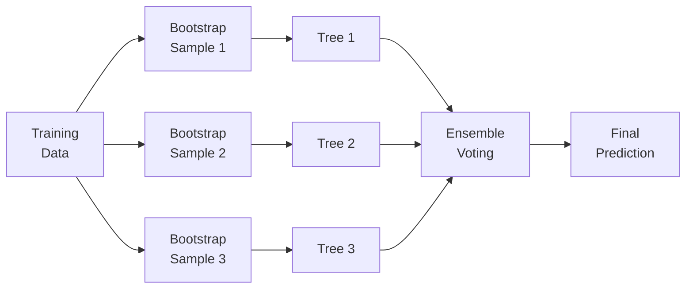

## Introduction

Well, sometimes it feels like machine learning is everywhere—finance included. I remember the early days when a simple linear regression was fancy enough to impress folks. Now, words like “penalized regression,” “support vector machine,” and “random forest” are popping up in investor presentations. In this section, let’s explore the big supervised learning methods you should know for the CFA® Level II exam (and also for real-world applications). We’ll walk through penalized regression, SVM, k-NN, decision trees, and powerful ensemble models. We’ll also chat about how to interpret and deploy these models responsibly in finance—because let’s be honest, a misapplied model can be worse than no model at all.

## Penalized Regression

Penalized regression methods introduce a penalty term to the model’s objective function, which helps control the complexity of the regression. In a typical ordinary least squares (OLS) setting, the cost function (let’s call it J) might look like:

J = ∑(yᵢ - xᵢβ)²

But penalized regression tacks on a penalty term that grows with larger coefficients. This encourages the model to keep coefficients small or even zero, reducing overfitting.

### Ridge (L2) Regression

Ridge regression adds an L2 penalty. In other words, it adds the sum of squared coefficients, weighted by a penalty parameter λ:

J = ∑(yᵢ - xᵢβ)² + λ ∑βⱼ²

Ridge regression shrinks coefficients but generally does not force any to zero. It’s helpful when you have many correlated features. In equity factor modeling, for example, you may collect numerous potential factors (like value metrics, momentum scores, volatility measures). Using ridge can help reduce the magnitude of the factor coefficients so that no single factor dominates unpredictably.

### Lasso (L1) Regression

Lasso uses an L1 penalty, which is the sum of absolute values of coefficients:

J = ∑(yᵢ - xᵢβ)² + λ ∑|βⱼ|

This penalty can drive some coefficients to exactly zero. Lasso is great for feature selection. In, say, a factor-based equity strategy with 50 possible factors, Lasso might push 40 of them to zero, leaving you with 10 that meaningfully explain returns.

### Elastic Net

Elastic Net mixes the L1 and L2 penalties, capturing benefits from both ridge and lasso. So you get:

J = ∑(yᵢ - xᵢβ)² + α λ ∑βⱼ² + (1-α) λ ∑|βⱼ|

Where α controls the weighting between ridge (α part) and lasso (1-α part). In finance, especially in high-dimensional data (like thousands of potential predictive signals), Elastic Net can be a balanced approach to shrink coefficients and drop less relevant features.

### Practical Finance Example

Imagine you’re building a style factor model to select undervalued stocks. You gather 20 fundamentals-based signals, 10 technical signals, and 5 macro factors. You suspect not all of them matter, and some could be correlated. Using Lasso or Elastic Net, you can systematically “prune” your signals while mitigating overfitting. The result is a more stable set of signals likely to generalize well.  

## Support Vector Machine (SVM)

Support Vector Machine is a classification (or regression) technique aiming to find the hyperplane—basically a boundary—that best separates classes. The goal is to maximize the margin, which is the distance from the decision boundary to the nearest data points in each category. For finance, we might classify whether a loan applicant is likely to default or not, or whether the market is bullish or bearish based on certain macro/fundamental indicators.

### The Kernel Trick

The SVM can work in high-dimensional or even infinite-dimensional spaces. That’s thanks to the so-called kernel trick. Essentially, the kernel function allows the model to operate in a transformed feature space without explicitly computing the transformation. Polynomials, radial basis functions, or other kernels can help turn complicated, non-linear classification boundaries into linear hyperplanes in a higher dimension.

### Example: Credit Default Classification

Picture a credit portfolio manager wanting to classify loans into “likely to default” vs. “safe.” Data includes credit scores, debt-to-income ratios, employment length, etc. Because these features might not be linearly separable (some low credit score folks might still pay, while some high score folks might default), the manager sets up an SVM with a radial basis function kernel. The model finds a hyperplane in a transformed space, giving a boundary that best segments default risks.  

## k-Nearest Neighbors (k-NN)

k-NN is about as intuitive as it gets. If you want to classify a new observation, you look at the k closest existing observations and “ask them how they’re classified.” For regression, you average their values. For classification, you pick the majority label.

### Key Considerations

• Distance Metric: Typically Euclidean distance, but you’ll see others in practice.  
• Scaling: Because distance depends heavily on magnitude, you should normalize or standardize your data.  
• Dimensionality: The curse of dimensionality can cause distance measures to become less meaningful as features expand.

### Simple Example

Let’s say you want to group stocks by fundamentals—like price-to-earnings ratio (P/E) and return on equity (ROE). If these are your two features, you can scatter-plot them, pick a new stock point X, then find the k (say, 3 or 5) stocks closest to X on that plot. If most “neighbors” are in the “value” portfolio, you might similarly classify X as value-oriented.

## Decision Trees

A decision tree partitions the feature space using simple if-then splits. For instance, a first split might separate companies with market cap > $5 billion from those below. Another split might separate high P/E from low P/E, and so on. Ultimately you get leaves containing groups of observations with certain characteristics.

### Interpretability and Overfitting

Trees are super interpretable: you can literally trace a path. However, they can easily overfit. For instance, a fully grown tree that tries to perfectly classify training data usually ends up capturing a lot of noise. We often prune trees (by controlling depth or minimum sample splits) to strike a balance.

### Finance Example: Credit Risk Segmentation

You might build a decision tree to segment borrowers with “annual income > $70k?” If yes, next question: “FICO score > 700?” If not, etc. Each path leads to a different risk bucket. This helps a risk manager quickly see how the classification is derived.

## Ensemble Methods: Random Forest and Gradient Boosting

Ensemble methods bring multiple “weak learners” (often shallow or pruned trees) into a single stronger model. In finance, ensemble methods have become a go-to for tasks like forecasting market volatility, predicting default probabilities, or even generating alpha signals. The idea: many lightly correlated or uncorrelated models combined can yield a better overall prediction.

### Random Forest

Random Forest builds multiple decision trees in parallel, each one trained on a bootstrapped sample of data. It also randomly selects a subset of features for each tree as further decorrelation. Then the predictions are aggregated (for classification, via majority vote; for regression, via averaging). It’s relatively straightforward, generally robust to overfitting, and rarely the worst choice out of the box.

Below is a simple Mermaid diagram illustrating how a random forest might work:



### Gradient Boosting

Gradient boosting is another popular ensemble technique where you iteratively add weak learners. Each new tree tries to predict the errors (residuals) that the previous ensemble made. Over many iterations, the model becomes better at predicting the hardest-to-fit observations. A widely known version is XGBoost in open-source libraries. In finance, gradient boosting can serve as a powerful approach to, say, capture non-linear relationships in stock returns or factor exposures.

### Interpretability vs. Predictive Power

Ensemble methods often deliver strong performance but at the expense of interpretability. In a regulated financial context—for instance, explaining to regulators or clients why a credit decision was made—you may need to rely on additional interpretability techniques such as feature importance metrics (e.g., how many times a feature is used in splits).

## Common Pitfalls and Best Practices

• Overfitting: Models that memorize training data deliver poor out-of-sample performance. Techniques like cross-validation help mitigate this.  
• Data Leakage: If your dataset includes future information or data not available at the time of prediction, your model’s performance metrics become inflated. In finance, always carefully consider time-stamping.  
• Scaling: k-NN, SVM, and penalized regression often require data to be normalized or standardized. Overlooking such a detail can degrade performance.  
• Model Tuning: Each method has parameters (like λ in penalized regression, cost in SVM, k in k-NN, max depth for trees, etc.). Tuning these is crucial.  
• Interpretability Needs: Regulatory contexts often require a simpler or more interpretable approach. If you’re using a black-box method (like a complex ensemble), you might need tools like Shapley values to show the contribution of each variable.

## Brief Code Illustration

If you’re curious how you might do this in Python, here’s a short snippet showing how to use random forest on a sample dataset:

```python
import pandas as pd
from sklearn.ensemble import RandomForestClassifier
from sklearn.model_selection import train_test_split

X = df.drop('target', axis=1)
y = df['target']

X_train, X_test, y_train, y_test = train_test_split(X, y, test_size=0.2, random_state=42)

model = RandomForestClassifier(n_estimators=100, max_depth=5, random_state=42)
model.fit(X_train, y_train)

preds = model.predict(X_test)

accuracy = (preds == y_test).mean()
print("Accuracy: ", accuracy)
```

In a financial context, you might use this for a classification problem such as “will bond default or not?” or “will the portfolio underperform the benchmark next quarter?”.

## Final Exam Tips

• Know the difference between L1 and L2 penalties: L1 (Lasso) can shrink some coefficients completely to zero, which is great for variable selection. L2 (Ridge) shrinks them all but won’t make any exactly zero.  
• SVM: Pay special attention to the kernel trick and max-margin concept. In exam questions, look carefully for hints about non-linear boundary needs.  
• k-NN: The biggest issues revolve around choosing k and normalizing. Watch out for dimension pitfalls.  
• Decision Trees & Ensembles: Expect item sets that show how a random forest or gradient boosting might be used. Also, be ready for questions about the trade-off between interpretability vs. predictive power.  
• Practical Vignette Angle: The CFA exam might frame a scenario about factor modeling or classification of default risk. They’ll test your ability to identify which algorithm is most appropriate and why.

## References

• Breiman, L. (2001). “Random Forests.” Machine Learning.  
• Friedman, J. (2001). “Greedy Function Approximation: A Gradient Boosting Machine.” Annals of Statistics.  
• scikit-learn documentation on ensemble methods: https://scikit-learn.org/stable/modules/ensemble.html  
• CFA Institute Code of Ethics and Standards of Professional Conduct (as applicable to model usage and communications).  

## Supervised Algorithms Practice Questions



### Which form of penalized regression tends to force coefficients to exactly zero?

- [ ] Ridge (L2) Regression
- [x] Lasso (L1) Regression
- [ ] Elastic Net
- [ ] OLS Regression

> **Explanation:** Lasso (L1) regression can shrink coefficients to zero, making it useful for feature selection. Ridge regression does not typically zero out coefficients.

### What is a major difference between ridge and lasso regression?

- [x] Lasso can produce exactly zeroed coefficients, while ridge typically does not
- [ ] Ridge tends to perform worse than Lasso in all scenarios
- [ ] Lasso always outperforms Ridge in financial applications
- [ ] There is no difference; they are functionally the same

> **Explanation:** The key distinction is that Lasso uses an absolute value penalty, forcing some coefficients to zero, while Ridge uses a squared-penalty approach.

### In a Support Vector Machine, what is the primary purpose of the “kernel trick”?

- [ ] To remove outliers from the training data
- [ ] To optimize the learning rate
- [x] To allow the algorithm to operate in a higher-dimensional feature space without explicit transformations
- [ ] To reduce the margin between support vectors

> **Explanation:** The kernel trick is how SVMs can handle non-linear boundaries by mapping data into higher dimensions, bypassing the explicit (and often computationally intensive) transformation.

### Which of the following is a common way to handle overfitting in decision trees?

- [ ] Choose a very large maximum depth
- [ ] Use no stopping criterion, allow the tree to perfectly classify data
- [ ] Use linear regression leaves
- [x] Prune the tree or limit tree depth

> **Explanation:** Pruning or setting constraints like max depth, min sample splits, etc., helps combat overfitting.

### When building a Random Forest, how are the trees typically “de-correlated”?

- [x] By training each tree on a different bootstrap sample of observations and random subsets of features
- [ ] By using the same training set but different seeds
- [x] By forcing each tree to ignore certain classes
- [ ] By setting the overall model to L1-penalized

> **Explanation:** Random Forest uses two kinds of randomness: bootstrapped data samples and random feature subsets per tree, both of which help reduce correlation among the trees.

### Which statement best describes k-Nearest Neighbors (k-NN)?

- [x] It classifies or predicts a point based on the majority (or average) of its nearest neighbors in the feature space
- [ ] It uses hyperplanes to separate classes
- [ ] It grows multiple trees and averages them
- [ ] It only uses L2 regularization techniques

> **Explanation:** k-NN is a memory-based method that looks to the k nearest points for classification or regression.

### A key advantage of Gradient Boosting over a simple single decision tree is:

- [x] It iteratively improves the model by focusing on the errors of previous models
- [ ] It only trains on half of the available data
- [x] It always yields interpretable trees
- [ ] It automatically selects the best kernel

> **Explanation:** Gradient Boosting integrates new weak learners at each stage to correct errors from the previous ensemble, thus refining predictions iteratively.

### In a regulated financial environment, a potential downside of complex ensemble methods is:

- [ ] They never outperform logit models
- [x] They can be harder to interpret and explain to regulators
- [ ] They never incorporate variable importance metrics
- [ ] They cannot handle classification problems

> **Explanation:** Interpretability is often required by regulators, and complex ensembles can be difficult to explain.

### For SVM classification problems, what is the “margin”?

- [x] The distance between the decision boundary and the nearest data points
- [ ] A parameter that sets the learning rate
- [ ] The maximum possible error rate
- [ ] Another term for the penalty parameter

> **Explanation:** The margin is the gap between the boundary and the closest examples in each class, which SVMs attempt to maximize.

### In the context of Lasso regularization, is it true that coefficients can be exactly zero?

- [x] True
- [ ] False

> **Explanation:** Lasso (L1) regularization penalizes coefficients by their absolute value, which allows them to shrink to zero, effectively performing variable selection.


