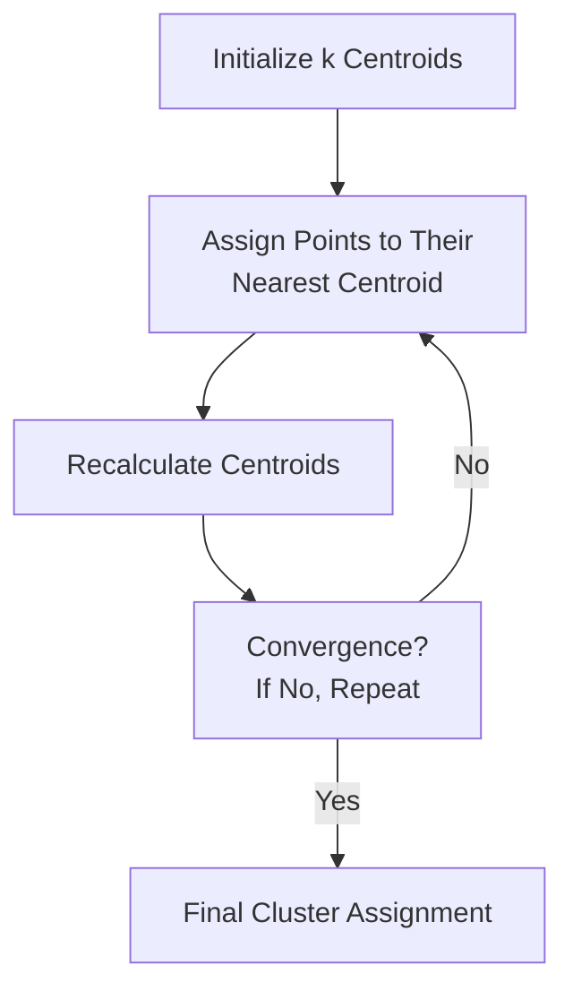
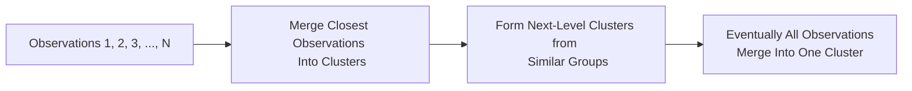

## Introduction

Let’s say you’ve got a humongous dataset—maybe it’s daily returns for hundreds of equities or volumes of client transactions—and you suspect there’s a hidden structure. You can’t see it directly, and you don’t have those neat little target labels telling you which category is which. That’s where unsupervised learning comes to the rescue. Unlike supervised learning, these algorithms do not predict a labeled outcome; they seek patterns or groupings in data without “knowing” the right answer in advance.

From your CFA Level II perspective, unsupervised approaches like Principal Component Analysis (PCA), k-Means Clustering, and Hierarchical Clustering can be powerful tools for factor identification, portfolio construction, client segmentation, and risk management. Below, we’ll walk through each of these techniques in detail, highlight their financial applications, and provide practical tips and best practices to guide you.

## Why Unsupervised Techniques Matter in Finance

Earlier in this curriculum, you encountered supervised learning algorithms that predict outcomes (like a stock’s future return). In unsupervised learning, we lack that outcome variable. Instead, we look for underlying patterns or structures:

• PCA helps reduce dimensionality and identify hidden factors or exposures.  
• k-Means groups data into clusters based on similarity.  
• Hierarchical clustering uncovers nested relationships—think of it like a family tree of securities.  

In a real-world financial setting, these methods:
• Improve portfolio construction and diversification by revealing uncorrelated factors (PCA).  
• Segment clients so that marketing or advisory services can be more targeted (k-Means).  
• Spot credit risk or equity groupings at multiple levels of granularity (Hierarchical Clustering).  

And, of course, these techniques pop up in the exam and in practical item sets all the time.

## Principal Component Analysis (PCA)

### Rationale and Core Concepts

Maybe you’ve run across a scenario in which you have 50 different economic indicators or 100 daily returns from a large equity portfolio. There’s simply too much data to analyze directly. PCA addresses this challenge by extracting a smaller set of uncorrelated features from a large dataset, capturing the most variance possible in each successive “principal component.”

Where does PCA come from, mathematically? Let X be your data matrix—say each row is an observation (like daily returns on a set of assets), and each column is a feature (like returns for a specific asset). PCA centers the data (subtracting means of each column), then computes the covariance matrix:


\Sigma = \frac{1}{n-1}X^\top X


PCA finds the eigenvectors and eigenvalues of \\(\Sigma\\). Each eigenvector becomes a “principal component,” and the associated eigenvalue measures how much variance is captured by that component. If your first principal component accounts for 40% of the total variance in the data, that’s a big chunk of the story right there.

### Practical Steps to Perform PCA

1. Standardize or normalize your data (especially if variables have different scales).  
2. Compute the covariance matrix Σ (or sometimes the correlation matrix in finance, if scales differ significantly).  
3. Calculate eigenvalues and eigenvectors.  
4. Select the top \\(k\\) principal components that explain a sufficiently large proportion (like 80% to 90%) of the total variance.  
5. Project the original data onto these \\(k\\) components to reduce dimensionality.

### Financial Example: Detecting Latent Risk Factors

In portfolio risk management, PCA can reveal “factors” that drive correlated movements among assets. For instance, the first principal component might be a broad market factor, the second might be an industry-specific factor, and so on. Once you identify these factors, you can measure your portfolio’s exposure to each one. That clarity helps you make better asset allocation decisions and manage your risk more intentionally.

### Python Snippet (Optional Illustration)

Below is a simple snippet that demonstrates PCA using Python’s scikit-learn. Although you probably won’t write code during the exam, having an intuitive sense of how it’s done can help you interpret item-set outputs.

```python
import numpy as np
from sklearn.decomposition import PCA

# e.g., each row is a different day, each column a different stock return
data = np.random.randn(1000, 10)  

pca = PCA(n_components=3)
pca.fit(data)

print("Principal components:", pca.components_)
print("Explained variance ratio:", pca.explained_variance_ratio_)
```

## k-Means Clustering

### Intuitive Overview

Picture the dreaded “client segmentation project.” You have client data—assets under management, transaction frequency, risk appetite, everything. You want to split them into distinct clusters so you can tailor your financial advice. With k-Means, you pick the number of clusters k, the algorithm partitions the data, and each cluster has a centroid representing its “center.”

### The Algorithmic Steps

k-Means tries to minimize the sum of squared distances of each point to its cluster centroid:

1. Choose k (the desired number of clusters).  
2. Randomly initialize k centroids.  
3. Assign each data point to the nearest centroid.  
4. Recalculate centroids as the mean of all points in each cluster.  
5. Repeat steps 3–4 until cluster assignments stabilize or a maximum number of iterations is reached.

Below is a simple visualization in Mermaid, showing how the assignments and centroid updates loop:



### Financial Use Case: Grouping Stocks by Similar Profiles

Let’s say you want to group securities by their valuation metrics (P/E, P/B), volatility, or returns. By specifying k, you can create segments of “Value Stocks,” “Growth Stocks,” “Stable Dividend Payers,” etc. The resulting clusters help you pick a diversified set or analyze your portfolio’s cluster exposures.

But watch out: you need to preselect k. If you pick too few clusters, you lose detail. Too many, and you might end up with oversegmentation. One common approach is the “elbow method,” which plots the within-cluster sum of squares against different choices of k. You look for the elbow, which is often a good trade-off between cluster separation and interpretability.

### Pitfalls and Best Practices

• Initialization sensitivity: k-Means can give different clusters if you start with different random seeds.  
• Scaling: Normalize or standardize inputs so one feature doesn’t dominate the distance metric.  
• Outliers: A single outlier might shift your centroids significantly. Sometimes it helps to remove outliers or use robust distance metrics.

## Hierarchical Clustering

### The Hierarchical Approach

What if you have no clue how many clusters you want? Hierarchical clustering solves that. It builds a tree-like structure (a dendrogram) showing how data points cluster together at various similarity thresholds.

• Agglomerative (“bottom-up”) approach: Start with every single observation as its own cluster, then iteratively merge the two closest clusters until only one remains.  
• Divisive (“top-down”) approach: Start with all points in one cluster, then split clusters recursively.

### Dendrogram Visualization

A dendrogram is a visual representation in which the y-axis might measure the distance (or dissimilarity), and the x-axis shows each data point or cluster. A high-level diagram might look like this:



You can “cut” the dendrogram at any level to decide how many clusters you want, so there’s no need to prespecify k as you do with k-Means.

### Real-World Example: Multi-Level Risk Grouping

In credit analysis, you might use hierarchical clustering to group loans by risk. At a coarse level, you see two or three major clusters (say, “Investment Grade,” “Speculative,” and “High Yield”). If you cut the dendrogram further down, you can differentiate subgroups, like “Technology High Yield” vs. “Emerging Markets High Yield.” This nested structure helps you refine your risk strategy.

### Key Points for Exam and Practice

• Linkage Criteria: How do we measure the “distance” between clusters? Single linkage uses the distance between the closest points in each cluster, while complete linkage uses the furthest points’ distance. In finance, “average linkage” can be more robust, balancing extremes.  
• Interpretability: The dendrogram makes the analysis visually interpretable. You can see which clusters merge at which distance thresholds.

## Comparing the Three Methods

| Method              | Key Strengths                           | Potential Weaknesses                              | Common Applications                                         |
|---------------------|------------------------------------------|---------------------------------------------------|--------------------------------------------------------------|
| PCA                 | Great for dimensionality reduction; can reveal hidden factors or exposures | May lose interpretability with too few or too many PCs | Risk factor extraction, factor-based portfolio construction |
| k-Means Clustering  | Straightforward, fast, good for large datasets | Requires specifying k; sensitive to outliers and initialization | Client segmentation, categorizing stocks with similar metrics|
| Hierarchical Clustering | No need to pick k in advance; provides a dendrogram for visual interpretability | Can be slow for large datasets; you must choose a linkage method carefully | Drill-down risk analysis, multi-level grouping of assets    |

## Exam Tips and Pitfalls

So you’re heading into the CFA exam, feeling good about your mastery of unsupervised learning. Here are a few final tips:

• Know the difference between supervised vs. unsupervised algorithms: exam prompts might test your conceptual understanding.  
• PCA in the exam context often shows up as factor extraction, so watch for item sets that mention “variance explained” and “loadings.”  
• k-Means might appear with questions about how many clusters to form or how to interpret cluster centroids.  
• Hierarchical clustering might be tested with a dendrogram. You might need to interpret where the cluster cuts happen or how to choose a linkage criterion.  
• Practice reading residual charts or cluster assignment tables quickly; time is precious in the item-set format.  
• Watch for outliers: a sneaky exam question might mention an extreme data point that skews your cluster centroid.  

Over the years, I’ve found it helpful to keep a mental checklist: 1) Is the data standardized? 2) Have I considered outliers? 3) What’s the right number of principal components or clusters?

## References

• Jolliffe, I. (2002). “Principal Component Analysis.” Springer.  
• Tan, P., Steinbach, M., & Kumar, V. (2019). “Introduction to Data Mining.”  
• Python Data Science Handbook chapters on clustering: https://jakevdp.github.io/PythonDataScienceHandbook/  

---

## Test Your Knowledge: Unsupervised Learning in Finance



### 1. Which of the following best describes the role of PCA in finance?

- [ ] It predicts future returns based on labeled data of historical returns.  
- [x] It reduces dimensionality by finding uncorrelated factors that explain variance.  
- [ ] It classifies stocks into “growth” or “value” categories with supervised labels.  
- [ ] It checks if a time series is stationary for AR modeling.  

> **Explanation:** PCA is an unsupervised method for dimensionality reduction, revealing latent factors that explain the largest portion of variance in a dataset.  

### 2. In k-Means clustering, the primary objective is to:

- [ ] Find hierarchical relationships among clusters without specifying the number of clusters.  
- [ ] Identify principal components by diagonalizing the covariance matrix.  
- [x] Minimize the sum of squared distances between points and their cluster centroids.  
- [ ] Assign outliers to separate clusters automatically.  

> **Explanation:** k-Means aims to minimize the within-cluster sum of squares to form coherent clusters around centroids.  

### 3. What is a dendrogram in hierarchical clustering?

- [ ] A statistical test for determining the number of principal components.  
- [ ] A measure of variance in a PCA model.  
- [x] A tree-like diagram that shows how data points or clusters merge at different similarity levels.  
- [ ] A line chart illustrating cluster centers over time.  

> **Explanation:** A dendrogram displays how observations and clusters merge step by step, making hierarchical clustering visually interpretable.  

### 4. Which statement about hierarchical clustering is correct?

- [ ] You must specify the number of clusters (k) before starting.  
- [x] You can view a dendrogram and decide where to “cut” it to form clusters.  
- [ ] It always produces better clusters than k-Means.  
- [ ] It’s always faster than k-Means for large datasets.  

> **Explanation:** In hierarchical clustering, you can pick the number of clusters by choosing how to cut the dendrogram. You don’t need to predefine k.  

### 5. In the context of PCA, eigenvalues represent:

- [x] The amount of variance explained by each principal component.  
- [ ] How features are standardized before clustering.  
- [ ] The average distance between centroids.  
- [ ] The best number of clusters in k-Means.  

> **Explanation:** Each eigenvalue measures the variance captured by its corresponding eigenvector (principal component).  

### 6. Suppose you implement k-Means and get different cluster assignments each time you run it. Which is the most likely cause?

- [ ] The data has no variance, making clusters impossible to form.  
- [ ] The use of PCA first always leads to unique clusters.  
- [x] The algorithm is sensitive to the initial random centroid placement.  
- [ ] The dendrogram structure is not defined.  

> **Explanation:** k-Means can yield different results if the starting centroids differ. This is why multiple runs or careful centroid initialization can help stabilize clusters.  

### 7. Which method would you choose if your primary goal is to see nested relationships among bonds across different credit ratings, sectors, and maturities?

- [ ] k-Means, because it yields well-defined centroids.  
- [ ] PCA, because it projects data into fewer principal components.  
- [x] Hierarchical clustering, because it provides a dendrogram for nested grouping.  
- [ ] None of the above, as you need a linear regression model.  

> **Explanation:** Hierarchical clustering’s dendrogram is ideal for exploring different levels of grouping in complex financial data.  

### 8. In a finance context, how might we interpret the first principal component of a set of equity returns?

- [ ] It is always equal to the risk-free rate times the time period.  
- [x] It often represents a broad market factor driving most of the variance among the stocks.  
- [ ] It indicates how to label data for logistic regression.  
- [ ] It shows the average correlation among the stocks at a 99% confidence interval.  

> **Explanation:** The first PC often aligns with a pervasive market factor. That’s one of PCA’s main benefits for portfolio analysis.  

### 9. Name a key limitation of hierarchical clustering compared to k-Means:

- [x] It can be computationally more expensive for large datasets.  
- [ ] It requires specifying k before clustering.  
- [ ] It cannot be visualized with a dendrogram.  
- [ ] It always leads to spherical clusters.  

> **Explanation:** Hierarchical clustering can be more computationally intensive for large datasets, as it involves repeated distance calculations among all points and clusters as the algorithm merges clusters.  

### 10. When discussing unsupervised learning, which statement is TRUE?

- [x] These methods do not rely on labeled data and instead look for intrinsic patterns in the dataset.  
- [ ] They only work when the outcome variable is binary.  
- [ ] They always outperform supervised methods in stock return prediction.  
- [ ] They require target labels before building the algorithm.  

> **Explanation:** Unsupervised learning works with unlabeled data to find patterns or structures without relying on a known target variable.  


