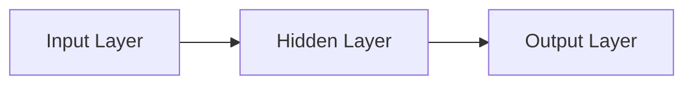

## Overview and Introduction

Have you ever gazed at a complex chart and felt like there must be hidden patterns just waiting to be uncovered? Neural networks (NNs) and deep learning are some of the most powerful tools for teasing out relationships from large or intricate datasets. And if that wasn’t exciting enough, reinforcement learning (RL) teaches machines—like some curious intern on their first day—to learn from trial and error, honing strategies and decisions in real time.

This section explores how neural networks, deep learning architectures, and reinforcement learning frameworks fit into traditional financial contexts like risk management, portfolio construction, and trading algorithms. We’ll dig into the fundamentals and expand toward more advanced concepts such as convolutional neural networks (CNNs) and recurrent neural networks (RNNs). We’ll also check out practical finance use cases—like systematic trading or asset price forecasting—where each approach can offer significant insights.

Remember, the aim is to equip you (and maybe even amuse you a little) with the background knowledge to tackle more advanced finance modeling tasks in your CFA Level II journey. Let’s jump in!

## Neural Network Fundamentals

Neural networks are computational models loosely inspired by the biological structure of the brain. While no one is suggesting your next portfolio manager is a literal brain in a jar (well, hopefully not!), the analogy helps illustrate how NNs learn from data.

### Basic Structure: Layers and Neurons

A neural network typically consists of three main layers:

- Input Layer: Receives information (features such as past returns, volatility measures, or even textual data from earnings announcements).
- Hidden Layer(s): Processes and transforms the input data. Each hidden layer contains “neurons” that apply weighted sums and activation functions.
- Output Layer: Produces the final signal or prediction (e.g., a forecasted price rise/fall, a classification like “high risk” vs. “low risk,” or a probability for a specific event).

Here’s a simplified schematic:



Each arrow represents weighted connections. The hidden layers are where the model learns non-linear mappings between inputs and outputs—an ability that’s especially important in finance, where relationships aren’t always linear (or obvious!).

### Weights and Activation Functions

Weights determine how much influence one neuron has on another. During training, an algorithm called backpropagation adjusts these weights, aiming to minimize a “loss function” (like mean squared error). Activation functions introduce non-linearity. Common types include:

• ReLU (Rectified Linear Unit): max(0, x).  
• Sigmoid: 1 / (1 + e^(-x)).  
• Tanh: (e^x – e^(-x)) / (e^x + e^(-x)).

In practice, ReLU is popular due to ease of optimization. But sometimes, a traditional approach like sigmoid is appropriate—especially in final-layer outputs for probabilities such as default risk or “probability of an upward market movement.”

### Example: Simple Neural Network in Python

A short snippet using PyTorch might look like this:

```python
import torch
import torch.nn as nn

class SimpleNN(nn.Module):
    def __init__(self):
        super(SimpleNN, self).__init__()
        self.fc1 = nn.Linear(10, 5)  # 10 inputs -> 5 hidden
        self.relu = nn.ReLU()
        self.fc2 = nn.Linear(5, 1)   # 5 hidden -> 1 output
        
    def forward(self, x):
        x = self.relu(self.fc1(x))
        x = self.fc2(x)
        return x
```

While the code above is minimal, it highlights the core building blocks: linear layers, an activation function, and a final output. In a financial context, you might feed in data like a 10-feature vector containing historical returns, volatility, yield curve slope, momentum indicators, and so forth, to estimate a single numeric output—e.g., predicted next-period return.

## Deep Learning

Deep learning takes neural networks and stacks layer upon layer, forming a “deep” architecture. This multi-layer design lets the model learn highly abstract, complex patterns.

### High-Level Characteristics

• Multiple Layers: Instead of a single hidden layer, you might have 5, 10, or even hundreds.  
• Feature Extraction: In earlier chapters, we manually performed feature engineering. Deep nets can discover new features themselves, although they typically require a lot of data to do this effectively.  
• Overfitting Concerns: The more parameters, the more risk that your network memorizes noise. Techniques like dropout randomly disable neurons during training while other regularization methods constrain weight magnitudes or distributions.

### Computational Requirements and Best Practices

Deep learning models can be huge. So, if you’ve got a modest CPU-based laptop, training a multi-layer RNN on a dataset of tens of millions of trades might be about as fast as waiting for paint to dry. Realistically, practitioners use GPUs or cloud compute instances to handle large-scale data.  

From a risk management perspective, it’s crucial to consider model interpretability. Regulators, along with internal risk committees, can be wary of black-box methods. So you always want to make sure you have a robust validation procedure (e.g., cross-validation, out-of-sample testing) and maintain thorough documentation of how your model is constructed and used.

## Convolutional Neural Networks (CNNs)

CNNs are specialized neural networks initially designed for image data—like scanning images of folks’ faces to identify your friend on social media. However, they also can be applied to 2D representations of financial data. For instance, you might transform time-series data into 2D “images” of correlation heatmaps or volatility surfaces.

### Key Components

• Convolutional Layers: Filters or kernels slide over the input, capturing local features.  
• Pooling Layers: Used to reduce the spatial size, summarizing the strongest local features.  

In finance, CNNs can be surprisingly effective if you transform your dataset cleverly. One personal anecdote: a trading team I knew once took equity returns from a cross-section of stocks, arranged them into a 2D grid by sectors and sub-industries, and then used CNN methods to detect patterns of momentum “hot spots.” They reported interesting alpha signals—but remember, results always vary, and thorough backtesting is essential.

## Recurrent Neural Networks (RNNs) and LSTM

RNNs are all about sequences, which is perfect for time-series data. Nothing screams “sequential data” louder than historical price or economic time-series. Traditional feed-forward NNs process each data instance independently, but RNNs incorporate knowledge from previous time steps via recurrent connections.

### Vanilla RNNs

Vanilla RNNs can capture short-term memory, but they sometimes suffer from vanishing or exploding gradients. That means, in practice, they have trouble remembering events from many periods ago. This can be problematic if you want to detect cyclical or seasonal patterns.

### LSTM (Long Short-Term Memory)

To mitigate that pesky short-term memory issue, LSTMs come with a more complex internal structure featuring “gates” (input, output, forget). These gates allow the network to maintain longer-term dependencies. For instance, you might want your model to remember information from last quarter’s earnings announcement to predict next quarter’s returns, especially if there’s a persistent effect over time.

In a typical finance scenario, LSTM-based models may help predict future asset prices, default probabilities, or even economic indicators, factoring in extended historical context. They also come up in credit scoring or consumer behavior analysis, where data points from six or twelve months back remain relevant.

## Reinforcement Learning

Reinforcement learning is a fascinating branch of machine learning. Instead of training on labeled data (like “here’s a set of returns, please classify them as up or down”), RL trains an agent to interact with an environment by trial and error, receiving rewards or penalties along the way.

### Key Concepts

• Agent: The decision-maker (for example, an automated trading system).  
• Environment: The market or simulated environment the agent observes.  
• Policy: The rules or strategy mapping states to actions (e.g., if the momentum is high, buy; otherwise hold).  
• Reward: A scalar, real-valued signal the agent aims to maximize over time (profits, risk-adjusted returns, or even surplus for liability-driven investments).

### Exploration vs. Exploitation

Finance can be tricky because exploration can be costly or risky—nobody wants to blow up real capital just to see what happens! Sometimes RL is tested first in simulation (like a paper trading environment), learning the dynamics. Then, a carefully monitored real-world rollout may follow.

### Practical Financial Examples

• Algorithmic Trading: An RL algorithm decides whether to buy, sell, or hold at each time step to maximize cumulative returns.  
• Optimal Execution: Minimizing market impact or transaction costs through dynamic order splitting.  
• Portfolio Rebalancing: Determining when and how heavily to shift allocations given evolving market conditions.  

It’s a powerful paradigm, though the complexity can also be high. Many RL applications remain cutting-edge, with big hedge funds or specialized quant shops investing heavily here.

## Common Pitfalls and Best Practices

• Overfitting: All these advanced methods are extremely flexible. Make sure you have a robust out-of-sample test, cross-validation approach, or walk-forward analysis.  
• Data Snooping: The more you search for patterns, the more likely you’ll find illusions. Avoid random chance or over-tuned models.  
• Hyperparameter Tuning: Neural networks can have many parameters (learning rate, number of layers, number of neurons, etc.). A systematic approach (grid search, Bayesian optimization) helps avoid guesswork.  
• Interpretability: Could you explain to your investment committee or regulator why your RL agent decided to drastically reduce a certain asset position on Tuesday? If not, weigh the pros and cons of black-box models carefully.  
• Resource Constraints: GPU or specialized hardware might be needed for large deep learning tasks. This implies a cost-benefit assessment for each project.

## Glossary

• Activation Function: A non-linear function applied to the neuron’s weighted inputs. Examples include ReLU, sigmoid, and tanh.  
• Backpropagation: An algorithm for adjusting neural network weights by propagating loss gradients backward through the network.  
• Dropout: A regularization technique that randomly turns off some neurons during training to prevent overfitting.  
• ReLU (Rectified Linear Unit): The function max(0, x) used in many deep NN architectures.  
• RNN (Recurrent Neural Network): A neural network that handles sequential data by retaining a “hidden state.”  
• LSTM (Long Short-Term Memory): A type of RNN designed to capture long-term dependencies in time-series data.

## Practical Study Tips for the Exam

• Familiarize yourself with High-Level Concepts: You might see a vignette describing a deep learning model for classifying credit risk. Understand how to interpret outputs, detect overfitting, or evaluate model performance.  
• Know the Terminology: Terms like “dropout,” “backpropagation,” or “gradient descent” can appear in item sets or multiple-choice questions.  
• Understand Time-Series vs. Panel Data: RNNs are a prime candidate for time-series data, whereas typical multiple regression might be more about cross-sectional or panel data.  
• Scrutinize Ethical and Risk Implications: The CFA Institute emphasizes risk management and ethics. Consider how black-box models might run afoul of transparency requirements.

## Additional References

• Goodfellow, I., Bengio, Y., & Courville, A. (2016). “Deep Learning.” MIT Press.  
• Sutton, R. S., & Barto, A. G. (2018). “Reinforcement Learning: An Introduction.” MIT Press.  
• TensorFlow Tutorials: https://www.tensorflow.org/  
• PyTorch Tutorials: https://pytorch.org/  

These resources go deep into the technical aspects if you’re up for some extended reading. And if you get lost in the details—don’t worry, it’s normal. Deep learning can feel like rocket science at first, but with persistence, it becomes a valuable addition to your quant toolkit.

--------------------------------------------------------------------------------

## Test Your Knowledge: Neural Networks, Deep Learning, and Reinforcement Learning Quiz



### Which layer in a neural network is primarily responsible for producing the final predicted value or classification?
- [ ] Input layer
- [ ] Hidden layer
- [x] Output layer
- [ ] Weight layer

> **Explanation:** The output layer delivers the final prediction (e.g., probability for a classification or numeric value for a regression task).

### Which of the following activation functions returns a value of zero for all inputs less than zero and is commonly used in deep learning?
- [ ] Sigmoid
- [ ] Tanh
- [x] ReLU
- [ ] Softmax

> **Explanation:** ReLU is defined as max(0, x) and is used extensively in modern deep neural networks due to its simplicity and effectiveness in alleviating vanishing gradients.

### A convolutional neural network (CNN) is typically best suited for which one of the following data forms in a finance context?
- [ ] Tabular data with 50 columns of numeric features
- [x] 2D representations such as correlation heatmaps
- [ ] A single numeric time series
- [ ] Mixed numeric and categorical data without any spatial structure

> **Explanation:** CNNs excel at finding local patterns in data arranged in a spatial or 2D format, such as images or correlation matrices in finance.

### Which of the following is a key characteristic of Long Short-Term Memory (LSTM) networks?
- [ ] They implement the ReLU activation function only.
- [x] They contain gates (input, forget, output) designed to maintain longer-term dependencies.
- [ ] They do not require backpropagation.
- [ ] They can only handle stationary time-series data.

> **Explanation:** LSTMs incorporate gating mechanisms that help the network learn and retain information across many time steps, addressing issues of vanishing or exploding gradients.

### Regarding reinforcement learning in trading, which statement is most accurate?
- [ ] It assumes all data is labeled in advance.
- [ ] It relies on 2D convolutions to find patterns in local data segments.
- [x] It learns a decision policy by maximizing a reward signal through trial and error.
- [ ] It uses standard linear regression with panel data.

> **Explanation:** RL focuses on an agent exploring an environment, receiving rewards, and adjusting its policy to maximize those rewards over time, which is different from supervised or unsupervised learning.

### Which of the following is most helpful in preventing overfitting in a deep neural network?
- [ ] Using a purely linear activation function
- [ ] Setting all weights to zero after each training epoch
- [x] Applying dropout during training
- [ ] Eliminating batch normalization layers

> **Explanation:** Dropout randomly disables neurons during training, reducing the risk that the network memorizes noise. It helps generalize the model better to unseen data.

### Which type of neural network is most commonly associated with processing sequential financial data, such as monthly asset returns?
- [ ] Convolutional Neural Network (CNN)
- [ ] Generative Adversarial Network (GAN)
- [x] Recurrent Neural Network (RNN)
- [ ] Feed-forward network with a single hidden layer

> **Explanation:** RNNs (and their variants like LSTM) are specifically designed to handle sequential or time-dependent data. They’re a natural fit for financial time series.

### Which of the following is considered both a benefit and potential drawback of deep neural networks in finance?
- [x] Their complexity allows them to capture highly non-linear patterns, but can make them difficult to interpret.
- [ ] They require no hyperparameter tuning at all.
- [ ] They’re always more accurate than traditional methods like multiple regression.
- [ ] They can only handle image data, not tabular data.

> **Explanation:** Deep NNs do a great job modeling complex relationships but can suffer from interpretability issues, which is a concern in finance.

### A major risk of searching through many neural network architectures or using extensive hyperparameter tuning without careful validation is:
- [ ] Lower probability of model convergence
- [x] Data snooping or overfitting
- [ ] Inability to use gradient descent optimizers
- [ ] Decreased complexity of the model

> **Explanation:** Excessive searching for patterns can lead to data snooping and overfitting—finding “patterns” that don’t hold in unseen data.

### True or False: In reinforcement learning, the agent relies entirely on labeled training examples to decide how to act.
- [ ] False
- [x] True

> **Explanation:** This is a trick question. The correct statement is: In reinforcement learning, the agent does not rely on pre-labeled training examples but rather on interactions with an environment and corresponding rewards or penalties. The statement “relies entirely on labeled training examples” is false. Therefore, the correct answer is “False.”



