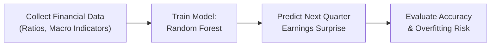
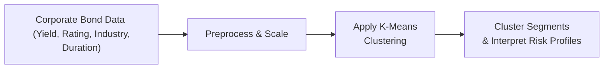
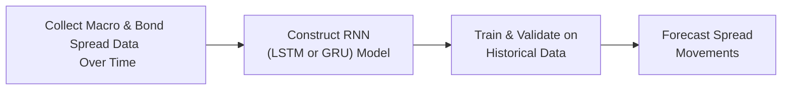

## Introduction

So, let’s talk about how machine learning (ML) can be used in the real world of equity and fixed income analysis. I remember the first time I tried applying ML to an earnings-surprise prediction project—my laptop nearly spun up like a jet engine from all the computations. But you know, the real challenge wasn’t the hardware, it was figuring out how to interpret the results in an actual investment context. That’s what we’ll explore here: using item sets (vignette-style scenarios) to show how ML can influence real investment decisions.

We’ll examine a few cool examples: one with a Random Forest model to predict next-quarter earnings surprises in equities, another with k-means clustering (an unsupervised approach) to segment corporate bonds, and finally, a time-series approach using Recurrent Neural Networks (RNNs) to forecast bond spread moves. We’ll even throw in some “trap” questions on data snooping and ethics—because if you’re not cautious, you might end up relying on non-public data or messing with the data in ways you shouldn’t. Anyway, let’s dive right in.

## Vignette: Random Forest for Quarterly Earnings Surprises

### Scenario and Data Overview

Imagine you’re an equity analyst for a mid-sized asset management firm. You’ve been tasked with predicting which companies in the S&P 500 are likely to beat consensus estimates next quarter. To do this, you’ve compiled a dataset that includes:

• Historical earnings surprise data for each company (last 12 quarters).  
• Fundamental ratios (P/E, Debt/Equity, Return on Equity, etc.).  
• Macro indicators (GDP growth, interest rates).  
• Sentiment indicators from news feeds.  

You decide to try a Random Forest model because it’s robust to messy data and can handle a variety of predictor variables. Below is a simplified depiction of the workflow:



### Model Building

You split your data into training and testing sets (for instance, an 80/20 split), then run the Random Forest algorithm. The model outputs a probability that a company will exceed analyst forecasts. To interpret results, you look at:

• Feature importance scores (e.g., you might notice that Debt/Equity has minimal influence while certain sentiment scores drive a big chunk of the prediction).  
• Out-of-bag error (an internal measure of error in random forests).  
• Confusion matrix (true positives: correctly identified “beats”; false positives: incorrectly predicted beats).  

Here’s a tiny Python snippet that might replicate part of this approach:

```python
from sklearn.ensemble import RandomForestClassifier
from sklearn.metrics import accuracy_score, confusion_matrix

model = RandomForestClassifier(n_estimators=100, random_state=42)
model.fit(X_train, y_train)
predictions = model.predict(X_test)

acc = accuracy_score(y_test, predictions)
cm = confusion_matrix(y_test, predictions)

print("Accuracy:", acc)
print("Confusion Matrix:")
print(cm)
```

### Interpretation and Pitfalls

Let’s say your model yields an accuracy of 72%. Sounds nice, but you need to cross-check: Is the model capturing the right economic rationale, or is it memorizing random noise? Also, be mindful of “feature leakage,” where certain variables might implicitly contain future information that wouldn’t be available at the time of prediction. That can lead to artificially high accuracy. Overfitting is another risk: if your forest has too many trees or if you haven’t pruned enough, you might be capturing anomalies rather than broad patterns.

### Mini Item Set Demonstration

A. You are given a snippet of out-of-bag errors for three different Random Forest configurations. The low OOB error is found in configuration B.  
B. The primary macro factors in the model are interest rate changes and GDP growth.  
C. The confusion matrix indicates a small number of false positives but a higher number of false negatives.  

Typical questions might include:

• Which configuration is most likely overfit?  
• If interest rates spike unexpectedly, how might your model’s performance shift?  
• Interpret the significance of a higher false negative rate in an earnings surprise prediction context.  

Remember also to question how you validated these results over multiple periods. A single testing set might not cut it. Cross-validation helps ensure your model is robust across various economic environments.

## Vignette: Using k-Means Clustering for Corporate Bond Segmentation

### Scenario and Data Overview

Now, let’s shift to fixed income. You’re a bond portfolio manager who suspects you might be missing some hidden relationships among your holdings, so you decide to cluster corporate bonds by risk and yield characteristics. Here’s the data you’ve collected:

• Bond yields, durations, credit ratings, and industries.  
• Issuer fundamentals (like leverage and coverage ratios).  
• Historical price volatility or spread volatility.  

Because you don’t have a specific target variable—you're just grouping bonds—an unsupervised method like k-means clustering is a logical first step. Check out this basic flow:



### Fitting the Model

Preprocessing means handling missing data, standardizing scale (e.g., yields might be in single-digit percentages while coverage ratios could range in the hundreds), and deciding how many clusters might be meaningful. Suppose you explore solutions from k=2 through k=10 and pick k=4 based on the “elbow method” or silhouette scores.

### Item Set Demonstration

The vignette might show:

• A table with partial data for 10 corporate bonds, including yield, rating, coverage ratio, and industry sector.  
• A scree plot or elbow plot that suggests k=4 is appropriate.  
• The final cluster assignments with brief characteristics (e.g., Cluster 1: “Low yield, high rating, stable industry,” Cluster 2: “High yield, lower rating, cyclical industry,” etc.).  

Questions could include:

• Why might standardization be crucial before applying k-means?  
• Suppose data from a newly issued bond doesn’t fit well into any of the four clusters. How might you handle that scenario?  
• What if you discover that your data contains information not available at issuance, leading to potential data snooping violations?  

Always keep in mind that labeling clusters can be subjective, and you should verify them against fundamental analyses. Just because k-means lumps some bonds together doesn’t mean they share the same risk profile if one has embedded call features or an unusual covenant. So approach with caution, interpret responsibly, and watch out for data that might inadvertently come from non-public sources or from suspiciously curated vendor feeds.

## Vignette: Time-Series Approach with RNN for Bond Spread Forecasts

### Scenario and Data Overview

Next up is a time-series scenario where you’re trying to predict corporate bond spreads relative to a benchmark Treasury yield. Let’s say you have:

• Daily or weekly spread data over multiple years.  
• Macro indicators (unemployment, inflation, interest rate momentum).  
• Sometimes textual data from central bank announcements.  

You pick an RNN—like an LSTM or GRU—because these models can handle sequential data, capturing trends or cyclical patterns that might influence bond spreads.



### Training the RNN

Data wrangling is often the biggest part. You might do something like:

1. Stationarize or difference your series if needed.  
2. Use a rolling window of 30 days as input features to predict spread 1 week ahead.  
3. Split data into training, validation, and test sets chronologically.  

You might do:

```python
import tensorflow as tf
from tensorflow.keras import layers

model = tf.keras.Sequential([
    layers.LSTM(50, input_shape=(30, num_features), return_sequences=False),
    layers.Dense(1)
])

model.compile(loss='mse', optimizer='adam')
model.fit(X_train, y_train, epochs=20, batch_size=32, validation_data=(X_val, y_val))
```

### Common Pitfalls

• Overfitting can happen quickly if the model memorizes historical anomalies.  
• Data coverage might not span enough economic cycles, so the model could fail in uncertain times.  
• If your data includes forward-looking indicators that weren’t publicly available at the time, you risk an ethics violation.  

### Mini Item Set

You get a final model that forecasts bond spreads with an average absolute error of 15 basis points over the test set. The item set might show a chart of predicted vs. actual spreads:

• Plot indicates the model does well in stable conditions but lags in quick market reversals.  
• You see a bigger error during the last recession period.  

Questions could involve:

• Which transformations are needed to ensure stationarity?  
• How do you interpret the poor performance during recession periods?  
• How might you guard against data snooping if you included monthly economic outlook updates from your firm’s internal strategy team?

This is where critical thinking and real investment context matter. The model’s not just a forecasting toy; it’s something you could use to decide on relative weighting of corporate vs. sovereign bonds. But if you rely on data that existed only in hindsight or is proprietary inside info, you cross ethical boundaries. The CFA Institute “Standards of Practice Handbook” is quite explicit on that point—no front-running or misusing privileged data.

## Ethical Considerations and Data Snooping Traps

I can’t emphasize enough: we’ve all been there, excited about a new ML technique that drastically boosts your accuracy. And then, you realize you used advanced knowledge—like guidance that management only released in a private senior manager meeting. Or you included a macro forecast that was published mid-quarter but pretended it was available from day one. That’s data snooping. Ethical traps can be subtle:

• Non-public data: Are you inadvertently including data sets from privileged analyst calls or internal strategy notes?  
• Overly aggressive data cleaning: Did you remove “bad data points” in a way that biases your model?  
• Hindsight bias: Did you treat announcements from halfway through the quarter as if they were known at the start?

The recommended approach is to adopt strict conformance to the CFA Institute’s code: ensure that your data is either public or thoroughly anonymized, ensure time alignment (that you don’t cheat on the timeline), and always document your data sources.

## Best Practices in ML Model Application

Below are a few pragmatic tips:

• Use cross-validation or rolling-window validation in time-series contexts.  
• Regularly check overfitting by comparing training and validation errors.  
• Keep an audit trail describing data sources, especially if reviewing them for compliance.  
• Document and revisit key assumption changes. Because machine learning models can degrade quickly as market conditions shift, be prepared to update them.  

In my opinion, no one model is a silver bullet. Combining domain knowledge (like you gain from fundamental equity research or bond covenant analysis) with strong quantitative checks will yield the best results. This is especially true in exam-type scenarios, where you must show a robust approach that respects both the math and the ethics.

## Evaluate Your Mastery of ML Applications in Equity and Fixed Income



### Which of the following is a key advantage of using a Random Forest to predict quarterly earnings surprises?

- [ ] It always guarantees a 100% accuracy in forecasting.  
- [x] It reduces variance by averaging multiple decision trees.  
- [ ] It uses a single, fully grown decision tree that’s easy to interpret.  
- [ ] It avoids any need for cross-validation.  

> **Explanation:** Random Forests use “bagging” (bootstrap aggregating) to build multiple trees, reducing variance in the final predictions. A single tree can overfit, so the ensemble approach helps mitigate that risk.

### When clustering corporate bonds using k-means, which factor makes standardizing variables a priority?

- [ ] To artificially inflate the importance of duration.  
- [x] To ensure that all features contribute equally regardless of their scale.  
- [ ] To guarantee the algorithm converges in fewer iterations.  
- [ ] To create more clusters than necessary.  

> **Explanation:** K-means calculates distances in the feature space. Without standardization, variables with larger numeric ranges can dominate distance calculations, skewing the clusters.

### In an RNN approach to forecasting spreads, which of the following can help mitigate overfitting?

- [x] Using dropout layers to randomly “turn off” neurons during training.  
- [ ] Increasing the learning rate to force the model to adapt faster.  
- [ ] Always training with 100 epochs or more.  
- [ ] Eliminating any type of validation set.  

> **Explanation:** Dropout systematically reduces overfitting by forcing the neural network not to rely too heavily on specific neurons. A separate validation set is critical for monitoring overfitting.

### If you discover that quarterly macroeconomic data used in your model was not publicly released until near the end of the quarter, which ethical principle is most likely at stake?

- [ ] Loyalty to colleagues.  
- [ ] Independence and objectivity.  
- [x] Fair dealing, due to potential data snooping from non-public sources.  
- [ ] Conflicts of interest in portfolio selection.  

> **Explanation:** Including data that wasn’t publicly available at the start of a period can be considered data snooping, creating an unfair advantage and violating fair dealing standards.

### Your Random Forest model shows minimal difference between in-sample and out-of-sample errors. This is typically an indicator of:

- [x] Adequate model generalization.  
- [ ] Possible data leakage.  
- [x] Low variance in predictions.  
- [ ] Overfitting.  

> **Explanation:** When the in-sample and out-of-sample errors are similar (and not excessively high), it generally signals your model is generalizing well. However, it’s still wise to confirm no data leakage is occurring.

### What is a potential drawback when labeling clusters in a k-means result?

- [x] Assigning interpretation after the fact can be subjective.  
- [ ] It always results in perfect classification.  
- [ ] The algorithm internally assigns cluster labels that reflect actual risk categories.  
- [ ] There is no need for domain knowledge once you have the labels.  

> **Explanation:** K-means merely groups objects. Analysts must interpret those groups, and such interpretation can be somewhat subjective, depending on the domain and the distribution of features.

### How might you best handle a newly issued bond that doesn't fall neatly into an existing k-means cluster?

- [ ] Ignore it and keep your clusters static.  
- [x] Temporarily classify it based on nearest centroid but review carefully.  
- [ ] Force it to start a new cluster by default.  
- [ ] Re-run clustering from scratch every time a new bond appears.  

> **Explanation:** Usually, you calculate the distance to each cluster centroid; you assign the bond to the closest cluster. However, you’d also want to review qualitative factors to ensure this classification is valid.

### In an RNN time-series model that struggles with rapid market reversals, one strategy to improve predictive power is:

- [ ] Use fewer historical data points in the input window.  
- [x] Incorporate additional features capturing short-term sentiment or volatility.  
- [ ] Eliminate the memory (hidden state) from the architecture entirely.  
- [ ] Train strictly on a single economic cycle.  

> **Explanation:** Rapid market reversals may be driven by sentiment or high-frequency changes in volatility. Adding relevant short-term features or volatility proxies can help the RNN react to abrupt shifts.

### Why might “rolling-window” cross-validation be more appropriate for bond spread forecasting than random splits?

- [x] To respect temporal ordering of data and avoid look-ahead bias.  
- [ ] It ensures a smaller data set.  
- [ ] It artificially increases your model’s training accuracy.  
- [ ] It randomly ignores half the data.  

> **Explanation:** In time-series forecasting, data should reflect the temporal sequence. Rolling-window validation trains on one time period and tests on the next, minimizing look-ahead bias.

### True or False: Using internally generated macro forecasts that were only shared with select trading desks during your training period is considered ethically acceptable.

- [ ] True  
- [x] False  

> **Explanation:** Relying on non-public or selectively shared data violates the CFA Institute’s Standards related to fair dealing and might constitute misuse of material non-public information.  



## References

• CFA Institute, “Standards of Practice Handbook.”  
• Kaggle Datasets for Finance: https://www.kaggle.com/  
• Various open-source ML libraries documentation (e.g., scikit-learn, TensorFlow).  

Use these resources to deepen your understanding, and be sure to stay on the right side of ethics whenever you’re dissecting data. Model building is fun, but let’s face it: even the greatest ML breakthroughs mean little if you compromise on standards—or if your model ends up memorizing the past rather than anticipating the future. Good luck refining your quantitative skills, and hopefully these item sets spark new insights for your equity and fixed income analyses!
