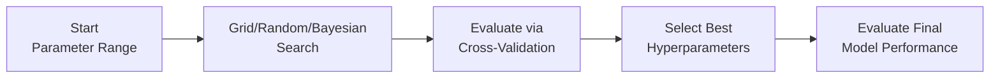

## Introduction and Rationale

I remember the first time I tried to build a machine learning model for a foreign exchange trading strategy. I was super excited, expecting my random forest with default settings to just...work, you know? Well, it sort of did, but the results were all over the place. Eventually, I realized that the hyperparameters—the parameters that control how the model learns—were basically suboptimal for my specific dataset. That’s when I first started fiddling with different ways to tune and evaluate my model. Let’s talk about why that’s so important.

Model tuning and hyperparameter optimization stand at the crossroads of machine learning and real-world financial applications. For classification tasks like credit default prediction and for regression tasks (such as forecasting macroeconomic indicators), a well-chosen set of hyperparameters can literally make or break your performance. And it’s not just about the final numbers; we also care about how robust and reliable the model is over different market conditions.

## Key Concepts in Hyperparameter Tuning

Before we dive into specific strategies, let's define some fundamental ideas:

• Hyperparameters: These are parameters set before training begins (for example, the maximum depth in a decision tree, the learning rate in gradient boosting, or the regularization parameter α in Lasso regression). They shape how the model learns.  
• Parameter vs. Hyperparameter: A “parameter” is learned directly from the data (e.g., the slopes and intercepts in a linear model), whereas a “hyperparameter” is configured externally and does not update during training.  
• Default Settings Trap: Many ML libraries (like scikit-learn or XGBoost) come with default hyperparameter settings that might be decent for “generic” problems but are rarely optimal. Especially in a finance context, data quirks—like high correlations or complex seasonal patterns—will require tuning.

## Approaches to Hyperparameter Optimization

There are multiple strategies for hyperparameter tuning out there. Here’s a quick overview of the big players, along with thoughts on how they apply in finance.

### Grid Search

Grid search is the most straightforward approach. We lay out a grid of hyperparameter values (e.g., [0.01, 0.1, 1, 10] for a regularization parameter) and systematically train/test the model for each combination.

• Pros: Easy to understand and implement, exhaustive coverage of parameter space (within your chosen grid).  
• Cons: Computationally expensive (especially if you’re exploring many parameters or large data). Also, a large portion of the search space may be wasted on unproductive parameter values.  

In finance, grid search can be sufficient if your model is small or your data set is not massive. For example, if you’re building a simple logistic regression to predict credit default, and you only want to test half a dozen values of your regularization parameter, grid search works just fine.

### Random Search

Rather than combing through every possible parameter combination, random search picks sets of hyperparameters at random. It might sound weird at first, but randomizing the search can often discover better hyperparameter values more quickly, especially in high-dimensional spaces.

• Pros: More efficient for high-dimensional parameter spaces, can find good solutions faster than grid search in many scenarios.  
• Cons: Not quite systematic, so definitely not guaranteed to find the global best if your sample is small.  

In practice, you might deploy random search if you have a large set of hyperparameters (like in a deep neural network with multiple layers, nodes, etc.). Especially in finance, you can try random search if you want to iterate fast on alpha models and can’t afford the grid search’s huge computational overhead.

### Bayesian Optimization

This is a more advanced approach that uses past evaluations of the model to build a probabilistic model of the hyperparameter-performance relationship. The objective is to decide which hyperparameters to try next, focusing on promising areas of the search space.  

• Pros: Often converges to good solutions with fewer iterations. Particularly useful when model training is expensive.  
• Cons: More complex to implement and interpret compared to grid or random search.  

Bayesian optimization can be highly valuable for big, complicated models such as gradient boosting machines forecasting equity returns, or a deep neural network analyzing text-based sentiment signals. If each training process takes hours, you’ll definitely appreciate that Bayesian optimization doesn’t waste time on far-from-optimal configurations.

## Cross-Validation Strategies

Once you have these candidate hyperparameters, you need a reliable way to evaluate them. That’s where cross-validation (CV) comes in.

### K-Fold Cross-Validation

The standard form splits your data into k folds (e.g., 5 or 10). You train on k−1 folds, test on the remaining fold, then iterate until each fold has been the “test fold” once. Finally, you average the performance across folds.  

In finance, this method is common for cross-sectional data, like analyzing a snapshot of multiple stocks at a single point in time. However, if you have time-series data (like repeating daily or monthly observations), normal k-fold can accidentally leak future data into the training process. That can lead to overly optimistic performance estimates—yikes!

### Time-Series (Rolling or Walk-Forward) Validation

For time-series forecasting or sequential data (think daily returns, monthly macro data, or transactions over time), you generally need to preserve the temporal ordering. This approach is often called walk-forward validation (or rolling window validation). You train on the earliest chunk of data, then test on the subsequent chunk, then keep moving forward in time.  

This technique helps you avoid “peeking into the future.” You can also do expansions or rolling windows—like train on the first 24 months, test on the next month, roll and re-train on a window that includes your first 25 months, and so on. While it’s more cumbersome, it’s essential if you want a realistic understanding of how well your model will forecast actual future data.

## Performance Metrics

Choosing the right performance metric is crucial. Depending on your modeling goal—classification or regression, profit maximization, or risk management—your choice of metric might differ.

### Classification Metrics

• Accuracy: Ratio of correct predictions to total predictions. It’s easy to interpret but can be misleading if classes are imbalanced (like a 99% “no default” scenario).  
• Precision and Recall: Precision is the fraction of predicted positives that are truly positive; recall is the fraction of actual positives that were predicted correctly. In credit risk or fraud detection, recall can matter more (to catch as many defaults as possible).  
• F1-score: Harmonic mean of precision and recall. Useful for balancing the two.  
• AUC (Area Under the ROC Curve): Measures how well the model ranks positives above negatives. For many financial classification tasks—detecting defaults or churn in a brokerage—AUC is widely used.

### Regression Metrics

• RMSE (Root Mean Squared Error): Penalizes large errors more heavily. Common for forecasting tasks (e.g., GDP or inflation).  
• MAE (Mean Absolute Error): More robust to outliers than RMSE, but doesn’t punish large errors as harshly.  
• MAPE (Mean Absolute Percentage Error): Expresses error as a percentage; very intuitive for returns or revenue forecasts.

### Finance-Specific Metrics

• Profit Factor: Ratio of gross profits to gross losses in a trading strategy.  
• Maximum Drawdown: Largest peak-to-trough decline. If you’re building a model for systematic trading, you want to keep max drawdown manageable.  
• Sharpe Ratio: Measures excess return per unit of risk (standard deviation). Often used in portfolio optimization or factor investing.

## Model Diagnostics and Reliability

In financial contexts, a model’s reliability across different market regimes (e.g., bull vs. bear) can be at least as important as its raw performance metrics. So after you’ve done your best hyperparameter tuning, it is often wise to:

• Assess Performance Stability: Check your model’s performance over sub-periods (e.g., pre-2008 crisis vs. post-2008).  
• Residual Analysis: For regression tasks, look at residual plots for patterns or heteroskedasticity.  
• Sensitivity Analysis: See how performance changes if you tweak certain hyperparameters slightly.  

## A Quick Mermaid Diagram of the Tuning Workflow

Below is a visual overview of a typical iterative approach to hyperparameter tuning and model evaluation. Please note the line breaks inside the node labels, which can help illustrate each step more clearly:

## Practical Implementation Example

Let’s say we’re building a gradient boosting classifier to predict corporate bond defaults. We have a dataset of historical bond issuances, with features like issuer leverage, interest coverage, macroeconomic indicators, etc. We want to minimize the misclassification of true defaults (i.e., we care a lot about recall).

1. Choose a range of learning rates (e.g., 0.01, 0.05, 0.1, 0.2).  
2. Pick different values for the maximum depth of trees (like 3, 5, 7), or the number of estimators (100, 200, 500, etc.).  
3. Use random search (or grid search if data is small enough) to evaluate different combinations.  
4. Use k-fold cross-validation if the data is cross-sectional, or a walk-forward scheme if the data is set up in a time series (maybe you have quarter-over-quarter data for each issuer).  
5. The best-performing hyperparameters might be something like a learning rate of 0.05 with a max depth of 5 and 300 estimators.  
6. Evaluate the final model with the business metric of your choice, such as recall of actual defaults or the total misclassification cost.

## Common Pitfalls and Best Practices

• Overfitting to the Validation Set: If you keep tweaking hyperparameters while always checking the same validation set, you might “learn” that set’s idiosyncrasies. Techniques like nested cross-validation or having a final held-out test set can mitigate this.  
• Inconsistent Data Splits: For time-series data, do not just shuffle randomly. It leads to unrealistic estimates.  
• Ignoring Data Leakage: Be mindful of how you treat data like future macro figures that might not have been known at the time of the forecast.  
• Untested Regimes: Some finance models work great in stable periods but break during crises. Always test models on different market scenarios if historical data is available.  

## Additional Thoughts on Model Reliability

In my opinion, financial data is notoriously noisy and regime-dependent. So, it’s not just about finding the “best” parameters on one historical dataset. It’s also about ensuring the model can gracefully adapt if market behavior changes. Sometimes, simpler models with stable hyperparameters can outperform more complex ones that are tuned to near perfection on historically specific patterns.

## Final Exam Tips

1. Understand how cross-validation setups differ for time-series vs. cross-sectional data. This is essential for item set questions featuring, say, historical portfolio returns or macro data.  
2. Use the right performance metric. For example, if a vignette scenario mentions high class imbalance (like predicting default for a small fraction of companies), expect the exam to emphasize precision/recall or AUC.  
3. Watch out for “trap” wording in item sets, such as mentioning that a manager used default hyperparameters or incorrectly combined training/validation sets.  
4. For machine learning in finance, think big picture. How might the model fail in new market regimes or after major policy changes?

## References

• Bergstra, J. & Bengio, Y. (2012). “Random Search for Hyper-Parameter Optimization.” Journal of Machine Learning Research.  
• CFA Level II Curriculum on cross-validation in multiple regression.  
• sklearn.model_selection module: https://scikit-learn.org/stable/modules/model_selection.html  

--------------------------------------------------------------------------------

## High-Impact Model Tuning for Finance: 10 Practice Questions



### In a hyperparameter tuning context, which of the following describes a hyperparameter appropriately?

- [ ] A learned coefficient that is updated during model training  
- [x] A parameter that is set prior to the learning process and does not change during training  
- [ ] The residual error term in a regression model  
- [ ] A performance metric used to evaluate model predictions  

> **Explanation:** Hyperparameters are configured before training (e.g., the learning rate or the number of hidden layers in a neural network). They are not updated from data.

### Which of the following is a drawback of basic grid search?

- [ ] It can only be used for classification tasks.  
- [x] It systematically explores many combinations, often wasting computational resources on suboptimal areas.  
- [ ] It is incapable of finding global optima.  
- [ ] It cannot be used for small or simple datasets.  

> **Explanation:** Grid search tries every combination in the predefined grid. This exhaustive approach can become time-consuming and can waste resources if the grid is large.

### In a time-series setting, why might standard k-fold cross-validation be inappropriate?

- [x] It can violate the temporal order and inadvertently use future data to predict the past.  
- [ ] It reduces bias by including data points from the future in the training set.  
- [ ] It does not allow for an accurate measure of predictive power.  
- [ ] It overly penalizes small models.  

> **Explanation:** Preserving time order is crucial in time-series forecasting to avoid data leakage. Standard k-fold mixes time periods, which leads to overly optimistic results.

### For a classification model with highly imbalanced classes (e.g., only 2% defaults), which metric is typically more meaningful than simple accuracy?

- [ ] RMSE  
- [ ] MAPE  
- [ ] R-Squared  
- [x] Precision/Recall or F1-Score  

> **Explanation:** Accuracy can be misleading in imbalanced scenarios. Precision, recall, or F1-score better measure performance when the minority class is most important to detect.

### Which of the following best characterizes random search in hyperparameter tuning?

- [x] It selects hyperparameter values randomly from a specified distribution, possibly finding good solutions with fewer trials.  
- [ ] It attempts to evaluate every possible combination of hyperparameters.  
- [ ] It uses gradient descent to optimize hyperparameters.  
- [ ] It fixes hyperparameter values at the beginning.  

> **Explanation:** Random search randomly samples from the hyperparameter space, often yielding equivalent or better results than grid search, especially in high-dimensional problems.

### Suppose you have a gradient boosting model for predicting bond defaults and you want the model to minimize large errors more aggressively. Which regression metric might be most aligned with that goal?

- [x] RMSE (Root Mean Squared Error)  
- [ ] MAE (Mean Absolute Error)  
- [ ] MAPE (Mean Absolute Percentage Error)  
- [ ] Accuracy  

> **Explanation:** Because RMSE penalizes larger errors more heavily than MAE or MAPE, it is better for situations where big errors are especially costly.

### One benefit of Bayesian optimization over random search or grid search is that it:

- [ ] Relies solely on trial and error.  
- [ ] Always converges to the global optimum.  
- [x] Utilizes information from previous evaluations to guide the search toward more promising regions.  
- [ ] Does not require any hyperparameter ranges to be defined in advance.  

> **Explanation:** Bayesian optimization builds a probabilistic model of the objective function and uses prior outcomes to choose new configurations, making it more sample-efficient.

### Which strategy, often called walk-forward analysis, is most suitable for validating a model trained on monthly stock return data from 2015 to 2025?

- [x] Time-series splitting that preserves chronological order and moves the training window forward through time  
- [ ] Standard k-fold splitting of all months into random folds  
- [ ] Repeated random train/test splits ignoring time order  
- [ ] A single hold-out split using only 2015 data for training and 2025 data for testing  

> **Explanation:** Walk-forward analysis is key in time-series forecasting, as it mimics the real-world progression of time and avoids future data leakage.

### In financial applications, the maximum drawdown metric:

- [ ] Measures the total market return within a time period.  
- [ ] Is used to track classification accuracy.  
- [x] Represents the largest peak-to-trough decline in the value of a portfolio or strategy.  
- [ ] Is only relevant in logistic regression.  

> **Explanation:** Maximum drawdown is essential when evaluating portfolio performance, capturing the worst loss from a peak.

### True or False: Overfitting can occur if you repeatedly tune hyperparameters based on the same validation set, effectively “learning” the validation set’s idiosyncrasies.

- [x] True  
- [ ] False  

> **Explanation:** Continuously adjusting the model’s hyperparameters to fit the same validation set can overfit to that specific sample, limiting the model’s ability to generalize.


