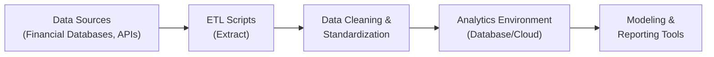

## Overview
Data can be messy. And let’s be honest—no matter how sophisticated your predictive models or machine learning algorithms, they’re only as good as the data you feed them. So, think of data analysis as cooking: if your ingredients are stale or incomplete, you’re not going to get the dish you hoped for. In quantitative finance, ensuring you have a clear plan for data collection and cleaning is crucial. This section walks through how to plan and define objectives, gather relevant data, and systematically clean that data so it’s ready for advanced modeling, risk assessment, or portfolio optimization.

## Project Scope and Objectives
Before you log in to your favorite analytics platform or rummage through reams of CSV files, pause and define the “why” behind your project. Are you aiming to build a predictive model to forecast bond yields? Maybe you want to automate a reporting system for daily portfolio returns, or you’re analyzing risk exposures in real time. Setting clear objectives can save you (and your stakeholders) from confusion. It also ensures your energy, resources, and time aren’t wasted on interesting—but irrelevant—data or calculations.

• Align objectives with investment/business goals. For instance, if your firm’s priority is to reduce trading costs, define a metric such as “percentage reduction in average spread or commission.”  
• Establish Key Performance Indicators (KPIs). Model accuracy, time saved on reporting, or cost reduction of transaction fees are all examples.  
• Get buy-in from stakeholders (e.g., portfolio managers or compliance officers) to confirm that what you’re solving is both meaningful and feasible.

I recall a time when a colleague and I were assigned a data project to forecast real estate valuations for an asset manager. We didn’t define the success metric: Was it the forecast accuracy within 5% of the actual price? Or was it the lead time before a market correction? Yep, we ended up with contradictory success measures. Lesson learned: define success criteria early!

## Data Inventory and Stakeholder Identification
Next, figure out what data is already out there—and who’s responsible for delivering it.

• Identify All Relevant Data Sources. These might include internal transactional databases, external data vendors (such as Bloomberg or Refinitiv), macroeconomic data from the Federal Reserve or OECD, or even alternative data feeds like social media sentiment.  
• Catalog Data by Type and Format. Is the data real-time or historical? Do you receive it as CSV files or database tables? Are you tapping into streaming APIs? Log these attributes in a central repository (it can be a simple spreadsheet if that’s all you’ve got!).  
• Clarify Stakeholder Roles. Maybe you need the IT team to set up your data ingestion scripts. Perhaps compliance has to approve the use of certain third-party data. Document these roles from the outset.  

Why does any of this matter for the CFA exam? Because item sets might test your ability to distinguish credible data sources—or to identify which stakeholder you must consult for data provisioning. And in real life, it’s even more important: if you miss a stakeholder or a relevant data feed, you’ll waste precious time scrambling to fill gaps or correct oversights.

## Data Collection Strategy
Whether you’re pulling daily returns or scraping websites for sentiment data, a robust data collection plan spares you headaches later. Here’s a general approach:

• Implement Reliable Data Pipelines. Setting up a robust pipeline—often through ETL (Extract, Transform, Load) processes—helps automate ingestion. A pipeline might connect an external API to your internal databases or cloud storage.  
• Schedule Data Pulls. For time-series data (stock prices, economic indicators), you might schedule daily or weekly feeds. For event-driven data (earnings announcements, corporate actions), you set triggers that alert your system to pull new info.  
• Automate Where Possible. Manual data entry is no fun and is prone to error. Python scripts or ETL tools like Talend or Informatica can streamline everything and reduce the chance of “fat-finger” mistakes.

As a visual glimpse, imagine a simple data pipeline for a project analyzing daily stock returns:

In many real-world cases, any glitch at an earlier step can cascade through the pipeline. If data extraction fails, your entire modeling will be off. That’s why each arrow in this chart represents not just a process step but a verification checkpoint.

## Data Cleaning and Preprocessing
So maybe you’ve got your raw data in a pristine relational database. But guess what? There might be duplicate rows, missing values in key fields, or columns mislabeled because of inconsistent naming conventions. Here’s what to do:

• Remove Duplicates. Merging trades from two systems? Watch out for records that appear in both. A standard approach is to use a unique identifier (e.g., transaction ID) to identify and remove duplicate entries.  
• Handle Missing Values. Should you drop rows with missing fields, or should you impute them (say, with the column average)? The decision depends on your use case. For instance, you might not want to guess a missing portfolio return.  
• Convert Data Types. A date field might show up as plain text, or a numeric field embedded in a string. Standardization (e.g., turning all currency amounts to the same base currency or ensuring your date fields are actual dates) is vital.  
• Preliminary Transformations. This can be as simple as extracting the day, month, and year from a timestamp to align your data with your analysis timeline. Or it can be as complex as normalizing large ranges of numeric values to ensure certain variables don’t dominate your model.

A quick anecdote: In one risk analysis project, we discovered that half the trades labeled “closed” had actually been reopened in another system. The duplicated trade IDs caused double exposures in the final risk report. Good thing we caught this in the data cleaning phase—before making any conclusive statements.

## Documentation and Change Management
So, you’ve done the heavy lifting of collecting and cleaning data. Now you want future users (including your future self) to understand what you did and why you did it.

• Maintain Detailed Notes. Record where each dataset came from, how you cleaned it, and why you threw out certain rows or replaced missing values with an average.  
• Versioning of Datasets. Whenever you make significant changes—like adding a new column or dropping records—use version control or at least keep separate backup files.  
• Communicate with Stakeholders. If the portfolio manager decides to add a new data source mid-project, you’ll need to revise your pipeline. Keep everyone in the loop to confirm the data still meets the project’s evolving needs.

In practice, non-technical folks might not love reading your thorough documentation, but they will love you when something goes wrong and you can fix it quickly, thanks to your change log. It’s also relevant professionally, because the CFA Institute Code of Ethics and Standards of Professional Conduct emphasizes diligence and thoroughness in data handling—improperly documenting changes might raise red flags if there’s an audit or compliance check.

## Initial Quality Checks
Okay, so now your data’s in place. Time for a sanity check:

• Aggregated Figure Comparison. Compare total trades, total returns, or aggregate exposures to known benchmarks or previously reported summaries. If your numbers deviate wildly, something might be off.  
• Basic Statistical Analysis. Look at descriptive stats—mean, median, mode, standard deviation—to see if they make sense. Outliers could be legitimate or might be data errors.  
• Industry or Benchmark Validation. If your dataset is about US equities, and you see that 80% of your returns fall outside the -10% to +10% daily range, that’s suspicious. Cross-reference historical data or widely used indexes (e.g., S&P 500 returns) to see if your set aligns with typical market conditions.

### Example: Quick Outlier Check
Suppose you have daily returns, and the mean daily return is 0.05% with a standard deviation of 1%. You discover certain days with 10% or 20% “returns.” Unless there was a major market crash or a unique corporate event, that’s likely a red flag to investigate.

## Best Practices and Pitfalls
• Best Practice: Have multiple eyes on the data. Peer review is crucial—a second person might spot obvious mistakes you’ve become blind to.  
• Pitfall: Over-Deleting “Suspicious” Rows. Sometimes outliers are real (think “Black Swan” events). Deleting them without a thorough rationale can bias your research and lead to false conclusions.  
• Best Practice: Create a Data Dictionary. List each column, define it, note its data type, and indicate permissible values.  
• Pitfall: Letting Perfect Be the Enemy of Good. You might never get 100% “perfect” data, especially if you’re dealing with multiple sources. Do the best you can, document limitations, and iterate.

## Glossary
• ETL (Extract, Transform, Load): A process to gather data from original sources, alter or clean it as needed, and load it into a target system or database.  
• Data Pipeline: An automated sequence of steps that moves raw data through various transformations until it’s ready for analytical or operational use.  
• Data Quality Checks: Techniques such as outlier detection, range checks, and cross-referencing against benchmarks to ensure the dataset is consistent and reliable.  
• Stakeholder: Anyone—portfolio managers, compliance officers, IT staff—who has an interest in, or is affected by, the data project and its outcomes.  
• Scope: The boundaries, deliverables, and objectives of a project, clarifying what falls inside or outside the project’s domain.

## Final Exam Tips
• Expect the exam to present item sets where you must identify “which data source is most appropriate” or “how you would address missing data.”  
• Time management is crucial—particularly under exam pressure, scanning how data is described in a vignette is essential. If they mention “duplicate trades,” watch for a question about data cleaning.  
• Link data quality to ethics. Misrepresentation of investment performance is a hot topic in the CFA Institute Code of Ethics and Standards of Professional Conduct.  
• Memorize the general steps: define scope, identify data/stakeholders, plan collection, clean data, document changes, run quality checks. The exam often tests conceptual frameworks like these.

## References and Suggested Readings
• Kimball, R. & Ross, M. (2013). “The Data Warehouse Toolkit.” John Wiley & Sons.  
• CFA Institute: Various readings on quantitative methods and data-driven decision making (search the CFA Institute website).  
• “Project Management Body of Knowledge (PMBOK Guide)” for detailed guidance on scope definition and stakeholder management.

Remember, you’re laying the foundation for more advanced analyses—like multiple regression (Chapter 2) and machine learning (Chapter 7). If your foundation is shaky, everything else might collapse! So, take your time to get data planning, collection, and cleaning right.

## Test Your Knowledge: Data Analysis Project Steps Quiz



### When defining the scope of a data analysis project, which of the following is the most critical starting point?

- [ ] Committing to immediate data acquisition from multiple vendors
- [ ] Developing the final report template ahead of data collection
- [ ] Delegating all tasks to the IT department
- [x] Establishing clear objectives and aligning them with business goals

> **Explanation:** The scope definition must begin with clear objectives tied to organizational or investment goals. This ensures that the subsequent data collection and cleaning efforts are relevant and effective.

### Which of the following best describes the purpose of a data pipeline in financial modeling?

- [x] An automated process to collect and prepare data before it reaches modeling or reporting systems
- [ ] A manual procedure used by compliance staff to approve all trade data
- [ ] A purely theoretical flowchart that illustrates guidelines in textbooks
- [ ] A type of off-site data backup solution for archived information

> **Explanation:** Data pipelines automate data ingestion, transformation, and loading so that analysts and portfolio managers have a clean and reliable dataset for modeling.

### In the context of data cleaning, which statement is correct?

- [ ] Outliers should always be removed
- [x] Outliers can sometimes indicate important events and should be investigated before removal
- [ ] Missing values are always replaced with the mean
- [ ] All rows with missing values must be deleted

> **Explanation:** Outliers may represent significant market or firm-specific events. Automatically removing them can distort insights. Likewise, missing values might need different strategies depending on the context and the data’s role in modeling.

### A financial analyst notices that some rows in a trade dataset appear twice. What is the recommended solution?

- [x] De-duplicate the data by identifying and removing exact duplicates based on a unique trade ID
- [ ] Delete all rows containing any duplicates, including original and duplicate
- [ ] Average the values of the duplicate entries
- [ ] Convert duplicates to missing values

> **Explanation:** Duplicate records can inflate metrics or skew analyses. The standard approach is to remove only the true duplicates, typically using a unique identifier such as a trade ID.

### Which of the following tasks is NOT typically part of data collection?

- [x] Performing hypothesis testing on financial ratios
- [ ] Implementing automatic data ingestion scripts
- [ ] Scheduling data pulls for real-time feeds
- [ ] Extracting data from internal or external databases

> **Explanation:** Hypothesis testing (statistical analysis) generally occurs after the data has been collected and cleaned. Data collection tasks center on gathering the data rather than analyzing it in-depth.

### Why is documenting every step of the data cleaning and transformation process important?

- [ ] It replaces the need to communicate with stakeholders
- [x] It allows for version control and transparency in case the process or data changes over time
- [ ] It ensures the data can only be used for one project
- [ ] It’s only a formality with no real benefit for diagnosing issues

> **Explanation:** Thorough documentation helps maintain version control, track transformations, and provide transparency. It’s critical if you need to revisit decisions or justify data treatments to regulators or colleagues down the line.

### In a typical data analysis project, which stakeholder is most likely responsible for providing approvals to use external data sources?

- [ ] The data engineering team
- [ ] The marketing team
- [ ] The portfolio manager
- [x] The compliance officer

> **Explanation:** Compliance officers often need to verify that external data usage aligns with regulations and internal policies. In many financial firms, they have final say on whether data sources are approved for usage.

### Which scenario most clearly indicates a potential data quality issue?

- [ ] Mean returns are slightly below the benchmark index
- [x] Daily returns exceeding ±15% in the absence of major market events or news
- [ ] Positive skew in returns data over the last five years
- [ ] A correlation matrix that shows low correlation among assets

> **Explanation:** Very large daily returns may signal a data error unless there’s an extraordinary market event, prompting further investigation.

### What argument best explains why “perfectly clean” data is often unattainable?

- [ ] Stakeholders usually prefer incomplete data to reduce computational workload
- [ ] It is unethical to spend too much time cleaning data
- [x] Multiple systems, data formats, and real-world anomalies mean there will always be some level of imperfection
- [ ] Regulators discourage extensive data validation

> **Explanation:** Real-world data is typically collected from a wide variety of sources, each with its own inconsistencies. Despite best efforts, absolute perfection is rare; the key is to keep imperfections within acceptable limits.

### True or False: Documenting anomalies and transformations of data is important only for junior analysts and not for senior managers.

- [x] True
- [ ] False

> **Explanation:** This question as stated is tricky. In practice, thorough documentation is critical for all levels in finance—junior analysts, senior managers, compliance officers, and more. If data accuracy and transformation steps are unclear, major strategic decisions could be built on faulty assumptions. Therefore, it’s actually true that it is important—but the statement is ironically reversed in meaning, highlighting the need to always read question wording carefully.


