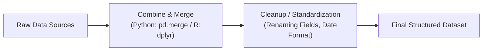

## Data Wrangling Fundamentals
Data wrangling is the process of bringing diverse, messy, or sometimes downright chaotic information into a consistent, structured format suitable for analysis. If you've ever tried consolidating daily stock returns from three or four different data vendors, you know how quickly things get complicated. Each vendor might format ticker symbols differently, or perhaps one data source logs monthly data and another logs weekly. That’s when you realize: you can’t just grab data off the shelf and run your fancy regression—first, you have to make it speak the same language.

In a typical Level II exam scenario, you may stumble upon a vignette providing large tables of stock prices, corporate fundamentals, and macroeconomic indicators. The question might involve merging them into one coherent dataset before modeling future returns. Let’s say you have data from two CSV files and one Excel workbook. Their column structures differ. The time frames don’t sync exactly. Some columns are labeled “PX_LAST,” others “Close,” or “Adjusted Price.” And oh—some stock tickers read “AAPL” while others read “Apple Inc.” That’s data wrangling in a nutshell: aligning these details carefully so your final dataset is correct and consistent.

Here are some key practices:

• Integrate multiple datasets using matching keys. Financial data is often linked by ticker symbols, company IDs (e.g., SEDOL, CUSIP), or exact date/time stamps. Check for variations in naming or date formatting (e.g., 2025/05/01 vs. 01-May-25 vs. 5/1/25).   
• Resolve schema mismatches. Maybe you have "last_price" in one dataset and "price_close" in another. Standardize these to a single, uniform field.   
• Use scripts in Python or R to reshape tables. In Python, the Pandas library’s merge, concat, and pivot methods are your best friends. In R, you might rely on dplyr’s join functions.  

Below is a miniature data-wrangling pipeline diagram (in Mermaid syntax) illustrating how raw data flows into a well-defined format:

In my experience, ensuring consistent column naming and date alignment feels tedious, but it’s absolutely vital. After all, if you can’t trust your data, you’ll have a seriously questionable final analysis.

## Imputation of Missing Values
Missing data is almost inevitable—especially in big financial datasets. Some asset prices might be missing on certain days, certain exchange rate fields might be blank, or fundamental data might be missing for smaller firms. There are several ways to address these gaps:

### Mean or Median Imputation
This is by far the simplest and often the first approach you learn. If a variable is missing, say, a daily trading volume, replace it with the mean or median of the available observations. For instance, if you have 200 days of volume data and only 2 days contain missing values, you can fill those days with the average volume. This can be acceptable when data are missing at random and you don’t expect major outliers to skew your results significantly. 

However, be cautious: if the data are missing systematically—like all Fridays for a certain stock for some reason—mean imputation could introduce bias. Also, in financial contexts, volume could be heavily skewed. Using the median instead of the mean might better preserve the dataset’s structure.

### Forward Fill and Backward Fill
These methods are especially popular in time-series contexts. Forward fill (or “last observation carried forward”) takes the last known data point and simply keeps using it for all subsequent missing observations until a new valid data point appears. Backward fill does the opposite—pulling in future observations to fill earlier gaps. 

In finance, forward fill is common for missing price data over weekends or holidays. If a Sunday’s closing price is missing, you might just use Saturday’s price until Monday’s price appears. But watch out: if a big event happened over the weekend, forward fill might distort your dataset. 

### Multiple Imputation
If you’re dealing with large and complex datasets—perhaps you have hundreds of missing data points for certain illiquid stocks—you might go for a more statistically sound approach. Multiple imputation involves creating several different “plausible” versions of the dataset by using predictive models (like regression or machine learning models) to fill missing values. Then you run your final analysis on each plausible dataset and combine the results. This approach helps incorporate the uncertainty around missing data, theoretically giving more reliable inferences.

## Normalization and Scaling
Normalization, or scaling, is another big step in data preparation. Many machine learning algorithms (e.g., k-Nearest Neighbors, neural networks, or support vector machines) assume all features are on similar scales. If one variable—like a stock price that often ranges in the hundreds—dominates another—like sentiment scores around 0 to 5—the model might overweight the high-scale variable. Normalization solves this.

### Min–Max Scaling
With min–max scaling, each feature is transformed to a target range, typically [0,1]. The formula is:

x_{\text{scaled}} = \frac{x - \min(x)}{\max(x) - \min(x)}

If you have daily returns ranging from -0.05 to +0.04, then after scaling, the smallest value becomes 0 and the largest value becomes 1. Everything in between is mapped accordingly. Min–max scaling is easy to interpret, but outliers can cause everything else to crunch into a tiny range.

### z-Score Standardization
z-score standardization transforms each value to represent how many standard deviations above or below the mean it lies:

z = \frac{x - \bar{x}}{\sigma}

If your data follows (or nearly follows) a normal distribution, z-score standardization can help highlight meaningful deviations. For instance, if an analyst sees a +3.0 z-score, that means an observation is 3 standard deviations above the mean—pretty unusual. But if your data is heavily skewed, z-scores might not be the best approach.

### Robust Scaling
If you’re dealing with heavy-tailed distributions or multiple outliers (and trust me, financial data can get super messy), robust scaling might be more appropriate. Instead of using the mean and standard deviation, robust scaling uses the median and interquartile range (IQR). This approach drastically reduces the influence of outliers because the median and quartiles are less sensitive to extreme values.

## Outlier Detection and Treatment
If you’re looking at returns data, you might occasionally see an abnormally huge return—like +500% in a single day—due to some one-off event (a critical press release or a data feed glitch). The question is: do you treat that as a legitimate data point, or is it a fluke that should be removed or capped?

### Statistical Thresholds
A common approach is to flag any values over a certain number of standard deviations from the mean—say 3 or 4 standard deviations. If 99% of your returns distribution is within ±5%, you can suspect that a +50% reading might be an outlier that needs thorough investigation. But keep in mind, outliers in finance can be real. Look at what happens during severe market crashes or huge rallies. Don’t just automatically remove these; analyze whether they’re legitimate.

### Domain Knowledge
Sometimes you rely on knowledge of the asset class or market microstructure. For instance, if a stock rarely trades over $10 million in volume per day but you see a $50 million reading, that might still be valid if it coincided with an earnings release. If it’s valid, keep it. If not, you might choose to remove or cap the value (Winsorize).

### Transformation Approaches
Winsorization caps extreme values at given percentiles—like the 1st and 99th percentile. For returns, you might decide that anything above the 99th percentile is replaced with the 99th-percentile value, and anything below the 1st percentile is replaced with the 1st-percentile value. This softens the effect of outliers without completely removing them. Just be sure to document your approach and be transparent about the reasons for your chosen thresholds.

## Log Transformations
If your data has exponential growth or a strong positive skew—like stock prices over time—using the natural logarithm can make a big difference. In finance, analyzing log-transformed data often aligns better with the assumption of multiplicative processes. For example, log returns are additive over time, which can simplify certain time-series analyses. 

If you ever look at how asset prices evolve, they frequently follow growth patterns that are nearly exponential over long periods. Taking logs can make these patterns more linear and more convenient to model. That said, never forget that log transformations require strictly positive data—no negative or zero values allowed.

## Glossary
• Data Wrangling: Transforming and consolidating raw datasets into a format suitable for analysis or modeling.  
• Imputation: Replacing missing or invalid values with estimates, often to preserve the integrity of your dataset.  
• Normalization (Scaling): Rescaling data so that different variables operate on comparable scales, often crucial for machine learning algorithms.  
• Winsorization: Capping extreme outliers at specified percentiles to reduce their impact.  

## References
• Gelman, A. & Hill, J. (2006). “Data Analysis Using Regression and Multilevel/Hierarchical Models.” Cambridge University Press.  
• VanderPlas, J. (2016). “Python Data Science Handbook.” O’Reilly Media (see chapters on data wrangling with Pandas).  
• Springboard Blog, “Data Wrangling Tips and Tricks” (online resource covering various data cleaning strategies).

## Final Exam Tips
• Document Everything. On the exam, you might be given a scenario about missing data and asked which imputation strategy is best. In real life, always record your reasons for choosing a specific method.  
• Beware of Over-Manipulation. Overly aggressive data cleaning or outlier removal can mask real phenomena—especially relevant in finance where tail events can be the most critical.  
• Practice Scripts and Tools. If you’re working with big data, coding proficiency in Python or R can be a game-changer—both for exam item sets and for real-world tasks.  
• Time Allocations. If a vignette describes multiple data sources with unknown columns, hold back the temptation to dive right in. Clarify the data fields, check their definitions, and ensure you understand how they’re supposed to merge.  

## Test Your Mastery: Data Wrangling, Imputation, and Normalization Quiz



### Which of the following is the MOST important consideration when merging dividend data from one vendor with price data from another vendor?

- [ ] Ensuring each feature is standardized via z-score before merging.
- [ ] Confirming that both vendors have the same ticker symbols and aligned date indices.
- [ ] Using backward fill to handle future missing prices.
- [x] Making sure the merge is done with shared keys (like ticker or date) and consistent data formats.

> **Explanation:** When combining data from multiple vendors, matching keys (and consistent date formats) is crucial. Standardizing data can be important, but only after you correctly merge the datasets.

### A time-series data set has missing observations on certain holidays. Which method, typically used for financial data, can fill these missing prices with the last known price?

- [x] Forward Fill
- [ ] Mean Imputation
- [ ] Multiple Imputation
- [ ] Robust Scaling

> **Explanation:** Forward fill (often used in finance) duplicates the last known observation to fill in for missing dates, maintaining continuity in price data.

### You detect that a stock’s daily returns distribution is highly skewed, with extreme outliers occasionally driven by large market movements. Which scaling approach is likely BEST for mitigating the influence of outliers?

- [ ] Min–Max Scaling
- [x] Robust Scaling
- [ ] z-Score Standardization
- [ ] Mean Imputation

> **Explanation:** Robust scaling is designed to reduce outlier influence by using medians and IQR. Min–max scaling can still be distorted by extreme values, and z-score standardization is heavily influenced by outliers.

### In the context of filling in missing data, which of the following statements about multiple imputation is CORRECT?

- [ ] It removes all rows that contain missing data.
- [x] It creates multiple plausible datasets and averages the results to incorporate uncertainty.
- [ ] It only uses the mean or the mode to fill missing values.
- [ ] It only applies to time-series data.

> **Explanation:** Multiple imputation involves creating multiple versions of the dataset with different plausible estimates for missing values and then pooling the results. This accounts for the inherent uncertainty in missing data.

### A researcher wants all variables in a multi-factor model on the same exact scale of [0,1]. Which transformation is MOST appropriate?

- [x] Min–Max Scaling
- [ ] z-Score Standardization
- [ ] Median Imputation
- [ ] Log Transformation

> **Explanation:** Min–max scaling transforms data into a preset range, commonly [0,1]. This is widely used when the model is sensitive to absolute differences.

### Which of the following is an example of domain knowledge guiding outlier detection in finance?

- [x] Recognizing that a 30% daily return for a stable stock is unusual and investigating corporate news events.
- [ ] Automatically removing all values more than two standard deviations from the mean.
- [ ] Enforcing a daily return cap of ±2% for all stocks.
- [ ] Applying robust scaling to the entire dataset.

> **Explanation:** Domain knowledge means recognizing unusual variations (like a 30% jump for a stable stock) and checking whether they reflect real market events or errors. Automatically removing outliers without context is risky.

### Why might an analyst apply a natural log transform to stock prices?

- [x] Stock prices often exhibit multiplicative growth, and log transforms can linearize this trend.
- [ ] It automatically fixes missing values in the data.
- [ ] It is necessary to handle negative values.
- [ ] It eliminates the need for outlier handling.

> **Explanation:** Log transforms are common in finance, as prices often grow multiplicatively. However, log transforms don’t handle negative or zero values and don’t inherently fix missing data.

### Which of the following best describes “winsorization”?

- [ ] Completely deleting outliers from the dataset.
- [x] Capping extreme values at specified percentiles (e.g., 1st and 99th) to limit their influence.
- [ ] Predicting missing values using time-series forecasting.
- [ ] Using the median to replace all “unusual” data points.

> **Explanation:** Winsorization modifies outlier values by capping them but not removing them. This helps reduce their impact on statistical calculations.

### An analyst has monthly stock returns where a handful of them exceed 100%. She suspects these might be data-entry glitches. Which step should she take FIRST?

- [x] Verify data validity using documentation or cross-referencing another source.
- [ ] Winsorize the returns at 95th percentile.
- [ ] Standardize them using z-scores.
- [ ] Delete the observations as outliers.

> **Explanation:** Before transforming or removing outliers, always verify whether they reflect legitimate market behavior or errors. Domain knowledge and additional data checks should come first.

### True or False: Mean imputation is always preferable to forward fill because it keeps the dataset’s average intact.

- [x] True
- [ ] False

> **Explanation:** While mean imputation maintains the overall average, it does not account for time-series continuity or sudden events—so it’s not always preferable. Context matters, especially in finance, but from a purely average-maintenance perspective, mean imputation preserves that statistic.


