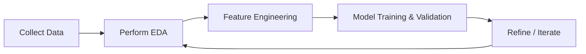

## Introduction and Context

Data Exploration and Feature Engineering represent crucial steps in any quantitative finance workflow, helping you squeeze actionable insights out of raw data. And trust me, it can be quite exciting—there’s that moment when you see an interesting pattern in your data, and you think, “Hey, this might actually matter for my investment model.” Meanwhile, ignoring these steps or rushing through them can doom even the most sophisticated machine learning or regression approach.

Throughout this section, we’ll discuss best practices for Exploratory Data Analysis (EDA) and feature engineering, including textual data extraction. We’ll get into how to handle messy data—like, say, those big financial text disclosures where half the words are legal boilerplate—and transform it into something your model can digest. We’ll also talk about how to spot interesting signals that might be hidden in your data. Let’s dive right in!

## Exploratory Data Analysis (EDA)

### Summary Statistics

One of the most important tasks is to calculate basic descriptive metrics—mean, median, standard deviation, minimum, maximum—for each variable in your dataset. If you’re analyzing daily stock returns, you’d inspect the average return, volatility (standard deviation), and maybe skewness and kurtosis to see if the distribution is nearly normal or severely fat-tailed. This is also the phase where you might encounter something surprising. A while back, at a small quant shop I worked for, we discovered that 90% of the data for a particular equity factor was missing for certain months—yikes. Checking summary stats saved us from building a model with massive blind spots.

### Visual Methods

EDA doesn’t stop at numeric summaries:

• Histograms show the distribution of a single variable. For returns, a histogram can reveal if there’s a large spike around zero or if you see extreme tails.  
• Scatter plots let you see the relationship between two variables easily. Plot, for instance, return on the x-axis versus volume on the y-axis. Do you notice any trend?  
• Boxplots help you spot outliers quickly, especially if you suspect your data might have anomalies (like returns that are suspiciously high). Boxplots for different sectors side-by-side are also quite insightful.  
• Correlation matrices can help identify pairs of variables that are positively/negatively correlated. This is crucial if you’re going to feed your data into a linear model, because strong correlations among predictors might lead to multicollinearity headaches.

### Example EDA Flowchart

Below is a simple diagram illustrating the iterative EDA and modeling cycle. Notice that outcomes from one step feed back into previous steps:



## Feature Engineering Basics

Feature engineering is about turning raw data into meaningful inputs for your model. It’s part art, part science. A well-engineered input can capture fundamental relationships (like momentum, volatility, or sentiment) better than a raw number sitting in your dataset.

### Combining Variables

Try creating combined signals that reflect real-life relationships. For instance, if you have daily returns, you might create a 20-day moving average to capture momentum. Or, if you have financial statement data, consider ratios that scale one metric by another, such as “Operating Cash Flow / Total Debt” to assess leverage in a more dynamic way. For equity analysts, combining price and volume data could yield features like “Price * Volume,” which approximates daily dollar volume that might get used in liquidity risk assessments.

### Polynomial Features and Interactions

Sometimes a relationship between two variables is nonlinear. In that case, you can generate extra terms (e.g., squared or cubed versions) or products of two features (interactions). For instance, if you suspect that volume’s effect on returns is different at higher prices compared to lower prices, you might include the interaction term “Price × Volume.” Done carefully, these expansions can capture complexities that linear models might miss. But you’ve got to be mindful of overfitting, especially if you add too many features. A prudent approach could involve cross-validation to see which polynomial or interaction terms actually boost predictive power in out-of-sample tests.

### Domain-Specific Transformations

In finance, experience and domain knowledge are crucial. If you’re analyzing an options strategy, you might create implied volatility features. For credit risk modeling, you might incorporate a company’s interest coverage ratio (EBIT / Interest Expense) or a measure of short-term liquidity (Current Ratio). If you’re dealing with currency markets, you might transform raw exchange rates to daily percentage changes or relative valuations (purchasing power parity deviation). That’s the real art: picking transformations that truly reflect an economic or financial rationale.

## Handling Textual Data

Textual data—like news articles, corporate filings, or social media chatter—can be a goldmine for signals, but it requires unique processing steps.

### Tokenization and Cleaning

Text is messy. Often, you’ll strip punctuation, convert everything to lowercase, and remove non-informative “stop words” (the, is, at, and so on). In finance, be mindful that generic stop word lists might remove terms that are meaningful in your domain, such as “asset,” “return,” or “risk.” You might even create a custom dictionary of abbreviations, especially if you’re dealing with 10-K or 10-Q reports where terms like “md&a” (management discussion and analysis) reappear in sometimes abbreviated forms.

Tokenization is the process of splitting text into words (tokens). For example, the sentence “Earnings soared 10% at XYZ Inc.” might be split into tokens like [“earnings”, “soared”, “10”, “xyz”, “inc”]. That’s your raw material for the next steps.

### Bag-of-Words vs. TF-IDF

Once text is tokenized, you need a numerical representation—your models can’t handle words directly. Two common methods:

• Bag-of-Words: Build a vocabulary of all tokens across documents, then represent each document by the counts of these tokens. For instance, if “growth” appears three times, you record a “3” for that word. This approach is simple but might overemphasize very frequent words.  
• TF-IDF (Term Frequency – Inverse Document Frequency): A weighting scheme that downplays extremely common words (like “the”) and up-weights more distinctive terms. If “auto” appears frequently in only one company’s filing, that might be a more telling term than something that appears in every single filing.

### Sentiment Analysis

If you’re looking to gauge market sentiment from textual data, you’ll often rely on conventional dictionaries or custom machine learning models.  
• Loughran–McDonald Dictionary is specialized for finance, distinguishing words that are positive, negative, uncertain, or litigious. So, if you see “concern,” that might belong in the negative sentiment bucket.  
• Advanced Approaches: You can train big language models or deep learning classifiers on historical textual data labeled as “positive,” “negative,” or “neutral.” This is more complex, but sometimes more accurate than dictionary-based approaches.

Below is a tiny sample Python snippet showing how you might create a simple sentiment feature:

```python
import nltk
from nltk.corpus import stopwords
from collections import Counter

call_text = "XYZ Inc. delivered strong performance, but management is concerned about future interest rates."

tokens = nltk.word_tokenize(call_text.lower())

stop_words = set(stopwords.words('english'))
filtered_tokens = [t for t in tokens if t.isalpha() and t not in stop_words]

lm_negative = {"concerned", "risk", "uncertain"}   # Typically a much bigger dictionary
lm_positive = {"strong", "success", "gain"}

word_counts = Counter(filtered_tokens)

neg_count = sum(word_counts[w] for w in lm_negative)
pos_count = sum(word_counts[w] for w in lm_positive)

sentiment_score = pos_count - neg_count
print("Sentiment Score:", sentiment_score)
```

In practice, you would incorporate more words into your dictionaries and handle additional complexities (e.g., negations like “not good”).

## Feature Selection

Now that you’ve engineered a bunch of potential predictors—numeric features, polynomial terms, textual sentiment scores—you might end up with dozens or hundreds of variables. Many will be redundant or have little predictive power.

### Filter Methods

These methods rank features by their correlation with the target or by simple statistical tests (e.g., ANOVA F-tests). If a feature has near-zero correlation with your target asset return, it might be excluded as unhelpful. Filter methods are fast, but they ignore interactions between features.

### Wrapper Methods

Here, you repeatedly train and evaluate a model while adding/removing features. Techniques like Recursive Feature Elimination (RFE) or forward selection systematically explore which subset of features gives the best performance. The downside? They can be computationally expensive, especially if your dataset is large.

### Embedded Methods

Regularized models (like LASSO, Ridge, or Elastic Net) integrate feature selection into the training process itself. LASSO is especially known for setting the coefficients of less important variables to zero, effectively discarding them. In finance, LASSO is handy when you suspect many variables provide minimal unique information.

## Iterative Refinement

Feature engineering and selection is not a one-and-done affair. If your model’s results look subpar, or if you run into suspiciously high error in out-of-sample tests, revisit your assumptions. Maybe you missed an important transformation, or maybe there’s a data quality issue that slipped through. Keep track of your data transformations and the rationale behind each new feature, so you can learn from both your successes and your dead ends.

## Glossary

• Exploratory Data Analysis (EDA): Summarizing data’s main characteristics and distributions, often visually.  
• Tokenization: Splitting text into tokens (words or phrases) for computational analysis.  
• TF-IDF (Term Frequency – Inverse Document Frequency): A numeric measure that highlights how important a word is in a particular document relative to all documents.  
• Loughran–McDonald Dictionary: A finance-specific dictionary commonly used for sentiment and textual analysis of corporate filings.  
• Feature Selection: Techniques to pare down the number of input variables, keeping only the ones that provide significant predictive power.

## Practical Exam Tips

1. Be Thorough with EDA: On the exam, you might be given a vignette describing a dataset’s summary statistics or showing a scatter plot. Expect to identify potential data issues or realize a variable is heavily skewed.  
2. Watch Out for Overfitting: The exam may test your understanding of polynomial expansions or large numbers of engineered features. Know how to justify the use of cross-validation or penalized regressions.  
3. Explain Your Feature Creation: Vignette questions often ask what transformations or interactions you’d apply and why they’re relevant to the investment hypothesis. Point to a financial rationale—examiners love that.  
4. Don’t Forget Textual Data Pitfalls: If they show you textual features, be prepared to talk about how certain words might not mean what you think (e.g., “liability” could be used in a legal, not just a financial sense).  
5. Keep it Iterative: The exam might mention that an initial set of variables didn’t produce a good model fit. They might test your knowledge of how to refine features or remove outliers.

## References and Suggested Readings

• Loughran, T., & McDonald, B. (2011). “When Is a Liability Not a Liability? Textual Analysis, Dictionaries, and 10-Ks.” The Journal of Finance.  
• Hastie, T., Tibshirani, R., & Friedman, J. (2009). “The Elements of Statistical Learning.” Springer.  
• CFA Institute Official Publication on NLP and textual analysis in investment research.  
• Additional recommended reading: “Applied Text Analysis with Python” by Benjamin Bengfort et al., for a deeper dive into textual feature engineering.

## Test Your Knowledge: Data Exploration and Feature Engineering Quiz



### Which of the following best describes Exploratory Data Analysis (EDA) in the context of financial modeling?

- [ ] It is the process of selecting the most relevant features for a regression model.  
- [x] It is an approach for summarizing the main characteristics of data, often using visual methods and descriptive statistics.  
- [ ] It is a method of encoding textual data using TF-IDF scores.  
- [ ] It is a technique that directly optimizes out-of-sample performance.  

> **Explanation:** EDA is primarily about understanding the structure and distribution of your dataset before building formal models.

### Which of the following actions is part of tokenization when processing textual data?

- [ ] Generating correlation matrices for words and sentences.  
- [x] Splitting text into smaller units (words or tokens).  
- [ ] Calculating the mean and median of text-based features.  
- [ ] Removing correlated numeric features from a dataset.  

> **Explanation:** Tokenization converts a string of text into smaller segments (typically words), which later serve as input to statistical or machine learning models.

### In a Bag-of-Words model, what key information is typically captured?

- [x] The frequency of each word in a document.  
- [ ] The time series momentum signals from the text.  
- [ ] The polarity of each word for sentiment analysis.  
- [ ] The interactions between numeric and text features.  

> **Explanation:** Bag-of-Words counts how many times each word appears in a document, without considering word order or context.

### When dealing with polynomial feature engineering, which of the following is a potential risk?

- [ ] Underfitting the dataset.  
- [ ] Reducing variance in your predictions.  
- [x] Overfitting if too many polynomial terms are introduced.  
- [ ] Improving interpretability unconditionally.  

> **Explanation:** Adding high-order polynomial terms can lead to overly complex models that memorize noise in your sample, thus overfitting.

### What is one main advantage of using TF-IDF over a simple Bag-of-Words approach?

- [x] It weighs down extremely common words and gives more prominence to rarer, more informative words.  
- [ ] It removes the need for pre-processing and cleaning the text.  
- [ ] It fixes the overfitting problem automatically.  
- [ ] It eliminates the complexity of creating polynomial features in numeric data.  

> **Explanation:** TF-IDF highlights words that are relatively more important in a specific document compared to their frequency across all documents, making the representation more meaningful.

### Which of the following is a likely reason to perform textual sentiment analysis using the Loughran–McDonald Dictionary?

- [x] It focuses on terms that are particularly relevant to corporate finance and accounting contexts.  
- [ ] It automatically engineers polynomial interactions between numeric variables.  
- [ ] It provides advanced deep learning architectures for stock price forecasting.  
- [ ] It primarily addresses the ethical dimensions of data usage in finance.  

> **Explanation:** The Loughran–McDonald Dictionary is tailored to financial disclosures, capturing sentiment specific to finance rather than general consumer-language sentiment.

### Which statement best characterizes a “filter method” of feature selection?

- [x] It selects features based on simple statistics (e.g., correlation) between each feature and the target.  
- [ ] It relies on forward and backward selection through iterative model training.  
- [ ] It applies LASSO penalties during the training of a regression model.  
- [ ] It uses time-series forecasting models to rank features.  

> **Explanation:** Filter methods rank features independent of one another using metrics such as correlation with the target variable, and they do not require iterative model fitting.

### In a wrapper-based feature selection approach, such as Recursive Feature Elimination (RFE), how are features typically discarded?

- [x] Features are systematically removed based on the model’s performance after each iteration.  
- [ ] Features are removed randomly in each iteration.  
- [ ] Only features with a negative correlation to the target are removed.  
- [ ] A dictionary-based list of negative words is used to remove them.  

> **Explanation:** Wrapper methods evaluate and remove features iteratively by observing the performance of the model each time, aiming to find an optimal feature subset.

### Which of the following best describes the main objective of LASSO in feature engineering?

- [ ] It averages multiple linear models to reduce variance in predictions.  
- [x] It regularizes model coefficients by shrinking some coefficients to zero, effectively performing embedded feature selection.  
- [ ] It transforms discrete textual data into continuous features.  
- [ ] It automates a grid search over polynomial degrees for numeric variables.  

> **Explanation:** LASSO (Least Absolute Shrinkage and Selection Operator) is a regularization method that can produce sparse models by setting coefficients of insignificant predictors to zero.

### True or False: After completing an initial set of feature engineering steps, one should not revisit them once the modeling process has begun.

- [x] True  
- [ ] False  

> **Explanation:** Actually, this is a bit of a trick: the statement is false. Feature engineering is iterative—it often needs to be revisited after you see how the model performs.  


