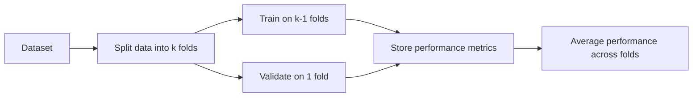

### Introduction
I remember once working on a massive credit risk project, where I had more than 200,000 observations for corporate bond issuers. I was so excited to test my newly built model, loaded it up with multiple predictor variables (like leverage ratios, coverage ratios, macroeconomic indicators), and—oh boy—it absolutely nailed the in-sample predictions. I felt like I was unstoppable. But the moment I tested it on unseen data, that glorious 99% accuracy crashed to about 60%. Um, yeah, that was a wake-up call. Turns out, I had fallen headlong into the classic trap of overfitting. 

This section focuses on ways to avoid that overfitting pitfall by explaining how to properly evaluate your model’s fit through various cross-validation protocols, metrics, and best practices. The goal is to give you a rock-solid foundation in model evaluation, a vital skill when tackling big-data forecasting tasks or even simpler single-stock predictions. 

We’ll talk about the importance of separating data into training and testing sets, highlight different cross-validation approaches, and then dive into performance metrics for both regression and classification. We’ll also take a quick look at the bias–variance trade-off. This is all stepping beyond just “What’s my R-squared?” to a more robust understanding, which is exactly what Level II might test you on in a vignette with some tricky data scenario. So, let’s get into it.

### Train/Test Split and Overfitting
One of the first ideas you’ll stumble upon in predictive modeling is that you should not feed your entire dataset into a single training pipeline. Why not? Because you need an objective way to measure how well your model will do on data it has never seen before. Models that train on all the data can inadvertently learn noise, or random idiosyncrasies, instead of the meaningful signal that generalizes to new observations. This phenomenon—where a model fits noise rather than capturing the underlying relationship—is called overfitting. 

If you overfit, you’re basically memorizing your training data. And trust me, memorization might work for short quizzes, but it rarely solves real-life finance puzzles. In quantitative finance contexts—like constructing an algorithmic trading strategy or a default probability model—unseen data is the norm, not the exception. 

The simplest approach to confronting overfitting is a train/test split:
• Put aside, say, 70–80% of your data to train your model.  
• Keep 20–30% locked away in a separate test set that is only used after the model has finished training.  

This test set is your final reality check: if your performance on the test set is significantly worse than on your training data, your model may not be generalizing well. In investment research or wealth management applications, this difference can be critical. Overfit models can produce misleading signals, ranging from inaccurate valuations to poor asset allocation decisions.

### Cross-Validation Techniques
While the train/test split is the simplest approach, it can sometimes waste data (particularly if you’re stuck with a small dataset) or give results that depend too much on how you did that initial split. Enter cross-validation, which is a more robust, data-efficient way to evaluate your model.

#### k-Fold Cross-Validation
In k-fold cross-validation, the dataset is split into k roughly equal-sized chunks, or “folds.” You train your model on (k−1) folds and then validate it on the remaining fold. That process repeats k times, with each fold taking a turn as the validation set.

Visually, we might represent it like this:



The final performance measure is typically the average of the scores across all k “trials.” The beauty here is that every data point gets used for both training and validation exactly once, making the most of your dataset. For instance, if k=5, you have 5 folds of training (~80% of your data each time) and 5 separate validation sets (~20% each). This helps you get performance estimates that are more stable.

Let’s do a quick analogy: imagine you’re a professor giving out practice exams. If you give 5 smaller quizzes over time, you get a far better read on how your students are doing than if you just gave them a single test.

#### Leave-One-Out Cross-Validation
Leave-One-Out Cross-Validation (LOOCV) is an extreme case of k-fold cross-validation where k equals the total number of observations. This means you train on all but one observation and use that last one for validation. Then you do this for every single data point. 

If you have 1,000 data points, you’ll train 1,000 times, each time omitting one data point. Needless to say, that can be computationally expensive. However, LOOCV is sometimes favored when you have a very small dataset and can’t afford to lose any data to a hold-out fold. In finance, though, large sample sizes are often available, and even if not, computational power tends to be a big constraint—so you might consider whether the cost (and complexity) is really worth it.

#### Time Series Split
Time series cross-validation can be a bit tricky, but in financial applications, it’s super important because it respects chronological order and helps you avoid “peeking into the future.” In a typical time series split, you train on a certain initial window of time (e.g., data from 2015 to 2018) and validate on the period just after that (e.g., 2019). Then you “expand” or “roll” forward. This method ensures that the validation data always comes after the training data in chronological order, reducing the likelihood of look-ahead bias.

For example, if you’re building an AR model to forecast bond yield movements (see Chapter 6 for deeper coverage of time-series modeling), you might break your data into multiple slices:
• Train on 2015–2018, test on 2019  
• Train on 2015–2019, test on 2020  
• Train on 2015–2020, test on 2021  

The results from each stage are then combined to give an overall measure of out-of-sample performance. If your performance is good in each “future” step, you can be more confident that your model captures real patterns, not random noise.

### Performance Metrics for Regression
Now let’s dig deeper into how we measure a model’s performance. For regression tasks—where the aim is to predict a continuous value such as a target price, a company’s daily returns, or an expected yield—the following metrics are standards.

#### Root Mean Squared Error (RMSE)
RMSE is one of the most popular metrics in regression tasks. You compute it as the square root of the average of squared differences between predicted and actual values:

 \text{RMSE} = \sqrt{\frac{1}{n} \sum_{i=1}^n (\hat{y}_i - y_i)^2} 

The benefit of squaring the error is that large errors get penalized substantially, which can be important in risk management contexts where outliers (e.g., big losses) matter a lot. But that also means if you have a few large outliers for reasons not strictly related to your model’s systematic accuracy, RMSE might look unattractive.

#### Mean Absolute Error (MAE)
MAE takes the absolute value of errors rather than squaring them:

 \text{MAE} = \frac{1}{n} \sum_{i=1}^n |\hat{y}_i - y_i| 

This metric is less sensitive to outliers than RMSE because absolute values grow linearly, not quadratically. If your portfolio returns or credit spreads can occasionally spike due to rare events, you might prefer MAE as a more “forgiving” measure.

#### R² (Coefficient of Determination)
R² tries to capture how much of the variance in your target variable is explained by the model. It is computed as:

 R^2 = 1 - \frac{\sum_{i=1}^n (\hat{y}_i - y_i)^2}{\sum_{i=1}^n (\bar{y} - y_i)^2} 

where \\(\bar{y}\\) is the mean of your actual observed values. If your model explains all the variability perfectly, R²=1. If your model is no better than guessing the mean of y, R²=0. And in some bizarre cases (like severe overfitting or incompetent modeling), R² can even go negative.

R² is easy to interpret and is commonly reported in research and analyst reports, yet it doesn’t always tell you about predictive power in out-of-sample contexts. A high R² in training can sometimes lull you into believing you have an excellent model, but the out-of-sample performance might say otherwise if the model is overfit.

Below is a small reference table:

| Metric  | Interpretation                                    | Pros                                              | Cons                                              |
|---------|---------------------------------------------------|---------------------------------------------------|---------------------------------------------------|
| RMSE    | Penalizes large errors more (square term)         | Highlights big deviations—good for risk contexts  | Outliers can have substantial impact              |
| MAE     | Average of absolute errors                        | More robust against outliers                      | May underweight the significance of large errors  |
| R²      | Proportion of variance explained                 | Highly interpretable—common in finance            | Does not guarantee out-of-sample predictive power |

### Performance Metrics for Classification
Finance is full of classification tasks: predicting whether a bond will default, whether an option is in-the-money at expiration, or whether the market will go up or down. Metrics for classification can be quite different from regression metrics.

#### Accuracy, Precision, Recall
• **Accuracy** measures how often your predictions are correct overall. It’s basically (number of correct predictions) / (total number of predictions). Works fine for balanced datasets, but in many financial problems—like detecting fraud or defaults—your data might be heavily imbalanced. If only 1% of loans default, a naive model that predicts “no default” every single time gets 99% accuracy, which is not particularly helpful.

• **Precision** is the fraction of predicted positives that are truly positive. In default prediction, if you say “this bond is going to default,” how often are you right?

 \text{Precision} = \frac{\text{True Positives}}{\text{True Positives + False Positives}} 

• **Recall** (also called “Sensitivity”) is the fraction of all real positives your model successfully identifies. Of all the bonds that truly default, how many are you catching?

 \text{Recall} = \frac{\text{True Positives}}{\text{True Positives + False Negatives}} 

#### F1 Score
The F1 score is the harmonic mean of precision and recall:

 \text{F1} = 2 \cdot \frac{\text{Precision} \times \text{Recall}}{\text{Precision} + \text{Recall}} 

It’s especially handy for imbalanced datasets like default or fraud detection, where both precision and recall matter a lot. If either precision or recall is very low, the F1 score will plummet, forcing you to maintain a balanced approach.

#### ROC Curve and AUC
The Receiver Operating Characteristic (ROC) curve is a plot of the true positive rate (recall) versus the false positive rate (1 – specificity) across various threshold settings. The Area Under the Curve (AUC) summarizes the ROC curve in a single number, typically between 0.5 (random guessing) and 1.0 (perfect classification). 

In practice, you might pick different classification thresholds depending on your risk tolerance. For example, a portfolio manager might set a more lenient threshold for “default risk.” This can inflate false positives (labeling more bonds as risky) but reduce the chance of missing an actual default. Looking at ROC/AUC helps you pick that threshold in a reasoned way.

### The Bias–Variance Trade-Off
Even the best cross-validation methods and metrics can’t help you if you don’t manage the bias–variance trade-off. In short, bias refers to errors from simplistic assumptions (like linear-only models or ignoring certain time lags), while variance refers to the model’s sensitivity to small changes in the training data, often manifested in overfitting.

• **High Bias (Underfitting)**: A model that’s too simple—maybe just using a single predictor or ignoring known nonlinearity. It may consistently miss critical patterns, leading to high error both in training and testing sets.  
• **High Variance (Overfitting)**: A model that tries to capture every nuance in the training data. It performs great in-sample but fails out-of-sample.  
• **Balancing Bias and Variance**: The ideal scenario is finding that “Goldilocks” model complexity—neither too simple nor too complex. Techniques like cross-validation allow you to systematically test different complexities (e.g., polynomial orders, number of features, or number of trees in a random forest) and pick a sweet spot.

It might help to visualize how the errors shift with complexity:

- As complexity goes up, bias usually goes down (because the model can capture more nuance).  
- As complexity goes up, variance usually goes up (because the model is more sensitive to small changes).  

Don’t hesitate to experiment with regularization methods (like Ridge or Lasso in regression, or pruning in random forests) and keep an eye on cross-validated metrics. The sweet spot is usually a model that’s flexible enough to learn genuine signals but constrained from purely memorizing noise.

### A Quick Python Example
In real-world practice, you might implement k-fold cross-validation in a library like Scikit-Learn. Here’s a quick snippet showing a linear regression example:

```python
import numpy as np
from sklearn.linear_model import LinearRegression
from sklearn.model_selection import KFold, cross_val_score

# For demonstration, let's create some random data
np.random.seed(42)
X = np.random.rand(100, 3)  # e.g., 100 observations, 3 features
y = 5 + 10*X[:,0] + 3*X[:,1] - 2*X[:,2] + np.random.randn(100)*0.1

model = LinearRegression()
kf = KFold(n_splits=5, shuffle=True, random_state=42)

# so we take negative of MSE to effectively 'minimize' it
scores = cross_val_score(model, X, y, scoring='neg_mean_squared_error', cv=kf)
rmse_scores = np.sqrt(-scores)

print("Cross-validated RMSE scores:", rmse_scores)
print("Mean RMSE:", rmse_scores.mean())
```

You can see how intuitive it is to gather multiple RMSE estimates across folds. If, say, your mean RMSE is significantly higher than you’d like, you can try more features or a different model. But be sure to keep a test set aside until you’re finally satisfied. That test set is your final line of defense against overfitting.

### Glossary
Below is a quick reference for some key terms discussed here:

• **Cross-Validation**: A resampling method used to evaluate a model by training and validating on multiple data partitions.  
• **RMSE (Root Mean Squared Error)**: The square root of the average squared difference between predicted and observed values; penalizes large errors more heavily.  
• **MAE (Mean Absolute Error)**: Average of absolute differences between predicted and observed values; more robust to outliers than RMSE.  
• **Precision**: Out of all predicted positives, the fraction that are truly positive.  
• **Recall (Sensitivity)**: Out of all actual positives, the fraction that are correctly identified as positive.  
• **Overfitting**: When a model learns random noise or idiosyncrasies in the training data rather than generalizable patterns.  

### References for Further Exploration
• Kuhn, M., & Johnson, K. (2013). “Applied Predictive Modeling.” Springer. They offer extended chapters on model validation and selection, which further detail cross-validation pitfalls and remedies.  
• CFA Institute materials, especially any guidelines or write-ups on time-series cross-validation to avoid look-ahead bias. This is crucial in financial modeling to maintain ethical and professional standards.  
• Scikit-Learn Documentation: (https://scikit-learn.org/) for a comprehensive, hands-on look at implementing cross-validation in real-world projects.

Remember, evaluating your model is not simply about getting a single metric to brag about in your pitch deck. The real power lies in how well your model will serve you in real, unpredictable market conditions. And that’s the hallmark of a thoughtful, well-validated approach.  

So the next time you see a fancy chart with a “95% accuracy,” try not to get too excited until you know how they actually measured it—and whether it would hold up in the real world, or in the uncertain environment of the next market cycle. Anyway, let’s put our knowledge to the test with some sample questions.

## High-Value Cross-Validation and Model Fit Quiz



### Which statement best explains overfitting in a machine learning model?

- [x] The model memorizes noise in the training data instead of capturing generalizable patterns.
- [ ] The model fails to utilize all the features in the dataset.
- [ ] The model’s performance on the training set and test set are identical.
- [ ] The model is too simple to capture the underlying trends in the data.

> **Explanation:** Overfitting occurs when a model captures random fluctuation or “noise” in the training data, causing it to perform poorly when tested on unseen data.


### In k-fold cross-validation, why is performance typically averaged over the k folds?

- [x] Because using multiple folds provides a more stable estimate than a single train/test split.
- [ ] To always maximize training accuracy metrics.
- [ ] To reduce computational expense in the model building phase.
- [ ] To help the model memorize the dataset fold by fold.

> **Explanation:** By training on k−1 folds and validating on the remaining fold repeatedly, the approach provides multiple estimates of performance. Averaging those estimates yields a stable indication of how the model might perform out-of-sample.


### Which cross-validation method is most computationally expensive for a dataset with n observations?

- [ ] k-fold cross-validation with k = 10
- [ ] k-fold cross-validation with k = 5
- [x] Leave-One-Out Cross-Validation (LOOCV)
- [ ] Shuffle-and-Split cross-validation

> **Explanation:** Leave-One-Out Cross-Validation (LOOCV) trains the model n times (once for each observation held out), making it significantly more computationally expensive than standard k-fold methods.


### For a large financial dataset where we don’t want to waste any data, but also want a solid performance estimate, which cross-validation approach generally offers the best balance?

- [ ] Leave-One-Out Cross-Validation, because it uses all data for both training and testing.
- [x] k-fold cross-validation with a moderate k (like 5 or 10), balancing data usage with computational tractability.
- [ ] A simple train/test split with an 80/20 partition.
- [ ] None of the above; you must always use LOOCV in finance.

> **Explanation:** k-fold cross-validation (with commonly used k values such as 5 or 10) is often seen as a good balance between computational efficiency and robust performance estimation.


### What does the Time Series Split approach in cross-validation help to avoid?

- [ ] Relying on cross-validation for large n.
- [x] Look-ahead bias in model evaluation.
- [ ] The need for a test set.
- [ ] Data preprocessing steps.

> **Explanation:** By respecting the chronological order, time series cross-validation specifically avoids leaking future data into the training process, mitigating look-ahead bias.


### If you are trying to predict a binary outcome (e.g., default vs. no default), which metric specifically measures how many of the actual defaults you capture?

- [ ] Precision
- [x] Recall
- [ ] Accuracy
- [ ] Specificity

> **Explanation:** Recall (or sensitivity) is the fraction of actual positives (defaults) correctly identified as positive by the model.


### Which metric provides a single-value summary of the trade-off between precision and recall?

- [ ] Accuracy
- [ ] ROC Curve
- [ ] AUC
- [x] F1 Score

> **Explanation:** The F1 Score is the harmonic mean of precision and recall, combining them into a single performance figure especially useful for imbalanced datasets.


### Which of the following is most appropriate for measuring how well a regression model fits extremely large but relatively infrequent errors?

- [ ] Mean Absolute Error (MAE)
- [x] Root Mean Squared Error (RMSE)
- [ ] Mean Absolute Percentage Error (MAPE)
- [ ] Classification Accuracy

> **Explanation:** RMSE heavily penalizes large errors because of the squared term, making it appropriate for scenarios where rare but big errors are critical to track.


### A high R² in your training set but a much lower R² in your validation set is often symptomatic of:

- [ ] Data that contain too few features.
- [ ] Perfect model generalization.
- [ ] A well-regularized model.
- [x] Overfitting.

> **Explanation:** When a model has a high training accuracy but fails to replicate that performance on validation data, it usually indicates overfitting—where patterns learned do not generalize.


### True or False: Balancing bias and variance is crucial because high variance models perform well on training data but may fail on new data.

- [x] True
- [ ] False

> **Explanation:** This is the essence of the bias–variance trade-off. High variance often reflects overfitting, where the model adapts too closely to the training data and becomes brittle when evaluated on data it wasn’t trained on.


