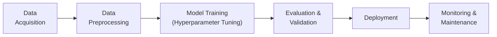

## Introduction
Model training, tuning, and deployment is one of those journeys that can feel a bit daunting initially—sort of like hiking up a big hill and noticing more peaks in the distance. But don’t worry, I’ve been there too, feeling overwhelmed about which hyperparameters to tweak or how to handle continuous model monitoring. The good news is that once you break everything down into core steps, you’ll see the entire process is quite systematic.

In quantitative finance, the stakes are especially high. Getting a predictive model just right can give you a critical edge in portfolio rebalancing, alpha generation, or even real-time risk mitigation. Furthermore, the complexity of financial data—large volumes (and often unstructured data), frequent updates, evolving market regimes—adds to the challenge. But let’s take a close look at how to tackle these tasks step by step, from hyperparameter tuning all the way to rolling out your model into a production system, or "live" environment.

## Hyperparameter Tuning
Hyperparameters are the knobs we set prior to training a machine learning model. They might dictate the number of layers in a neural network, the penalty strength in a regularized regression, or the learning rate in a gradient boosting model. Your model’s performance can rise or fall dramatically depending on these values. So, let’s explore some common methods for hyperparameter tuning.

### Grid Search
Grid search is often the first "go-to" approach that new practitioners (and some experienced ones, too) use when they need to find the best hyperparameters.

Imagine you have two hyperparameters:  
• The learning rate, say in the range {0.01, 0.1, 1.0}  
• The number of estimators (like the number of trees in a random forest), say in {10, 50, 100}

A grid search systematically tries all combinations: (0.01, 10), (0.01, 50), (0.01, 100), (0.1, 10), and so on. Each combination is evaluated—usually via cross-validation—to see how the model performs. The combination that gives the highest accuracy (or lowest RMSE, or whichever metric you choose) is your winner. Simple enough, but keep in mind: grid search can get incredibly time-consuming if you have many hyperparameters or wide ranges to explore.

### Random Search
Random search basically says, "Why test everything if we can just sample possible parameter combinations at random?" This is a clever approach introduced by Bergstra and Bengio (2012). It often finds surprisingly good solutions with far fewer computations, especially if many of your parameters turn out not to matter much.

In random search, you define a reasonable range for each hyperparameter—like a learning rate between 0.0001 and 1—and let random draws pick the next set of hyperparameters to try. Over time, you get good coverage of the parameter space but avoid the combinatorial explosion of grid search.

### Bayesian Optimization
Bayesian optimization takes a more sophisticated approach. It uses the results from earlier trials to make informed guesses about where the "best" hyperparameter region might be next. Conceptually, we model the response function (like validation accuracy) as a distribution over possible parameter values. Then we pick the next hyperparameter set where we believe we’re most likely to do better, balancing exploration (trying new areas) versus exploitation (fine-tuning near promising regions).

Bayesian methods can be extremely efficient—though they’re trickier to implement and require specialized libraries. In finance, where training can be expensive (both in compute resources and time), Bayesian optimization can pay off by honing in on ideal configurations without brute-forcing thousands of trials.

## Regularization Techniques
Financial data can be messy and highly correlated. Regularization is crucial for preventing overfitting, especially when modeling large, high-dimensional datasets. Let’s look at some of the big names: LASSO, Ridge, and Elastic Net.

### LASSO (L1 Penalty)
LASSO regression, or L1 regularization, adds an absolute penalty term to the cost function. Mathematically, in its simplest linear version:

(1)  
L = ∑(yᵢ - xᵢβ)² + λ ∑|βⱼ|  

where λ is the regularization parameter. LASSO has the neat effect of "zeroing out" coefficients for less-significant features, creating a sparse model. In practice, it can help isolate the key signals in a large factor set. The trade-off is that it might discard mild but still relevant variables.

### Ridge (L2 Penalty)
Ridge regression, or L2 regularization, imposes a squared penalty:

(2)  
L = ∑(yᵢ - xᵢβ)² + λ ∑(βⱼ²)

Ridge shrinks coefficients toward zero but typically doesn’t eliminate them entirely. It’s a favorite for dealing with multicollinearity—where predictor variables in your dataset are correlated with each other. Finance folks often find their fundamental factors or macro indicators overlapping somewhat, making ridge regression a good fit.

### Elastic Net
If you just can’t decide between L1 or L2, you might do both. Elastic Net is a blend of LASSO and Ridge:

(3)  
L = ∑(yᵢ - xᵢβ)² + α(λ₁ ∑|βⱼ| + λ₂ ∑(βⱼ²))  

This approach can keep some features small while discarding others, preserving a dose of interpretability and a measure of shrinkage across all predictors. If you suspect some features in your data carry minimal or no signal, and others are highly correlated, an Elastic Net might be just the trick.

## Ensuring Stability and Scalability
Practitioners sometimes forget that "if it doesn’t scale, it doesn’t matter." At least that’s what a mentor once told me. Whether you’re running a monthly strategy or higher-frequency trading program, make sure your model can handle new data volumes without crashing. Here’s how:

• Test subsets: Begin with smaller portions of the dataset, train, and confirm that performance is consistent as you scale up. This helps you spot memory constraints or time bottlenecks early.  
• Distributed frameworks: Tools such as Apache Spark or Hadoop let you train on large clusters. For instance, if you’re rebalancing a global equity portfolio across thousands of stocks, you might rely on Spark ML to handle your logistic regression at scale.

## Deployment Environments
Once the model is ready, it’s time to generate real predictions for business or client use. The environment you choose depends on how quickly you need results and how your overall system is structured.

### Batch Predictions
Batch predictions are perfect for offline or less time-critical processes, like rebalancing a mutual fund monthly or producing weekly risk reports. The model can run on a scheduled basis (e.g., each night after markets close). You then stash the predictions in a database or data warehouse for the next morning’s analysis.

This approach is easier to maintain because you don’t typically worry about millisecond latency or always-on servers. However, it might be insufficient if your investment strategy relies on more frequent signals or real-time event triggers.

### Online / Real-Time Inference
Sometimes, you just gotta go fast. High-frequency trading, algorithmic risk management dashboards, intraday re-hedging simulation—these operations might need sub-second predictions to calibrate orders or market risk. Here, you’ll deploy your model as a real-time service, maybe behind a low-latency API.

Keep in mind that streaming data can be volatile. You might also consider building drift detection or incremental learning into your pipeline so the model updates with fresh data. The environment typically relies on specialized infrastructure for caching, concurrency, and failover.

### APIs and Microservices
Microservices are a pretty popular approach to deployment. You "wrap" your model logic in a small service that can be called by other applications, whether it’s a trading platform, a portfolio management system, or a risk analytics dashboard. This is especially useful if you foresee multiple departments wanting to harness the same predictive engine. You’d be surprised how quickly a marketing or compliance team might request your factor-based risk forecast for their own planning.

## Monitoring and Maintenance
Okay, so you’ve deployed your model. Now what? If you just leave it running indefinitely, it’s probably going to degrade eventually. Market dynamics shift. Data distributions change due to external events—looking at you, pandemic shocks, central bank policy changes, or new regulations. This phenomenon is called data drift.

• Set up alerts: Track metrics like model accuracy, mean absolute error, or portfolio tracking error. If any deviate significantly from your baseline, it’s time to investigate.  
• Periodic retraining: Some practitioners rebuild models monthly, quarterly, or as soon as performance dips that matter to your investment strategy. Another approach is a rolling window design in time-series or cross-sectional contexts.  
• Champion-challenger framework: In production, you might run your main model ("champion") in parallel with an experimental model ("challenger"), letting you see if the new approach outperforms before you roll it out fully.

## Example Workflow Diagram
Below is a simple flowchart of a typical pipeline for model training, tuning, and deployment. Use it as a conceptual map for how these pieces fit together:



From data acquisition to monitoring, each step is essential. Neglecting any of these can lead to suboptimal performance or nasty surprises down the line.

## Python Example: Simple Grid Search
Sometimes, seeing a snippet of code clarifies the concepts. Suppose we have a basic random forest regression, and we want to do a grid search on two parameters: number of estimators and maximum tree depth.

```python
from sklearn.ensemble import RandomForestRegressor
from sklearn.model_selection import GridSearchCV

param_grid = {
    'n_estimators': [10, 50, 100],
    'max_depth': [3, 5, 10]
}

rf = RandomForestRegressor()

grid_search = GridSearchCV(estimator=rf, 
                           param_grid=param_grid, 
                           cv=3,      # 3-fold cross-validation
                           scoring='neg_mean_squared_error')

grid_search.fit(X_train, y_train)

print("Best Params:", grid_search.best_params_)
print("Best Score:", -1 * grid_search.best_score_)
```

This code systematically tries all specified parameter combinations, uses 3-fold cross-validation, and returns the parameters that yield the best performance, as measured by (negative) mean squared error.

## Glossary
• Hyperparameter: A setting or configuration external to the model, controlling, for example, learning rates, tree depths, or penalty strengths.  
• Data Drift: A gradual or abrupt change in data distributions over time, often requiring model updates or recalibration.  
• Batch Prediction: Generating model predictions on a set schedule or as a chunk-based process, rather than constantly in real-time.  
• Model Scalability: The ability of your system and model to handle growing data volumes or complexity with minimal slowdown or resource issues.

## References and Further Exploration
• Bergstra, J., & Bengio, Y. (2012). “Random Search for Hyper-Parameter Optimization.” Journal of Machine Learning Research.  
• Dean, J., & Ghemawat, S. (2008). “MapReduce: Simplified Data Processing on Large Clusters.” Communications of the ACM.  
• Ng, A. “Machine Learning Yearning.” (Multiple chapters on practical deployment strategies.)  

Also, consider looking into open-source frameworks like MLflow for model tracking, or MLOps platforms that integrate well with your existing enterprise technology. In the high-stakes world of finance, you’ll want robust versioning, logging, and explanation features for compliance and client communication.

---

## Model Training, Tuning, and Deployment Quiz



### 1. Which statement best describes the advantage of random search over grid search for hyperparameter tuning?

- [ ] Grid search is always more efficient than random search.
- [x] Random search can find near-optimal hyperparameters with fewer iterations.
- [ ] Random search requires scanning all possible parameter combinations exhaustively.
- [ ] Random search is only suitable for small datasets.

> **Explanation:** Random search samples hyperparameter combinations at random, often leading to quicker discovery of good configurations (Bergstra & Bengio, 2012).

### 2. In finance, LASSO (L1) regularization is particularly useful because it:

- [x] Encourages sparsity by driving some coefficients to zero.
- [x] Helps isolate a small set of highly relevant factors.
- [ ] Expands model complexity to include more factors.
- [ ] Prevents any coefficients from being penalized below zero.

> **Explanation:** LASSO uses the L1 penalty, which shrinks coefficients and can zero out unimportant ones, creating a more parsimonious model.

### 3. When scaling your model to handle larger volumes of financial data, it’s essential to:

- [ ] Deploy only on a single CPU core.
- [x] Test performance incrementally on progressively bigger datasets.
- [ ] Avoid using distributed frameworks.
- [ ] Retrain only once a year.

> **Explanation:** Ensuring stability means gradually increasing dataset size and monitoring resource usage or performance, potentially leveraging distributed computing if needed.

### 4. Which deployment scenario is best for a setting where predictions must be generated in milliseconds for algorithmic trading?

- [ ] Batch predictions run nightly.
- [x] Online or real-time inference with low-latency infrastructure.
- [ ] Generating predictions by manual user input during each trading day.
- [ ] A single monolithic app that does everything in one run.

> **Explanation:** Real-time inference is crucial for ultra-fast trading environments that rely on immediate insights.

### 5. Which of the following is an advantage of hosting your model as an API (microservice)?

- [x] It can be accessed easily across different systems or departments.
- [x] It simplifies version control and maintains a clear model boundary.
- [ ] It must be tied to one specific database.
- [ ] It cannot be monitored in real-time.

> **Explanation:** Microservices encapsulate the model logic in a lightweight service that other platforms can call for predictions, facilitating inter-departmental use and simpler updates.

### 6. Data drift in a financial context refers to:

- [ ] Detecting changes in your production code baseline.
- [x] Shifts in the statistical properties of your input data over time.
- [ ] Deploying a model with the wrong hyperparameters.
- [ ] A smaller training set than expected.

> **Explanation:** Data drift typically happens when the underlying relationships in markets shift, affecting model performance.

### 7. To decide when to retrain a live model, it’s best to:

- [x] Implement performance monitoring and trigger retraining when performance degrades.
- [ ] Retrain your model only at the end of the year.
- [x] Use champion-challenger approaches for ongoing comparison.
- [ ] Retrain daily, even if performance remains stable.

> **Explanation:** Monitoring your model is critical in finance. A champion-challenger approach helps you compare your production model with potential replacements.

### 8. Elastic Net regularization effectively:

- [x] Combines both L1 (sparsity) and L2 (ridge) penalties.
- [ ] Eliminates the need for cross-validation.
- [ ] Expands the feature set beyond the original data.
- [ ] Encourages no penalty on coefficients.

> **Explanation:** Elastic Net blends L1 and L2, giving you both sparsity and controlled shrinkage of coefficients.

### 9. A major limitation of grid search is:

- [x] The search space grows exponentially with the number of hyperparameters.
- [ ] It cannot use cross-validation.
- [ ] It is always less accurate than random search.
- [ ] It only works for neural networks.

> **Explanation:** Grid search tries all combinations, which can be computationally expensive with many parameters or large parameter ranges.

### 10. True or False: Model scalability only matters for high-frequency trading applications.

- [ ] True
- [x] False

> **Explanation:** Scalability is important for many financial applications, including large portfolio optimizations, multi-market analyses, and big data projects that do not rely on high-frequency strategies.



---

**Final Exam Tips:**  
• Keep an eye on resource constraints and runtime: time is money.  
• Use cross-validation consistently for unbiased hyperparameter tuning.  
• Be mindful of interpretability, especially if you’ll be presenting to stakeholders or dealing with compliance.  
• Demonstrate how your chosen method handles shifting data, especially in dynamic financial markets.  

Good luck, and let your models shine!
