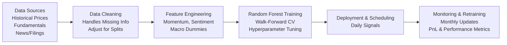

## Project Overview

Sometimes it feels like everyone is tossing around the phrase “big data,” but we’re not always sure how it works in practice—especially when it comes to applying it in finance. This vignette aims to demystify things a bit (or at least give you a step-by-step blueprint) by walking through a real-ish scenario: building a daily equity returns forecast model for a global multi-asset portfolio. Our end goal? Predict the direction (Buy or Sell) of tomorrow’s equity returns for each stock in the portfolio.

The big idea here is to combine a bunch of data sources: historical price data, fundamentals, macro indicators, and even that intangible “sentiment” from corporate filings or news. The final product should be a daily “Buy” or “Sell” signal spit out by a model that’s robust enough to handle the unpredictability of markets. We’ll talk data cleaning, feature engineering, model selection, deployment, and monitoring—basically the entire pipeline.

## Step-by-Step Walkthrough

### Planning and Scope

I remember the first time I tried to do a big data project for daily forecasts—my biggest rookie mistake was not scoping it out well. My team got overwhelmed with data we didn’t need, and we wasted weeks sorting out what was relevant. So, lesson one: define objectives and decide how far you really want to go.

• Objective: Predict the next day’s return direction—basically “Buy” if we expect positive returns, or “Sell” if we expect negative or negligible returns.  
• Key Deliverables: A daily service that can ingest fresh data, run the model, and produce signals by market open.  

Setting up a daily pipeline also means we need robust scheduling. We’ll collect data from the prior day’s close, process, and have the forecast ready soon after.

### Data Collection and Cleaning

When it comes to data in finance, we’re typically pulling from multiple vendors or official reports—Bloomberg or Refinitiv for price data, EDGAR for fundamentals, etc. If you’re anything like me, you’ll realize quickly that different sources have different formats and cleanliness levels.

• Historical Price Data: End-of-day close prices, maybe with volume, from a data vendor. Keep an eye out for corporate actions like splits or dividends, which can throw off your time series.  
• Fundamental Data: Quarterly (or sometimes even monthly) earnings, revenue, and other items from EDGAR. Patching these into daily data can be tricky, so watch the date alignment carefully.  
• Market Sentiment: Automatic scraping of news or 10-K filings can add a layer of complexity. You’ll need an NLP (Natural Language Processing) library to assign sentiment scores.  

If you notice some newly listed stocks that don’t have a full price history, fill in those blanks or maybe trash those tickers altogether if data is too sparse. Don’t forget: inconsistent data can be deadly, especially if your model is sensitive to short-term patterns.

### Data Wrangling and Imputation

So you’ve got your data. Great. Now what? Even after you collect it, you’ll probably face:

• Missing or Partial Dates: Perhaps some stocks didn’t trade on a given day, or your data vendor messed up. You might forward-fill data for short absences or use bridging approaches—like substituting the sector average return if a stock had zero data.  
• Corporate Actions: If there was a stock split, you might want to adjust historical prices to keep everything consistent.  
• Outliers: A single, suspicious price spike isn’t always an error—maybe the CEO got indicted that day—but it’s something you want to think carefully about.  

Also, normalizing your signals can be huge. Sentiment scores might be around 0.0 to 1.0, while prices might be in the hundreds. You want everything on a consistent scale so the model doesn’t overweight one type of feature just because it has bigger numerical values.

### Feature Engineering

Alright, so we have squeaky-clean data (fingers crossed). Now it’s time to build features. This is where your creativity matters. On one project, my friend found that adding a “day of the week” feature actually improved returns forecasting, presumably capturing some cyclical patterns.

Below are some typical features:

• Rolling Averages & Momentum: 5-day or 20-day moving averages, moving standard deviation (volatility), that kind of thing.  
• Sector-Level Sentiment: If the S&P 500 Oil & Gas sector has negative sentiment, that might affect our particular energy stock.  
• Macroeconomic Shocks: On days when the Fed surprises markets with a sudden rate hike, that edge might be crucial. Encode it with a simple dummy variable or a numeric measure of surprise.  

If we assume each equity’s direction depends on both fundamental and market-driven signals, we can do a combined approach. The key is to keep an eye on the trading frequency: daily is tight, so we want features that reflect short-term movements but also incorporate some fundamental angles.

### Model Choice and Validation

Now for the fun part—picking a model. Everyone loves neural nets, but random forest classifiers are often a good sweet spot between interpretability and performance. They handle non-linearities and noisy data gracefully. 

We want to train on historical data from, say, 2018 to 2022, then test on 2023 so far. But we can’t just do a typical random train/test split. With time series, you have to respect chronology. That’s why walk-forward cross-validation is so popular:

1. Train on data from, say, Jan 2018 to Dec 2020, forecast 2021.
2. Train on Jan 2018 to Dec 2021, forecast 2022.
3. Keep rolling forward until you run out of data.

This approach simulates real-time usage—at least more so than just ignoring time ordering. Then measure metrics like accuracy, precision, recall for Buy signals, and maybe even track an out-of-sample PnL if you hypothetically traded on those signals.

### Tuning and Deployment

Random forests have hyperparameters such as the number of trees, maximum depth, or the minimum samples needed to split a node. You can do a random or grid search. In practice, random search is often less time-consuming, especially if you have a large parameter space.

Once you’ve got your best model, it’s time to deploy. A straightforward approach is to host your model in the cloud (AWS, Azure, or GCP). You can schedule a daily job that:

• Pulls the new data after market close.  
• Performs all your wrangling, normalization, and feature generation.  
• Applies the model to produce signals for the next day’s open.  
• Outputs a CSV or a database entry that your trading system can read.  

### Monitoring and Refinement

You’re not done yet. Honestly, monitoring might be the hardest part. Markets change. The model that worked last month might tank if a new macro environment or a black swan event arises. So:

• Track model performance daily: accuracy, precision, recall, confusion matrix, and PnL if you’re actually trading.  
• Monthly Retraining: Keep your model aware of recent data. A common approach is a rolling window—maybe only train on the last three years so the model doesn’t overweight ancient data.  
• Threshold Adjustments: If your model is spitting out too many “Buy” signals, it might be that you need to tweak the classification threshold based on your risk tolerance.  

Below is a simple flowchart showing how data moves through the pipeline:

## Glossary

• Walk-Forward Cross-Validation: A strategy for training and testing time-series models where you carefully maintain temporal ordering.  
• Fundamental Data: Core financial data (earnings, revenue, etc.) from official filings.  
• Sentiment Analysis: Combining text analytics tools and finance to score how “positive” or “negative” a piece of text might be.  
• Corporate Actions: Stock splits, dividends, mergers, or acquisitions that alter share counts or share prices in your historical data.

## References and Suggested Readings

• CFA Institute: Case studies on quantitative investment strategies and big data usage.  
• Provost, F., & Fawcett, T. (2013). “Data Science for Business.” O’Reilly Media.  
• Khan, M., & Elder, J. (2014). “A Real-World Walk-Forward Analysis Example,” Journal of Computational Finance.

## Test Your Knowledge: End-to-End Big Data Project for Financial Forecasting



### In a daily equity returns forecast model, why is walk-forward cross-validation typically preferred over a random train-test split?
- [x] Because it respects the chronological order of data and better simulates real-time forecasting.
- [ ] Because it merges all historical data into one model without accounting for time periods.
- [ ] Because it uses less processing power for model training.
- [ ] Because it automatically adjusts the dataset for corporate actions and missing data.
> **Explanation:** Time-series data should maintain chronological order to avoid future information leaking into the past (data snooping). Walk-forward cross-validation ensures training always precedes test periods.

### Which of the following best describes a key challenge in big data collection for equity forecast modeling?
- [ ] Having too many data points with no missing values.
- [ ] Consistency of business cycles in historical data making the model too robust.
- [x] Variations in data coverage (incomplete data, corporate actions) that can cause irregular time-series patterns.
- [ ] Excessively simple infrastructure and data pipelines.
> **Explanation:** Completing and aligning data can be difficult in practice. Irregularities—such as partially missing data or splits—often require manual or algorithmic solutions to maintain continuity.

### When imputing missing price data for a newly listed stock, which approach is most likely to avoid introducing excessive bias?
- [ ] Replacing all missing values with zeros.
- [x] Using a sector-average return if the data gap is minimal.
- [ ] Simply ignoring the stock entirely for the rest of the dataset.
- [ ] Forward-filling from the previous day’s price for all missing days, regardless of context.
> **Explanation:** Using sector-average returns can be more representative than outright zeros or ignoring valuable ticker data. Forward-fill is okay for short gaps, but it can distort results if used blindly.

### Why might a random forest classifier be chosen over a simple linear regression model for equity direction prediction?
- [ ] Because random forests are always more accurate for any data in all circumstances.
- [x] Because random forests can capture complex, non-linear relationships without heavy assumptions.
- [ ] Because the CFA Institute recommends random forests exclusively.
- [ ] Because random forests do not require hyperparameter tuning.
> **Explanation:** Random forests are flexible, can handle multiple interacting features well, and do not rely on linear assumptions. They often outshine simpler models in classification scenarios with messy or non-linear data.

### Which of the following is a potential advantage of including macroeconomic shock indicators (like Fed rate announcements) as model features?
- [x] They may capture sudden market regime shifts that standard momentum indicators miss.
- [ ] They usually allow for near 100% accuracy in the model.
- [ ] They ensure you never need to retrain your model again.
- [ ] They replace the need for walk-forward validation entirely.
> **Explanation:** Macroeconomic shock indicators can capture significant regime changes or news-driven volatility that standard technical indicators can’t handle on their own.

### In a big data forecasting pipeline, why is monthly retraining recommended for a daily prediction model?
- [x] To adapt to new market conditions and keep the model from becoming stale.
- [ ] To increase the time overhead, thereby reducing overfitting.
- [ ] To create more data drift in the predictions.
- [ ] To ensure your model is always trained on the largest possible historical window without updates.
> **Explanation:** Markets evolve quickly, and monthly retraining helps incorporate new data so that the model stays aligned with the latest economic or corporate developments.

### What is an example of a beneficial feature engineering technique in daily equity forecasting?
- [x] Creating rolling averages to capture short-term momentum and volatility patterns.
- [ ] Storing raw daily prices exclusively without any transformations.
- [ ] Excluding macro sentiment data from the model to avoid complexity.
- [ ] Imputing missing values with random numbers to approximate real-world randomness.
> **Explanation:** Rolling windows (averages or standard deviations) help highlight short-term performance trends and volatility, which often have predictive power in daily returns forecasting.

### Which of the following best describes a valid reason to normalize sentiment data and fundamental data prior to modeling?
- [x] It places all features on a similar scale, helping the model weigh them more appropriately.
- [ ] It guarantees linear relationships in all variables for simpler model interpretation.
- [ ] It allows the data to remain unadjusted for outliers or missing values.
- [ ] It makes the final model immune to overfitting.
> **Explanation:** Scaling features helps avoid distortions from widely different numerical ranges, ensuring the model doesn’t overemphasize any single variable.

### What is a key measure you might use to evaluate the performance of a classification model that predicts “Buy” or “Sell” signals?
- [ ] Kendall’s tau
- [x] Precision and recall for “Buy” signals
- [ ] Root Mean Squared Error
- [ ] Mean Absolute Error
> **Explanation:** Precision and recall (or the confusion matrix for classification) are particularly relevant for evaluating how accurately “Buy” vs. “Sell” signals are assigned. RMSE and MAE are more typical for regression models.

### For a daily equity returns forecast system, which statement is true regarding data monitoring and model refinement?
- [x] Monitoring daily performance and updating thresholds or retraining periodically helps maintain model relevance.
- [ ] Once deployed, a good model rarely requires further adjustments.
- [ ] Refinement strategies are typically discouraged due to time constraints.
- [ ] Continuous monitoring is unimportant if you have a large initial dataset.
> **Explanation:** Markets shift constantly, so ongoing monitoring and adjustments are critical. A model that worked during a bull market might struggle in a more volatile environment.


