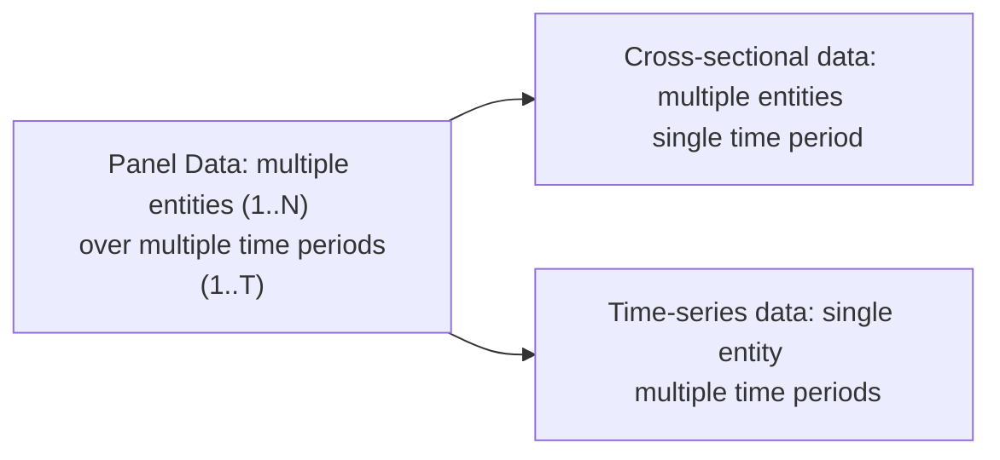

## Overview of Panel Data

Panel data—sometimes called longitudinal data—refers to datasets that track multiple entities across multiple time periods. Think of having returns data for 50 different funds over 10 years. Each fund (the “entity”) has observations repeated over time, allowing us to capture both cross-sectional variation (differences across funds) and time-series variation (changes over the years).

If we had just one year’s worth of data for all funds, that would be cross-sectional data. If we had just one fund’s data over multiple years, that would be time-series data. Panel data combines both worlds, giving us a much richer dataset.

Here’s a quick illustration in Mermaid form:



And let me just say from personal experience: the first time I analyzed a huge panel dataset of emerging-market stocks for multiple years, I initially tried treating it as a big “lump” with old-school linear regression. The results were...less than ideal. That quickly taught me the benefit of understanding the panel structure—there’s hidden magic in those entity- and time-specific nuances.

## Pooled OLS: The Simple (But Potentially Naive) Approach

Pooled Ordinary Least Squares (OLS) is like throwing all your panel data observations into one large pot and ignoring that they come from different entities across different time periods. You basically estimate a model such as:

$$
y_{it} = \alpha + \beta x_{it} + \epsilon_{it},
$$

where:
- \\( y_{it} \\) is the dependent variable (e.g., a fund’s return) for entity \\( i \\) at time \\( t \\).  
- \\( x_{it} \\) is the explanatory variable (e.g., market excess returns) for entity \\( i \\) at time \\( t \\).  
- \\(\alpha\\) is the intercept.  
- \\(\beta\\) is the coefficient of interest.  
- \\(\epsilon_{it}\\) is the error term.

But what if each fund has a special “style” that never gets captured by \\(\alpha\\)? In that case, pooled OLS lumps everything together, possibly ignoring how each fund’s style might consistently affect returns. That’s the big con: you might get biased or inconsistent estimates because unobserved factors unique to each entity or each year aren’t accounted for.

There are some pros, though. This method:
• Is straightforward to implement.  
• Generally has fewer computational demands.  
• Can be a decent “first pass” for a quick read of the data.

However, especially for exam scenarios, if you see references to reporting entity-specific differences or talk about “unobserved heterogeneity,” that’s your hint that pooled OLS might not cut it.

## Fixed Effects: Capturing Unobserved Entity- or Time-Specific Factors

Fixed effects (FE) models solve the “unobserved heterogeneity” problem by giving each entity its own intercept. In other words, each entity (say, each mutual fund) can have a unique baseline level that accounts for time-invariant characteristics:

$$
y_{it} = \alpha_i + \beta x_{it} + \epsilon_{it},
$$

where \\(\alpha_i\\) is an entity-specific intercept. That intercept basically lumps together everything that is unique to entity \\( i \\) but doesn’t vary over time (like a fund’s inherent management style).

### Why Fixed Effects?

• Controls for anything that doesn’t change over time within an entity, such as a country’s legal framework in a cross-country dataset or a fund’s core investment philosophy.  
• Minimizes omitted variable bias if those omitted variables are constant over time.  
• Is widely used in finance and economics for “within-entity” analysis.

### Practical Steps

There are two common ways to estimate an FE model:

• “Within Transformation”: Subtract the entity’s mean from each observation. For instance, you replace \\( y_{it} \\) with \\( y_{it} - \bar{y}_i \\) and similarly \\( x_{it} \\) with \\( x_{it} - \bar{x}_i \\). This mean-centering removes the intercept.  
• Dummy Variables: You can add a dummy variable for each entity (except one as a baseline) to capture each entity’s intercept. In a dataset of \\(N\\) funds, you’d have \\(N-1\\) dummies.

You can also add fixed effects for each time period if you believe there are distinct “time shocks” (like macroeconomic events or global factors) each year that affect all entities. Then you’d include \\(\alpha_t\\) in the model.

### The Downsides

• Time-invariant variables of interest can’t be included separately because they get “differenced out.” If a country’s legal environment never changes, you can’t estimate its direct effect—it becomes part of \\(\alpha_i\\).  
• FE can gobble up degrees of freedom (i.e., lots of parameters if you have many entities).  
• In short panels, you risk losing a lot of variation.

## Random Effects: When Entity-Specific Differences Are Random

Random effects (RE) models treat the entity-specific intercept not as a fixed parameter but as a random variable:

$$
y_{it} = \alpha + \beta x_{it} + u_i + \epsilon_{it},
$$

where:
- \\(\alpha\\) is a common intercept for all entities,  
- \\(u_i\\) is the entity-specific random effect (drawn from some distribution, often \\(N(0, \sigma_u^2)\\)),  
- \\(\epsilon_{it}\\) is the usual error term (often assumed \\(N(0, \sigma_\epsilon^2)\\)).

### Pros and Cons of Random Effects

• Pros:  
  - Can estimate coefficients for time-invariant variables (great if you want to measure the effect of something that never changes over time).  
  - Fewer parameters than FE, so it can be more efficient.  
  - Conceptually simpler to interpret because you have one main intercept plus a random shift for each entity.

• Cons:  
  - Requires the crucial assumption that \\(u_i\\) is not correlated with the regressors \\(x_{it}\\). If that assumption is violated, you get biased results.  
  - In real finance contexts, it’s often hard to be sure that unobserved factors (like a manager’s style) are uncorrelated with your chosen explanatory variables (like market returns, fund size, etc.).

A big chunk of exam questions revolve around testing whether you understand that if the unobserved entity-specific effect is correlated with the explanatory variables, you should pick Fixed Effects. If uncorrelated, Random Effects is more efficient.

## Hausman Test: The Umpire Between FE and RE

The Hausman test helps determine whether the unique errors (\\(u_i\\)) in the RE model are correlated with the regressors. If they are correlated, RE is invalid, and you lean toward FE.

Conceptually, the test compares coefficient estimates from the FE and RE models. If the coefficients differ significantly, then it implies a correlation between \\(u_i\\) and \\(x_{it}\\), signaling that FE is preferred. If they’re “basically the same,” RE may be used safely.

In formula form, the Hausman statistic is like comparing:

(\hat{\beta}_{RE} - \hat{\beta}_{FE})’
\Big[\text{Var}(\hat{\beta}_{RE}) - \text{Var}(\hat{\beta}_{FE})\Big]^{-1}
(\hat{\beta}_{RE} - \hat{\beta}_{FE}).

A large value (in line with a chi-square distribution) indicates a difference in estimates, favoring FE.

## Practical Tips

• Start with a theoretical justification: If you strongly suspect that unobserved differences exist between entities and might correlate with regressors, skip pooled OLS.  
• If you can’t fully justify random effects assumptions or your Hausman test says otherwise, go with FE.  
• Only use RE when you have good reason to believe that your unobserved entity effects are random and uncorrelated with your regressors (i.e., the population is “randomly drawn” from a broader group).  
• Be mindful of how many time periods you have. If you have a large number of time periods, FE can reveal a lot. If you only have a few time periods, you might lose too many degrees of freedom with FE.  
• Sometimes a hybrid approach or advanced methods like “correlated random effects” or dynamic panel models (explored in advanced econometrics) might be relevant. But for the exam context, the standard FE vs. RE trade-off is your main focus.

## Example Vignette: Evaluating Multiple Funds’ Performance

Suppose you want to compare the performance of 20 equity funds over 5 years. You suspect each fund has a distinct style—maybe Fund A is consistently more aggressive than Fund B. If you ignore those differences and just pool your data (pooled OLS), you might incorrectly attribute “aggressiveness” to other variables in your model.

Fixed Effects Approach  
• Include an intercept for each fund (or use a within transformation).  
• This effectively controls for each fund’s style that doesn’t change over time.  
• Now you measure how changes in your predictors (like market conditions or sector exposures) influence the changes in returns within each fund.

Random Effects Approach  
• Assume these fund-level variations are random draws from a bigger population of funds.  
• You can include variables that don’t change over time for each fund (like a static measure of manager’s skill or “fund mission statement”).  
• But if, for some reason, skill is correlated with your regressors, you’ll get biased estimates.

In a real exam item set, you might see a paragraph hinting that each mutual fund is believed to be unique in ways that definitely might correlate with the independent variables. That’s a tip-off for FE or the Hausman test.

## A Quick Python Example

Below is a tiny snippet that shows how you might conduct a fixed effects or random effects model using a popular Python library (statsmodels). This snippet is purely illustrative and not as thorough as what you’d do in real research.

```python
import pandas as pd
import statsmodels.formula.api as smf


pooled_model = smf.ols("Return ~ MarketFactor", data=df).fit()
print(pooled_model.summary())

df = pd.get_dummies(df, columns=['FundID'], drop_first=True)
fe_model = smf.ols("Return ~ MarketFactor + " + " + ".join([col for col in df.columns if col.startswith('FundID_')]),
                   data=df).fit()
print(fe_model.summary())

from linearmodels import PanelOLS
df = df.set_index(['FundID','Year'])
re_model = PanelOLS.from_formula("Return ~ MarketFactor + EntityEffects", data=df).fit()
print(re_model.summary())
```

In practice, expect to refine your code for the specifics of your analysis (and handle robust standard errors, etc.).

## Ethical Considerations and Best Practices

• Always ensure that data usage respects confidentiality agreements and privacy laws.  
• Consider whether unobserved heterogeneity could represent an ethical or regulatory factor. For example, if analyzing multiple firms with different compliance practices, ignoring that difference might mislead results.  
• Avoid “data snooping”: Don’t keep flipping regression models until you find one that “looks good.”  
• When reporting to clients, highlight assumptions made in your model specification, particularly if you’re adopting RE, which relies on the assumption of no correlation with your regressors.

## Final Exam Insights

• Expect item sets that mention “unobserved fund style” or “firm-level idiosyncrasies” as a nudge toward fixed effects.  
• Watch for “random draw from a population” language and references to time-invariant descriptive variables that you absolutely need to measure—likely a nudge to random effects.  
• If you see the Hausman test in the vignette, they’re typically guiding you to decide whether FE or RE is more appropriate.  
• Pooled OLS is usually introduced as a “wrong” or naive approach in advanced CFA contexts—but sometimes exam questions will test whether you know it’s limited.  
• Bring a thorough understanding of these methods to multi-factor modeling or large panel datasets—common in real-world equity and bond analysis.

## References for Further Study

- Wooldridge, J.M. (2019). Econometric Analysis of Cross Section and Panel Data. MIT Press.  
- Greene, W.H. (2018). Econometric Analysis. Pearson.  
- Various articles in The Journal of Econometrics comparing fixed vs. random effects.  
- CFA Institute’s official readings on multiple regression and advanced panel data techniques for the 2025 curriculum. Use your Learning Outcome Statements (LOS) for a quick reference to precisely which sections matter most in exam prep.

## Test Your Knowledge: Panel Data Models Quiz



### Which statement best describes panel data?

- [x] It involves observations for multiple entities over multiple time periods.  
- [ ] It involves observations for one entity over many time periods.  
- [ ] It is limited to cross-sectional data only.  
- [ ] It is synonymous with time-series data.  

> **Explanation:** Panel data has both cross-sectional and time-series dimensions, whereas time-series data and cross-sectional data are single-dimensional.

### When might pooled OLS be acceptable?

- [x] When you have reason to believe that entity-specific effects do not influence key variables.  
- [ ] When unobserved heterogeneity definitely biases your estimates.  
- [ ] When entities and time periods are obviously correlated with your regressors.  
- [ ] When you need to capture unique entity styles through a series of dummy variables.  

> **Explanation:** Pooled OLS may be used if you believe there is no material unobserved heterogeneity. If you suspect unobserved entity factors, pooled OLS is rarely appropriate.

### What is a key drawback of the fixed effects approach?

- [ ] It artificially creates entity-level dummy variables.  
- [x] It cannot estimate coefficients on variables that do not vary over time.  
- [ ] It is methodologically simpler than pooled OLS.  
- [ ] It ignores the possibility of time-specific shocks.  

> **Explanation:** Fixed effects “difference out” entity-invariant factors, so you can’t measure the effect of time-invariant predictors within the “within transformation.”

### In a random effects model, the entity-specific effects are:

- [x] Random variables uncorrelated with the regressors.  
- [ ] Fixed and correlated with the regressors.  
- [ ] Explicitly included as dummy variables.  
- [ ] Always correlated with the error term.  

> **Explanation:** Random effects models assume that the unobserved entity-specific heterogeneity is random and not correlated with the regressors.

### Which best explains a difference between fixed effects (FE) and random effects (RE)?

- [x] FE includes an intercept for each entity, whereas RE treats entity effects as part of the error term.  
- [ ] RE includes an intercept for each entity, whereas FE pools all entities in a single model.  
- [ ] Both FE and RE demand that time-invariant variables be limited.  
- [ ] FE assumes unobserved effects are uncorrelated with the regressors, while RE does not.  

> **Explanation:** FE models allow each entity to have its own intercept, while RE lumps entity differences into a random component of the error term.

### For the Hausman test, a significant p-value indicates:

- [ ] Random effects should be used over fixed effects.  
- [x] Fixed effects are preferred because entity effects appear correlated with the regressors.  
- [ ] Pooled OLS is more suitable.  
- [ ] There is strong multicollinearity.  

> **Explanation:** A significant Hausman test usually rejects the random effects assumption, favoring fixed effects.

### A disadvantage of using pooled OLS on panel data is:

- [x] Potential bias if unobserved heterogeneity is present.  
- [ ] It fully accounts for entity-specific intercepts.  
- [ ] It meets all assumptions of unbiasedness automatically.  
- [ ] It cannot be used for short panels.  

> **Explanation:** Pooled OLS ignores possible differences across entities or time periods that might systematically affect the dependent variable.

### When time-invariant variables are important research variables, which approach might be more appropriate?

- [x] Random effects, assuming unobserved effects are uncorrelated with regressors.  
- [ ] Fixed effects, so those variables remain captured in the model.  
- [ ] Pooled OLS, because it is simpler.  
- [ ] It is impossible to model time-invariant characteristics.  

> **Explanation:** Random effects allow the inclusion of variables that don’t vary over time for each entity. FE would difference out those variables.

### Which of the following statements about fixed effects is accurate?

- [x] It helps control for omitted variables that are constant within an entity over time.  
- [ ] It relies on the assumption that entity effects are uncorrelated with regressors.  
- [ ] It is always more efficient than random effects.  
- [ ] It captures time-varying explanatory variables but omits entity, period, and cross-sectional influences.  

> **Explanation:** Fixed effects specifically deals with time-invariant omitted variables, preventing them from biasing the estimates for time-varying factors.

### True or False: The random effects model assumes the entity-specific error component is correlated with at least one regressor.

- [ ] True  
- [x] False  

> **Explanation:** By definition, random effects models assume no correlation between the random entity-specific component and the explanatory variables.


