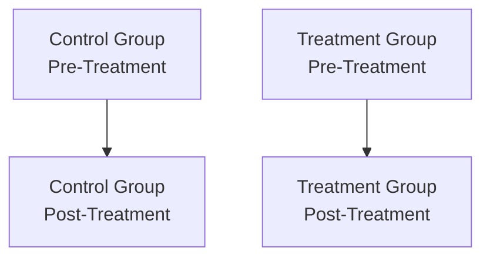

## Introduction and Conceptual Overview

If you’ve ever wondered whether a new regulation or policy really changed market behavior—or if financial metrics would have changed anyway—Differences-in-Differences (DiD) might be your best friend. In plain terms, DiD helps you compare what happened in a group affected by a policy (the “treatment” group) with what happened in a similar group that wasn’t affected (the “control” group). Then it subtracts out any common trends that both groups would have experienced over time.

I remember a time when I helped analyze a tax incentive policy that only impacted large manufacturing firms. We weren’t sure if it was truly the tax incentive that drove the resulting uptick in profitability, or if there was a general economic boom affecting everyone. By using DiD, we teased out that difference. And guess what? The policy did matter, but only half as much as the initial raw data suggested. That is precisely the power of DiD.

Now, let’s break down the mechanics, assumptions, and best practices you’ll need for your CFA® 2025 Level II exam and real-world applications.

## Classic Setup and the Underlying Assumption

DiD analysis is typically done in a panel data framework (sometimes cross-sectional time series) with observations across two groups over at least two time periods. One group experiences a “treatment” (like a policy, regulation, or event) at a specific point in time, while the comparison group does not.

• Treatment Group: Receives an intervention at time tᵢ.  
• Control Group: Remains unaffected by the intervention.  
• Pre-Treatment Period: Observations before the intervention.  
• Post-Treatment Period: Observations after the intervention.  

The math behind DiD is straightforward at the surface, but do note the critical assumption: in the absence of any intervention, the treated and control groups would have followed parallel trends over time. Meaning, if you plotted the outcome variable for both groups from pre- to post-intervention, you’d see lines that move pretty much in the same direction and magnitude, just offset by some constant difference. If that parallel relationship holds, any additional divergence you see after the policy is presumably due to the treatment itself.

## How DiD Works: A Simplified Formula

A very common expression for Differences-in-Differences is:

$$
\text{DiD} = \bigl(\bar{Y}_{T,\text{post}} - \bar{Y}_{T,\text{pre}}\bigr) \;-\; \bigl(\bar{Y}_{C,\text{post}} - \bar{Y}_{C,\text{pre}}\bigr),
$$

where  
– \\( \bar{Y}_{T,\text{post}} \\) is the average outcome for the treatment group in the post-treatment period.  
– \\( \bar{Y}_{T,\text{pre}} \\) is the average outcome for the treatment group in the pre-treatment period.  
– \\( \bar{Y}_{C,\text{post}} \\) is the average outcome for the control group in the post-treatment period.  
– \\( \bar{Y}_{C,\text{pre}} \\) is the average outcome for the control group in the pre-treatment period.  

This difference-between-differences is the estimated average treatment effect of the policy change, net of time trends that affect everyone and net of pre-existing differences between the groups.

## Regression Specification (Interaction Term)

DiD can also be estimated with a regression that typically looks like this:


Y_{it} = \alpha + \beta_1 \text{Treatment}_i + \beta_2 \text{Post}_t + \beta_3 (\text{Treatment}_i \times \text{Post}_t) + \epsilon_{it}.


• \\( Y_{it} \\): outcome of entity \\( i \\) at time \\( t \\).  
• \\( \text{Treatment}_i \\): dummy (1 if entity \\( i \\) is in the treatment group, 0 if in control).  
• \\( \text{Post}_t \\): dummy (1 if time period is “post-treatment,” 0 otherwise).  
• \\( \text{Treatment}_i \times \text{Post}_t \\): interaction term capturing the DiD effect.  

In this specification:  
– \\(\beta_3\\) measures the causal treatment effect, i.e., the difference-in-differences.  
– \\(\beta_1\\) picks up average differences between treatment and control (constant over time).  
– \\(\beta_2\\) picks up any differences over time that affect both groups equally.  

When reading a CFA exam vignette, look out for clues like “A new regulation is introduced in 2022 that applies only to certain banks based on asset size.” You might have a dataset from 2020, 2021 (pre) and 2023, 2024 (post). The question might ask, “How do you interpret the coefficient on the interaction term between Post and Treated banks?” That’s your DiD coefficient.

## Visual Representation

Below is a simple diagram to visualize the concept of DiD. Think of it like two lines, one for the control group, one for the treatment group, each measured before and after the policy:



If we took only the difference between C→D, we’d overstate (or understate) the policy’s effect if both groups were generally on an upward (or downward) trend. By subtracting A→B (the difference for the control group) from C→D, we get the net effect.

## Example: Regulation Affecting Large Mutual Funds

Let’s say a new regulation was introduced in 2021 that only targets “large” mutual funds—perhaps something about additional disclosure or constraints on portfolio composition. We have data from 2019 and 2020 (pre-regulation) and 2022 (post-regulation). We want to see the average effect on fund performance (e.g., net return) among large vs. small mutual funds.

1. Large funds (treatment group) might show an increase in average net return of 2% from the pre- to post-regulation period.  
2. Small funds (control group) might show an increase of 1.2% from pre- to post-regulation (maybe because it was a generally bull market).  
3. DiD estimate: 2% – 1.2% = 0.8%.  

So we interpret 0.8% as the net effect of that new regulation, presumably after netting out any overall market improvements that would have raised everyone’s returns anyway. On the exam, you might see a table with these kinds of numbers and be asked to compute that difference or interpret the corresponding regression coefficient.

## Parallel Trends Assumption and Why It Matters

At the risk of repeating ourselves, let’s highlight arguably the single most important assumption: in the absence of treatment, the two groups would have continued along parallel outcome trends. If that assumption is violated—say, because large mutual funds were already heading in a significantly different direction than small mutual funds—then your DiD estimates might be biased.

Possible ways to spot or check parallel trends:  
• Plot the outcome variable for both groups over time (before the policy). Look for roughly similar slopes.  
• Regress the outcome on group/time interactions before the policy and see if the difference is stable.  
• Use domain knowledge. Maybe large funds always adopt new technology or face different constraints. If those generate systematically different performance patterns, you might question the parallel trends assumption.

## Potential Pitfalls and Caveats

• Nonparallel Trends: As mentioned, if there’s a reason the treatment group would’ve grown faster (or slower) even without the policy, DiD can incorrectly attribute that difference to the policy.  
• External Shocks or Macro Events: If something big happened (like a massive market crash) that affected the treatment group differently than the control group, we might again attribute that difference erroneously to the policy.  
• Unbalanced Panels: Sometimes not all entities are observed in each period. If data is “missing” or “uneven,” your comparison might be skewed.  
• Staggered Treatments: In real life, interventions might not occur at a single point in time for all subjects. Some states adopt a policy in 2020, others do in 2021, etc. Handling that in a standard DiD requires careful modifications (such as two-way fixed effects or specialized methods).

## A Quick Python Example

If you have a basic dataset in Python’s pandas, you can run a DiD regression with statsmodels:

```python
import statsmodels.formula.api as smf

# plus 'entity_id' for cluster-robust standard errors if needed.

model = smf.ols('outcome ~ treat + post + treat:post', data=df).fit(
    cov_type='cluster', 
    cov_kwds={'groups': df['entity_id']}
)
print(model.summary())
```

Here, the term “treat:post” is your interaction capturing the DiD effect. If you see a significant coefficient on “treat:post,” that suggests a meaningful difference in the treatment group’s post-period outcome beyond what’s explained by time and group-level differences alone.

## Exam Tips and Best Practices

• Look for Vignette Clues: If a scenario states “Company X was subject to a new regulation in 2023, but Company Y was not,” and you see data from 2022 and 2024, that’s a strong hint that a DiD approach might be the intended method.  
• Check the Parallel Trend: The exam might test whether you can identify a scenario that violates or satisfies the parallel trends assumption.  
• Interpret the Coefficient: If the question specifically asks, “What does the coefficient of the interaction term represent?” your immediate reaction: “It’s the estimated treatment effect under DiD.”  
• Watch for Over Control: Sometimes you might see a question about controlling for other factors. You want to ensure that you’re not controlling away the effect you’re trying to estimate or introducing endogeneity.  
• Time Constraints: In exam settings, item set (vignette) questions can be quite data-dense. Practice quickly scanning for evidence of “pre” vs. “post” periods and “treated” vs. “control” groups.

## Strategies for Handling Model Misspecification

In the broader context of panel data, you might also incorporate fixed effects for entities (firms, funds, etc.) or time if you suspect there are unobserved characteristics that vary at the firm level or the year level. However, be mindful that the standard DiD approach already accounts for many of these sources of bias, especially if data collection is consistent across groups.

## Final Thoughts

Differences-in-Differences is remarkably powerful for making a cause-and-effect statement, which is crucial in finance research and real-world policy analysis. It’s kind of like hearing two sets of traffic noise: one from a busy street and one from a quiet neighborhood. If the entire city has a festival (time effect), noise levels will rise everywhere—but if your busy street had a special event on top of that festival, that extra jump you hear is basically the “treatment.”

As you approach the CFA® Level II exam, keep an eye out for scenarios that fit the DiD pattern. Understand the parallel trends assumption, how to interpret the interaction term, and the common pitfalls. If you nail these, you’ll be in great shape for any item set that tests your ability to identify or interpret a DiD design.

---

## References and Further Reading

• Angrist, J.D., & Pischke, J.-S. (2014). Mastering ’Metrics: The Path from Cause to Effect. Princeton University Press.  
• Gormley, T.A., & Matsa, D.A. (2014). “Common Errors: How to (and Not to) Control for Unobserved Heterogeneity.” Review of Financial Studies, 27(2), 617–661.  
• Official CFA Institute Curriculum, 2025 Edition (Level II), for foundational treatments of regression and panel-data topics.  

---

## Test Your Knowledge: Differences-in-Differences & Treatment Analysis



### 1. Which statement best describes the core logic of a Differences-in-Differences (DiD) approach?

- [ ] It compares the level of an outcome in a treated group to the level in a control group at a single point in time.  
- [x] It compares the before-and-after differences for a treated group to the before-and-after differences for a control group.  
- [ ] It regresses an outcome on only a treatment indicator to get the treatment effect.  
- [ ] It fits a single cross-sectional linear model with no time dimension.  

> **Explanation:** DiD estimates the treatment effect by comparing outcome changes in the treatment group to those in the control group, hence “differences-in-differences.”

### 2. Under a classic DiD setup, which assumption is most crucial?

- [ ] Homoskedastic errors in the regression.  
- [x] The treated and control groups would have followed parallel outcome trends in the absence of treatment.  
- [ ] The sample size must be equal between treatment and control.  
- [ ] The outcome variables are normally distributed.  

> **Explanation:** The key requirement is that the treatment and control would have moved in parallel over time without the intervention. This is known as the parallel trends assumption.

### 3. In the regression model Yᵢₜ = α + β₁Treatmentᵢ + β₂Postₜ + β₃(Treatmentᵢ × Postₜ) + εᵢₜ, which coefficient measures the DiD effect?

- [ ] β₁  
- [ ] β₂  
- [x] β₃  
- [ ] α  

> **Explanation:** β₃ is the coefficient on the interaction term between Treatment and Post, representing the difference-in-differences estimate.

### 4. Suppose in a two-period, two-group DiD study, the treatment group’s average outcome went from 10 to 15, while the control group’s average outcome went from 8 to 10. What is the DiD estimate?

- [ ] 2  
- [ ] 5  
- [ ] 3  
- [x] (15 − 10) − (10 − 8) = 3  

> **Explanation:** The DiD is the change in the treatment group (5) minus the change in the control group (2), which equals 3.

### 5. A finance researcher worries that a macroeconomic shock happened during the post-treatment period, affecting the treatment group differently. Which problem does this highlight?

- [x] A violation of the parallel trends assumption due to external shocks.  
- [ ] Heteroskedastic errors.  
- [ ] Perfect collinearity among regressors.  
- [ ] No differences in the data.  

> **Explanation:** If external shocks differently affect the treated group, the parallel trends assumption may be violated, thereby biasing the DiD estimate.

### 6. In a DiD context, what is the purpose of having a control group?

- [ ] To ensure maximum variability in the outcome measure.  
- [x] To capture general time trends that would have affected the treatment group if there were no intervention.  
- [ ] To perform a placebo test after the main analysis.  
- [ ] To filter out only those observations with missing values.  

> **Explanation:** The control group helps estimate the baseline trend over time, so we can subtract that out from the treatment group’s observed trend.

### 7. If an exam vignette presents data with multiple time periods pre- and post-intervention, how can DiD be extended?

- [ ] DiD cannot be extended beyond a single pre- and post-period.  
- [x] You can incorporate multiple time dummies, or use a two-way fixed effects model to account for multi-period changes.  
- [ ] You must discard all but two time points.  
- [ ] You can simply pool all periods with no time distinction.  

> **Explanation:** Multiple time periods can be incorporated either by including additional time dummies, or by a two-way fixed effects framework for a more robust DiD design across multiple time points.

### 8. What is a common approach to testing the parallel trends assumption?

- [ ] Omit the treatment group from analysis.  
- [x] Check pre-treatment data to see if trends in outcome variables are similar across treated and control groups.  
- [ ] Run a logistic regression with the treatment indicator as the dependent variable.  
- [ ] Ensure that the sample standard deviations match exactly in both groups.  

> **Explanation:** Inspecting the pre-period trends (e.g., plotting them or using a regression test) is a common way to check whether the groups exhibited parallel movements prior to treatment.

### 9. Which of the following is a key advantage of DiD over a simple pre/post comparison in the treatment group?

- [ ] DiD requires more data and thus is less prone to measurement error.  
- [ ] DiD eliminates the need for significance testing.  
- [x] DiD accounts for time-specific changes that affect both groups, removing bias from common trends.  
- [ ] DiD can handle cross-sectional data with no time dimension.  

> **Explanation:** By comparing the treatment group’s change to the control group’s change, DiD removes the influence of any external time effects common to both groups.

### 10. True or False: In DiD analysis, the coefficient on the interaction term between Treatment and Post dummies directly interprets the average causal effect of treatment, assuming parallel trends hold.

- [x] True  
- [ ] False  

> **Explanation:** Yes. In a DiD setup with a standard interaction term approach, that interaction coefficient is the primary estimator of the treatment’s average causal effect, contingent on the parallel trends assumption being valid.


