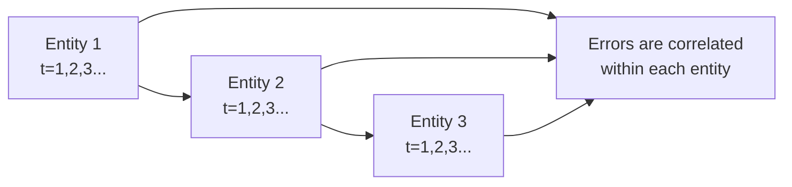

## Understanding Entity Clustering

If you’ve ever worked with panel data where each firm, region, or country is observed over multiple years (or months, quarters, etc.), you’ve probably bumped into the concept of “entity clustering.” I remember back when I first started doing research on corporate profitability across multiple companies... one day, I happily found a bunch of “significant” results in my regression. My t‑statistics looked great, and I was pretty excited to share the findings. Then a more experienced colleague politely asked, “Hey, are you sure you’re adjusting for the correlation of your firm-specific residuals over time?” Um, I had that uneasy feeling. Turned out all my significance was spurious because I’d ignored entity clustering.

Anyway, what do we mean by clustering? In panel data, you usually have repeated observations for each cross-sectional unit (like each firm). These repeated observations create intra-entity correlations in the error term. If you run a standard OLS with no correction for clustering, you’re likely assuming that every residual is independent from every other residual. But that’s just not true when you have repeated measurements on the same firm, whatever the time horizon might be.

Ignoring these within-entity correlations can cause you to grossly underestimate standard errors. The direct result? Overstated t‑stats, p‑values that look more impressive than they actually are, and a heightened risk of concluding that some effect is statistically significant when it really isn’t.

## Why We Adjust: Potential Pitfalls

Understated Standard Errors  
• In the presence of clustering, the residuals for a given entity may remain correlated across time. Picture a firm that experiences a systematic shock or that systematically outperforms. Its error terms likely share a pattern over time.  
• If you ignore that, your regression’s standard errors shrink and you might think your coefficients are more precise than they actually are.

Misleading Economic Conclusions  
• In finance and investment analysis, the cost of ignoring clustering could be huge. Imagine you’re studying how a certain corporate governance change influences stock returns. If multiple firms in your sample are from the same industry, their performance might move together. Standard OLS that doesn’t account for this phenomenon will likely produce inflated t‑statistics—even though real-world significance might be much lower.

## Methods for Adjusting Standard Errors

To address this within-entity correlation, we typically use cluster-robust standard errors (CRSE). The main idea is that each entity is treated as a “cluster,” and the residuals within that cluster are allowed to be correlated, while residuals across different clusters are assumed to be independent.

### Cluster-Robust Standard Errors (CRSE)

• Cluster by Entity  
  - The most common approach in panel data regressions. The procedure modifies the variance–covariance matrix of the estimated coefficients so that within-entity correlation doesn’t artificially deflate standard errors.  
  - When you see something like “Stata: vce(cluster firm)” or “R: vcovHC(model, type='HC1', cluster='group')” or “Python statsmodels with cov_type='cluster'”, that’s the technique in action.

• Multi-Way Clustering (For Example, by Entity and Time)  
  - Sometimes, your residuals are correlated not only within entities (firms) but also within calendar years (market-wide shocks, macro events). You might need to cluster by entity and by time.  
  - Two-way clustering is more advanced, but in empirical finance, we often see it used. If your data might have correlations across industries for a certain year, say a big financial crisis in 2008, you probably want to cluster by both dimension: one for firm-level, another for time-level.

• Block Bootstrap Methods  
  - Another approach is to bootstrap the data in “blocks,” grouping observations by entity or time. This method can also account for correlated observations, though it can be more computationally intensive.

## Visualizing Clustering with a Mermaid Diagram

Below is a simple conceptual diagram illustrating how panel data might be organized, with each entity having multiple time-series observations:

We see multiple entities (perhaps different firms), each measured across various time points. Within each entity block, the error terms can be correlated—hence, we cluster our standard errors by entity.

## Practical Case Example: Corporate Profitability

Let’s say you’re running a panel data regression:

(1)  
yᵢₜ = β₀ + β₁ Xᵢₜ + εᵢₜ  

…where yᵢₜ is the profitability (ROE) of firm i at time t, and Xᵢₜ measures, say, debt-to-equity ratio or some macroeconomic variable relevant to that firm.

Without adjusting for clustering, your regression might show a t-statistic for β₁ of 3.2, looking statistically significant at the 1% level. Then—because you’re now a wise person who’s read about clustering—you decide to re-run the same regression but this time with cluster-robust standard errors at the firm level. Suddenly, your t-statistic might drop to 1.9. That’s still borderline significant at the 5% level, but it’s certainly not the flashy 1% significance you initially boasted about.

These differences can become even more dramatic when you have large panels with many periods, especially if each entity’s data points exhibit persistent correlation in the error term.

## Implementations in Software

• Stata  
  - Typically, you’d specify something like:  
    regress y x, vce(cluster firm_id)  
  - That ensures standard errors are robust to correlation within each firm.

• R  
  - Using the sandwich package, you might do:  
    library(sandwich)  
    library(lmtest)  
    coeftest(model, vcov = vcovCL, cluster = ~ firm_id)  

• Python (statsmodels)  
  - statsmodels offers a similar approach. Something like:  
    import statsmodels.formula.api as smf
    model = smf.ols("y ~ x", data=df).fit(cov_type='cluster', cov_kwds={'groups': df['firm_id']})  

These commands handle the heavy lifting of adjusting the variance–covariance matrix so that your standard errors reflect the correlation within each entity.

## Common Pitfalls

• Failing to Identify the Right Clustering Dimension  
  - Most commonly, you cluster by entity (firm or region). But if there’s reason to believe that observations across time might be correlated (e.g., you have daily data across many stocks in the same market), then consider clustering by time or use two-way clustering.

• Over-Clustering (Too Many Dimensions with Not Enough Observations)  
  - Multi-way clustering can be helpful, but you might run out of degrees of freedom if your panel is not sufficiently large. Often, you’ll see two-way clustering by firm and time, but going beyond that might get complicated.

• Overlooking Heteroskedasticity  
  - Cluster-robust standard errors typically handle both correlation within clusters and heteroskedasticity. That said, always confirm that your chosen approach truly addresses both issues. Sometimes you need to simultaneously address cross-sectional dependence in a panel setting, which can be even more complex.

## Conclusion and Exam Tips

So, in a nutshell, always check whether the error terms in your panel data are correlated within entities. If they are, you should use cluster-robust standard errors (CRSE). On the CFA® exam, you might see a vignette referencing how a researcher adjusted standard errors for within-firm correlation. Or you might see them highlight the difference in p-values before and after clustering. Be ready to explain that ignoring clustering leads to overstated significance.

A quick exam reminder:  
• Mention that using ordinary OLS standard errors in panel data with within-entity correlation can inflate t‑stats.  
• Show how cluster-robust standard errors fix the problem.  
• Be prepared with an example where the significance level changes after clustering is accounted for.

And maybe double-check your homework (or your next investment pitch) the way I wish I had early in my career, so you don’t overstate your results. Trust me, it saves a bit of embarrassment!

## References

• Petersen, M.A. (2009). “Estimating Standard Errors in Finance Panel Data Sets: Comparing Approaches.” Review of Financial Studies, 22(1), 435–480.  
• Cameron, A.C. & Trivedi, P.K. (2005). Microeconometrics: Methods and Applications. Cambridge University Press.  
• Software-specific user guides are also invaluable. Try reading up on Stata, R, or Python StatsModels documentation to see how they implement cluster-robust standard errors.

----------------------------

## Test Your Understanding: Clustering in Panel Data



### What does “entity clustering” typically refer to in panel data?

- [ ] Observations across different firms in different time periods are assumed to be identical.
- [ ] All regressors are correlated with each other zero percent of the time.
- [x] Residuals (errors) for the same firm are correlated over time.
- [ ] There is no correlation in the data.

> **Explanation:** Entity clustering in panel data means observations for the same entity (e.g., a firm) are correlated over time, implying traditional OLS assumptions of independence are violated.

### Which of the following is a direct consequence of ignoring clustering in panel data?

- [ ] Underestimated t‑statistics.
- [x] Overstated t‑statistics.
- [ ] Unchanged standard errors.
- [ ] Lower risk of Type I error.

> **Explanation:** Ignoring clustering typically inflates your t‑values because the standard errors end up being understated, leading to an increased risk of Type I error (false positives).

### Why might someone use two-way clustering (e.g., by entity and by time)?

- [x] Because there can be both intra-entity correlations and time-based correlations that affect standard errors.
- [ ] It always produces smaller standard errors, enabling more significance.
- [ ] It randomly eliminates within-firm variation.
- [ ] It only applies to cross-sectional data, not panel data.

> **Explanation:** Sometimes, you need to account for both within-entity correlation and correlations across particular time periods (such as broad market shocks in a given year).

### If your standard errors are “cluster-robust,” what does this primarily mean?

- [x] The standard errors incorporate the possibility that residuals are correlated within each cluster.
- [ ] The regression automatically includes random effects.
- [ ] The coefficient estimates are zero in each cluster.
- [ ] The model sets the correlation across clusters to 1.

> **Explanation:** Cluster-robust standard errors adjust the variance–covariance matrix of the parameter estimates to handle potential within-group (within-entity) correlation of residuals.

### Suppose you run a regression on panel data and then re-run it using cluster-robust standard errors. Your t-statistic on the main explanatory variable decreases drastically. Which of the following is the most likely explanation?

- [ ] You used the wrong dependent variable in the second regression.
- [ ] Clustering artificially inflated your standard errors initially.
- [x] Ignoring clustering had originally caused strongly understated standard errors.
- [ ] The data’s degrees of freedom suddenly increased.

> **Explanation:** Once you account for clustering, the standard errors get bigger if residuals are correlated within entities. This tends to lower the t‑statistic.

### Which type of correlation does single-cluster standard error adjustment usually address?

- [ ] Cross-entity correlation during the same time period.
- [x] Within-entity correlation across multiple time periods.
- [ ] Both cross-entity and within-entity correlation simultaneously.
- [ ] No correlation.

> **Explanation:** Single-cluster adjustment mostly handles within-cluster correlation (often “within-entity”). Typical usage is one dimension, such as firm-level clustering.

### When might multi-way clustering be considered too complicated?

- [x] If you have high-dimensional data but relatively few observations in each cluster.
- [ ] When your sample size is extremely large in every dimension.
- [ ] When you expect no correlation at all.
- [ ] If the t-statistics are already large.

> **Explanation:** Multi-way clustering can “eat” your degrees of freedom and might be unstable if you have a limited number of entities or time periods in each grouping.

### You find that your p-values change dramatically after implementing cluster-robust standard errors. Which is the most likely reason?

- [ ] The intercept has been overestimated.
- [x] The previously assumed independence of errors was incorrect.
- [ ] The slope coefficient lost significance entirely due to a coding error.
- [ ] Time-dummy variables were excluded.

> **Explanation:** Large revisions in p-values typically stem from adjusting standard errors upward to account for correlated residuals within each entity.

### A researcher decides to cluster by both firm and time because of suspected correlation in each dimension. Which of the following statements is most accurate?

- [ ] This approach usually leads to smaller standard errors for all coefficients.
- [ ] Multi-way clustering is a guaranteed fix for correlated errors of any kind.
- [x] This approach can help correct standard errors if there is both within-firm and within-time correlation.
- [ ] Multi-way clustering is not allowed in finance research setups.

> **Explanation:** If data suggests correlation across firm dimension and across time dimension, multi-way clustering is more appropriate than single-dimension clustering.

### Cluster-robust standard errors primarily help address which type of violation of basic OLS assumptions?

- [x] The independence of error terms.
- [ ] The normality of residuals.
- [ ] The linearity of the relationship.
- [ ] The presence of outliers in the data.

> **Explanation:** The main impetus for cluster-robust standard errors is correcting the assumption that errors are independently and identically distributed (i.i.d.) across all observations—particularly the independence part among observations within an entity.


