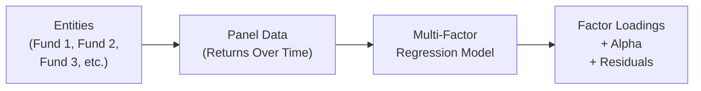

## Introduction and Key Concepts

If you’ve ever tried to explain why certain stocks or funds behave differently over time—maybe you’ve even found yourself going, “Uh, this fund is up 10% because, well...the market is good?”—you’re capturing just a small piece of the story. In reality, there are plenty of different factors at play. Market movement is an important one, but so are others like size effects (small-cap vs. large-cap), value vs. growth styles, sector tilts, macroeconomic elements (like bond yield shocks or rate changes), and even liquidity constraints. That’s where multivariate approaches for multi-factor modeling step in.

Within panel data contexts, multi-factor modeling is a robust way to disentangle these various drivers of performance. Picture a huge spreadsheet with rows representing different funds (or stocks) across multiple time periods—yep, that’s basically a panel dataset. Each fund might have a different level of sensitivity (or “loading”) to factors such as market, value, size, or momentum. With this approach, you can see not only what matters on average but also how these sensitivities can vary across funds while you incorporate data from multiple time periods all at once.

## Why Use a Multi-Factor Panel Regression?

In a single-factor world (like the classic Capital Asset Pricing Model, CAPM), we typically measure an asset’s returns in relation to a single market factor. But we know from practical experience that, for instance, a small-cap value stock might respond differently to market ups and downs than a large growth-oriented company. This complexity begs for a more nuanced approach:

• Multiple Factors for Multiple Explanations: Incorporating size, value, momentum, quality, or even macro factors often gives a richer explanation for returns.  
• Cross-Section and Time Dimensions: Panel data merges both cross-sectional (differences among multiple stocks or funds) and time-series dimensions. This is powerful for testing whether factors systematically explain variations in returns over time.  
• Better Performance Evaluation: Many portfolio managers claim to have “alpha,” but multi-factor approaches can tell us whether the strategy is truly generating alpha or if it’s just riding a particular factor wave.

Personally, I remember working at a hedge fund early in my career (I was pretty wide-eyed at the time) and noticing that some of the “alpha” we bragged about was basically exposure to small-cap biotech stocks. In other words, we had a hidden factor tilt. Once we used a multi-factor regression, the alpha shrank significantly. That was my “aha” moment—I realized how crucial it was to dissect returns carefully with more than one factor.

## Setting Up the Multi-Factor Panel Regression

At its core, a multi-factor panel regression for returns can be specified like this:


R_{i,t} = \alpha_i \;+\; \beta_{i,1} F_1(t) \;+\; \beta_{i,2} F_2(t) \;+\; \dots \;+\; \beta_{i,k} F_k(t) + \epsilon_{i,t},


where:  
• \\(R_{i,t}\\) is the return of entity (e.g., stock or fund) \\(i\\) at time \\(t\\).  
• \\(\alpha_i\\) is the intercept term (sometimes considered the asset’s or fund’s alpha). In panel data, we can allow this intercept to vary across entities (a fixed effect).  
• \\(F_j(t)\\) represents the \\(j\\)-th factor at time \\(t\\). For instance, one factor might be the market excess return, another might be the SMB (“small minus big”) size factor, yet another might be a bond yield factor, etc.  
• \\(\beta_{i,j}\\) is the sensitivity of entity \\(i\\) to factor \\(j\\).  
• \\(\epsilon_{i,t}\\) is the error term for entity \\(i\\) at time \\(t\\).

### Cross-Sectional vs. Time-Dimensional Structure

Unlike a simple cross-sectional model, we pool data across entities and over time. This has two big advantages:

• Greater Sample Size and Power: By combining cross-sectional and time-series data, we often get more degrees of freedom, leading to more precise estimates.  
• Variation Across Entities and Periods: Factor loadings can differ for each entity (\\(\beta_{i,j}\\)), capturing the unique “fingerprint” of each fund or asset.

### Depicting Panel Data Conceptually

Below is a simple Mermaid.js diagram that shows how multiple funds, across multiple time periods, interact with a multi-factor regression framework.

Here, each fund (Fund 1, Fund 2, Fund 3, and so on) has a time series of returns. We then feed this panel dataset into the multi-factor regression model, and the output assigns factor loadings and alpha estimates to each entity.

## Comparing Panel Data and Purely Cross-Sectional Factor Models

You’ll often hear of another big approach: the Fama-MacBeth two-step procedure. While the differences can get a bit tricky, here’s a quick snapshot:

• Fama-MacBeth Procedure (Cross-Section Focus):  
  1. For each period \\(t\\), regress each entity’s returns on whatever characteristic or factor you’re testing, to get that factor or characteristic’s “price” in the cross-section.  
  2. Average or aggregate these factor “prices” over time and assess their statistical significance.  
  The Fama-MacBeth framework is commonly used in research to test whether a factor truly carries a premium across assets.

• Panel Data Multi-Factor Approach:  
  – Instead of running a cross-sectional regression each period, you treat the entire panel in a single regression (or some variations that allow for fixed or random effects).  
  – The advantage is it leverages both cross-sectional and time variation simultaneously. You can see each entity’s factor loadings (the \\(\beta_{i,j}\\)) more directly and test for alpha at the entity level.

In industry practice, you’ll see both. Often, big quant shops run panel data regressions to figure out each strategy’s or each manager’s exposures. Then they might pivot to a Fama-MacBeth style analysis to see if a particular new factor or anomaly is priced in the cross-section of stock returns.

## Interpreting Factor Loadings and Alpha

A multi-factor panel regression yields:

• \\( \alpha_i\\): The fund- or asset-specific intercept. If \\(\alpha_i\\) is significantly positive and you trust your factor model is well specified, you can interpret this as that entity’s “abnormal performance.” If everyone’s using the same factor set, a persistent positive alpha can be a big bragging point—but be sure the alpha is truly robust and not just picking up omitted factors.  

• \\(\beta_{i,j}\\): The exposure of asset \\(i\\) to factor \\(j\\). If \\(\beta_{i,1}\\) is large and positive for the market factor, that fund or asset is likely to have strong correlation with general market swings. A large negative \\(\beta\\) might mean a short position in that factor.  

• \\(\epsilon_{i,t}\\): The residual. Panel data might have additional complexities like heteroskedasticity or autocorrelation. We want the residual to be random noise, not some hidden factor or pattern we haven’t accounted for.

In the exam context, watch out for item sets that present partial regression results and ask you to interpret the factor loadings, or to see whether alpha is statistically different from zero. Sometimes a question might highlight that two factors are highly correlated, hinting at multicollinearity concerns.

## Potential Pitfalls and Challenges

### 1. Multicollinearity Among Factors

Some factors move closely together—size (SMB) and value (HML) might be correlated. Or maybe sector and momentum factors overlap. When factors are correlated, it can be tough to isolate each factor’s separate effect. Watch for:

• High Variance in Coefficients: The standard errors can blow up, making it look like your factors are insignificant when they might actually matter.  
• Unreliable Beta Estimates: Small changes in sample or method might produce large swings in the estimated loadings.

### 2. Time-Varying Factor Loadings

Managers might drift in their style. A large-cap manager can become a mid-cap manager over time. If factor loadings \\(\beta_{i,j}\\) are not stable, a single multi-factor model might mislead you. Solutions could include:

• Rolling Regressions: Re-estimate betas over different windows.  
• Interactive Terms: Interact factors with time-identified events.  
• Regime Switching: More advanced models detect different factor exposures during bull vs. bear markets.

### 3. Misinterpretation of Alpha

Alpha might be the crown jewel for some managers, but if you’ve omitted an important risk factor, your alpha could be inflated. Always ask: “Are we missing a factor that systematically explains these returns?” If so, the alpha is suspect.

### 4. Data Snooping and Overfitting

With so many potential factors—momentum, profitability, liquidity, whatever—it’s easy to “kitchen sink” it and run a bloated regression. The model might fit the past extremely well but fail out-of-sample. This is a big no-no, especially on the exam, as overfitting usually yields spurious alpha.

## Real-World Example: Hedge Fund Factor Analysis

Let’s say you have 20 hedge funds and 60 months of return data (that’s a nice little panel: 1,200 total observations). You suspect four major factors:

1) Market Factor (broad equity index returns above risk-free).  
2) Size Factor (small minus big).  
3) Bond Factor (some measure of bond market excess return).  
4) Liquidity Factor (spread-based measure capturing liquidity shifts).

You run a multi-factor panel regression:


R_{i,t} = \alpha_i + \beta_{i,MKT} \times (MKT_t) + \beta_{i,SIZE} \times (SIZE_t) + \beta_{i,BOND} \times (BOND_t) + \beta_{i,LIQ} \times (LIQ_t) + \epsilon_{i,t}.


For Fund #7, for example, you might find:


\hat{\alpha}_7 = 0.002 \quad (monthly), \quad \hat{\beta}_{7,MKT} = 1.20, \quad \hat{\beta}_{7,SIZE} = 0.30, \quad \hat{\beta}_{7,BOND} = -0.10, \quad \hat{\beta}_{7,LIQ} = 0.05.


This suggests that Fund #7 has a high exposure to the market factor and a tilt toward small-cap stocks (reflected by the positive SIZE factor loading). The negative \\(\beta\\) to the BOND factor might imply the fund is short or inversely exposed to bond market excess returns. If \\(\alpha_7\\) is significantly different from zero, you might proclaim that Fund #7 has some idiosyncratic skill. But remember—maybe we’re missing another factor, like momentum or volatility. The exam might push you to question that.

## Exam Tips and Best Practices

• Scrutinize Residual Plots: A quick look at panel residuals can show if you’re missing a factor or if your variance is bigger for certain time periods.  
• Check Factor Correlations: High correlation flags potential multicollinearity.  
• Remember the Big Goal: Factor modeling is about explaining returns, identifying exposures, and measuring alpha. If all your returns are explained by the factors, the alpha is near zero.  
• Time Management: For item set questions, keep an eye on how the question is framed—sometimes it’s a quick “Is alpha significant?” Other times it’s “Which factor is driving performance?” Focus on the data provided—like factor t-stats, correlation matrices, or an ANOVA table—and interpret them correctly.  
• Real-World Relevance: Don’t forget the ethical dimension. Overfitting or data dredging to claim alpha can be unethical and mislead clients. The CFA Institute Code of Ethics emphasizes competence and diligence, meaning you must properly test any factor-based assertion.

## References

- Fama, E.F. & French, K.R. (1993). “Common Risk Factors in the Returns on Stocks and Bonds.” Journal of Financial Economics.  
- Bali, T.G., Engle, R.F., & Murray, S. (2016). “Empirical Asset Pricing: The Cross Section of Stock Returns.” Wiley.  
- CFA Institute Level II Curriculum (Multi-Factor Models for Equity Investments, Advanced Regression Techniques).  

## Test Your Knowledge: Multi-Factor Panel Data Quiz



### Which aspect best distinguishes a panel data multi-factor approach from a simple cross-sectional approach?

- [ ] The use of only one factor (market).  
- [x] The integration of both entity-specific and time-series dimensions in one regression.  
- [ ] The assumption that all factor loadings remain constant across entities.  
- [ ] The reliance on bond factors only.  

> **Explanation:** In panel data, you incorporate both cross-sectional and time-series information simultaneously, allowing each entity to have different factor loadings over time.

### In a multi-factor model, the coefficient on the size factor (SMB) for a particular fund is +0.45 and is statistically significant. What does this imply?

- [ ] The fund’s alpha is +0.45%.  
- [x] The fund’s returns are positively related to small-cap exposure.  
- [ ] The fund’s returns are negatively related to small-cap exposure.  
- [ ] The fund charges a 0.45% management fee.  

> **Explanation:** A positive and significant factor loading of +0.45 on the size factor indicates a tilt toward smaller-cap stocks, which should drive returns in line with that factor’s performance.

### A common pitfall in multi-factor panel regressions is:

- [ ] Using data from both stocks and bonds together.  
- [ ] Failing to aggregate all time periods into one average.  
- [x] Multicollinearity among factors leading to unstable beta estimates.  
- [ ] Reporting alpha for each factor.  

> **Explanation:** Highly correlated factors can cause large estimation errors and lead to confusion about their true individual effects.

### If a fund’s alpha in a multi-factor panel regression is significantly positive, which statement is most accurate?

- [x] The fund’s performance cannot be explained solely by the included factors.  
- [ ] The fund has zero exposure to the included factors.  
- [ ] The fund’s returns are entirely driven by sector tilts.  
- [ ] No more factors exist in the market.  

> **Explanation:** A significantly positive alpha implies that part of the fund’s return generation isn’t explained by the listed factors, suggesting potential skill, mispricing, or omitted factors.

### Time-varying factor exposures can be partially addressed by:

- [x] Conducting rolling regressions.  
- [ ] Dropping all observations with volatility.  
- [x] Considering regime-switching or interactive models.  
- [ ] Merging all data into a single cross-section.  

> **Explanation:** Rolling regressions or regime-switching frameworks help capture shifts in factor exposures over different periods or under different market conditions.

### In a 60-month panel with 20 funds, how many total observations are there for the multi-factor regression?

- [ ] 20 total observations.  
- [x] 1,200 total observations.  
- [ ] 80 total observations.  
- [ ] 60 total observations.  

> **Explanation:** Twenty entities (funds) each observed over 60 time periods yield \\(20 \times 60 = 1,200\\) data points.

### If the market factor is highly correlated (0.95) with the bond factor, what is a possible consequence in the regression?

- [x] Inflated standard errors for the coefficients of these two factors.  
- [ ] A perfect factor loading on both factors.  
- [x] Difficulty in distinguishing their separate effects on returns.  
- [ ] Automatic removal of one factor by the software.  

> **Explanation:** Multicollinearity due to high correlation can cause large standard errors and make it difficult to parse out each factor’s true effect.

### Fama-MacBeth and panel data approaches differ primarily in:

- [x] How they treat the cross-sectional vs. time-series dimensions.  
- [ ] The type of alpha reported.  
- [ ] The number of factors used.  
- [ ] The completely different definitions of returns.  

> **Explanation:** Fama-MacBeth runs cross-sectional regressions each period and then averages across time, whereas panel data methods typically pool time and entity data in one model.

### A high R² in a multi-factor panel regression suggests:

- [x] The chosen factors collectively explain a large portion of the variation in returns.  
- [ ] The factors are entirely irrelevant.  
- [ ] There is necessarily a high alpha for each entity.  
- [ ] The standard errors must be zero.  

> **Explanation:** R² is the proportion of variance explained by the model. A higher R² indicates that the included factors (plus any intercepts) do a good job explaining return variations.

### A manager claims that an omitted factor (like volatility) explains her positive alpha. In a multi-factor context, this means:

- [x] The alpha might be biased upward because an important risk factor is missing.  
- [ ] The alpha is definitive and cannot be questioned.  
- [ ] The manager should remove the size factor.  
- [ ] The bond factor should be replaced with the omitted factor.  

> **Explanation:** Omitting an important factor can inflate alpha (or even get the sign wrong), because the model isn’t attributing that portion of returns to the correct risk factor.


