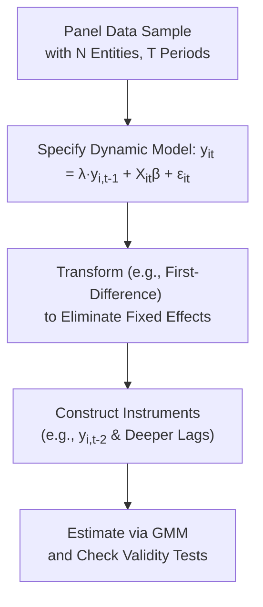

## Introduction
Sometimes, we look at data across firms or funds over multiple periods and notice something interesting: this period’s outcome might depend on last period’s outcome. For instance, maybe a fund’s current performance depends, in part, on its past performance or a company’s current leverage decisions hinge on how much debt it carried last year. These situations call for what we call dynamic panel models, where a lagged dependent variable (say, last period’s fund return) becomes one of the regressors in a panel setting.

I remember working on a research project on corporate capital structure, and I was so tempted to just run a fixed-effects (FE) regression. Then someone pointed out that my model had a lagged dependent variable which might create correlation with the error term, that dreaded Nickell bias. It felt like a big “aha” moment: standard methods like ordinary least squares (OLS) or just plain FE can produce biased estimates in these contexts. Enter Generalized Method of Moments (GMM), specifically the Arellano-Bond or Blundell-Bond estimators, to help us fix those issues.

Dynamic panel data approaches are especially handy when you’re dealing with phenomena that display persistence or momentum over time, such as macroeconomic variables (GDP, inflation), asset prices, or corporate performance. And since the CFA exam might throw a vignette describing exactly that—like a scenario involving persistent fund returns or incremental changes in a firm’s leverage ratio—understanding GMM for dynamic panels becomes a key skill.

## Key Concepts in Dynamic Panel Models

### Why “Dynamic”?
A “dynamic” panel model means that your dependent variable in period t (denoted yᵢₜ) might be explained (in part) by yᵢ,ₜ₋₁. This structure captures inertia or momentum—think of a company’s leverage ratio that doesn’t drastically change from one year to the next but rather adjusts slowly. Or a macrovariable like GDP that has strong correlation with its own past values.

### The Nickell Bias
If you run a within-group or fixed-effects estimator on a model with a lagged dependent variable, you’ll likely run into Nickell bias. Essentially, the lagged dependent variable is correlated with the error component due to the nature of how panel means are removed in the fixed-effects transformation. This correlation leads you to incorrectly estimate the coefficient on yᵢ,ₜ₋₁. The bias can be especially significant when the time dimension (T) is small (like fewer years of data) and the cross-sectional dimension (N) is large.  

Some might say, “Well, I’ll just rely on OLS or standard FE.” But these end up being biased or inconsistent in many dynamic panel contexts—especially once we suspect endogeneity or correlation with the error term.

### Where Does Endogeneity Come From?
Endogeneity can show up for a bunch of reasons, but the two big ones in dynamic models are:
• The lagged dependent variable is inherently correlated with the unobserved entity effects.  
• Other regressors (like control variables) might be partly determined by past values of the dependent variable (or correlated with omitted variables), creating feedback loops.

In a typical exam vignette, you might see hints like “the fund’s return partially depends on the prior period’s return” or “the firm’s leverage decisions are influenced by last period’s leverage.” The question might say something about the presence of endogeneity and how traditional methods produce biased estimates. The recommended approach usually involves specialized GMM estimators.

## The GMM Approach
Generalized Method of Moments (GMM) techniques allow you to estimate model parameters using “moment conditions.” These conditions, in practical terms, rely on identifying instruments that correlate with the endogenous regressors but are uncorrelated with the error term. That might sound a bit jargon-heavy, so let’s break it down:

1. You suspect your regressors (like yᵢ,ₜ₋₁) are correlated with the error term εᵢₜ.  
2. You hunt for instruments that are good proxies for those endogenous regressors. In many dynamic panel contexts, the natural go-to is to use past values (lagged values) of yᵢₜ or other explanatory variables as instruments.  
3. If you do it right, GMM can generate consistent estimates of your parameters. Because the moment conditions basically say: “The instruments (lagged values) must be correlated with the regressor in question but must not be correlated with the current period’s error.”

### Arellano-Bond Estimator
One of the most famous dynamic panel GMM estimators is by Arellano and Bond (1991). Conceptually:
• You first difference your model, so that yᵢₜ − yᵢ,ₜ₋₁ becomes your dependent variable. This removes the unobserved entity effect (any time-invariant firm or fund attribute).  
• Now the challenge is that (yᵢ,ₜ₋₁ − yᵢ,ₜ₋₂) could still be correlated with the differenced error term (εᵢₜ − εᵢ,ₜ₋₁).  
• The solution? Use yᵢ,ₜ₋₂ (the second or deeper lags of the dependent variable) as instruments. Because if your error term doesn’t exhibit serial correlation beyond what the dynamic part accounts for, those deeper lags are uncorrelated with the differenced error.  
• You build up a system of equations for each time period, gather all possible instruments from second or deeper lags of y, and run GMM to solve for the coefficients.

### Blundell-Bond Estimator
Arellano-Bond can sometimes suffer from a “weak instruments” problem, especially if the dependent variable is super persistent. That’s where the Blundell-Bond (1998) “system GMM” approach steps in. It effectively combines:
• The original (level) equation.  
• The first-differenced equation.  
It imposes additional assumptions about the initial conditions so that lagged differences of yᵢₜ can serve as instruments in the level equation, and lagged levels can serve as instruments in the differenced equation. The end result is typically more precise estimates (less finite-sample bias) than pure Arellano-Bond.

### Assumptions & Diagnostics
When using GMM for dynamic panels, pay attention to:
• No serial correlation in the error term beyond what’s accounted for by the lag. Arellano-Bond tests for autocorrelation (AR(1) and AR(2)) are standard to check.  
• Instrument validity. You might see “Sargan tests” or “Hansen tests” for overidentifying restrictions. A p-value that’s too low might indicate your instruments are correlated with the error term, rendering them invalid.  
• The risk of “instrument proliferation.” Sometimes, with many time periods, you get a huge number of potential instruments. This can degrade the power of the test statistics and actually blow up your standard errors.

## Example: Modeling Corporate Leverage
Let’s say we have a panel dataset of 500 firms over 5 years (N=500, T=5). We suspect current leverage (DebtRatioᵢₜ) depends on last year’s leverage (DebtRatioᵢ,ₜ₋₁) as well as some other firm-level variables Xᵢₜ (size, profitability, etc.).  

We might specify:

DebtRatioᵢₜ = λ · DebtRatioᵢ,ₜ₋₁ + βXᵢₜ + εᵢₜ

If we just run a fixed-effects regression, we fear correlation between DebtRatioᵢ,ₜ₋₁ and the error term. So we apply the Arellano-Bond difference GMM:  
1. First difference: (DebtRatioᵢₜ − DebtRatioᵢ,ₜ₋₁) = λ (DebtRatioᵢ,ₜ₋₁ − DebtRatioᵢ,ₜ₋₂) + β(Xᵢₜ − Xᵢ,ₜ₋₁) + (εᵢₜ − εᵢ,ₜ₋₁).  
2. Use second and deeper lags of DebtRatioᵢₜ as instruments.  
3. Estimate λ and β via GMM.  
If done properly, we get a consistent estimate of λ (the inertia of the leverage ratio). This matters big-time for corporate finance folks analyzing how quickly firms adjust leverage to a target or if they just gradually drift in and out of different capital structures.

## Mermaid Diagram: GMM Workflow
Below is a simple flowchart showing the typical steps for dynamic panel data estimation with GMM:



## Practical Tips and Best Practices
• Always test for autocorrelation of the error term. AR(1) is expected in first differences, but you want no significant AR(2).  
• Carefully consider how many lags to use as instruments. Using too many might cause “instrument proliferation,” and your results could become unstable.  
• Evaluate the Sargan or Hansen test for overidentifying restrictions. A high p-value (e.g., greater than 0.05) indicates your instruments are likely valid.  
• If your variable is super persistent, consider the Blundell-Bond system GMM.  
• Don’t blindly trust GMM software outputs; check for reliability of instruments, and watch out for huge standard errors if instruments are weak.

## Example Code Snippet (Python)
Below is a basic (simplified) structure for how you might implement an Arellano-Bond style difference GMM in Python using an econometrics library:

```python
import linearmodels as lm
import pandas as pd

# 'entity_id', 'time', 'y', 'x1', 'x2', etc.

df = df.set_index(['entity_id', 'time'])

# linearmodels has a PanelOLS or IV2SLS approach, but for dynamic GMM, we might do:
model = lm.PanelOLS(dependent='y', exog=['x1', 'x2'], entity_effects=True, lags=1)
results = model.fit()
print(results)
```

In actual practice, you might need more specialized routines for Arellano-Bond or Blundell-Bond in Python or other stats software. R has the “plm” or “AER” packages, and Stata has dedicated commands like xtabond or xtabond2.

## Real-World Applications
• Fund performance persistence: testing whether today’s returns stem from yesterday’s.  
• Corporate finance: analyzing how quickly firms adjust capital structures, dividend policies, or other financial ratios.  
• Macroeconomics: seeing if a country’s GDP growth this year is partly explained by last year’s GDP (and controlling for other factors).  
• Labor economics: examining dynamic employment relationships or wage changes among workers over multiple time periods.

## Ethical and Practical Considerations
• Data manipulation: Be mindful of constructing valid instruments. Using questionable lags or non-stationary data might lead to spurious results.  
• Model risk: Relying on dynamic panel data models that are incorrectly specified or not validated can lead to misguided investment decisions.  
• Communication: If you’re deploying these models in an investment setting, ensure all relevant decision-makers understand the model’s assumptions (e.g., “We assume no second-order autocorrelation in the error terms!”).  

## Final Exam Tips
• Carefully read any item set describing a scenario with a lagged dependent variable. If the text implies OLS or FE might be biased (mentioning Nickell bias or endogeneity), suspect GMM.  
• Know the difference between Arellano-Bond (first-differenced GMM) and Blundell-Bond (system GMM).  
• Watch for references to standard tests (AR(2) test, Hansen test). The item set might deliver the results of those tests and ask whether the model is correctly specified or instruments are valid.  
• Expect to see mention of “internal instruments” or “lagged instruments.” This is your GMM clue.  
• Don’t overcomplicate. Typically, they’re testing whether you can identify the bias from including a lagged dependent variable and the solution that GMM offers.

## References
- Arellano, M. & Bond, S. (1991). “Some Tests of Specification for Panel Data: Monte Carlo Evidence and an Application to Employment Equations.” Review of Economic Studies.  
- Blundell, R. & Bond, S. (1998). “Initial Conditions and Moment Restrictions in Dynamic Panel Data Models.” Journal of Econometrics.  
- Bond, S. (2002). “Dynamic Panel Data Models: A Guide to Micro Data Methods and Practice.” Institute for Fiscal Studies Working Paper.  
- Asia School of Business or Princeton University lecture notes online for simpler explanations of Arellano-Bond methods.

-----

## Test Your Knowledge: Dynamic Panel Data and GMM Quiz



### Which phrase best describes a dynamic panel model?

- [ ] A model restricted to finite samples only.  
- [x] A panel model that includes a lagged dependent variable among the regressors.  
- [ ] A model that can only be estimated by standard OLS procedures.  
- [ ] A single time series model without cross-sectional variation.  

> **Explanation:** Dynamic panel models refer to panel data models that incorporate lagged values of the dependent variable among the explanatory variables.

### What is Nickell bias?

- [ ] A term used to describe overfitting in time-series regression.  
- [x] A bias arising when a lagged dependent variable is included in a fixed-effects model.  
- [ ] A measurement error bias in cross-sectional regressions.  
- [ ] A bias from incorrectly omitting dummy variables.  

> **Explanation:** Nickell bias is the bias introduced by the correlation of the lagged dependent variable with the error term in fixed-effects panel estimations.

### Why do we need instruments in dynamic panel data GMM?

- [ ] To improve the R-squared of the model.  
- [ ] To remove heteroskedasticity.  
- [x] To handle endogeneity by ensuring that the variables used are uncorrelated with the error term.  
- [ ] To eliminate collinearity among regressors.  

> **Explanation:** The main motivation for using instruments is to deal with endogeneity. In dynamic panel data, the lagged dependent variable can be correlated with the error term, so GMM uses internal instruments to achieve consistent estimates.

### One key difference between the Arellano-Bond and Blundell-Bond estimators is that:

- [x] Blundell-Bond adds equations in levels, using lagged differences as instruments.  
- [ ] Arellano-Bond uses random effects while Blundell-Bond uses fixed effects.  
- [ ] Blundell-Bond is only for balanced panels with large T.  
- [ ] Arellano-Bond is only suitable for cross-sectional data.  

> **Explanation:** The Blundell-Bond approach introduces additional moment conditions by using lagged differences as instruments in the level equation, whereas Arellano-Bond focuses on the differenced equation.

### What does the AR(2) test in Arellano-Bond estimation check for?

- [ ] Validity of cross-sectional independence.  
- [ ] Overidentifying restrictions.  
- [x] Second-order serial correlation in the differenced residuals.  
- [ ] Parameter stability across time.  

> **Explanation:** The AR(2) test specifically checks for second-order serial correlation in the first-differenced residuals. Lack of significant AR(2) is a key assumption for Arellano-Bond validity.

### In the GMM context, an ideal instrument must be:

- [x] Correlated with the endogenous regressor and uncorrelated with the error term.  
- [ ] Statistically insignificant in the regression.  
- [ ] Unrelated to the dependent variable under any circumstances.  
- [ ] A dummy for each time period.  

> **Explanation:** A valid instrument should have a strong relationship to the endogenous explanatory variable but no relationship (other than through that variable) to the error term.

### Instrument proliferation occurs when:

- [ ] The AR(2) test fails.  
- [x] The number of instruments grows too large relative to the sample size.  
- [ ] The model has only one endogenous regressor.  
- [ ] We use cross-sectional averages as instruments.  

> **Explanation:** Instrument proliferation is when you have so many instruments (often due to many time periods and lags) that it weakens the power of diagnostic tests and can create overfitting issues.

### If the null hypothesis of the Hansen test is rejected, it implies:

- [ ] That the AR(2) test is invalid.  
- [x] Instruments are likely not valid, since the test detects overidentifying restrictions.  
- [ ] The model is perfectly specified.  
- [ ] The principal component analysis was incorrectly applied.  

> **Explanation:** The Hansen or Sargan test is used to check the validity of instruments in GMM. Rejection of the null indicates potential correlation between the instruments and the error term.

### For a large N and small T panel, dynamic GMM methods are particularly useful because:

- [ ] It eliminates the need for any fixed or random effects.  
- [x] OLS or FE estimation would be inconsistent under lagged dependent variables.  
- [ ] Cross-section regressions are typically more accurate.  
- [ ] It ensures normality in the data.  

> **Explanation:** When T is small, Nickell bias remains a significant issue for OLS/FE, and GMM helps to produce consistent estimates in the presence of dynamic effects.

### True or False: Blundell-Bond (system GMM) is typically recommended when the lagged dependent variable shows high persistence.

- [x] True  
- [ ] False  

> **Explanation:** When the dependent variable is highly persistent, Arellano-Bond may yield weak instruments. Blundell-Bond’s additional level equation improves instrument strength.


