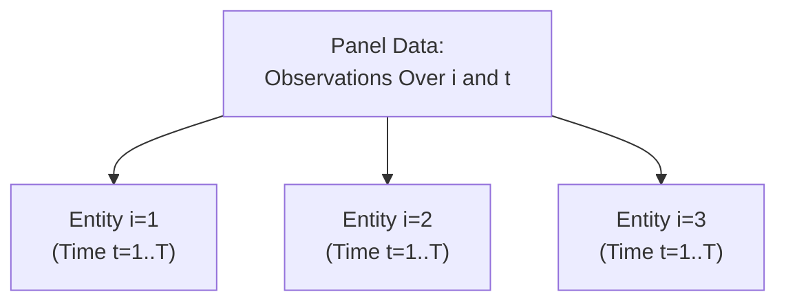

## Introduction and Rationale

I remember when I first tackled panel data techniques—you know, that moment when you realize your data aren’t neatly stacked in a single time series or just multiple cross-sections, but a combination of both. I stared at the table of observations for different firms across different years and thought, “Well, this is going to be a fun challenge.” The intricacies of deciding between fixed effects (FE) and random effects (RE), checking for correlated errors within entities, and making sense of big, messy data can be daunting. But it’s actually pretty cool once you start to see how panel regressions help us capture insights that pure time-series or cross-sectional models might miss.

In this section, we’ll work through vignette-style examples that illustrate key panel data applications. Each mini-case will mirror what you might see in a CFA Level II item set. By the end, you’ll have some practical insights into:

• How to choose between FE and RE, and interpret model output.  
• How to apply Differences-in-Differences (DiD) approaches to measure policy impacts.  
• Using clustered standard errors for within-entity correlation.  
• Running multi-factor panel regressions, such as those you might encounter in asset pricing.  
• Handling dynamic panel data models (often with GMM-based approaches) to address endogeneity or persistence issues.

Don’t worry if some of these terms sound a bit advanced. We’ll break them down with scenarios that feel real (like analyzing investment returns, corporate leverage decisions, or macro policy changes). Let’s jump right in.

## Vignette 1: Fixed vs. Random Effects for Mutual Fund Performance

Imagine you’re an analyst at a large asset management firm. You’re looking at monthly performance data from 50 mutual funds over the last three years (36 months). You suspect that management quality (a manager-specific trait) drives performance variation across funds, in addition to systematic market factors. But you’re also open to the possibility that unobserved fund-specific random factors might be relevant.

### The Setup

Our dependent variable is FundReturnᵢₜ (in percentage points), where i denotes the fund (i = 1…50) and t denotes the month (t = 1…36). The main covariates include:

• MktIndexₜ – The return on a broad market index at month t.  
• Sizeᵢₜ – A measure of the fund’s asset size in millions.  
• ExpenseRatioᵢ – Time-invariant (for our short sample) expense ratio of the fund.  
• ManagerTenureᵢ – Time-invariant measure of how many years the current manager has been at the helm.

We compare two models:

(1) Fixed Effects Model (FE):

FundReturnᵢₜ = α + β₁×MktIndexₜ + β₂×Sizeᵢₜ + γᵢ + εᵢₜ,

where γᵢ is a fixed effect for fund i, capturing time-invariant differences (like manager skill or brand reputation).

(2) Random Effects Model (RE):

FundReturnᵢₜ = α + β₁×MktIndexₜ + β₂×Sizeᵢₜ + uᵢ + εᵢₜ,

where uᵢ is a random intercept with a specified distributional assumption (often normal with mean zero).

Let’s say you run both models in statistical software and see the following stylized outputs (coefficients for the key variables, plus standard errors in parentheses):

• FE:  
  - MktIndex: 0.82 (0.09)  
  - Size: 0.01 (0.00)  
  - F-test for fixed effects (p-value): 0.03  
  - R² (within): 0.42  

• RE:  
  - MktIndex: 0.80 (0.08)  
  - Size: 0.01 (0.00)  
  - Hausman test (p-value): 0.01  
  - R² (overall): 0.44  

From the Hausman test p-value = 0.01, we’re seeing a reason to favor the FE model (since a small p-value suggests potential correlation between the random intercepts and regressors). The F-test for fund-level fixed effects is also significant (p = 0.03), reinforcing that each fund’s specific effect likely matters. So we tentatively pick FE.

### Quick Discussion Questions

Q1: Based on these outputs, which model appears more appropriate and why?  
Q2: How would you interpret the coefficient on MktIndex in the fixed effects model?  
Q3: If you found that Size and MktIndex were correlated with the unobserved effect, how would that influence your choice between FE and RE?

### Takeaways

For exam-style item sets, pay close attention to the *Hausman test* results. Typically, a significant result indicates you should prefer the FE approach because RE results may be biased if the unobserved random effects correlate with your regressors. When in doubt, always check these diagnostics to ensure you’re not making an accidental specification error.

## Vignette 2: Differences-in-Differences for a New Financial Regulation

Here, you’re evaluating the impact of a newly introduced regulation that caps certain trading commissions. Half of your sample of broker-dealers is subject to the policy (the “treatment” group), while the other half is not (the “control” group). You have data for two years before and two years after the regulation was enacted.

### The Setup

Define:

• Yᵢₜ = revenue from trading commissions for broker i at time t.  
• Treatedᵢ = 1 if broker i is in the treatment group, 0 otherwise.  
• Postₜ = 1 if the observation is from after the policy began, 0 if before.  

The DiD model:

Yᵢₜ = α + β₁ × Treatedᵢ + β₂ × Postₜ + β₃ (Treatedᵢ × Postₜ) + εᵢₜ.

• β₃ is our main coefficient of interest: it measures how the treatment group’s outcome changes above and beyond any time trend in the control group.

### Typical Results

Let’s say the regression yields:

- β₃ = -0.80 (p = 0.04), implying broker revenues subject to the cap are on average 0.80 percentage points lower (after the policy) relative to the control group.  

Now, interpret with caution: a negative sign suggests the regulation might be effectively reducing trading commissions for those regulated brokers (or shifting business elsewhere). But watch for potential confounding factors, like macro shifts or competitive behaviors.

### Quick Discussion Questions

Q1: Which coefficient directly measures the policy’s impact?  
Q2: If the Post variable alone were also negative, does that conflict with a negative DiD coefficient?  
Q3: Suppose certain brokers anticipated the policy and changed their practices earlier. How might that complicate your interpretation?

### Takeaways

Differences-in-Differences is a powerful technique for policy analysis, but you have to watch out for things like parallel trends and pre-treatment adjustments. In a real CFA item set, they might throw in data to see if you pick up on any violation of the parallel trend assumption.

## Vignette 3: Clustering Standard Errors in a Corporate Profitability Study

Let’s move to a scenario where you suspect correlation of errors within each firm’s observations over time. Suppose you’re analyzing the effect of R&D expenditures on operating margins across a panel of firms from different sectors. Traditional standard errors might be biased downward if there’s within-firm autocorrelation.

### The Setup

We have:

OperatingMarginᵢₜ = α + β₁×(R&Dᵢₜ / Salesᵢₜ) + β₂×Leverageᵢₜ + FixedEffectsᵢ + εᵢₜ.

You decide to cluster standard errors at the firm level, meaning you allow for firm-specific correlation patterns. The output might appear something like:

- R&D intensity coefficient: 2.10  
- Standard error (clustered by firm): 0.80  
- p-value: 0.02  

Where standard errors had you not clustered might have been smaller, say 0.40, leading to an even more “significant” result. Clustering corrects for the fact that each firm’s margin tends to be correlated over time. 

### Quick Discussion Questions

Q1: Why do we often cluster by firm in panel data?  
Q2: How do standard errors typically change when we cluster as opposed to the naive approach?  
Q3: If we suspect sector-level correlations, what alternative clustering strategy might we consider?

### Takeaways

Clustering is essential in many panel-based analyses. The CFA exam may require you to identify when clustering is appropriate, how it affects standard errors, and the difference between clustering at the firm level or the firm-year level. Just keep an eye out for any clues in the vignette that suggest persistent, within-entity correlations.

## Vignette 4: Multi-Factor Panel Regressions for Asset Returns

Now let’s head to a more finance-specific application: analyzing stock returns with multiple factors. Suppose you have monthly returns on 200 stocks over five years. You want to see how each stock’s return responds to risk factor exposures. Your panel regression might look like:

Returnᵢₜ = αᵢ + β₁×MKTₜ + β₂×SMBₜ + β₃×HMLₜ + β₄×Momentumₜ + εᵢₜ.

Here, MKT, SMB, HML, and Momentum are factor returns at time t. You might allow for different intercepts (αᵢ) for each stock. Alternatively, you could treat α as random. The goal is to estimate factor loadings that can then be used for risk analysis or portfolio construction.

### Sample Results

Let’s say your output for a particular stock i, using a pooled regression approach, yields:

• β₁ (MKT) = 1.2 (p = 0.01)  
• β₂ (SMB) = 0.3 (p = 0.10)  
• β₃ (HML) = -0.2 (p = 0.05)  
• β₄ (Momentum) = 0.5 (p = 0.03)  

But then you notice that a fixed-effect approach might be more appropriate to control for each firm’s average return difference from the cross-sectional sample. The exam question could ask: “Which approach better captures each stock’s idiosyncratic average? Why might random effects not be suitable if the intercept correlates with certain omitted variables?”

### Quick Discussion Questions

Q1: In a multi-factor setting, which parameters would you typically interpret for portfolio construction decisions?  
Q2: If the firm-level intercept αᵢ is correlated with the HML factor, what does that imply for a random effects assumption?  
Q3: Why might adjusting for time fixed effects be beneficial here (e.g., to remove overall market shocks in certain months)?

### Takeaways

Many investment analysts use multi-factor panel regressions, especially in equity research and portfolio management contexts. Watch for the necessity of controlling for both time effects (macro shocks) and entity-level effects (stock-specific traits). If you see persistent cross-sectional differences in the real world, that usually points to a fixed effects specification.

## Vignette 5: Dynamic Panel Data GMM in a Leverage Model

Finally, let’s consider a more advanced scenario. Suppose you’re analyzing corporate leverage (Debtᵢₜ / Assetsᵢₜ) and suspect that the previous period’s leverage influences the current period’s leverage. This creates a dynamic panel because the dependent variable depends on its own lag:

Leverageᵢₜ = α + ρ → Leverageᵢ,ₜ₋₁ + β×(Profitabilityᵢₜ) + δᵢ + εᵢₜ.

Ordinary FE or RE can be biased due to the lagged dependent variable. This is where GMM methods (like Arellano-Bond) come in.

### Typical GMM Setup

Using first differences:

(Leverageᵢₜ – Leverageᵢ,ₜ₋₁) = ρ → (Leverageᵢ,ₜ₋₁ – Leverageᵢ,ₜ₋₂) + β×(Profitabilityᵢₜ – Profitabilityᵢ,ₜ₋₁) + (εᵢₜ – εᵢ,ₜ₋₁).

Then, use lagged instruments (e.g., Leverageᵢ,ₜ₋₂) to address endogeneity. The exam might show you partial GMM output, focusing on ρ’s magnitude (the persistence effect in leverage).

### Quick Discussion Questions

Q1: Why can’t we just use a plain old fixed effects model with a lagged dependent variable?  
Q2: What role do lagged instruments serve in this approach?  
Q3: If the Sargan test or Hansen test statistic is significant, what does that imply about the instruments?

### Takeaways

Dynamic panels are a broad topic but occasionally tested. Mastering the intuition behind GMM is key: you’re trying to fix the fact that Leverageᵢ,ₜ₋₁ is correlated with the error term. Expect item sets to highlight whether the methods used (like Arellano-Bond) are appropriate and to test your knowledge of instrument validity.

## Best Practices and Potential Pitfalls

• Always run diagnostic tests like Hausman or the F-test for fixed effects.  
• Check for parallel trend assumptions when using Differences-in-Differences.  
• Remember that within-entity correlation often requires clustered standard errors.  
• In multi-factor models, watch out for omitted factor biases.  
• Dynamic panels demand specialized approaches like GMM to avoid biased estimates.

## A Brief Visual Summary of Panel Data Structures

Below is a simple Mermaid diagram illustrating the concept of panel data where each entity i is observed over multiple time periods t.

• Each entity (firm, fund, broker) is measured repeatedly.  
• Observations for the same entity are typically correlated across time.

## Practical Tips for the CFA Exam

• Read each vignette carefully. Identify whether the data is cross-sectional, time-series, or panel.  
• Look for keywords: “over multiple years,” “across different companies,” “fixed effects,” “random effects,” “differences-in-differences,” “clustered standard errors,” “GMM,” and so forth.  
• Decide on the best specification by scanning for potential correlation between unobserved effects and regressors (Hausman test).  
• Remember: DiD questions typically revolve around measuring the effect of a new policy or event.  
• For multi-factor regressions, match the factor loadings to the relevant risk factor and interpret them accordingly.  
• GMM or dynamic panel references often revolve around endogeneity or a lagged dependent variable.  

## References and Further Reading

• CFA Institute Learning Ecosystem on Panel Data Methods – specifically the sections on fixed vs. random effects, and advanced topics in GMM.  
• Wooldridge, J. (2010). Econometric Analysis of Cross Section and Panel Data. MIT Press.  
• Baltagi, B. (2013). Econometric Analysis of Panel Data. Wiley.  
• Practitioner journals: The Journal of Finance, Journal of Financial Economics often publish empirical studies using panel methods.  

Now, as promised, let’s close with a set of exam-style multiple-choice questions so you can test yourself.

## Practice with Panel Data Regressions: 10-Question Quiz



### Question 1
Which test is MOST commonly used to decide between fixed effects and random effects in a panel regression?

- [ ] F-test for overall significance of the model
- [x] Hausman test
- [ ] Breusch-Godfrey test
- [ ] Durbin-Watson test

> **Explanation:** The Hausman test compares the consistency of the fixed effects and random effects estimators. If the test statistic is significant, you typically opt for the fixed effects model.

### Question 2
In a Differences-in-Differences (DiD) setup, which coefficient captures the treatment effect of a policy?

- [ ] The Post coefficient
- [ ] The Treated coefficient
- [x] The coefficient on (Treated × Post)
- [ ] The time fixed effect coefficient

> **Explanation:** The interaction term between Treatedᵢ and Postₜ isolates the difference-in-differences impact for the treatment group after the policy compared to the control group.

### Question 3
When you suspect the errors are correlated within each entity (firm, fund, etc.) over time, which standard error adjustment is typically recommended?

- [ ] White (robust) standard errors
- [x] Clustered standard errors at the entity level
- [ ] Newey-West standard errors
- [ ] Bootstrapped standard errors

> **Explanation:** In panel data, clustering at the entity (or group) level accommodates within-entity autocorrelation of residuals.

### Question 4
In a multi-factor panel regression for stock returns, the intercept αᵢ is significant and correlated with one of the factor returns. Which approach is likely more appropriate?

- [ ] Pooled OLS with robust standard errors
- [ ] Random Effects because it accounts for correlation
- [x] Fixed Effects because the intercept is correlated with the regressors
- [ ] No regression model needed

> **Explanation:** If an unobserved intercept (the firm-specific effect) is correlated with the regressors, fixed effects is generally the correct choice.

### Question 5
Which of the following is the primary reason to use GMM in dynamic panel models?

- [x] To address endogeneity caused by the lagged dependent variable
- [ ] To save computational time when dealing with large data
- [ ] To avoid the need for time-period indicators
- [ ] To simplify the interpretation of coefficients

> **Explanation:** Including a lagged dependent variable in panel regressions can create endogeneity. GMM estimators such as Arellano-Bond are designed to handle this issue.

### Question 6
If a seasonality pattern affects all entities in a panel simultaneously, what is a recommended practice?

- [ ] Use random effects only
- [ ] Cluster at the time level
- [x] Include time fixed effects (month or year dummies)
- [ ] Omit the time dimension

> **Explanation:** Time fixed effects will capture shocks or seasonal factors common to all entities in a given period.

### Question 7
In a DiD study, the “parallel trends” assumption implies:

- [x] In the absence of treatment, the trend in outcomes for the treatment and control groups would have been the same.
- [ ] The pre-treatment means for treatment and control are equal.
- [ ] The distribution of residuals must be identical across groups.
- [ ] Each group must have the same number of observations.

> **Explanation:** DiD relies on the assumption that, had there been no intervention, treatment and control groups would follow similar trends, allowing us to isolate the effect of the intervention.

### Question 8
You run a random effects model and obtain a small p-value (0.02) from the Hausman test. Which is the MOST appropriate next step?

- [ ] Continue with random effects since p < 0.05 indicates significance
- [x] Switch to a fixed effects model
- [ ] Increase the sample size to validate results
- [ ] Rerun the random effects model with robust errors

> **Explanation:** A low p-value on the Hausman test suggests a significant difference between fixed and random effects estimators, typically favoring the fixed effects model.

### Question 9
Why might the standard errors become larger when you cluster by firm?

- [ ] Clustering shrinks the residuals closer to zero
- [x] Clustering accounts for correlation within each entity over time
- [ ] Clustering forces the regression to fit each entity perfectly
- [ ] Clustering merges multiple observations into a single measurement

> **Explanation:** Clustering recognizes that observations from the same entity are not independent, which often leads to larger, more realistic standard errors.

### Question 10
True or False: A significant Hansen test in GMM estimation indicates that the instruments are valid.

- [ ] True
- [x] False

> **Explanation:** A significant Hansen test (or Sargan test) usually indicates a problem with the instruments; it suggests that the instruments may not be valid.


